# 🧭 The Full Schemata of Product Owner / Product Manager
### (in Active Software Development)

> Same format as the UI/UX schemata: a wiki of linked nodes with Mermaid diagrams. Build the schema, then go get it broken by real stakeholders, real engineers, and real users.
>
> Internal links like [Prioritization](#-node-5--prioritization-the-core-craft) jump between nodes. Mermaid renders in Obsidian, GitHub, and Notion.

---

## 🌉 Bridge — Where This Skill Sits (Read First)

This is the **upstream half** of a two-skill pair. The `ui-ux-design` schemata governs *how the product looks, feels, and converts*; this one governs *what gets built, in what order, and why* — the decisions that exist before a single screen is sketched. On a real build you wear both hats in sequence: the PO/PM hat chooses the outcome, the slice, and the order; the design hat shapes its surface. When the question is scope, priority, or value, you are here. When the question is the interface, go there. The two documents deliberately rhyme — same wiki-of-nodes format, same constructivist spine — because they are one schema with two layers: Kano's basics mirror the UX Hierarchy of Needs, discovery's ~5-user tests are Node 5 of the UI/UX schemata, and "outcome over output" is the product-level twin of "aesthetics is a multiplier, not a substitute."

One boundary deserves stating up front because teams get it wrong constantly: **the Product Owner / Product Manager is responsible for User Flows and User Journeys as well.** The end-to-end journey — how a user discovers the product, enters it, moves through each core task, hits the moments of value, and comes back — is product territory, not a design afterthought: the journey *encodes what the product is*. The PO/PM owns that the steps exist, connect, and serve the outcome (journey maps, flow definitions, the path through every capability in [Node 0](#-node-0--what-is-this-role-actually)'s scope); the designer, through `ui-ux-design`, owns how each step on that path looks and behaves. A beautiful screen inside a broken journey is a well-decorated dead end — and that failure belongs to the PO, not the designer.

With that frame set, build the schema below.

---

## 🗺️ The Master Map

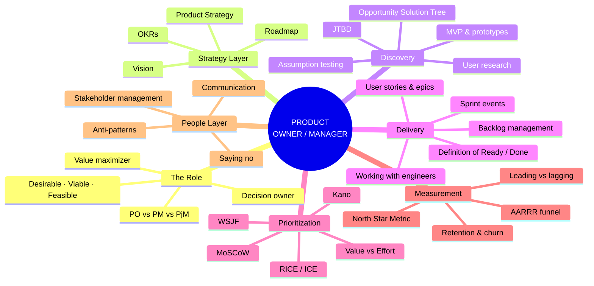

---

## 🎯 Node 0 — What Is This Role, Actually?

**One-line definition:** The Product Owner/Manager is accountable for **maximizing the value** the product delivers, by deciding **what gets built, in what order, and why**, and by being able to defend that "why" with evidence.

Notice what's *not* in the definition: writing code, managing people, drawing UI, running ceremonies. The role owns **decisions and outcomes**, not execution.

The cleanest mental anchor comes from Marty Cagan (*Inspired*): your job is to discover a product that is simultaneously:

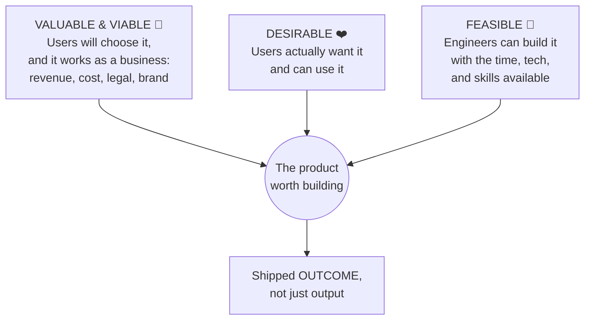

Miss any leg and you get a classic failure:

| Missing leg | What you ship |
|---|---|
| Desirability | A technically impressive product nobody asked for |
| Viability | A beloved product that bleeds money or breaks the law |
| Feasibility | A beautiful roadmap that never ships |

> 💡 **Output vs outcome** is the single most important distinction in this entire document. *Output* = features shipped. *Outcome* = behavior changed, problem solved, metric moved. Teams that measure themselves by output become [feature factories](#-node-9--anti-patterns-how-this-role-goes-wrong). Everything below exists to keep you on the outcome side.

**See also:** [Strategy cascade](#-node-2--the-strategy-cascade), [Metrics](#-node-7--measurement-how-you-know-it-worked)

---

## 🪪 Node 1 — PO vs PM vs Everyone Else

The titles are messy in the real world. Here's the schema to untangle them.

### Product Owner (Scrum's definition)

A **role defined by the Scrum Guide**: one person accountable for maximizing product value, primarily through managing the Product Backlog. Tactical center of gravity: backlog, sprint goals, acceptance, working with the dev team daily.

### Product Manager (the industry's definition)

A **job title defined by the market**: owns problem discovery, strategy, market understanding, pricing, positioning, and the roadmap. Strategic center of gravity: the *why* and *what next quarter/year*.

### How they relate in practice

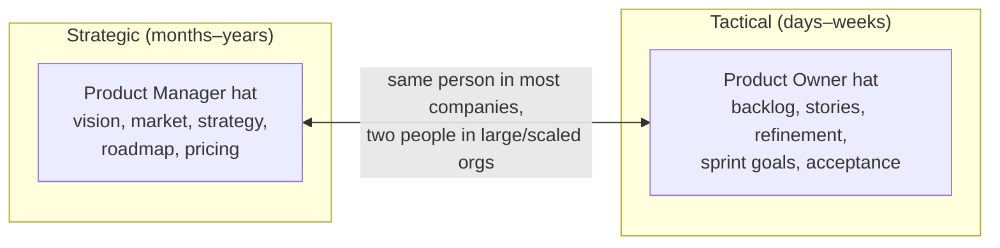

Three common configurations:

1. **One person, both hats** (most startups and mid-size companies). The title might be either PM or PO
2. **PM + PO pair** (large enterprises, scaled frameworks like SAFe): PM faces the market, PO faces the teams. Works if they communicate constantly; creates a [proxy-PO anti-pattern](#-node-9--anti-patterns-how-this-role-goes-wrong) if the PO is just a ticket-writer with no authority
3. **PO as junior PM** (career-ladder interpretation): PO is the entry rung, PM the next

### Boundary table (who owns what)

| Concern | PO/PM | Scrum Master / Agile Coach | Project Manager | Engineering Lead | Designer |
|---|---|---|---|---|---|
| What to build & why | ✅ owns | | | consulted | consulted |
| Order of the backlog | ✅ owns | | | consulted | consulted |
| User flows & journeys (end-to-end) | ✅ owns | | | consulted | collaborates |
| How to build it | | | | ✅ owns | |
| How it looks & behaves | consulted | | | | ✅ owns |
| Process health, impediments | | ✅ owns | | | |
| Timeline/budget coordination | consulted | | ✅ owns (where role exists) | | |
| Team performance & careers | ❌ never | | | ✅ (their reports) | |

> ⚠️ The PO/PM decides **what and in which order**, never **how** (engineering's domain) and never **how fast** (the team's sustainable pace is discovered, not declared).

**See also:** [Working with engineers](#-node-6--delivery-the-po-inside-the-sprint), [Stakeholders](#-node-8--stakeholders-and-the-art-of-saying-no)

---

## 🏔️ Node 2 — The Strategy Cascade

Everything you do should trace upward to something. When it doesn't, you're a feature factory with extra steps. This cascade is the spine of the role:

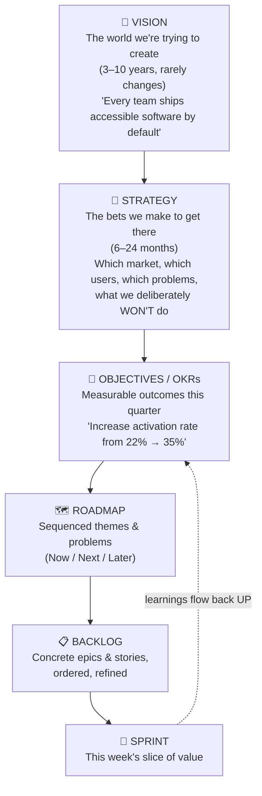

Key properties of a healthy cascade:

- **Vision** is stable and inspiring; if it changes quarterly it was a goal, not a vision
- **Strategy is choice.** A strategy that doesn't exclude anything isn't one. "We serve everyone with everything" = no strategy
- **OKRs state outcomes, not features.** "Launch dark mode" is output. "Reduce evening session abandonment by 20%" is an outcome that dark mode might serve
- **Roadmaps communicate intent, not promises.** Prefer **Now / Next / Later** over date-laden Gantt charts for anything beyond the current quarter. Dates on distant items become commitments stakeholders screenshot and weaponize
- **Outcome-based roadmap items** ("reduce onboarding drop-off") leave the solution space open for [discovery](#-node-3--discovery-deciding-what-is-worth-building); feature-based items ("add tutorial videos") close it prematurely

**See also:** [Metrics](#-node-7--measurement-how-you-know-it-worked), [Anti-patterns](#-node-9--anti-patterns-how-this-role-goes-wrong)

---

## 🔬 Node 3 — Discovery: Deciding What Is Worth Building

Discovery is the work of de-risking decisions *before* expensive engineering time gets spent. In modern product thinking (Cagan, Teresa Torres), discovery isn't a phase you do once; it runs **continuously, in parallel with delivery**:

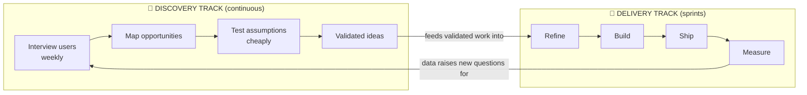

This is **dual-track agile**: same team, two kinds of work. Discovery answers "should we build it?"; delivery answers "did we build it right?".

### The Opportunity Solution Tree (Teresa Torres)

The single best schema for keeping discovery honest. It forces every solution to trace to an opportunity, and every opportunity to a desired outcome:

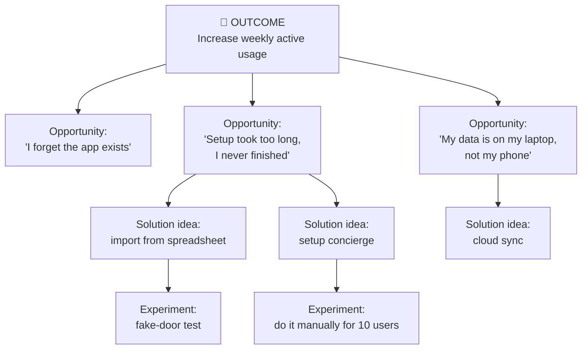

If a stakeholder's pet feature can't be attached to any opportunity on the tree, you now have a polite, visual way to say [no](#-node-8--stakeholders-and-the-art-of-saying-no).

### Core discovery techniques

| Technique | What it de-risks | One-liner |
|---|---|---|
| **User interviews** (continuous, ~weekly) | Desirability | Ask about past behavior, not hypothetical futures. "Tell me about the last time you..." beats "would you use...?" |
| **Jobs To Be Done (JTBD)** | Framing | People "hire" products to make progress in a situation. Milkshake story: commuters hired it as a one-handed breakfast. Competition = anything else hireable for the job |
| **Assumption mapping** | Everything | List what must be true (desirable/viable/feasible/usable), test the riskiest assumption first, cheapest method first |
| **Fake door / painted door** | Demand | A button for a feature that doesn't exist yet; measure clicks, apologize nicely |
| **Wizard of Oz / concierge** | Demand + usability | Deliver the service manually behind a real-looking interface before automating |
| **Prototype testing** | Usability | Clickable mock with ~5 users (see the UI/UX schemata, Node 5) |
| **A/B testing** | Impact | Needs traffic; for mature products and small bets |

### MVP, properly understood

**Minimum Viable Product** = the smallest thing that produces **validated learning** about your riskiest assumption. It is an experiment, not "version 1 with fewer features." The famous sequence: a skateboard → scooter → bike → car (each slice usable end-to-end), *not* a wheel → chassis → body → car (nothing usable until the end).

> ⚠️ Constructivist note: discovery is literally **accommodation engineering**. You are paying small amounts of money to break your team's wrong schemata early, before the market breaks them expensively.

**See also:** [Prioritization](#-node-5--prioritization-the-core-craft), [Measurement](#-node-7--measurement-how-you-know-it-worked)

---

## 📋 Node 4 — The Backlog: Your Single Source of Truth

**Definition:** The Product Backlog is the **one ordered list** of everything that might be built: features, bugs, tech debt, experiments. One list, one owner, strictly ordered (position 1, 2, 3... not "priority: high" on forty items).

### Structure: the work breakdown

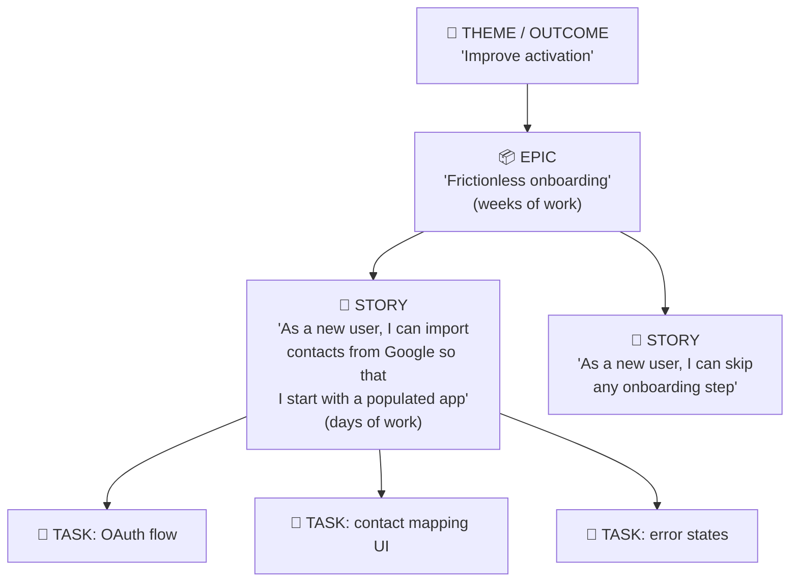

### User stories that don't suck

Template: **As a** [user type], **I want** [capability], **so that** [outcome]. The "so that" is the most important clause; if you can't fill it, the story has no defensible reason to exist.

Quality check — **INVEST**:

- **I**ndependent — schedulable in any order (mostly)
- **N**egotiable — a placeholder for conversation, not a contract
- **V**aluable — delivers something a user or business notices
- **E**stimable — understood well enough to size
- **S**mall — fits comfortably in a sprint
- **T**estable — has concrete **acceptance criteria** (often Given/When/Then: *Given* a new user with a Google account, *When* they tap Import, *Then* contacts appear within 10s, and a failure shows a retry option)

### A healthy backlog is DEEP

- **D**etailed appropriately — top items refined and small; bottom items deliberately vague
- **E**mergent — it grows and changes; it is never "done"
- **E**stimated — at least the upper portion
- **P**rioritized — strictly ordered by value

> 💡 The backlog has a shape: a funnel. Sharp and detailed at the top (next 1–2 sprints), increasingly fuzzy below. If your backlog is 400 fully-specified tickets, it isn't a backlog, it's a graveyard with good documentation. Regularly delete the bottom; if something matters, it will come back.

### Refinement (a.k.a. grooming)

The ongoing activity (typically ~5–10% of team capacity) where PO + team clarify, split, and estimate upcoming items. The output is items meeting a **Definition of Ready**: clear, valuable, sized, testable. Refinement is where most misunderstandings die cheaply instead of expensively mid-sprint.

**See also:** [Sprint mechanics](#-node-6--delivery-the-po-inside-the-sprint), [Prioritization](#-node-5--prioritization-the-core-craft)

---

## ⚖️ Node 5 — Prioritization: The Core Craft

Prioritization is the role's defining act. Frameworks don't make the decision for you; they make your reasoning **explicit, comparable, and arguable**. That's their real value: they convert "HiPPO vs gut feeling" shouting matches into structured arguments.

### The toolbox

| Framework | Formula / mechanism | Best for | Watch out |
|---|---|---|---|
| **RICE** | (Reach × Impact × Confidence) ÷ Effort | Comparing many feature candidates | False precision; garbage estimates in, confident garbage out |
| **ICE** | Impact × Confidence × Ease | Fast scoring of experiments | Even more subjective than RICE |
| **MoSCoW** | Must / Should / Could / Won't | Scoping a release with stakeholders | Everything migrates to "Must" unless you cap it (~60% of capacity) |
| **Kano** | Basic needs vs performance needs vs delighters | Understanding feature *types* | Needs user surveys; delighters decay into basics over time (cameras in phones) |
| **WSJF** (SAFe) | Cost of Delay ÷ Job Size | Sequencing when timing matters (deadlines, decaying value) | Cost of Delay is hard to estimate honestly |
| **Value vs Effort** | 2×2 quadrant | Quick triage, workshop settings | "Value" hides every assumption you haven't tested |

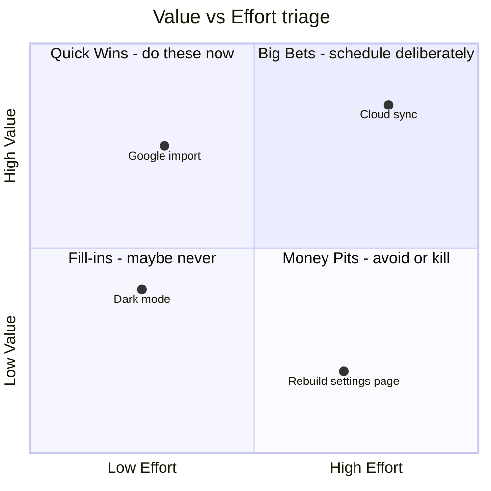

### The Kano insight (worth its own paragraph)

Features are not all the same species:

- **Basic (must-be):** absence infuriates, presence goes unnoticed. Login works, app doesn't crash. You can only lose points here
- **Performance:** more = better, linearly. Speed, storage, accuracy. Compete here deliberately
- **Delighters:** unexpected joy; absence costs nothing. These differentiate you... until competitors copy them and they decay into basics

Prioritizing only delighters while basics are broken is how products get great press and terrible retention. (Cross-reference: the [UX Hierarchy of Needs](#) from the UI/UX schemata — same shape, same lesson.)

### What about bugs and tech debt?

They go in **the same ordered backlog**, prioritized by the same logic: impact on outcomes. A practical pattern many teams use: reserve a standing capacity slice (e.g., ~10–20%) for debt and quality, then prioritize *within* that slice. Zero-debt sprints and all-debt sprints are both failure modes.

### Prioritization decision flow

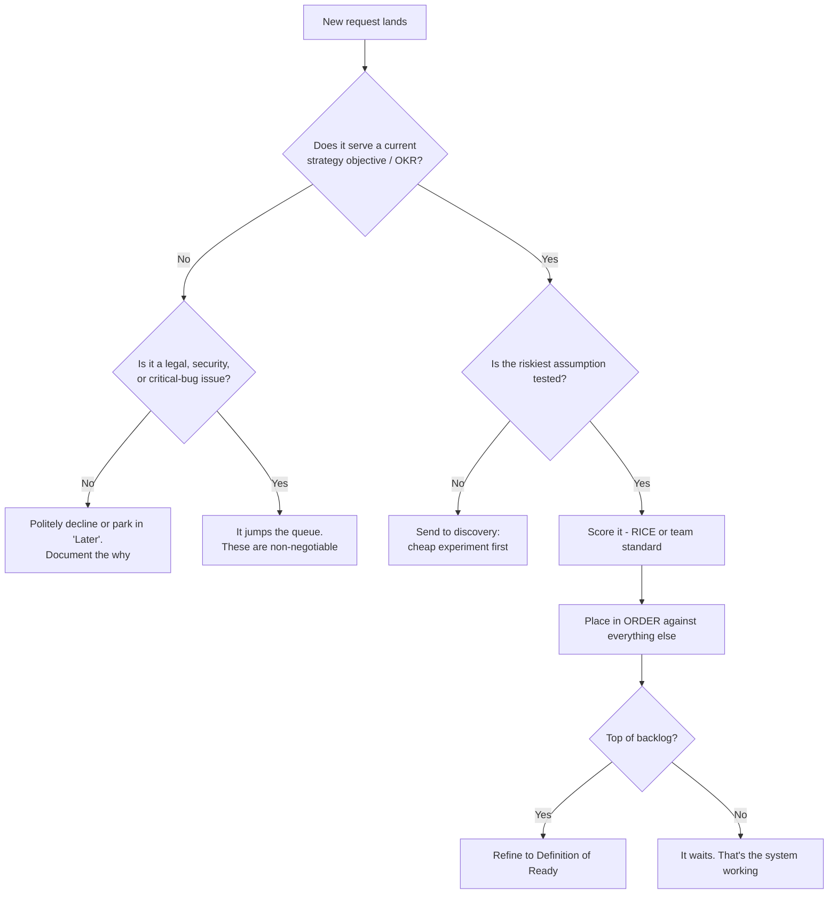

**See also:** [Saying no](#-node-8--stakeholders-and-the-art-of-saying-no), [Discovery](#-node-3--discovery-deciding-what-is-worth-building)

---

## 🏃 Node 6 — Delivery: The PO Inside the Sprint

Active development is where the role gets physical. Here's the Scrum loop with the PO's touchpoints marked:

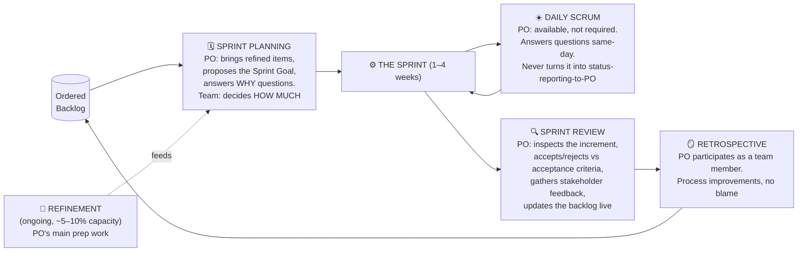

### The PO's daily reality in active development

- **Be available.** The most expensive thing in a sprint is an engineer blocked for a day waiting for a product answer that takes you four minutes. Answer latency is a core PO metric nobody writes down
- **Protect the Sprint Goal.** Mid-sprint scope injection destroys trust and throughput. Truly urgent items swap *out* something of equal size, with the team's agreement, and it should be rare
- **Accept work against acceptance criteria,** not against vibes. If you reject work for reasons not in the criteria, the criteria were wrong: fix your refinement, apologize, move on
- **Negotiate scope, not quality.** When time runs short, the conversation is "which slice ships?" never "skip the tests." Quality cuts are invisible loans at loan-shark interest
- **Definition of Done (DoD)** is the team's quality bar (tested, reviewed, deployed, monitored). The PO respects it absolutely; "done" that isn't Done is inventory, not value

### Working with engineers (the trust protocol)

| Do | Don't |
|---|---|
| Bring problems and context; let the team propose solutions | Arrive with pre-baked solutions and call it "requirements" |
| Share the *why* behind every story | Treat engineers as ticket-executing machines |
| Take estimates as information | Negotiate estimates downward ("can't you just...") |
| Bring engineers into discovery (they spot feasibility traps and cheaper options early) | Reveal plans only at sprint planning |
| Budget honestly for tech debt | Treat refactoring as the team "not working on real features" |

> 💡 Engineers extend enormous goodwill to POs who can explain *why* in terms of users and evidence, and almost none to POs who say "stakeholders want it."

**See also:** [Backlog](#-node-4--the-backlog-your-single-source-of-truth), [Anti-patterns](#-node-9--anti-patterns-how-this-role-goes-wrong)

---

## 📊 Node 7 — Measurement: How You Know It Worked

If outcomes are the job, metrics are the scoreboard. The schema has three layers: one star, a funnel, and a discipline.

### The North Star Metric

One metric that best captures the value users receive (not the value you extract). Examples: weekly active teams (Slack-style products), nights booked (marketplaces), orders delivered (food delivery). Revenue is a *result* of the North Star, rarely the star itself.

### The AARRR "Pirate Metrics" funnel (Dave McClure)

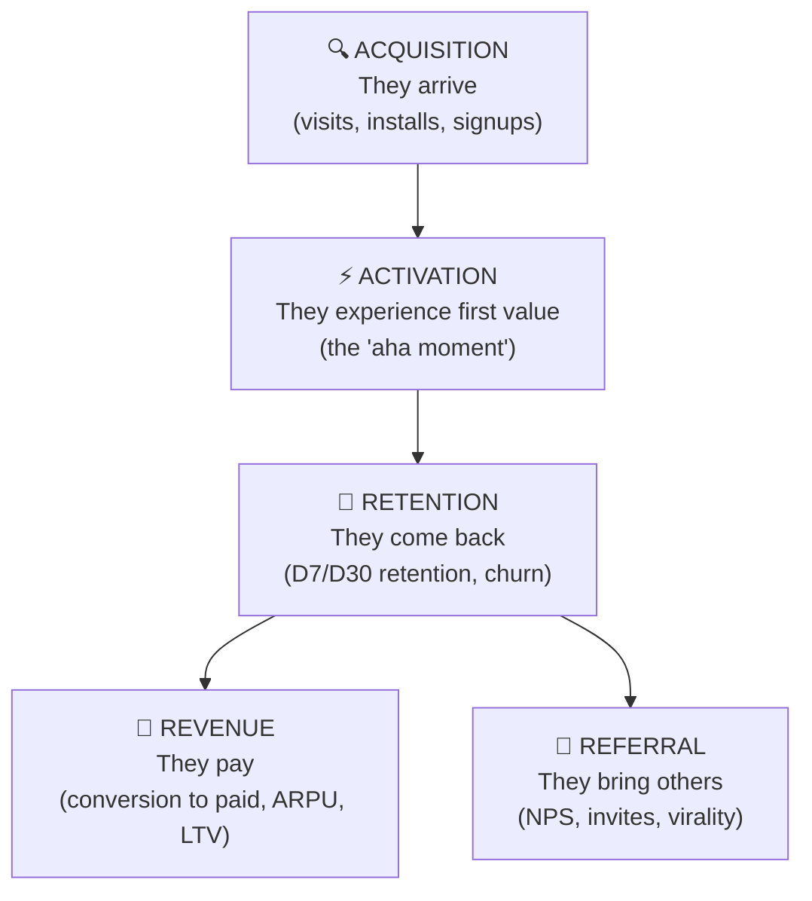

Two rules of the funnel:

1. **Fix it top-down in diagnosis, bottom-up in priority.** Pouring acquisition into a leaky retention bucket is the most common growth mistake in software
2. **Retention is the truth-teller.** Almost every vanity metric can be bought; a flat retention curve cannot. If retention is bad, the product isn't delivering on the [North Star](#-node-7--measurement-how-you-know-it-worked), full stop

### Leading vs lagging, and counter-metrics

- **Lagging indicators** (revenue, churn) tell you what already happened: trustworthy, slow
- **Leading indicators** (activation rate, feature adoption in week 1) predict the lagging ones: actionable, noisier. OKR key results should lean leading
- **Counter-metrics:** every metric you optimize will be gamed (Goodhart's Law: when a measure becomes a target, it stops being a good measure). Pair each target with a guard: push activation speed, watch support tickets; push engagement, watch session quality and uninstalls

### Closing the loop

Shipping is the midpoint, not the end:

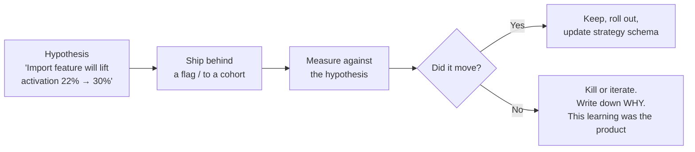

Teams that skip the measure step aren't doing product management; they're doing feature archaeology, to be excavated by whoever inherits the codebase.

**See also:** [Strategy cascade](#-node-2--the-strategy-cascade), [Discovery](#-node-3--discovery-deciding-what-is-worth-building)

---

## 🤝 Node 8 — Stakeholders and the Art of Saying No

A PO/PM decision is only as durable as the alignment behind it. Stakeholder management isn't politics as a side quest; it's load-bearing.

### The basic schema: map, then treat differently

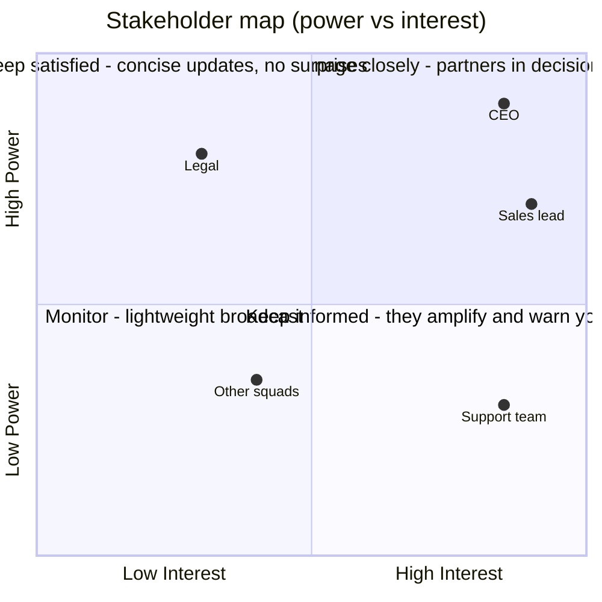

### Saying no (the job's signature move)

"No" delivered well is: **acknowledgment + reasoning + evidence + alternative.**

> "I hear that Enterprise client X wants SSO this month. Right now our top objective is activation, because retention data shows we lose 60% of users before day 7; SSO serves one account, the activation work serves every future account including X. It's in 'Next' on the roadmap, here's the tree showing where it sits, and here's what I *can* do this month: a documented workaround via their identity provider."

Tools that make "no" cheaper:

- A **visible, ordered backlog**: "yes, and it goes here in the order, which means it ships after these items" turns no into a sequencing conversation
- The **opportunity solution tree**: requests must attach to an opportunity or they're visibly orphaned
- **Trade-off framing**: never absorb new scope silently; "yes to this means later for that — which do you prefer?" pushes the real decision back to the requester
- **Decision logs**: write down what was decided and why; re-litigating from memory is how HiPPOs win

> ⚠️ The HiPPO (Highest Paid Person's Opinion) is defeated by evidence and pre-alignment, never by debate in the meeting itself. Socialize big decisions 1:1 *before* the meeting; meetings are for confirming alignment, not creating it.

**See also:** [Prioritization](#-node-5--prioritization-the-core-craft), [Strategy cascade](#-node-2--the-strategy-cascade)

---

## ☠️ Node 9 — Anti-Patterns: How This Role Goes Wrong

Learn these the cheap way (reading) instead of the expensive way (living them for two years).

| Anti-pattern | Symptom | The fix |
|---|---|---|
| **Feature factory** | Success = features shipped; nobody measures after launch | Outcome OKRs, hypothesis per epic, kill-or-keep reviews ([Node 7](#-node-7--measurement-how-you-know-it-worked)) |
| **Proxy PO / ticket clerk** | PO writes tickets for decisions made elsewhere, has no authority | Renegotiate the role or escalate; a PO without decision rights is a bottleneck cosplaying as an owner |
| **Backlog landfill** | 500+ items, years old, "we might need it" | Delete aggressively; DEEP shape ([Node 4](#-node-4--the-backlog-your-single-source-of-truth)) |
| **HiPPO-driven development** | Roadmap = whoever shouted last in the exec meeting | Evidence, decision logs, pre-alignment ([Node 8](#-node-8--stakeholders-and-the-art-of-saying-no)) |
| **Solution-first stories** | "Add a dropdown" with no problem statement | Force the 'so that' clause; opportunity solution tree |
| **Mid-sprint scope injection** | "Just one small thing" every other day | Protect the Sprint Goal; swap, don't stack ([Node 6](#-node-6--delivery-the-po-inside-the-sprint)) |
| **Absent PO** | Team waits days for answers; guesses instead | Availability SLA with the team; refinement discipline |
| **Discovery theater** | Interviews happen, conclusions were pre-written | Test riskiest assumptions; let evidence kill your favorites publicly at least once |
| **Roadmap as contract** | Stakeholders screenshot dates from 9 months out | Now/Next/Later beyond the current quarter ([Node 2](#-node-2--the-strategy-cascade)) |
| **Quality as scope** | Tests and debt cut to "make the date" | Negotiate scope, never the Definition of Done |

---

## 🎓 Node 10 — A Constructivist Study Path

Sequenced so each layer assimilates into the previous one:

1. **Anchor schema** — *Inspired* (Marty Cagan): the role, the triad, why feature teams fail
2. **Add discovery** — *Continuous Discovery Habits* (Teresa Torres): interviews, opportunity solution trees, assumption tests
3. **Add delivery mechanics** — The Scrum Guide (free, ~13 pages, read it twice) + *User Story Mapping* (Jeff Patton)
4. **Add measurement** — *Lean Analytics* (Croll & Yoskovitz) or *Trustworthy Online Controlled Experiments* (Kohavi) when you're ready for rigor
5. **Add strategy** — *Good Strategy / Bad Strategy* (Richard Rumelt): why most "strategies" are just goals wearing a suit
6. **Add escape velocity** — *Escaping the Build Trap* (Melissa Perri): the feature-factory diagnosis and cure
7. **Accommodate** — Own one real outcome for one quarter. Write the hypothesis, ship the smallest test, measure, and present what you learned including the misses. This step converts the reading into a schema that's actually yours

### Glossary stub

| Term | One-liner |
|---|---|
| **Acceptance criteria** | Testable conditions for a story to be accepted |
| **DoD / DoR** | Definition of Done (quality bar) / Definition of Ready (refinement bar) |
| **Dual-track agile** | Discovery and delivery running in parallel on one team |
| **Epic** | A body of work spanning multiple stories |
| **HiPPO** | Highest Paid Person's Opinion |
| **JTBD** | Jobs To Be Done; the progress a user "hires" a product for |
| **MVP** | Smallest experiment producing validated learning |
| **North Star Metric** | The one metric best capturing user value delivered |
| **OKR** | Objective + measurable Key Results |
| **OST** | Opportunity Solution Tree |
| **RICE / ICE / WSJF** | Prioritization scoring frameworks |
| **Sprint Goal** | The single objective a sprint commits to |
| **Velocity** | Team's historical throughput; a planning tool, never a performance target |

---