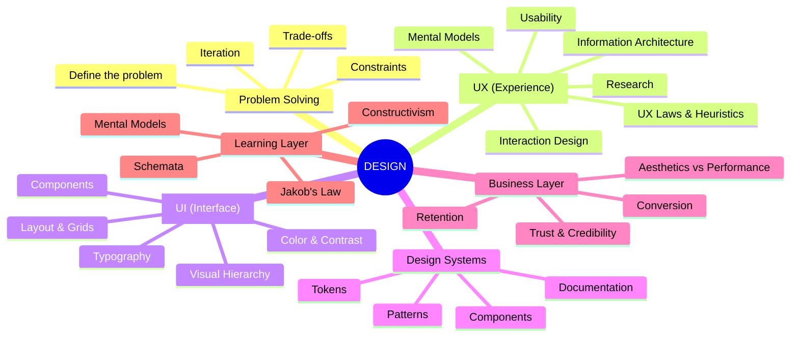
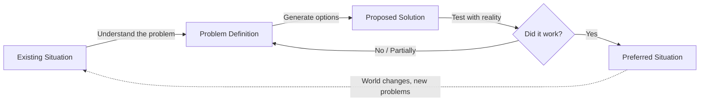
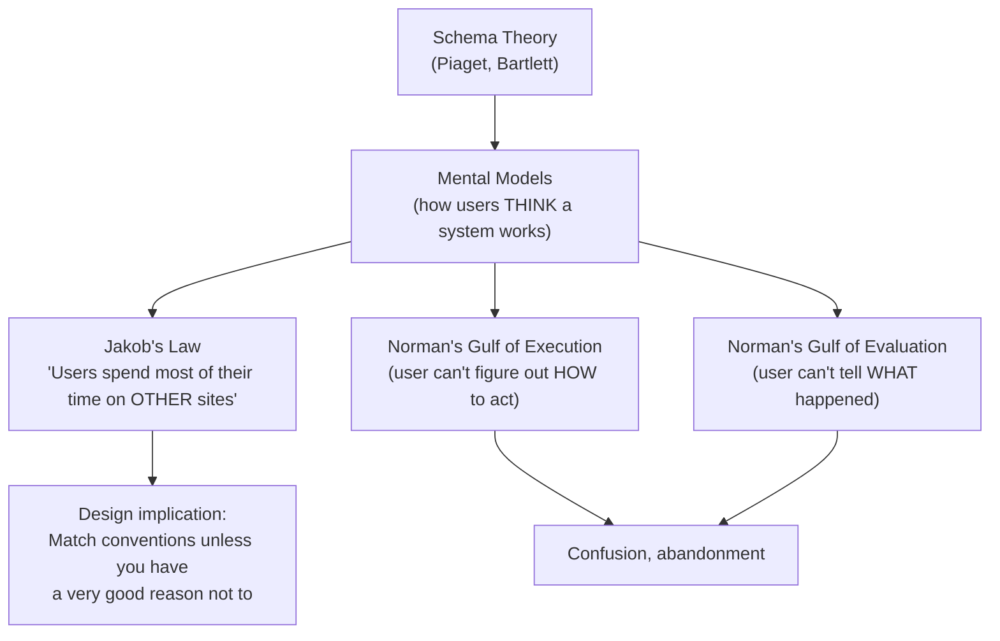
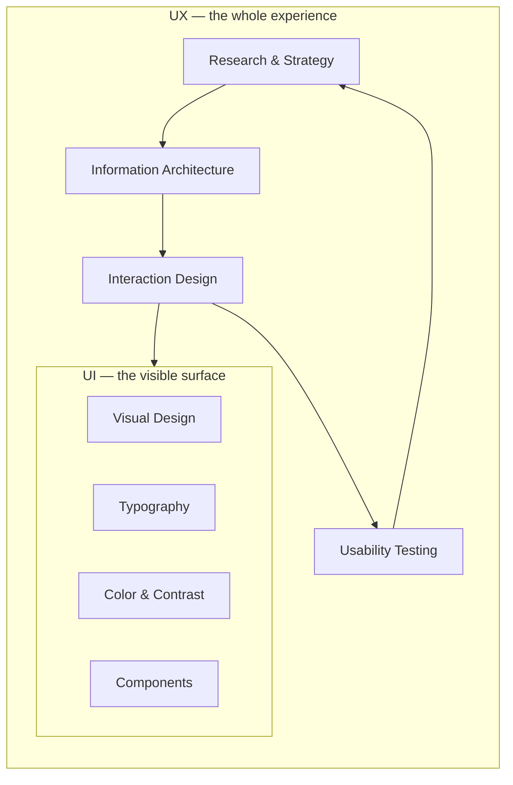
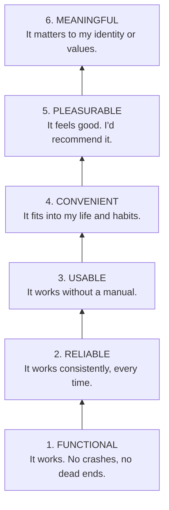
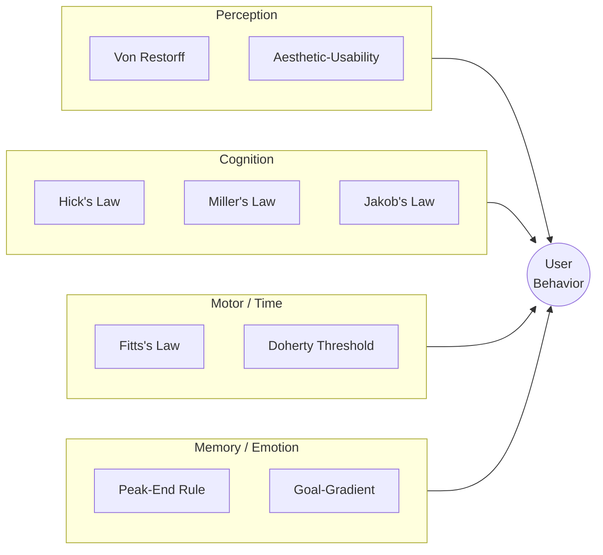
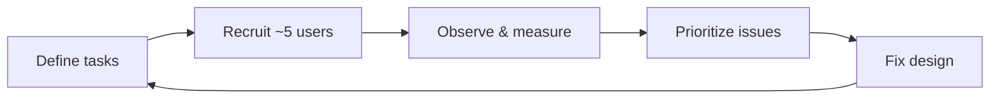
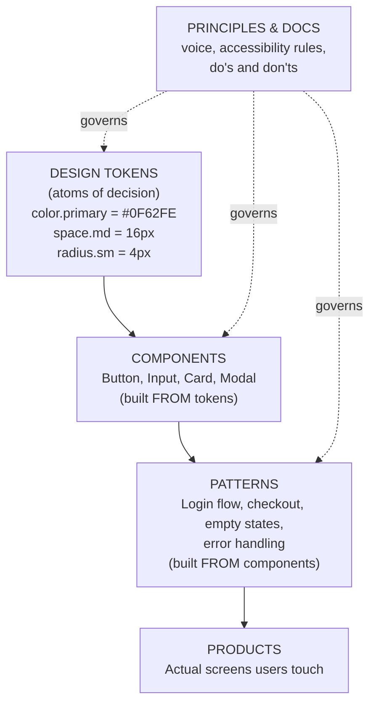
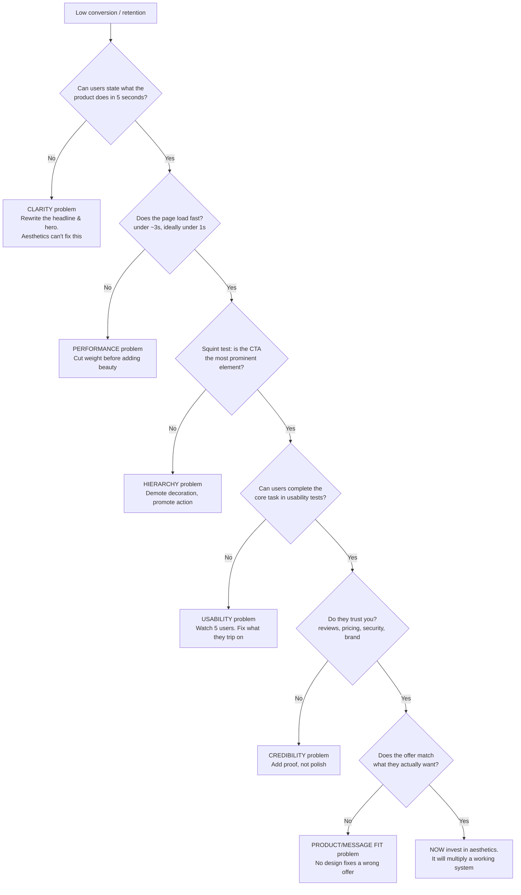
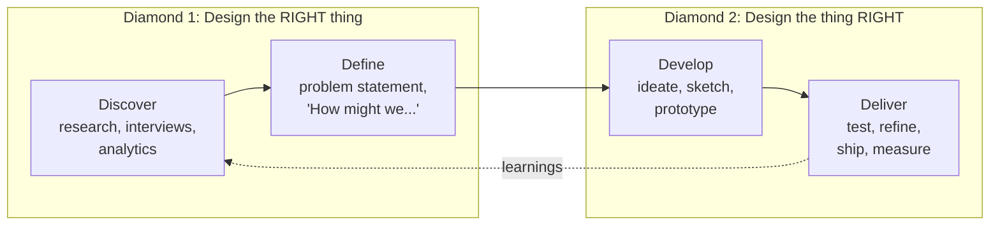

# 📐 The Full Schemata of UI/UX Design

> A wiki-style knowledge map. Each section is a node. Follow the links, build the schema in your head, then go break it against real users.
>
> **Format notes:** Internal links like [Visual Hierarchy](#-visual-hierarchy) jump between nodes. Mermaid blocks render in Obsidian, GitHub, Notion, and most modern markdown viewers.

---

## 🗺️ The Master Map

Start here. Everything below hangs off this tree.

---

## 🧩 Node 0 — What Is Design?

**Definition:** Design is the intentional shaping of something (a product, a screen, a service, a process) to achieve a purpose under constraints.

The keyword is *intentional*. Decoration happens to look nice. Design exists to *do* something.

Herbert Simon, in *The Sciences of the Artificial*, framed it roughly as: anyone who devises a course of action to change an existing situation into a preferred one is designing. By that definition, a doctor writing a treatment plan is designing. So is an engineer, a teacher, and yes, the person arranging buttons on a checkout page.

**So... is design about problem solving?**

Yes, with one important nuance.

Design *is* problem solving, but it's a specific flavor of it. Most design problems are what theorists call **wicked problems** (Rittel & Webber, 1973):

- There is no single correct answer, only better and worse ones
- The problem definition itself shifts as you work on it
- Every solution creates new constraints
- You can't fully test a solution without shipping it

This is why design is iterative by nature. You don't "solve" a checkout flow the way you solve a math equation. You propose, test, learn, and revise.

> ⚠️ **The nuance:** "Design = problem solving" is true but incomplete. Design also involves *problem finding* (framing what's actually wrong) and *meaning making* (why should anyone care?). A perfectly solved wrong problem is still a failure.

**See also:** [The Double Diamond](#-node-9--the-design-process), [Wicked problems vs puzzles](#-node-0--what-is-design)

---

## 🧠 Node 1 — Constructivism & Schemata (Why This Document Is Shaped Like This)

You asked about Constructivism and schemata. Both matter twice here: once for *how you learn design*, and once for *how your users experience your design*.

### Constructivism (the learning theory)

**Definition:** Knowledge isn't transferred into your head like a file copy. You *construct* it by connecting new information to what you already know. Key figures: **Jean Piaget** (cognitive constructivism), **Lev Vygotsky** (social constructivism).

Piaget's two core mechanisms:

| Mechanism | What happens | Design-learning example |
|---|---|---|
| **Assimilation** | New info fits into an existing schema | "Oh, a design token is just a variable. I know variables." |
| **Accommodation** | New info breaks the schema, forcing you to rebuild it | "Wait, beautiful design *lowered* conversion? My schema 'pretty = good' is wrong." |

### Schemata (the mental structures)

**Definition:** A **schema** (plural: *schemata*) is an organized mental framework: a cluster of related concepts, expectations, and patterns. The term comes from Piaget and from **Frederic Bartlett's** memory research (1932).

A wiki is basically a schema made visible. Nodes, links, hierarchy. That's why this document is wiki-shaped: the format mirrors the cognitive structure you're trying to build.

### The bridge to UX: users have schemata too

Here is the punchline. In UX, a user's schema is called a **mental model**, and it's one of the most powerful forces in interface design.

When your interface matches the user's schema, it feels "intuitive." When it violates the schema, the user must *accommodate* (rebuild their mental model), and accommodation costs effort. Users mostly refuse to pay that cost. They just leave.

> 💡 **Rule of thumb:** "Intuitive" is not a property of your design. It's a property of the *match between your design and the user's existing schemata.*

**See also:** [UX Laws](#-node-4--the-laws--heuristics-of-ux), [Why ugly sites convert](#-node-8--aesthetics-vs-conversion-the-paradox)

---

## 🔀 Node 2 — UI vs UX (They Are Not the Same Thing)

**UX (User Experience):** The *entire* journey: how someone discovers, learns, uses, struggles with, and feels about a product. UX includes things you never see on screen: loading speed, support emails, the pricing page, the cancellation flow.

**UI (User Interface):** The concrete surface a person touches: screens, buttons, typography, colors, spacing, motion.

A classic way to relate them:

Common metaphor: UX is the architecture and structural engineering of a house; UI is the interior finishing. A gorgeous interior in a house with no plumbing is still a bad house. (And yes, the metaphor leaks: in practice UI decisions feed back into UX. The layers talk to each other.)

| | UX | UI |
|---|---|---|
| **Core question** | Does this solve the right problem, smoothly? | Is this clear, legible, and pleasant to operate? |
| **Artifacts** | Personas, journey maps, flows, wireframes, test reports | Mockups, design systems, components, prototypes |
| **Measured by** | Task success, time on task, retention, NPS, support tickets | Legibility, scannability, error rate per screen, accessibility |
| **Fails like** | "I don't understand what this app is for" | "I can't read this gray text on white" |

**See also:** [Usability](#-node-5--usability), [Visual Hierarchy](#-node-6--the-ui-layer-hierarchy-layout-contrast)

---

## 🏛️ Node 3 — The Principles of UX

You asked directly: *what is the principle of UX?* There isn't one principle; there are a few canonical frameworks. Learn these three and you've covered most of the field's foundations.

### 3.1 Don Norman's design principles (*The Design of Everyday Things*)

1. **Visibility** — Can the user see what actions are possible?
2. **Feedback** — Does the system respond to every action, immediately and clearly?
3. **Affordances** — Does the object's form suggest how to use it? (A handle affords pulling.)
4. **Signifiers** — Explicit signals of where to act (a "Push" label, an underlined link)
5. **Mapping** — Does the control's layout match its effect? (Stove knobs arranged like the burners.)
6. **Constraints** — Does the design prevent wrong actions? (Grayed-out buttons, plugs that only fit one way.)
7. **Conceptual model** — Does the user end up with an accurate schema of how the system works?

### 3.2 Nielsen's 10 Usability Heuristics (1994, still the industry standard)

1. Visibility of system status
2. Match between system and the real world
3. User control and freedom (undo, escape hatches)
4. Consistency and standards
5. Error prevention
6. Recognition rather than recall
7. Flexibility and efficiency of use (shortcuts for experts)
8. Aesthetic and minimalist design
9. Help users recognize, diagnose, and recover from errors
10. Help and documentation

> 💡 Memorize #6. "Recognition rather than recall" explains half of all good UI decisions: show options instead of making users remember them. It's schema theory in action: recognition only requires *activating* an existing schema; recall requires *reconstructing* one.

### 3.3 The UX Hierarchy of Needs

Borrowed from Maslow. You cannot skip levels. Delight built on broken functionality is lipstick on a 404.

**See also:** [Usability](#-node-5--usability), [Aesthetics vs Conversion](#-node-8--aesthetics-vs-conversion-the-paradox)

---

## ⚖️ Node 4 — The Laws & Heuristics of UX

These are the empirical regularities of human-computer interaction. Treat them like physics for interfaces. (Reference: lawsofux.com)

| Law | Statement | Practical move |
|---|---|---|
| **Jakob's Law** | Users spend most of their time on *other* products, so they expect yours to work the same way | Follow conventions for nav, carts, forms. Innovate on value, not on where the logout button lives |
| **Hick's Law** | Decision time grows with the number and complexity of choices | Cut options. One primary CTA per screen. Progressive disclosure for the rest |
| **Fitts's Law** | Time to hit a target depends on its distance and size | Make tap targets big (44×44px+) and put frequent actions within thumb reach |
| **Miller's Law** | Working memory holds about 7±2 chunks | Chunk phone numbers, group form fields, break long flows into steps |
| **Tesler's Law** | Every system has irreducible complexity; someone must absorb it | Absorb complexity in the design, not in the user. Smart defaults > 12 settings |
| **Aesthetic–Usability Effect** | People perceive attractive designs as *more usable*, even when they aren't | Beauty buys forgiveness for small flaws. It also masks real flaws in testing. Double-edged 🔪 |
| **Von Restorff Effect** | The item that differs from the rest gets remembered | Make the primary action visually distinct. Only one thing can be distinct |
| **Peak–End Rule** | Experiences are judged by their peak moment and their ending | Polish the success state and the offboarding, not just the funnel entrance |
| **Doherty Threshold** | Keep system response under ~400ms to hold attention | Performance IS UX. Use skeletons and optimistic UI when you can't be fast |
| **Goal-Gradient Effect** | Motivation increases as people near a goal | Show progress bars; pre-fill the first step ("2 of 5 complete") |

---

## 🧪 Node 5 — Usability

**Definition (ISO 9241-11):** The extent to which a product can be used by specified users to achieve specified goals with **effectiveness**, **efficiency**, and **satisfaction** in a specified context of use.

Break that down:

- **Effectiveness** — Can they complete the task at all? (Task success rate)
- **Efficiency** — How much time/effort does it take? (Time on task, clicks, errors)
- **Satisfaction** — How do they feel about it? (SUS score, ratings, retention)

Nielsen adds two more attributes worth tracking: **learnability** (how fast can a first-timer get it?) and **memorability** (after a month away, do they still remember how?).

### Morville's UX Honeycomb

A checklist for whether an experience is actually complete:

> **Useful · Usable · Desirable · Findable · Accessible · Credible · Valuable**

Notice that *desirable* (aesthetics) is one cell out of seven. This becomes important in [Node 8](#-node-8--aesthetics-vs-conversion-the-paradox).

### How you actually test usability

1. **Define tasks** — real goals, not feature tours ("buy a blue shirt under $30," not "explore our filters")
2. **5 users** — Nielsen's research: ~5 users uncover the majority of usability problems; iterate and test again rather than testing 20 at once
3. **Think-aloud protocol** — users narrate while doing; you shut up and watch
4. **Measure** — success rate, time, errors, where they hesitated
5. **Fix, retest** — usability is a loop, not a gate

**See also:** [Nielsen's Heuristics](#-node-3--the-principles-of-ux), [The Design Process](#-node-9--the-design-process)

---

## 🎨 Node 6 — The UI Layer: Hierarchy, Layout, Contrast

You named these specifically, so here's each one as its own sub-node.

### 6.1 Visual Hierarchy

**Definition:** The deliberate ordering of elements so the eye lands on things in the sequence *you* intend.

Hierarchy is built from a small set of levers:

| Lever | How it signals importance |
|---|---|
| **Size** | Bigger = more important. The H1 should be unmistakable |
| **Weight** | Bold pulls the eye before regular text does |
| **Color & contrast** | High-contrast elements come forward; muted ones recede |
| **Position** | Top-left start (in LTR languages); F-pattern and Z-pattern scanning |
| **Whitespace** | Isolation = emphasis. Space around an element is a spotlight |
| **Imagery** | Faces and photos beat text for first attention. Eye-gaze in photos steers attention |

> 🧪 **The squint test:** Blur your eyes at the screen. Whatever still stands out is your real hierarchy. If everything stands out, nothing does. If the decorative blob outshines your CTA, you've found a conversion leak.

### 6.2 Layout & Grids

- **Grid systems** — 12-column grids dominate web layout because 12 divides cleanly by 2, 3, 4, and 6
- **Spacing scale** — Use a consistent scale (4pt or 8pt system). Random spacing reads as sloppy even when users can't say why
- **Alignment** — Every element should align with *something*. Strong edges create invisible structure
- **Proximity (Gestalt)** — Things near each other are perceived as related. Group label with its field, price with its product
- **Reading patterns** — **F-pattern** for text-heavy pages, **Z-pattern** for sparse landing pages. Put critical content on the path, not off it

#### Gestalt principles (the perception engine under all layout)

Proximity · Similarity · Continuity · Closure · Figure/Ground · Common Region · Common Fate

These are pre-attentive: the user's brain applies them before conscious thought. You don't get to opt out, so use them on purpose.

### 6.3 Contrast Ratio (Accessibility, WCAG)

**Definition:** The luminance ratio between foreground and background, from 1:1 (invisible) to 21:1 (black on white).

The WCAG 2.x standards you should know cold:

| Content | AA (the practical legal/industry bar) | AAA (stricter) |
|---|---|---|
| Normal body text | **4.5:1** | 7:1 |
| Large text (≥24px, or ≥18.66px bold) | **3:1** | 4.5:1 |
| UI components & meaningful graphics (icons, input borders, focus rings) | **3:1** | — |

Why care beyond compliance:

- Roughly 1 in 12 men has some form of color vision deficiency
- Everyone becomes "low vision" in sunlight on a phone screen
- Low-contrast gray-on-gray text (a persistent trend) measurably hurts reading speed and comprehension, which hurts conversion
- **Never encode meaning in color alone.** Pair color with icons, labels, or patterns (error = red + icon + message)

Tools: WebAIM Contrast Checker, Stark, the contrast inspector built into Chrome DevTools.

### 6.4 Typography (the 90% of UI that is text)

- Limit to 1–2 typefaces; create variety with size and weight instead
- Body text: ~16px minimum on web; line height ~1.5; line length 45–75 characters
- Establish a **type scale** (e.g., 1.25 ratio: 16 → 20 → 25 → 31 → 39) and stick to it
- Real hierarchy in text = size + weight + color working together, not size alone

**See also:** [Design Systems](#-node-7--design-systems), [Aesthetics vs Conversion](#-node-8--aesthetics-vs-conversion-the-paradox)

---

## 🧱 Node 7 — Design Systems

**Definition:** A single source of truth that packages design decisions into reusable parts: tokens, components, patterns, and the documentation explaining when to use which.

### Why design systems exist (the actual business case)

1. **Consistency = learnability.** One button style means users build the schema once and reuse it everywhere. (Constructivism again: consistency enables *assimilation*; inconsistency forces costly *accommodation* on every screen.)
2. **Speed.** Teams stop redesigning the dropdown for the fifth time
3. **Quality floor.** Accessibility and contrast get solved once, inside the component, instead of re-litigated per page
4. **Coherent brand** at scale, across teams who never meet

### What "design system choices" actually means in practice

- **Adopt, adapt, or build?** Adopt an existing system (Material, Carbon, Polaris, shadcn/ui) when speed matters; build your own when differentiation and scale justify the cost
- **Token architecture** — semantic tokens (`color.text.danger`) over raw values (`red-500`) so themes and dark mode don't require rewrites
- **Component API design** — which variants exist (`primary/secondary/ghost`), which are forbidden
- **Governance** — who can add a component? Without governance, a design system becomes a junk drawer in about six months

Famous public systems worth studying: **Material Design** (Google), **Human Interface Guidelines** (Apple), **Carbon** (IBM), **Polaris** (Shopify), **Atlassian Design System**.

**See also:** [Typography](#-node-6--the-ui-layer-hierarchy-layout-contrast), [Nielsen heuristic #4: Consistency](#-node-3--the-principles-of-ux)

---

## 💰 Node 8 — Aesthetics vs Conversion: The Paradox

This is the contradiction you noticed, and it's real. Beautiful designs sometimes convert worse. Ugly designs sometimes convert and retain brilliantly. Craigslist, Hacker News, Wikipedia, and Berkshire Hathaway's website are all famously plain and famously sticky. Plenty of award-winning redesigns have tanked revenue.

The paradox dissolves once you separate what aesthetics actually does from what conversion actually requires.

### Why a beautiful design can fail to convert

| Failure mode | What's happening |
|---|---|
| **Beauty without clarity** | The visitor can't answer "what is this and why should I care?" in ~5 seconds. Gorgeous hero image, vague headline, dead funnel |
| **Misdirected hierarchy** | The most visually dominant element is decorative, so attention never reaches the CTA. Failed squint test |
| **Aesthetic-Usability Effect masking flaws** | In testing, users *rate* pretty designs as usable while still failing tasks. Your test scores lied to you |
| **Performance cost** | Heavy animation, video backgrounds, custom fonts → slow load. Every second of delay costs conversions. Doherty Threshold violated |
| **Schema violation** | The "creative" navigation breaks Jakob's Law. Users must accommodate, and they won't |
| **Form over friction** | Minimalist aesthetics hid the trust signals, prices, or shipping info people needed to feel safe buying |
| **Wrong audience** | Designers design for designers. Dribbble taste ≠ what a 52-year-old procurement manager finds credible |

### Why a "non-aesthetic" design can convert and retain

- **Speed** — plain HTML loads instantly
- **Information density matches intent** — Craigslist users want listings, not whitespace. Amazon's cluttered UI is dense *on purpose*: density = scent of information for comparison shoppers
- **Familiarity** — years of unchanged UI means users' schemata fit perfectly. Zero relearning cost, ever. That's retention
- **Function as trust** — for utility products, "no marketing polish" itself signals honesty
- **Nothing competes with the task** — accidental perfect hierarchy: the content IS the page

### The resolution

Aesthetics is a *multiplier on a working system*, not a substitute for one. Refer back to the [UX Hierarchy of Needs](#-node-3--the-principles-of-ux): pleasurable sits on top of functional, reliable, usable, and convenient. And per the [Honeycomb](#-node-5--usability), desirable is one cell of seven.

Conversion specifically depends on, in rough order of leverage:

1. **Clarity** — value proposition understood in seconds
2. **Relevance** — message matches what the visitor came for (ad ↔ landing page match)
3. **Friction** — fewer fields, fewer steps, fewer decisions (Hick's Law)
4. **Anxiety** — trust signals, security cues, reviews, transparent pricing
5. **Urgency/Motivation** — honest scarcity, clear benefit
6. **Distraction** — one page, one job; remove competing links
7. *Then* **aesthetics**, which amplifies credibility and perceived quality of everything above

### Diagnostic flowchart: "my design doesn't convert"

> 💡 **Takeaway:** When beautiful designs fail, beauty usually isn't the culprit. Something below it on the hierarchy is broken, and the beauty either hid the break or actively caused it (slow load, buried CTA, violated schema).

**See also:** [Aesthetic-Usability Effect](#-node-4--the-laws--heuristics-of-ux), [Mental models](#-node-1--constructivism--schemata-why-this-document-is-shaped-like-this)

---

## 🔄 Node 9 — The Design Process

Two canonical models. Both encode the same idea: alternate between expanding options and committing to choices.

### The Double Diamond (UK Design Council)

- **Discover** (diverge): go wide, gather evidence, suspend solutions
- **Define** (converge): commit to a problem statement
- **Develop** (diverge): many candidate solutions, cheap prototypes
- **Deliver** (converge): test, pick, polish, ship, measure

### Design Thinking (Stanford d.school)

**Empathize → Define → Ideate → Prototype → Test**, looping freely. Same DNA, more emphasis on user empathy at the front.

> ⚠️ The diagrams look linear. Real projects loop constantly. Testing in Deliver routinely reveals you defined the wrong problem, sending you back to Discover. That's not failure; that's the process working.

---

## 🎓 Node 10 — A Constructivist Study Path

Since knowledge is built, not copied, here's a sequence designed for assimilation (each step hooks onto the previous schema):

1. **Anchor schema** — Read *The Design of Everyday Things* (Norman). Doors and stoves first; screens make more sense after
2. **Add the web layer** — *Don't Make Me Think* (Krug). Short, funny, eternally true
3. **Add the laws** — lawsofux.com, one law per day; find a real example of each in apps you use
4. **Add the eye** — *Refactoring UI* (Wathan & Schoger) for practical visual craft
5. **Add measurement** — Nielsen Norman Group articles (nngroup.com) on testing and research
6. **Accommodate** — Redesign one real screen. Test it on 5 people. Watch your schemata break and rebuild. This step is not optional; it's where the knowledge becomes yours

### Glossary stub (expand as you learn)

| Term | One-liner |
|---|---|
| **Affordance** | What an object's form lets you do |
| **CTA** | Call to action; the thing you want clicked |
| **Heuristic evaluation** | Expert review against Nielsen's 10 |
| **Information architecture** | How content is organized, labeled, and navigated |
| **Mental model** | The user's schema of how a system works |
| **Progressive disclosure** | Reveal complexity only when needed |
| **SUS** | System Usability Scale; 10-question usability score |
| **Token** | A named, reusable design decision |
| **WCAG** | Web Content Accessibility Guidelines |
| **Wireframe** | Low-fidelity structural sketch of a screen |

---

*End of schemata. Now go violate it knowingly instead of accidentally.* 🛠️

---

## 🛠️ Node 11 — From Schema to Screen: The Execution Playbook

Everything above is the map — the *why* behind every design decision. What follows is the territory: the working procedure for actually producing an interface, with the schemata loaded in your head while you build. The two halves form one loop: the schemata tells you which rules exist and what breaking them costs; the playbook tells you how to build something distinctive without breaking the rules that matter.

Read the playbook through the lens of the nodes above:

- **Step 1 (Context-Driven Design Reasoning)** is [Node 0](#-node-0--what-is-design) in action — problem *finding* before problem solving. Domain, audience, and tone are the constraints that make design intentional instead of decorative.
- **Step 2 (Break the Probability Bias)** lives in the tension of [Jakob's Law](#-node-4--the-laws--heuristics-of-ux): be unexpected in *aesthetics* (typography, color, composition), stay conventional in *interaction* (navigation, forms, where the logout button lives). Distinctiveness that forces users to rebuild their mental model ([Node 1](#-node-1--constructivism--schemata-why-this-document-is-shaped-like-this)) isn't creativity — it's a conversion leak.
- **Step 4 (Curate and Verify)** is [Node 5's usability loop](#-node-5--usability) compressed into a working session: judge the rendered result empirically, not the code theoretically. Run the squint test from [Node 6](#-node-6--the-ui-layer-hierarchy-layout-contrast) on every screen.
- **The Aesthetics Guidelines** only pay off when the layers beneath them hold. Per [Node 8](#-node-8--aesthetics-vs-conversion-the-paradox), aesthetics is a multiplier on a working system — clarity, hierarchy, performance, and trust come first, then beauty amplifies all of them. And every bold visual choice still answers to [Node 6.3's contrast floors](#-node-6--the-ui-layer-hierarchy-layout-contrast): distinctive is never an excuse for illegible.

With that frame set, here is the playbook.

---

This skill guides creation of distinctive, production-grade frontend interfaces that avoid generic "AI slop" aesthetics. Implement real working code with exceptional attention to aesthetic details and creative choices.

The user provides frontend requirements: a component, page, application, or interface to build. They may include context about the purpose, audience, or technical constraints.

## Step 1: Context-Driven Design Reasoning

Before any aesthetic choices, use deductive reasoning to derive the right design from the context:

- **Domain**: What is this? (enterprise SaaS, creative portfolio, fintech, healthcare, e-commerce, etc.)
- **Audience**: Who uses this? A CFO expects different visual language than a teenager. A developer tool looks different from a wedding planner.
- **Tone**: Professional? Playful? Trustworthy? Edgy? The context dictates this — don't pick a tone arbitrarily.
- **Visual Appropriateness**: Does a gradient help or hurt? A law firm landing page with neon gradients destroys trust. A music app without color energy feels dead. Every visual choice must survive the question: "Does this serve the context?"

Derive the design from the problem, don't impose a style onto it.

## Step 2: Break the Probability Bias

LLMs are next-token predictors optimized via backpropagation. This creates a natural bias toward the most statistically probable (generic) output. To counter this:

1. **Generate 5 design directions** ranging from highest probability (most generic/expected) to lowest probability (most unexpected/distinctive)
2. **Scrutinize the top 1-2** — these are the AI slop zone. Don't default to them, but individual elements may still work if they genuinely serve the context
3. **Cherry-pick across all 5** — select elements that are distinctive yet contextually appropriate, regardless of which tier they came from
4. **Combine deliberately** — merge the best unconventional choices into one cohesive direction

Present the chosen direction to the user briefly before implementing. This ensures every design is intentionally de-biased.

## Step 3: Think in Pure HTML/CSS/JS First

LLMs have deepest mastery over raw web fundamentals. Use this to your advantage:

- **Design in HTML/CSS/JS mentally first** — even if the target is React/Vue/Svelte. The browser is the ground truth.
- **Prototype the visual in vanilla form** — CSS is where the design lives. Get the aesthetics right at this layer.
- **Then translate** to the target framework/component structure. The conversion is mechanical; the design thinking is not.

This prevents framework abstractions from flattening creative choices.

## Step 4: Curate and Verify

Adopt the mindset of a senior UI/UX Designer — someone who both solves usability problems and crafts visually beautiful, creative interfaces. Evaluate the output through that expert lens:

- **UX Review**: Does the layout guide the user's eye correctly? Is the information hierarchy clear? Are interactive elements discoverable and intuitive? Would a real designer approve the flow?
- **Visual Design Review**: Step back and judge the aesthetics as a designer would. Does the composition feel balanced and intentional? Do colors, typography, and spacing work together harmoniously? Is there a clear visual identity?
- **Ask the user to verify**: Request the user to paste a screenshot of the rendered result, or if browser tools (Playwright) are available, use them to view the output directly.
- **Iterate like a designer**: Refine based on what's actually rendered, not what the code theoretically produces. Adjust spacing by pixels, tweak color values, fine-tune font weights — the details are the design.

## Frontend Aesthetics Guidelines

Focus on:
- **Typography**: Choose fonts that are beautiful, unique, and interesting. Avoid generic fonts like Arial and Inter; opt instead for distinctive choices that elevate the frontend's aesthetics; unexpected, characterful font choices. Pair a distinctive display font with a refined body font.
- **Color & Theme**: Commit to a cohesive aesthetic. Use CSS variables for consistency. Dominant colors with sharp accents outperform timid, evenly-distributed palettes.
- **Motion**: Use animations for effects and micro-interactions. Prioritize CSS-only solutions for HTML. Use Motion library for React when available. Focus on high-impact moments: one well-orchestrated page load with staggered reveals (animation-delay) creates more delight than scattered micro-interactions. Use scroll-triggering and hover states that surprise.
- **Spatial Composition**: Unexpected layouts. Asymmetry. Overlap. Diagonal flow. Grid-breaking elements. Generous negative space OR controlled density.
- **Backgrounds & Visual Details**: Create atmosphere and depth rather than defaulting to solid colors. Add contextual effects and textures that match the overall aesthetic. Apply creative forms like gradient meshes, noise textures, geometric patterns, layered transparencies, dramatic shadows, decorative borders, custom cursors, and grain overlays.

NEVER use generic AI-generated aesthetics like overused font families (Inter, Roboto, Arial, system fonts), cliched color schemes (particularly purple gradients on white backgrounds), predictable layouts and component patterns, and cookie-cutter design that lacks context-specific character.

Interpret creatively and make unexpected choices that feel genuinely designed for the context. No design should be the same. Vary between light and dark themes, different fonts, different aesthetics. NEVER converge on common choices (Space Grotesk, for example) across generations.

**IMPORTANT**: Match implementation complexity to the aesthetic vision. Maximalist designs need elaborate code with extensive animations and effects. Minimalist or refined designs need restraint, precision, and careful attention to spacing, typography, and subtle details. Elegance comes from executing the vision well.