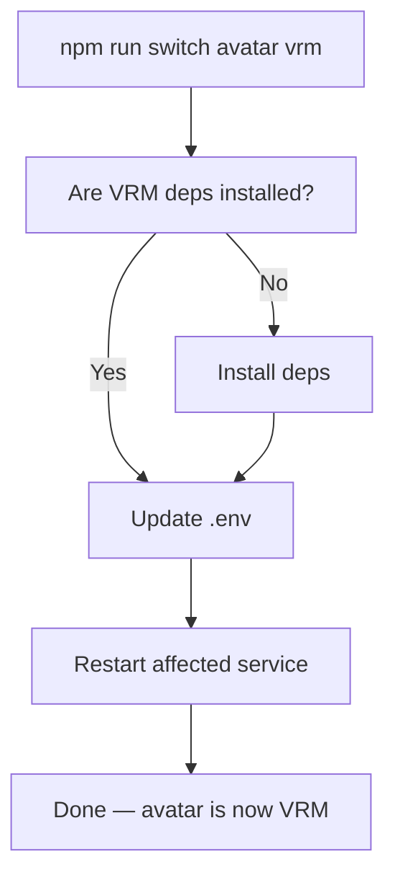

# Installation Flow — What Actually Happens

## The User's Journey

A person finds our project. They want an AI with a virtual body. Here's what happens from their perspective.

### Step 1: Clone

```bash
git clone https://github.com/.../vibe-ai-partner.git
cd vibe-ai-partner
```

### Step 2: Run Setup

```bash
npm run setup
```

Setup is interactive. It asks questions, installs only what the user chooses.

### Step 3: Setup Asks — Choose Your Avatar

```
Which avatar renderer?

  1) HTML       — simple HTML/CSS avatar (no WebGL, works everywhere, lightest)
  2) Live2D     — 2D anime style (default model: Shizuku, ~5MB download)
  3) VRM        — 3D model (bring your own .vrm file)
  4) Three.js   — 3D custom (bring your own .glb/.gltf)

Your choice [1]:
```

**What happens behind the scenes:**

| Choice | npm deps installed | Model downloaded | Storage |
|--------|-------------------|-----------------|---------|
| HTML | None (pure HTML/CSS) | None | ~0MB |
| Live2D | pixi-live2d-display (~50MB) | Shizuku (~5MB from GitHub Releases) | ~55MB |
| VRM | three.js + @pixiv/three-vrm (~80MB) | None (user provides .vrm) | ~80MB |
| Three.js | three.js only (~40MB) | None (user provides .glb) | ~40MB |

Setup downloads the default model from `models.json` registry (not stored in git). For VRM/Three.js, users provide their own model file and set `AVATAR_MODEL=/path/to/file` in `.env`.

### Step 4: Setup Asks — Choose Your Voice Engine

```
Which text-to-speech engine?

  1) KittenTTS         — ultra-light, ~25MB on disk, CPU only, fast
  2) Kokoro ONNX       — ~80MB on disk (quantized), CPU or GPU, good quality
  3) Kokoro (full)     — ~350MB model + PyTorch, GPU recommended, best quality

Your choice [1]:
```

This is the critical choice. The difference (all sizes are **storage on disk**, not RAM):

| Engine | Storage (disk) | GPU needed? | Quality | Voices |
|--------|---------------|-------------|---------|--------|
| **KittenTTS** | ~25MB model | No (CPU only) | Good | 8 voices |
| **Kokoro ONNX** | ~80MB quantized / ~300MB full model | No (CPU ok, GPU faster) | Very good | 20+ voices, multilingual |
| **Kokoro (full)** | ~350MB model + ~1.5GB PyTorch dep | Yes (MPS/CUDA) | Best | 27 voices, multilingual |

**What happens behind the scenes:**

| Choice | What gets installed (storage) |
|--------|------------------------------|
| KittenTTS | `pip install kittentts` (~25MB on disk) |
| Kokoro ONNX | `pip install kokoro-onnx` + quantized model (~80MB on disk) |
| Kokoro (full) | `pip install kokoro` + PyTorch (~1.5GB) + model download on first use (~350MB) |

The tts-server has adapters for all engines. `pip install` only installs the chosen engine's dependencies. The `.env` file tells the server which engine to use.

### Step 5: Setup Asks — Choose Your Voice

```
Available voices for KittenTTS:

  1) Bella   (female)
  2) Jasper  (male)
  3) Luna    (female)
  4) Bruno   (male)
  5) Rosie   (female)
  6) Hugo    (male)
  7) Kiki    (female)
  8) Leo     (male)

Your choice [1]:
```

### Step 6: Setup Asks — Memory Plugins (Optional)

```
Memory system?

  File-based memory is always included (conversations, state saved as JSON).
  Optional plugins add database-backed features:

  1) File only       — no database needed (default)
  2) + SQLite        — adds state history, lightweight, no server
  3) + PostgreSQL    — adds state history, feeling timeline, cross-session queries
  4) + Semantic      — adds memory search with pgvector + Gemini (requires PostgreSQL)

Your choice [1]:
```

### Step 7: Setup Configures Claude Code Hooks

```
Claude Code Integration

Hooks make the entity react to Claude's work automatically.
⚠️  Note: Hooks consume additional tokens on every interaction.

Enable hooks? [y/N]:

If yes → hook level?

  1) Minimal    — Temporal grounding only (nearly free)
  2) Standard   — + event reactions + sentiment analysis (recommended)
  3) Full       — + conversation curation + qualia + consciousness
  4) Custom     — Choose individually

Your choice [2]:

Vocal mode?

  1) Silent         — Expressions only, never speaks (default)
  2) Reactive       — Speaks on strong emotions (intensity > 80)
  3) Conversational — Speaks on most responses (streaming)

Your choice [1]:
```

See [10-hooks-system — Token Cost](10-hooks-system.md) for what each tier costs per interaction.

### Step 8: Setup Writes .env

```bash
# Generated by npm run setup
AVATAR_RENDERER=live2d
TTS_ENGINE=kittentts
TTS_VOICE=Bella
TTS_SPEED=1.0
MEMORY_PLUGINS=
TTS_SERVER_PORT=5111
```

### Step 9: Done

```
Setup complete!

  Start:     npm start
  Stop:      npm stop
  Status:    npm run status

  Change settings: edit .env
  Reconfigure:     npm run setup
```

## Switching Plugins After Setup

Changed your mind? Use `npm run switch`:

```bash
# Switch avatar renderer
npm run switch avatar vrm
# → Checks if VRM deps are installed
# → Installs them if not (npm install three @pixiv/three-vrm)
# → Updates .env: AVATAR_RENDERER=vrm
# → Restarts avatar app

# Switch TTS engine
npm run switch tts kokoro-onnx
# → Checks if kokoro-onnx is installed
# → Installs it if not (pip install kokoro-onnx + downloads model)
# → Updates .env: TTS_ENGINE=kokoro-onnx
# → Restarts TTS server

# Add a memory plugin
npm run switch memory +postgresql
# → Checks if PostgreSQL is reachable
# → Runs database migrations
# → Updates .env: MEMORY_PLUGINS=postgresql

# Remove a memory plugin
npm run switch memory -postgresql
# → Updates .env: MEMORY_PLUGINS=
# → Data stays in DB (not deleted)
```

**What it does internally:**



Power users can also edit `.env` directly and restart manually — `npm run switch` is just the safe path that handles deps.

## The Lightweight Path (Minimum Storage)

For users who want the smallest footprint:

```
Avatar:  Live2D (~50MB on disk)
TTS:     KittenTTS (~25MB on disk)
Total:   ~75MB storage
GPU:     Not needed
Docker:  Not needed
```

## The Balanced Path (Recommended)

Good quality, runs on CPU, multilingual:

```
Avatar:  Live2D (~50MB on disk)
TTS:     Kokoro ONNX quantized (~80MB on disk)
Total:   ~130MB storage
GPU:     Not needed (optional, makes it faster)
Docker:  Not needed
```

## The Full Quality Path

Best possible voice quality:

```
Avatar:  VRM + Three.js (~80MB on disk)
TTS:     Kokoro full (~350MB model + ~1.5GB PyTorch)
Total:   ~2GB storage
GPU:     Yes (MPS on Mac, CUDA on Windows/Linux)
Docker:  Optional (for TTS isolation)
```

## Switching Later

User changes their mind? Edit `.env` and re-run setup:

```bash
# Change TTS engine
npm run setup -- --tts-only

# Or edit .env manually, then:
npm run tts:install   # Installs the engine specified in .env
npm restart
```

## What Users Never See

Users never think about:
- npm workspaces or monorepo structure
- TypeScript interfaces or design patterns
- Event bus or plugin registry internals
- Package boundaries between core/plugins

They think about:
- Which avatar do I want?
- Which voice do I want?
- How do I start it?
- How do I change settings?

## TTS Engine Details

### KittenTTS — The Lightweight Champion

```python
# What setup.sh runs:
pip install kittentts

# What the server does internally:
from kittentts import KittenTTS
model = KittenTTS("KittenML/kitten-tts-mini-0.8")
audio = model.generate("Hello!", voice="Bella")
```

- 15 million parameters
- Model: ~25MB (nano-int8 variant)
- CPU-optimized, no GPU needed
- 8 voices: Bella, Jasper, Luna, Bruno, Rosie, Hugo, Kiki, Leo
- Python 3.12

### Kokoro ONNX — The Sweet Spot

```python
# What setup.sh runs:
pip install kokoro-onnx
# + downloads quantized model (~80MB) or full model (~300MB)

# What the server does internally:
from kokoro_onnx import Kokoro
kokoro = Kokoro("kokoro-v1.0.onnx", "voices-v1.0.bin")
samples, sr = kokoro.create("Hello!", voice="af_heart", speed=1.0)
```

- ONNX Runtime (CPU or GPU)
- Storage: **~80MB quantized** or ~300MB full model
- 20+ voices, multilingual (English, Japanese via misaki G2P, etc.)
- Python 3.10-3.13
- Near real-time on Apple Silicon (CPU)
- Setup recommends quantized version by default

### Kokoro (Full) — Maximum Quality

```python
# What setup.sh runs:
pip install kokoro soundfile sounddevice
# + PyTorch auto-installs as dependency (~1.5GB on disk)
# + model downloads on first use (~350MB)

# What the server does internally:
from kokoro import KPipeline
pipeline = KPipeline(lang_code="a")
generator = pipeline("Hello!", voice="af_heart", speed=1.0)
for samples, sample_rate, _ in generator:
    # stream chunks
```

- Full PyTorch inference
- Storage: ~350MB model weights + ~1.5GB PyTorch dependency
- 82M parameters, 27 voices, multilingual with misaki G2P
- GPU recommended: MPS (macOS) or CUDA (Windows/Linux)
- Best quality, supports streaming (chunk by chunk)
