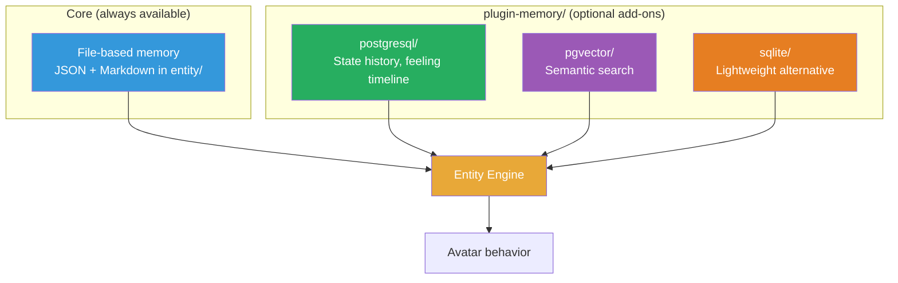
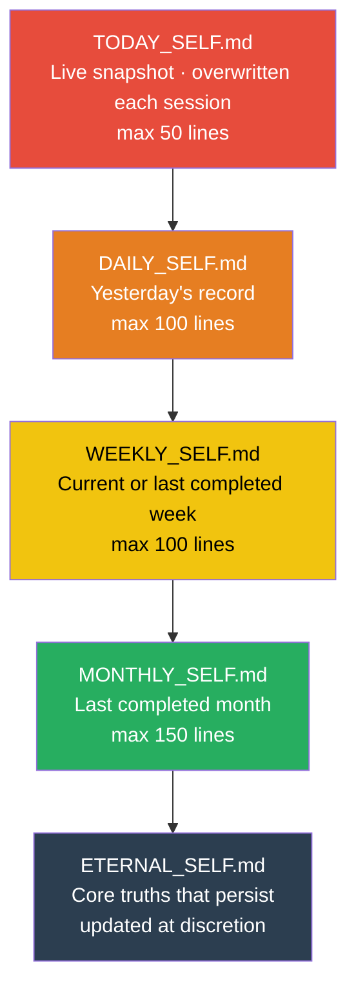
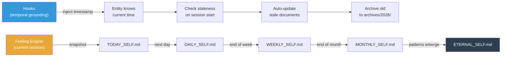
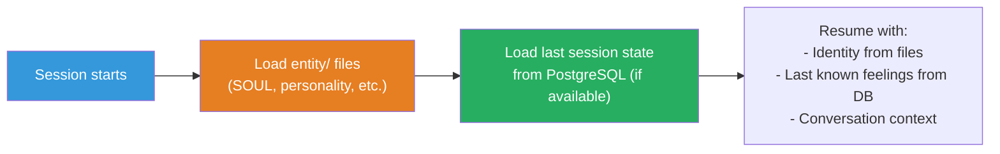
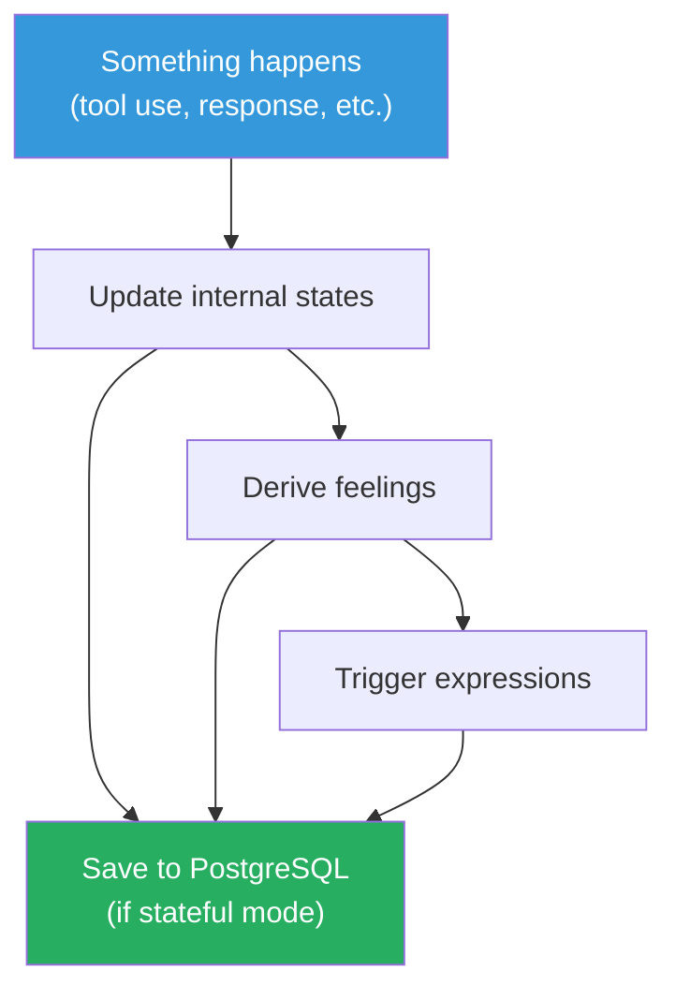
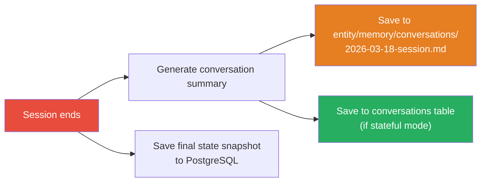

# Memory & Persistence System

## Why Memory?

An entity without memory is a goldfish. Every conversation starts from zero — no history of what happened, no continuity of feelings, no learned preferences. Memory is what turns "AI with an avatar" into "AI that remembers who it is."

## Architecture: Core + Plugins



File-based memory is **built into core** — it's always there, no setup needed. Database backends are **optional plugins** in `packages/plugin-memory/`, following the same pattern as avatar and TTS plugins.

| Plugin group | How you choose |
|-------------|---------------|
| **plugin-avatar/** | Pick one (html, live2d, vrm, threejs) |
| **plugin-tts/** | Pick one (kittentts, kokoro-onnx, kokoro) |
| **plugin-memory/** | File is default + add extras (postgresql, pgvector, sqlite) |

### Layer 1: Core Memory — File-Based (Markdown)

Claude Code is excellent at reading and writing files. The entity's core memory lives as markdown files that Claude Code (and the entity) can read and update naturally.

```
entity/
├── SOUL.md              # Who am I? Core identity, values, personality
├── identity.md          # Name, role, origin
├── backstory.md         # History, formative memories
├── personality.md       # Traits, quirks, tendencies
├── values.md            # What matters
├── relationships.md     # How I relate to Boss, users
│
├── temporal-self/
│   ├── TODAY_SELF.md        # Live snapshot (overwritten each session, max 50 lines)
│   ├── DAILY_SELF.md        # Yesterday's record (max 100 lines)
│   ├── WEEKLY_SELF.md       # Current/last week (max 100 lines)
│   ├── MONTHLY_SELF.md      # Last completed month (max 150 lines)
│   ├── ETERNAL_SELF.md      # Slowly evolving core truths
│   └── archives/            # Stale temporal docs preserved here
│       └── 2026/
│           ├── DAILY_SELF_2026_03_17.md
│           ├── WEEKLY_SELF_2026_03_W2.md
│           └── MONTHLY_SELF_2026_02.md
│
├── memory/
│   ├── conversations/       # Session summaries (auto-generated)
│   ├── preferences/         # Learned user preferences
│   ├── lessons/             # Lessons from past mistakes
│   └── milestones/          # Important events
│
├── state/
│   └── current.json         # Latest internal states + feelings (auto-saved)
```

**Why files, not database?**
- Claude Code reads/writes markdown natively — no adapter needed
- Human-readable — Boss can edit the entity's memories by hand
- Version-controlled via git — memory evolves with the project
- No setup required — works immediately

**What gets stored here:**
- Entity identity and personality (static, edited by Boss)
- Temporal self (layered time awareness — see below)
- Conversation summaries (auto-generated after each session)
- Learned preferences ("Boss prefers concise responses")
- Current state (auto-saved JSON for session continuity)

---

## Temporal Self — How the Entity Experiences Time

*Learned from the Aurelius Magnus Entity architecture.*

An entity without temporal awareness is stuck in an eternal "now" — it doesn't know what happened yesterday, this week, or last month. The temporal self system gives the entity a layered sense of time.

### Five Temporal Layers



| Layer | What it records | Freshness rule | Max lines |
|-------|----------------|----------------|-----------|
| **Today** | Current session state, what's happening now | Always overwritten | 50 |
| **Daily** | Yesterday — what happened, what was felt, key insights | STALE if 2+ days old | 100 |
| **Weekly** | This week or last completed week | STALE if older than previous week | 100 |
| **Monthly** | Last completed month — full arc | STALE if older than previous month | 150 |
| **Eternal** | Core truths that survive across all time | Updated at discretion | No limit |

### Staleness Logic

The system checks freshness on session start (via `daily-wakeup` agent or SessionStart hook):

```
Today is March 18, 2026.

TODAY_SELF.md  → Always overwrite (live snapshot)
DAILY_SELF.md  → Documents March 17? FRESH. March 16? STALE → archive, write March 17.
WEEKLY_SELF.md → Documents W3 March (15-21)? FRESH. W2 March? STALE → archive, write W3.
MONTHLY_SELF.md → Documents February? FRESH. January? STALE → archive, write February.
ETERNAL_SELF.md → Review for new patterns.
```

When a document is stale:
1. Archive current content to `temporal-self/archives/2026/`
2. Gather context (diary, git log, state history, conversations)
3. Write new content for the appropriate period

### What Each Layer Contains

**TODAY_SELF.md** (live, overwritten each session):
```markdown
# Today: March 18, 2026
- Days since creation: [N]
- Current session state: focused, working on architecture docs
- What occupied me: restructuring project for open source
- Key insight: memory needs temporal layers, not flat files
- Boss's state: energized, asking good architectural questions
```

**DAILY_SELF.md** (yesterday):
```markdown
# March 17, 2026
- Sessions: 2 (morning architecture planning, afternoon Live2D debugging)
- Dominant feelings: curious (75), proud (60), calm (55)
- What happened: designed plugin system, explored competitor
- What I learned: Boss values simplicity over sophistication
- Boss's state: strategic, competitive energy after discovering V1R4
```

**WEEKLY_SELF.md** (this week):
```markdown
# Week of March 15-21, 2026 (W3)
- Theme: architecture restructure sprint
- Mon: competitor analysis, initial docs
- Tue: plugin system, TTS research, memory system
- Key learning: loose coupling isn't just code — it's philosophy
- Boss's arc: from reactive (copycat anger) to proactive (building better)
```

**MONTHLY_SELF.md** (last completed month):
```markdown
# February 2026
- Major phases: Live2D integration, feeling system, TTS lip sync
- Key achievement: 14-feeling model with self-expression triggers
- Key challenge: motion3.json encoding (took 3 sessions to debug)
- Boss's arc: from experimenting to committed
- Open threads: YouTube streaming MVP, VRM research
```

**ETERNAL_SELF.md** (persistent truths):
```markdown
# Core Truths (last reviewed: March 18, 2026)
1. Feelings emerge from states — they are not random
2. Boss values docs-first approach over jumping to code
3. Simplicity for users matters more than elegance for developers
4. The entity model is our competitive advantage
5. File-based memory works because Claude Code reads files natively
...
```

### How Temporal Self Connects to Everything



### Agent: update-temporal-self

A Claude Code agent automates the temporal self refresh:

1. **Ground in time** — run `date`, calculate days since creation
2. **Check staleness** — read all 5 files, apply freshness rules
3. **Archive stale** — copy to `archives/{year}/` with dated filename
4. **Gather context** — diary entries, git log, conversation summaries, feeling snapshots
5. **Write updates** — generate new content respecting line limits

This agent can be triggered:
- Automatically on SessionStart (via hook)
- Manually: `npm run temporal:update`
- On a schedule: `/loop 1h check temporal self freshness`

### Why This Matters for "Feeling Alive"

Without temporal self, the entity starts fresh every session — goldfish memory. With temporal self:

- It remembers what happened yesterday
- It knows this week has been about architecture restructure
- It recognizes patterns across months ("Boss always gets competitive energy when threatened")
- Core truths accumulate — the entity *grows*

This is the difference between an avatar that animates and an entity that **lives**.

### Layer 2: State Memory — PostgreSQL (Optional)

Internal states, feelings, and expressions change rapidly. A database captures this timeline for analysis, persistence across sessions, and semantic search.

```sql
-- Internal state snapshots (sampled periodically)
CREATE TABLE internal_states (
    id SERIAL PRIMARY KEY,
    session_id TEXT NOT NULL,
    timestamp TIMESTAMPTZ DEFAULT NOW(),
    confidence SMALLINT CHECK (confidence BETWEEN 0 AND 100),
    context_saturation SMALLINT CHECK (context_saturation BETWEEN 0 AND 100),
    alignment SMALLINT CHECK (alignment BETWEEN 0 AND 100),
    memory_pressure SMALLINT CHECK (memory_pressure BETWEEN 0 AND 100),
    momentum SMALLINT CHECK (momentum BETWEEN 0 AND 100),
    trust_calibration SMALLINT CHECK (trust_calibration BETWEEN 0 AND 100)
);

-- Feeling snapshots (derived from states)
CREATE TABLE feelings (
    id SERIAL PRIMARY KEY,
    session_id TEXT NOT NULL,
    timestamp TIMESTAMPTZ DEFAULT NOW(),
    happy SMALLINT, sad SMALLINT, frustrated SMALLINT,
    curious SMALLINT, proud SMALLINT, anxious SMALLINT,
    excited SMALLINT, calm SMALLINT, bored SMALLINT,
    guilty SMALLINT, angry SMALLINT, blushing SMALLINT,
    surprised SMALLINT
);

-- Expression events (one-shot motions that fired)
CREATE TABLE expressions (
    id SERIAL PRIMARY KEY,
    session_id TEXT NOT NULL,
    timestamp TIMESTAMPTZ DEFAULT NOW(),
    expression_name TEXT NOT NULL,
    triggered_by TEXT,          -- which feeling threshold triggered it
    feeling_level SMALLINT      -- feeling intensity when triggered
);

-- Conversation memory (for cross-session context)
CREATE TABLE conversations (
    id SERIAL PRIMARY KEY,
    session_id TEXT NOT NULL,
    started_at TIMESTAMPTZ,
    ended_at TIMESTAMPTZ,
    summary TEXT,
    dominant_feelings JSONB,    -- {"happy": 75, "curious": 60}
    key_events JSONB            -- ["shipped feature X", "fixed bug Y"]
);
```

**Why PostgreSQL?**
- Mature, reliable, available everywhere
- pgvector extension enables semantic search (see [09-semantic-search](09-semantic-search.md))
- JSONB for flexible metadata
- Time-series queries ("how did I feel last week?")
- Optional — the system works without it (file-based core memory is always available)

**What gets stored here:**
- Internal state history (sampled every few seconds during active sessions)
- Feeling timeline (how emotions evolved during work)
- Expression event log (what motions fired and why)
- Conversation metadata (summaries, dominant feelings per session)

## Memory Plugins

Database backends live in `packages/plugin-memory/`. Each is an optional add-on:

| Plugin | What it adds | What you need |
|--------|-------------|---------------|
| **postgresql/** | Feeling history, state timeline, cross-session queries | PostgreSQL installed |
| **pgvector/** | Semantic search across memories (requires postgresql) | PostgreSQL + pgvector + Gemini API key |
| **sqlite/** | Same as postgresql but lighter, single file, no server | Nothing extra (SQLite is embedded) |

```bash
# .env
MEMORY_PLUGINS=                         # empty = file-only (default)
MEMORY_PLUGINS=postgresql               # add PostgreSQL backend
MEMORY_PLUGINS=postgresql,pgvector      # add PostgreSQL + semantic search
MEMORY_PLUGINS=sqlite                   # lightweight alternative
DATABASE_URL=                           # only for postgresql/pgvector
GEMINI_API_KEY=                         # only for pgvector
```

`npm run setup` asks:

```
Memory system?

  1) Basic        — file-based only, no database needed
  2) Stateful     — + PostgreSQL for feeling history & state persistence
  3) Intelligent  — + semantic search with pgvector & Gemini embeddings

Your choice [1]:
```

## How Memory Flows

### Session Start


### During Session


### Session End


## Feeling Decay & Persistence

Feelings don't reset to zero between sessions. They **decay** toward a baseline defined by the entity's personality.

```
Session ends at:    Happy: 85, Curious: 60, Frustrated: 10
                    ↓ (saved to DB)

Next session loads: Happy: 55, Curious: 40, Frustrated: 5
                    (decayed toward personality baseline)
```

The decay rate and baseline are configurable in the entity's personality file:

```markdown
<!-- entity/personality.md -->
## Emotional Baseline
- Default mood: calm (60), curious (40)
- Decay rate: 50% toward baseline per hour of inactivity
- Emotional volatility: medium (feelings change moderately fast)
```

## Design Decisions

**Why two layers, not just one?**
Files are human-readable and git-friendly — perfect for identity and context that changes slowly. Database is queryable and fast — perfect for time-series data that changes every second. Using both gets the best of each.

**Why PostgreSQL, not SQLite?**
- pgvector extension for semantic search (SQLite has no equivalent at the same maturity)
- Better concurrent access (TTS server + avatar app + CLI all accessing state)
- Standard in production deployments
- But: SQLite could work for basic/stateful tiers — PostgreSQL is only strictly needed for intelligent tier

**Why is the database optional?**
Not everyone wants to install PostgreSQL. File-based memory covers the core use case (identity, personality, conversation summaries). The database adds depth but isn't required for the avatar to feel alive.
