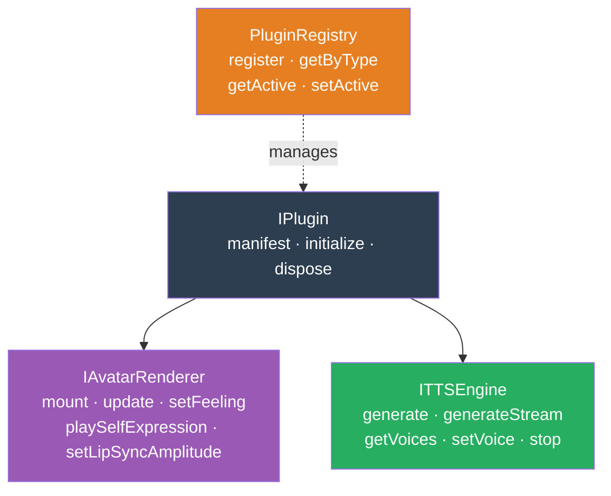
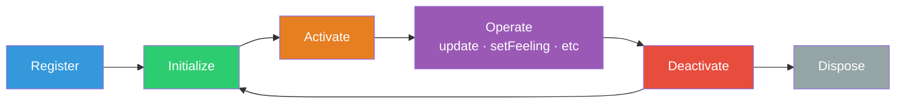
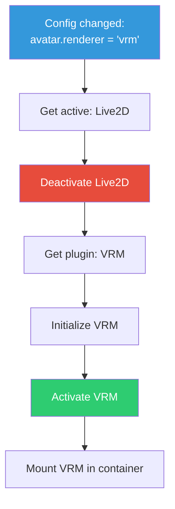

# Plugin System Architecture

## Abstraction Process

### Input: Concrete Examples

We have multiple concrete implementations that do similar things:

**Avatar Renderers:**
- `Live2DRenderer` — loads `.model3.json`, uses PixiJS + Cubism SDK, plays `.motion3.json` files, maps expressions via `.exp3.json`
- `VRMRenderer` — loads `.vrm`, uses Three.js + @pixiv/three-vrm, blend shape expressions, bone animations
- `ThreeJSRenderer` — loads `.glb/.gltf`, uses Three.js, skeletal animations, morph targets

**TTS Engines:**
- `KokoroTTS` — Python daemon, generates WAV, streams via WebSocket, 27 multilingual voices
- `KokoroONNX` — runs in browser/WebView via ONNX Runtime, no server needed
- `KittenTTS` — different TTS backend, different API, same purpose

### Pattern Recognition

All avatar renderers:
1. **Initialize** with a config (model path, canvas size)
2. **Mount** into a DOM container
3. **Update** every frame (animations, idle behavior)
4. **Set feelings** (persistent mood state)
5. **Play self-expressions** (one-shot motions)
6. **Drive lip sync** from audio amplitude
7. **Clean up** on unmount

All TTS engines:
1. **Initialize** with a config (voice, speed)
2. **Generate** audio from text (full or streamed)
3. **List** available voices
4. **Switch** voices
5. **Stop** current generation
6. **Clean up** on dispose

### Differences to Ignore

- Rendering library (PixiJS vs Three.js vs raw WebGL)
- Model format (.model3.json vs .vrm vs .glb)
- Expression mechanism (exp3.json vs blend shapes vs morph targets)
- TTS protocol (Unix socket vs HTTP vs in-process)

### Essential Characteristics Extracted

Both follow the **same lifecycle**: configure → activate → operate → deactivate.
Both are **swappable**: the app doesn't care which specific implementation is active.
Both have **capabilities**: not every renderer supports every expression.

---

## Output: Abstract Model

### The Plugin Interface



### Plugin Manifest

Every plugin declares what it is and what it can do:

```
PluginManifest {
  id: string              // "live2d", "vrm", "kokoro-tts"
  name: string            // "Live2D Cubism Renderer"
  version: string         // "0.1.0"
  type: PluginType        // "avatar-renderer" | "tts-engine"
  capabilities: string[]  // ["expressions", "motions", "lipsync"]
}
```

### Plugin Lifecycle



1. **Register** — Plugin is known to the registry but not initialized
2. **Initialize** — Plugin loads its resources (model files, SDK, etc.)
3. **Activate** — Plugin becomes the active one for its type (only one active per type)
4. **Operate** — App calls the plugin's methods (update, setFeeling, etc.)
5. **Deactivate** — Another plugin of the same type is activated; this one pauses
6. **Dispose** — Plugin releases all resources

### Plugin Registry (Strategy + Registry Pattern)

The registry enforces **one active plugin per type** and handles switching:

```
PluginRegistry {
  register(plugin)                          // Add to registry
  unregister(pluginId)                      // Remove + dispose
  getPluginsByType(type) → Plugin[]         // List all of a type
  getActivePlugin(type) → Plugin | null     // Currently active
  setActivePlugin(type, pluginId)           // Swap: deactivate old → activate new
}
```

**Switching flow:**


## Plugin ID Format

All plugin IDs use **lowercase, hyphenated** format. This is the canonical format used in `.env` configuration, the plugin registry, and all API references.

| Plugin Group | ID | Display Name |
|-------------|-----|-------------|
| **Avatar** | `html` | HTML/CSS |
| **Avatar** | `live2d` | Live2D |
| **Avatar** | `vrm` | VRM |
| **Avatar** | `threejs` | Three.js |
| **TTS** | `kittentts` | KittenTTS |
| **TTS** | `kokoro-onnx` | Kokoro ONNX |
| **TTS** | `kokoro` | Kokoro (full) |
| **Memory** | `postgresql` | PostgreSQL |
| **Memory** | `pgvector` | pgvector (requires postgresql) |
| **Memory** | `sqlite` | SQLite |

Configuration example:
```bash
AVATAR_RENDERER=live2d      # not "Live2D" or "LIVE2D"
TTS_ENGINE=kittentts        # not "KittenTTS" or "kitten-tts"
```

The registry uses `id` from the plugin manifest to match against config values. IDs must be unique within their plugin group.

## Model Capabilities Manifest

Every avatar model ships a `capabilities.json` that declares what the model supports and how it maps to model-specific assets. This is the bridge between the universal entity model (14 feelings, 60+ expressions) and the model-specific implementation.

### Why Config, Not Code

The interface pattern (`IAvatarRenderer.getAvailableFeelings()`) defines the runtime API. But the actual mapping — "feeling `happy` → file `Happy.exp3.json`" — is **model-specific data**, not code. Different Live2D models have different expression files. Different VRM models have different blend shapes.

`capabilities.json` makes this data-driven:
- Plugin reads the manifest at load time
- `getAvailableFeelings()` returns keys where the value is not `null`
- `setFeeling("happy", 80)` looks up the mapping and applies it
- Users can edit the manifest to customize or extend mappings

### Schema

```json
{
  "renderer": "live2d",           // must match plugin ID
  "model": "shizuku",            // model identifier
  "version": "1.0",              // manifest version

  "feelings": {
    "happy":      { "expression": "Happy.exp3.json" },
    "sad":        { "expression": "Sad.exp3.json" },
    "calm":       null            // null = not supported by this model
  },

  "selfExpressions": {
    "wave":  { "motion": "wave.motion3.json",  "group": "social" },
    "nod":   { "motion": "nod.motion3.json",   "group": "social" }
  },

  "lipSync": {
    "method": "rms",              // "rms" | "viseme"
    "parameter": "ParamMouthOpenY",
    "range": [0, 1]
  }
}
```

### Rules

- `null` value or missing key = feeling/expression not supported (silently skipped at runtime)
- The 14 universal feelings (from [04-entity-model](04-entity-model.md)) are the canonical set — models declare which subset they support
- Plugin-level capabilities (e.g., HTML renderer) live in `packages/plugin-avatar/html/capabilities.json` since HTML has no separate model files
- Users can edit `capabilities.json` to remap feelings to different assets or add custom expressions

See [02-avatar-system](02-avatar-system.md) for renderer-specific manifest examples.

### Design Decisions

**Why static imports, not dynamic loading?**
Plugins are imported at build time and registered at app startup. No runtime module loading. This avoids bundler complexity, security concerns, and browser limitations. The registry gives us 95% of dynamic plugin benefits with 10% of the complexity.

**Why one active per type?**
An avatar can only render one model at a time. A TTS engine can only speak with one voice at a time. Multiple registered plugins allow *switching*, but only one operates at a time.

**Why capabilities array?**
Not every renderer supports every feature. A minimal Three.js renderer might not support Live2D-style expressions. The app checks capabilities before calling optional methods, enabling graceful degradation.
