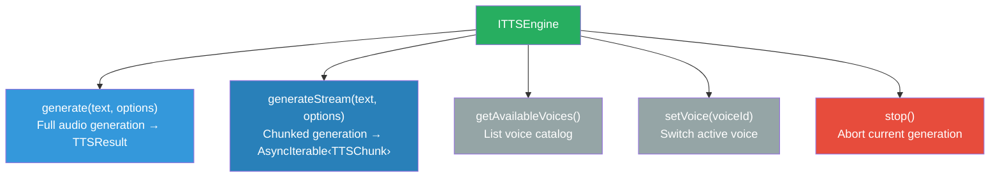
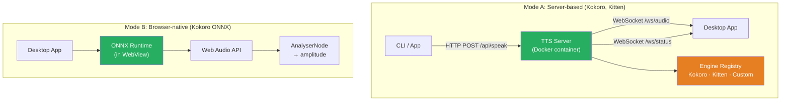
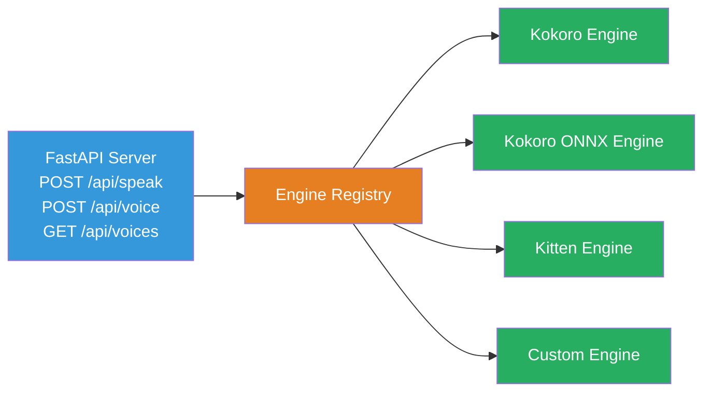
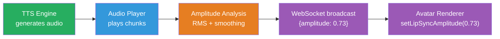

# TTS System Architecture

## Abstraction Process

### Input: Concrete TTS Technologies

**Kokoro TTS (Python daemon):**
```
Text → KPipeline (sentence splitting, G2P)
     → Kokoro model (82M params, GPU)
     → WAV audio chunks (24kHz, float32)
     → sounddevice playback
     → Amplitude emitted via WebSocket
```
- Runs as separate Python process
- Requires: Python 3.10-3.12, torch, kokoro, sounddevice
- 27 multilingual voices (English + Japanese)
- Streaming: chunk-by-chunk as sentences are processed
- Storage: ~350MB model + ~1.5GB PyTorch dependency

**Kokoro ONNX (lightweight, CPU-friendly):**
```
Text → kokoro-onnx Python library
     → ONNX Runtime (CPU or GPU)
     → Kokoro model (ONNX format, ~300MB or ~80MB quantized)
     → PCM audio (numpy array)
     → soundfile writes WAV
```
- Install: `pip install kokoro-onnx`
- Model files: `kokoro-v1.0.onnx` (~300MB full, **~80MB quantized**) + `voices-v1.0.bin`
- Python 3.10-3.13
- CPU works fine (near real-time on Apple M1)
- GPU optional (faster with CUDA/CoreML)
- 20+ voices, multilingual (English, Japanese via misaki G2P)
- API: `kokoro.create("text", voice="af_heart")` → (samples, sample_rate)

**KittenTTS (ultra-lightweight, CPU-only):**
```
Text → kittentts Python library
     → KittenTTS model (15M params, <25MB)
     → PCM audio (numpy array)
```
- Install: `pip install kittentts`
- Model: ~25MB (nano-int8), auto-downloaded from HuggingFace
- Python 3.12
- CPU-optimized, no GPU needed at all
- 8 voices: Bella, Jasper, Luna, Bruno, Rosie, Hugo, Kiki, Leo
- API: `model.generate("text", voice="Bella")` → audio array
- Fastest inference, smallest footprint

**Custom / User-provided:**
```
Text → Any TTS service (cloud or local)
     → Audio output
     → Amplitude via analysis
```

### Pattern Recognition

Despite wildly different implementations:

All sizes below are **storage on disk**, not RAM.

| Step | Kokoro (full) | Kokoro ONNX | KittenTTS | Custom |
|------|--------------|-------------|-----------|--------|
| Input | text string | text string | text string | text string |
| Processing | Python + PyTorch + GPU | Python + ONNX Runtime | Python + CPU | varies |
| Storage (disk) | ~350MB model + ~1.5GB PyTorch | **~80MB quantized** / ~300MB full | ~25MB | varies |
| Output | numpy audio chunks | numpy audio array | numpy audio array | varies |
| Streaming? | yes (chunked) | no (full then play) | no (full then play) | varies |
| Voices | 27 multilingual | 20+ multilingual | 8 English | varies |
| GPU needed? | recommended (MPS/CUDA) | no (optional, faster with GPU) | no (CPU only) | varies |
| Amplitude | emitted during playback | computed from audio | computed from audio | varies |

**Common shape**: Text in → Audio out → Amplitude during playback

### Differences to Ignore

- Where computation happens (server vs browser vs cloud)
- Language runtime (Python vs WASM vs native)
- Model architecture and size
- Streaming capability (graceful: full generation is streaming with 1 chunk)
- Voice catalog differences

### Essential Characteristics

Every TTS engine:
1. **Generates** audio from text (returns audio data)
2. **Streams** optionally (chunk by chunk for low latency)
3. **Lists** available voices
4. **Switches** voices
5. **Stops** mid-generation
6. **Provides** amplitude data for lip sync

---

## Output: Abstract Model

### ITTSEngine Interface



### Data Types

```
TTSOptions {
  voice?: string       // Voice ID
  speed?: number       // Playback speed multiplier
  language?: string    // Language code (en, ja, etc.)
}

TTSResult {
  audio: Float32Array  // Raw PCM audio data
  sampleRate: number   // e.g. 24000
  duration: number     // seconds
}

TTSChunk {
  audio: Float32Array  // Partial PCM data
  sampleRate: number
  isLast: boolean      // True for final chunk
}

VoiceInfo {
  id: string           // "af_heart", "am_adam"
  name: string         // "Heart (Female)"
  language: string     // "en-us"
  gender?: string      // "female"
}
```

### Two Deployment Modes



**Mode A** — TTS runs on a server (Python in Docker). The desktop app connects via WebSocket for audio streaming and amplitude. Best for quality and multi-language support.

**Mode B** — TTS runs inside the WebView (ONNX runtime). No server needed. Best for simplicity and offline use. Limited voice selection.

Both modes produce the same output: audio data + amplitude for lip sync.

### Server-Side Engine Registry

The TTS server supports multiple backends via a simple registry:



```
EngineRegistry {
  register(name, engine)         // Add engine to registry
  getActive() → TTSEngineBase    // Get currently active
  switch(name)                   // Switch active engine
  list() → string[]              // List registered engines
}

TTSEngineBase (abstract) {
  generate(text, voice, speed) → AudioChunk[]
  getVoices() → VoiceInfo[]
  stop()
}
```

### Amplitude → Lip Sync Pipeline



The amplitude value is computed server-side (or browser-side for ONNX mode) and sent to the avatar renderer as a normalized 0-1 value at ~30Hz. The avatar renderer doesn't know or care how the audio was generated.

### Deployment: Docker vs Native

Users choose via `.env`:
```bash
TTS_MODE=native    # or "docker"
```

#### Option A: Docker

```
docker-compose.yml:
  tts-server:
    build: ./apps/tts-server
    ports: ["5111:5111"]
    volumes:
      - kokoro-models:/app/models     # Cached model weights
      - ./config/tts.json:/app/config  # User config
    deploy:
      resources:
        reservations:
          devices:                      # GPU passthrough
            - driver: nvidia
              capabilities: [gpu]
```

**Pros:**
- One command: `docker compose up tts-server`
- No Python version conflicts, no pip hell
- Reproducible across machines
- GPU passthrough for NVIDIA (CUDA)

**Cons:**
- Docker Desktop required (~2GB install, ~1-2GB RAM overhead)
- No Apple Silicon MPS GPU support (CPU fallback only on macOS Docker)
- Disk: Docker images add overhead on top of dependencies
- First build is slow (~5-10 min)
- Adds complexity for users unfamiliar with Docker

#### Option B: Native (Low RAM / macOS MPS users)

```bash
npm run tts:start    # Uses local Python venv
```

**Pros:**
- No Docker overhead (saves ~1-2GB RAM)
- Apple Silicon MPS GPU works (fast on M1/M2/M3)
- Lighter disk footprint
- Faster startup (no container overhead)

**Cons:**
- Requires Python 3.10-3.12 installed
- `pip install` can fail on some systems
- Less reproducible across machines
- setup.sh handles the venv creation

#### Decision Matrix

| Scenario | Recommendation |
|----------|---------------|
| Windows + NVIDIA GPU | Docker |
| Linux + NVIDIA GPU | Docker |
| macOS Apple Silicon | **Native** (MPS GPU) |
| macOS Intel | Docker or Native (CPU) |
| Low RAM machine (< 8GB) | **Native** (avoid Docker overhead) |
| CI/CD / Reproducibility | Docker |
| First-time setup ease | Docker |

#### npm Scripts

```bash
npm run tts:start           # Auto-detect: uses TTS_MODE from .env
npm run tts:start -- docker # Force Docker mode
npm run tts:start -- native # Force native mode (local Python venv)
npm run tts:stop            # Stop TTS server
npm run status              # Check health (includes TTS)
```

### Voice ID Reference

Voice IDs differ across TTS engines. The `.env` value `TTS_VOICE` must match the active engine's ID format:

**KittenTTS** (8 voices):

| Voice ID | Gender | Notes |
|----------|--------|-------|
| `Bella` | Female | Default |
| `Jasper` | Male | |
| `Luna` | Female | |
| `Bruno` | Male | |
| `Rosie` | Female | |
| `Hugo` | Male | |
| `Kiki` | Female | |
| `Leo` | Male | |

**Kokoro ONNX / Kokoro Full** (20+ voices, same IDs for both):

| Voice ID | Language | Gender | Notes |
|----------|----------|--------|-------|
| `af_heart` | English | Female | Default |
| `af_bella` | English | Female | |
| `am_adam` | English | Male | |
| `am_michael` | English | Male | |
| `bf_emma` | British | Female | |
| `bm_george` | British | Male | |
| `jf_alpha` | Japanese | Female | Requires misaki[ja] |
| `jm_beta` | Japanese | Male | Requires misaki[ja] |

(Full voice list: see Kokoro documentation)

**When switching TTS engine**, `npm run switch tts <engine>` updates both `TTS_ENGINE` and `TTS_VOICE` in `.env`. If the current voice ID doesn't exist in the new engine, setup prompts for a new voice selection.

### Design Decisions

**Why Python? Why not Express (Node.js), Go, or Rust for the TTS server?**

The TTS engines are Python libraries:
- `pip install kokoro` — Python
- `pip install kokoro-onnx` — Python
- `pip install kittentts` — Python

There is no npm, Go, or Rust equivalent for these models. The neural network inference runs in Python (PyTorch / ONNX Runtime). The server language must match the library language.

FastAPI specifically because:
- Async by default (handles WebSocket + HTTP concurrently)
- Lightweight (~1MB, no heavy framework)
- Auto-generates API docs (OpenAPI/Swagger)
- Python ecosystem is where the TTS libraries live

If TTS engines ever get Node.js bindings (e.g., ONNX Runtime for Node), we could port. But today, Python is the only option.

**Why separate server for TTS instead of embedding in Tauri?**
- Python TTS engines can't run inside a Tauri/JS app
- Docker or native — either way, TTS runs as a separate process
- Server can be shared by multiple clients (desktop, web, mobile)
- Server can run on a different machine (e.g., GPU server)

**Why offer both Docker and native?**
Docker is the easiest setup for most users, but it has real costs:
- **RAM**: Docker Desktop uses ~1-2GB just existing. On an 8GB machine, that matters.
- **MPS**: macOS Docker doesn't pass through Apple Silicon GPU. Native install with MPS is 10x faster than CPU.
- **Disk**: Docker image adds overhead on top of the TTS engine storage. Users with small SSDs care.
We offer both so users choose what fits their machine.

**Why AsyncIterable for streaming?**
Natural fit for chunk-by-chunk generation. The consumer processes each chunk as it arrives. For engines that don't stream natively, a single-chunk async iterable is trivially constructed.

**Why voice ID strings, not voice objects?**
Voices vary per engine. IDs are sufficient for selection. Full voice metadata comes from `getAvailableVoices()`.
