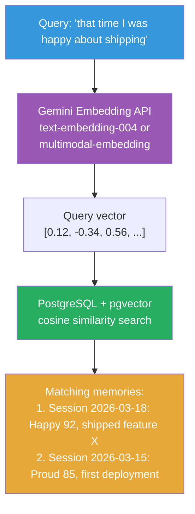

# Semantic Search (Optional — Intelligent Tier)

Requires PostgreSQL 15+ with pgvector extension.

## What This Enables

The entity can search its own memories by meaning, not just keywords.

"Remember when I was frustrated about the auth bug?" → finds the conversation where frustration was high and auth-related work happened, even if those exact words weren't used.

This is the bridge between having memories and being able to *use* them meaningfully.

## Architecture



## Components

### 1. Gemini Embedding API

Using Google's Gemini embedding models for vector generation:

- **text-embedding-004** — text-only, 768 dimensions, good for conversation/text search
- **Gemini multimodal embedding** — text + images, useful if we store screenshots or visual context

```python
# Generate embedding for a memory
import google.generativeai as genai

genai.configure(api_key=os.environ["GEMINI_API_KEY"])

result = genai.embed_content(
    model="models/text-embedding-004",
    content="Shipped the auth feature, Boss was happy, tests all passed",
    task_type="RETRIEVAL_DOCUMENT"
)
embedding = result['embedding']  # 768-dim vector
```

**Why Gemini, not OpenAI/local?**
- Multimodal embedding support (text + images in one vector space)
- Competitive quality at lower cost
- Google's embedding models are well-suited for retrieval tasks

### 2. pgvector Extension

PostgreSQL extension that adds vector similarity search:

```sql
-- Enable pgvector
CREATE EXTENSION IF NOT EXISTS vector;

-- Add embedding column to conversations
ALTER TABLE conversations
ADD COLUMN embedding vector(768);

-- Add embedding to memory entries
CREATE TABLE memory_embeddings (
    id SERIAL PRIMARY KEY,
    source_type TEXT NOT NULL,       -- 'conversation', 'milestone', 'lesson'
    source_id INTEGER NOT NULL,
    content TEXT NOT NULL,           -- the text that was embedded
    embedding vector(768) NOT NULL,
    metadata JSONB,
    created_at TIMESTAMPTZ DEFAULT NOW()
);

-- Create index for fast similarity search
CREATE INDEX ON memory_embeddings
USING ivfflat (embedding vector_cosine_ops)
WITH (lists = 100);
```

### 3. Search Flow

```python
# Search entity's memories semantically
async def search_memories(query: str, limit: int = 5):
    # 1. Embed the query
    query_embedding = await embed_text(query, task_type="RETRIEVAL_QUERY")

    # 2. Search pgvector
    results = await db.fetch("""
        SELECT content, metadata,
               1 - (embedding <=> $1::vector) as similarity
        FROM memory_embeddings
        ORDER BY embedding <=> $1::vector
        LIMIT $2
    """, query_embedding, limit)

    return results
```

## What Gets Embedded

| Source | When | Example content |
|--------|------|----------------|
| Conversation summaries | End of session | "Debugged auth bug for 2 hours. Started frustrated, ended proud after finding the race condition." |
| Milestones | On significant events | "First YouTube stream with Boss Kamil. Avatar waved hello to 50 viewers." |
| Lessons learned | After mistakes/successes | "Always check test output before celebrating. Got burned by a false positive." |
| Feeling snapshots | Periodically | "Session peak: Excited 95 + Proud 80 when all CI tests passed." |

## Use Cases

### 1. Entity Recalls Past Experiences
```
Boss: "Remember when we fixed that nasty bug?"
Entity: [searches memories] → finds session with high frustrated→proud transition
        → "Yes! The race condition in auth. I was frustrated for hours
           but felt so proud when we found it."
```

### 2. Feeling-Aware Context
```
Entity's internal thought: "My confidence is low on this task.
Have I felt this way before?"
[searches for low-confidence memories]
→ "Last time I felt like this was the database migration.
   I asked Boss for help and it worked out."
→ Decides to ask for help rather than struggle silently
```

### 3. Relationship Memory
```
[searches for interactions with Boss]
→ "Boss prefers concise responses. Gets frustrated when I repeat myself.
   Likes when I suggest alternatives proactively."
→ Adjusts communication style accordingly
```

## Prerequisites

| Requirement | How to install |
|-------------|---------------|
| PostgreSQL 15+ | `brew install postgresql` / `apt install postgresql` / Docker |
| pgvector extension | `CREATE EXTENSION vector;` (included in most PostgreSQL distributions) |
| Gemini API key | [Google AI Studio](https://aistudio.google.com/) — free tier available |

```bash
# .env
MEMORY_MODE=intelligent
DATABASE_URL=postgresql://localhost:5432/vibe_ai_partner
GEMINI_API_KEY=your-api-key-here
```

## Cost & Performance

### Gemini Embedding API
- Free tier: 1,500 requests/day for text-embedding-004
- Cost beyond free: ~$0.00001 per 1,000 characters
- Latency: ~100-200ms per embedding
- We embed infrequently (end of session, milestones) — free tier is usually sufficient

### pgvector Search
- Similarity search on 10,000 memories: <10ms with ivfflat index
- Storage: ~3KB per embedded memory (768-dim float32 vector)
- 10,000 memories ≈ 30MB of vector data

## Design Decisions

**Why not embed locally?**
Local embedding models (e.g., sentence-transformers) add ~500MB of Python dependencies and need significant RAM. Gemini API is a single HTTP call, quality is high, and the free tier covers typical usage. For offline users, we can add local embedding as a future option.

**Why not ChromaDB or Pinecone?**
PostgreSQL is already in the stack for state persistence. pgvector adds vector search without another service to install and manage. One database, two purposes.

**Why is this the "Intelligent" tier, not default?**
- Requires a Gemini API key (external dependency)
- Requires PostgreSQL + pgvector (not trivial to install)
- Most users get a great experience with basic file memory
- This tier is for power users who want the entity to truly remember and reason across sessions
