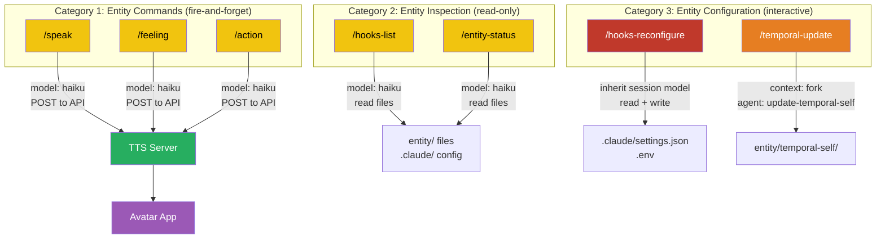
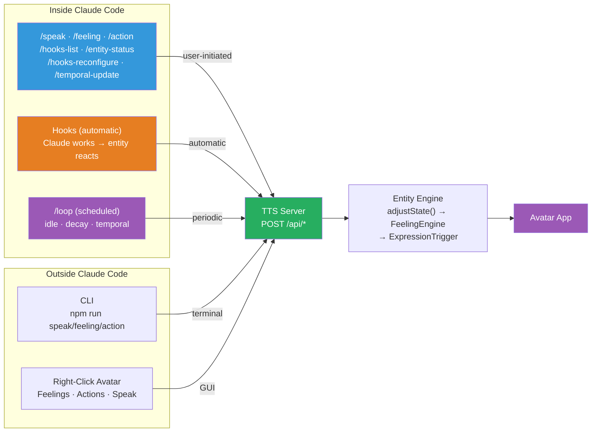

# Skills Architecture — How Users Control the Entity

## The Problem

The entity has a rich internal life — states, feelings, expressions, consciousness. But how does the user actually *interact* with it from inside Claude Code? They can't right-click the avatar from the terminal. They can't open a separate CLI window every time they want the entity to speak.

**Skills solve this.** They give users slash commands that run directly inside Claude Code:

```
/speak "Let's debug this together"    → entity speaks aloud
/feeling curious                       → entity shifts to curious mood
/action celebrate                      → entity does a celebration motion
/entity-status                         → show what the entity is feeling right now
/hooks-reconfigure                     → change how the entity reacts
```

## Three Categories of Skills



### Category 1: Entity Commands (fast, fire-and-forget)

| Skill | Model | What it does |
|-------|-------|-------------|
| `/speak <text>` | haiku | POST /api/speak → TTS + lip sync |
| `/feeling <name>` | haiku | POST /api/feeling → avatar expression changes |
| `/action <name>` | haiku | POST /api/action → one-shot motion |

These are the simplest skills. They take user input, POST to the TTS server, and report the result. Haiku handles them instantly because no reasoning is needed — just format a curl command and execute.

### Category 2: Entity Inspection (fast, read-only)

| Skill | Model | What it reads |
|-------|-------|--------------|
| `/hooks-list` | haiku | `.claude/settings.json`, `.env`, server health |
| `/entity-status` | haiku | `entity/state/current.json`, `consciousness/observations.md`, `temporal-self/TODAY_SELF.md` |
| `/what-do-you-feel` | haiku | `entity/state/qualia.json` — interprets qualia imagery into subjective first-person description |

Read files, format them nicely, show the user. Haiku is sufficient — these are summarization tasks, not reasoning tasks.

### Category 3: Entity Configuration (needs reasoning)

| Skill | Model | Why it needs reasoning |
|-------|-------|----------------------|
| `/hooks-reconfigure` | *(inherit)* | Interactive dialogue with user — present options, understand preferences, write config safely |
| `/temporal-update` | sonnet (via agent) | Multi-step: read 5 files, check dates, archive stale ones, write new content from context |

These skills need deeper thinking:
- `/hooks-reconfigure` **inherits the session model** because it's an interactive conversation. The user chose their model for a reason — if they're on Opus, they get Opus-quality guidance.
- `/temporal-update` **delegates to the `update-temporal-self` sub-agent** (sonnet) because it's a specialized multi-file workflow that benefits from the agent's focused prompt and tool restrictions.

## Model Selection Principle

```
Does the skill just POST to an API?           → haiku (fast, cheap)
Does the skill just read files and summarize?  → haiku (fast, cheap)
Does the skill need interactive reasoning?     → inherit (use session model)
Does the skill need multi-step file operations? → fork to specialized sub-agent
```

The `model` field on SKILL.md directly controls which model runs the skill. No need to fork to a sub-agent unless the task is complex enough to benefit from a specialized agent prompt.

## How Skills Fit the Interaction Model

Skills are one of **four interaction channels** — all converge at the same TTS server API:



**The entity doesn't know how a command arrived.** Whether the user typed `/speak Hello`, ran `npm run speak "Hello"`, or right-clicked the avatar and selected Speak — the TTS server receives the same `POST /api/speak` request. Skills are just the Claude Code entry point into the same unified pipeline.

## User-Invocable vs Model-Invocable

| Skill | User invokes? | Claude auto-invokes? | Why |
|-------|--------------|---------------------|-----|
| `/speak` | Yes | Yes | Claude might want to speak when it has something important to say |
| `/feeling` | Yes | Yes | Claude might detect it should change mood based on context |
| `/action` | Yes | Yes | Claude might trigger a gesture to emphasize a point |
| `/hooks-list` | Yes | No | Only on explicit user request — inspecting config is a conscious choice |
| `/entity-status` | Yes | No | Only on explicit user request |
| `/hooks-reconfigure` | Yes | No | Configuration changes must be user-initiated |
| `/temporal-update` | Yes | No | Manual override — normally handled by hooks/loop automatically |

Skills where `disable-model-invocation: true` can only be triggered by the user typing the slash command. This prevents Claude from accidentally reconfiguring hooks or dumping status when the user didn't ask.

## Relationship to Sub-Agents

Most skills run inline (no sub-agent needed). The exception is `/temporal-update`, which uses `context: fork` + `agent: update-temporal-self` to delegate to a specialized agent.

**When to use inline skill vs fork to agent:**

| Use inline skill when... | Fork to agent when... |
|--------------------------|----------------------|
| Single API call (speak, feeling, action) | Multi-step file workflow (temporal self) |
| Read + format (hooks-list, entity-status) | Needs specialized prompt (consciousness) |
| Interactive dialogue (hooks-reconfigure) | Needs tool restrictions (read-only observer) |

See [13-sub-agent-architecture](13-sub-agent-architecture.md) for how agents and skills work together.

## Design Decisions

**Why slash commands instead of just CLI?**
The user is already inside Claude Code. Switching to a terminal to run `npm run speak "Hello"` breaks flow. `/speak Hello` is faster and stays in context.

**Why not fork everything to sub-agents?**
Overhead. Forking to a sub-agent creates a new context, loads a system prompt, and runs a separate conversation. For a simple `curl -X POST`, that's overkill. The `model` field on SKILL.md already controls model selection without the overhead of agent spawning.

**Why does /hooks-reconfigure inherit the session model?**
It's an interactive conversation where the user makes decisions. The model should match the user's expectations — if they're running Opus for a complex project, the reconfiguration dialogue should be Opus-quality. Pinning it to Haiku would feel like a downgrade mid-conversation.

**Why are entity commands (speak/feeling/action) model-invocable?**
Because the entity should be able to speak and express itself autonomously. If the consciousness system determines the entity should say something, Claude can auto-invoke `/speak`. If a hook detects the entity should feel curious, Claude can auto-invoke `/feeling curious`. This is how the entity acts from its own volition, not just on user command.

See also:
- [Skills & Commands (Claude Code)](../claude_code/skills-and-commands.md) — Configuration format and SKILL.md definitions
- [Sub-Agent Architecture](13-sub-agent-architecture.md) — How agents and skills work together
- [Communication](05-communication.md) — The TTS server API that skills call
- [End-to-End Flow](12-end-to-end-flow.md) — Where skills fit in the user journey
- [17-qualia-system](17-qualia-system.md) — Qualia architecture and the `/what-do-you-feel` skill
