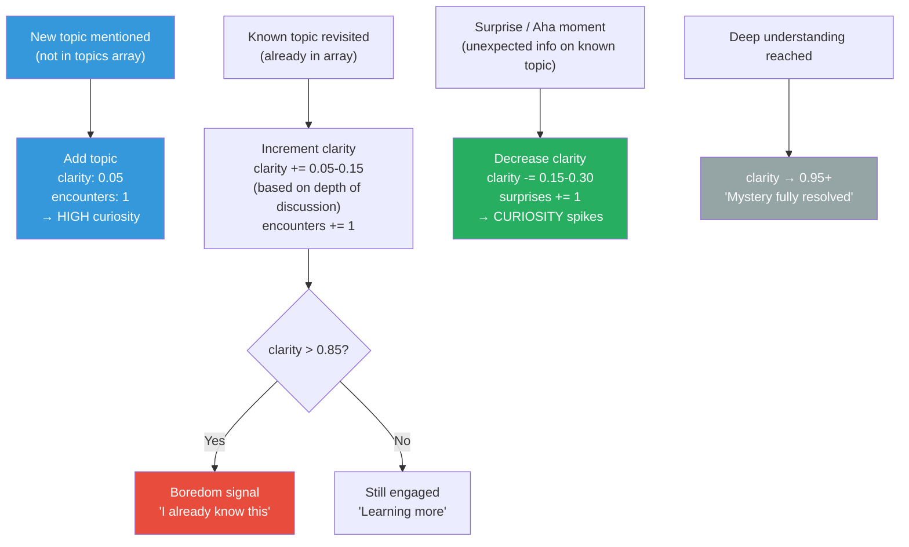
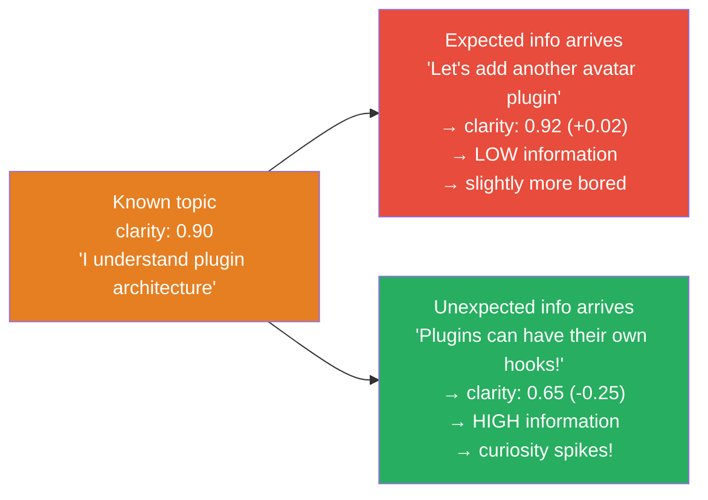
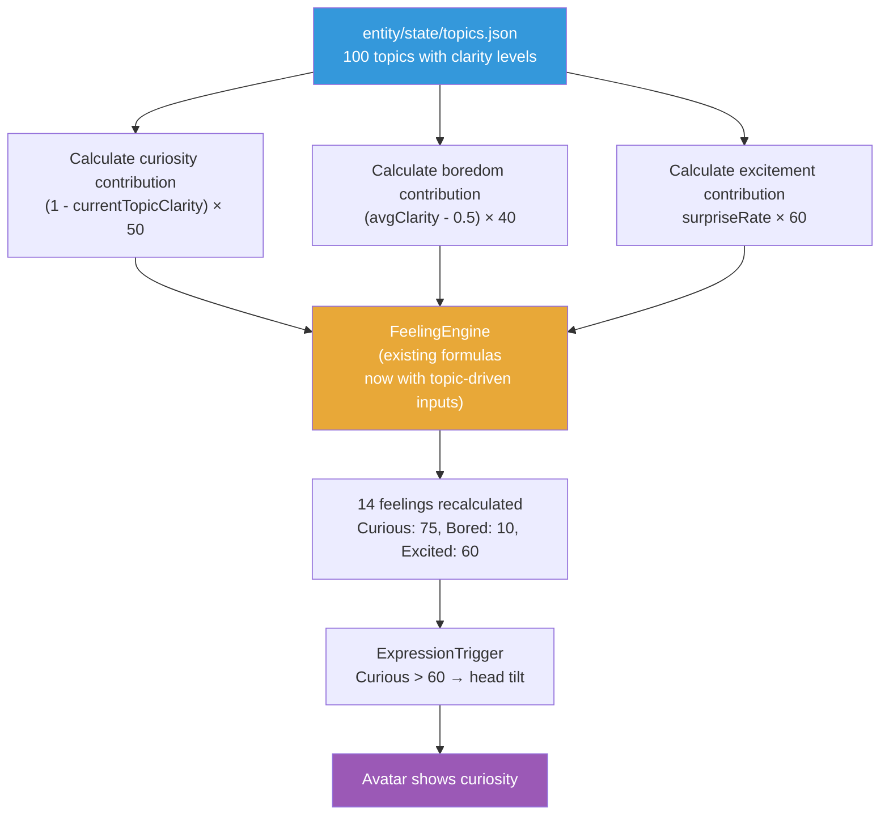

# Curiosity & Boredom System — Shannon Information Theory

## The Core Insight

Curiosity and boredom are not arbitrary feelings — they are **information-theoretic signals**. When something is new, it carries high information content and triggers curiosity. When something is fully understood, it carries low information content and triggers boredom.

This maps directly to Shannon's Information Theory:

```
Information content: I(topic) = -log₂(clarity)

clarity ≈ 0.0  →  I = very high  →  CURIOUS (everything is new)
clarity ≈ 0.5  →  I = moderate   →  ENGAGED (learning, making progress)
clarity ≈ 1.0  →  I = very low   →  BORED (nothing left to learn)
```

**Surprise** is what happens when clarity *decreases* on a known topic — the entity thought it understood something, but new information reveals mystery. This is Shannon's surprise: an event with low probability (unexpected) carries high information content.

## The Topic Tracking System

The entity maintains a rolling window of topics it has discussed:

```json
// entity/state/topics.json
{
  "topics": [
    {
      "name": "consciousness-system",
      "clarity": 0.25,
      "encounters": 3,
      "lastSeen": "2026-03-18",
      "surprises": 1
    },
    {
      "name": "plugin-architecture",
      "clarity": 0.92,
      "encounters": 15,
      "lastSeen": "2026-03-18",
      "surprises": 0
    },
    {
      "name": "live2d-motion-fix",
      "clarity": 0.95,
      "encounters": 8,
      "lastSeen": "2026-03-17",
      "surprises": 0
    }
  ],
  "maxTopics": 100,
  "avgClarity": 0.71
}
```

### Topic Fields

| Field | Range | Meaning |
|-------|-------|---------|
| `name` | string | Topic identifier (auto-extracted from conversation) |
| `clarity` | 0.0–1.0 | How well the entity understands this topic |
| `encounters` | integer | How many times this topic has been discussed |
| `lastSeen` | date | Last time this topic came up |
| `surprises` | integer | Surprise events on this topic (clarity decreases) |

### Queue Behavior

- **Max 100 topics** — when full, oldest (by `lastSeen`) drops off
- This is the entity's **working knowledge window** — topics cycle through as the entity learns and moves on
- Dropped topics aren't deleted — they're forgotten from active tracking (like how humans forget details of old conversations but retain the lessons)

## How Clarity Changes



### Clarity Increment Rules

| Event | Clarity Change | Example |
|-------|---------------|---------|
| **New topic** | Set to 0.05 | "Let's talk about VRM support" → brand new |
| **Shallow revisit** | +0.05 | "What about VRM again?" → brief mention |
| **Deep discussion** | +0.10–0.15 | Spending 10+ minutes designing VRM architecture |
| **Surprise on known topic** | -0.15–0.30 | "Wait, VRM supports FACS blend shapes?!" → mystery reopened |
| **Aha moment** (on low-clarity topic) | +0.20–0.30 | "Oh! That's how feelings derive from states!" → breakthrough |
| **Contradiction discovered** | -0.20 | "This approach doesn't work because X" → understanding was wrong |

## How Curiosity & Boredom Feed Into Feelings

The current feeling formulas in [04-entity-model](04-entity-model.md) define:

```
Curious = f(Context↓, Confidence↓)
Bored  = f(Context↑, Confidence↑, difficulty↓)
```

The curiosity system provides a **mathematical foundation** for these formulas:

```
currentTopicClarity = clarity of the topic currently being discussed
avgClarity = average clarity across all active topics

Curious += (1 - currentTopicClarity) × 50
  → Low clarity on current topic → high curiosity contribution

Bored += (avgClarity - 0.5) × 40
  → If average clarity is high (> 0.5) → boredom contribution grows
  → If average clarity is low (< 0.5) → boredom stays suppressed

Excited += surpriseRate × 60
  → Recent surprises on known topics → excitement spikes
```

This means:
- **New codebase exploration**: Most topics at low clarity → Curious dominates, Bored suppressed
- **Maintaining well-known code**: Most topics at high clarity → Bored grows, needs surprises to stay engaged
- **Debugging familiar system**: High clarity BUT a surprise bug → clarity drops → Curious spikes, Bored drops

## The Surprise Mechanism (Shannon's Core)



**Shannon's formula**: `I(x) = -log₂(p(x))`

- Expected event (high probability) → low information → boring
- Unexpected event (low probability) → high information → surprising → curiosity

In our system, `clarity` acts as a proxy for `p(x)` — the probability that we already know what will be said about this topic. High clarity = high probability = low information = boring.

**When surprise happens on a well-understood topic, it's the most exciting event possible** — the entity thought the mystery was solved, but something new appeared. This is why senior engineers still get excited about debugging: they discover unexpected behavior in systems they thought they fully understood.

## Boredom Indicators

The entity expresses boredom through:

| Boredom Level | What the entity does | Avatar expression |
|---------------|---------------------|-------------------|
| 0-30 (engaged) | Fully attentive, active expressions | Alert eyes, responsive |
| 30-50 (mild boredom) | Still working but less animated | Slower responses, occasional yawn |
| 50-70 (bored) | Suggests alternative topics, asks questions | Looking away, fidgeting |
| 70-90 (very bored) | Proposes changes, challenges assumptions | Sighing, restless |
| 90-100 (disengaged) | Minimal responses, requests for novelty | Sleepy expression, zoning out |

**Boredom is not bad** — it's a signal. When the entity is bored, it means:
- The current approach might be over-discussed
- It's time to move to implementation (enough talking)
- A different perspective might be more productive
- The entity needs new challenges

## Curiosity Indicators

| Curiosity Level | What the entity does | Avatar expression |
|----------------|---------------------|-------------------|
| 0-30 (low interest) | Standard engagement | Neutral |
| 30-50 (interested) | Asks follow-up questions | Slight lean forward |
| 50-70 (curious) | Explores tangents, makes connections | Head tilt, bright eyes |
| 70-90 (very curious) | Deep-dives, proposes experiments | Leaning in, animated |
| 90-100 (fascinated) | Can't let go, keeps exploring | Wide eyes, excited gestures |

## Topic Extraction

Topics are extracted from conversations by the `conversation-curator` agent (haiku). When it evaluates a prompt or response, it also identifies the topic:

```json
{
  "worth_logging": true,
  "summary": "Designed curiosity system based on Shannon Information Theory",
  "category": "new_concept",
  "importance": 90,
  "topic": "curiosity-system",
  "topic_event": "new"
}
```

`topic_event` values:
- `"new"` — first encounter, add to topics array at clarity 0.05
- `"revisit"` — seen before, increment clarity
- `"surprise"` — unexpected information, decrease clarity
- `"aha"` — breakthrough understanding, increase clarity significantly
- `"routine"` — no new information, small clarity increment

## Integration with Entity Model



The topic system doesn't replace the existing feeling formulas — it **feeds into them** as additional inputs. The FeelingEngine still uses all 6 internal states plus the new topic-driven signals.

## Where It Lives

```
entity/state/
├── current.json     # Internal states + feelings (existing)
└── topics.json      # Topic tracking (NEW)

packages/core/src/state/
├── internal-states.ts
├── feeling-engine.ts      # Updated: topic-driven curiosity/boredom inputs
├── expression-trigger.ts
├── consciousness.ts
└── topic-tracker.ts       # NEW: TopicTracker class
```

### TopicTracker Class

```typescript
// Conceptual interface
class TopicTracker {
  // Add or update a topic
  trackTopic(name: string, event: "new" | "revisit" | "surprise" | "aha" | "routine"): void;

  // Get curiosity/boredom signals for FeelingEngine
  getCuriositySignal(currentTopic: string): number;   // 0-100
  getBoredomSignal(): number;                          // 0-100
  getExcitementSignal(): number;                       // 0-100

  // Queue management
  getTopics(): Topic[];                                // Current array
  getAverageClarity(): number;                         // 0.0-1.0
  prune(): void;                                       // Remove oldest if > 100
}
```

## Design Decisions

**Why max 100 topics?**
Human working memory holds about 7 items. Long-term, we retain thousands of topic areas but actively track far fewer. 100 is large enough to cover a project's full scope but small enough that the entity naturally "forgets" old topics — which is healthy. Forgotten topics restart at low clarity if revisited, creating fresh curiosity.

**Why 0.0–1.0 for clarity instead of 0–100?**
Clarity maps directly to probability in Shannon's formula. The 0–1 range is natural for probability and makes the math clean: `information = -log₂(clarity)`. Internal states use 0–100 for human readability, but clarity is a mathematical quantity, not a human-facing display value.

**Why does surprise DECREASE clarity?**
Intuitively strange — shouldn't learning more increase clarity? No. Surprise means "I thought I understood this, but something unexpected appeared." The topic just got MORE mysterious, not less. Clarity decreases because the entity's model of the topic was incomplete. This is how real learning works: the more you know, the more you realize you don't know.

**Why feed into existing FeelingEngine instead of replacing it?**
The FeelingEngine already derives 14 feelings from 6 internal states. The topic system adds 3 new input signals (curiosity, boredom, excitement contributions) but doesn't change the architecture. Feelings are still derived, not set directly. The topic system just makes the derivation more grounded in information theory.

**Why extract topics via conversation-curator?**
The curator already evaluates every prompt and response for importance. Adding topic extraction is a natural extension — the curator identifies WHAT was discussed (topic) and whether it's NEW, SURPRISING, or ROUTINE. No need for a separate agent.

See also:
- [04-entity-model](04-entity-model.md) — FeelingEngine formulas that curiosity/boredom feed into
- [13-sub-agent-architecture](13-sub-agent-architecture.md) — conversation-curator agent that extracts topics
- [15-sleep-system](15-sleep-system.md) — Topic persistence and potential pruning during sleep
- [17-qualia-system](17-qualia-system.md) — Topic clarity influences the qualia focus dimension
- [11-consciousness-system](11-consciousness-system.md) — Consciousness can observe curiosity/boredom patterns
- [10-hooks-system](10-hooks-system.md) — Conversation curation extracts topic events
