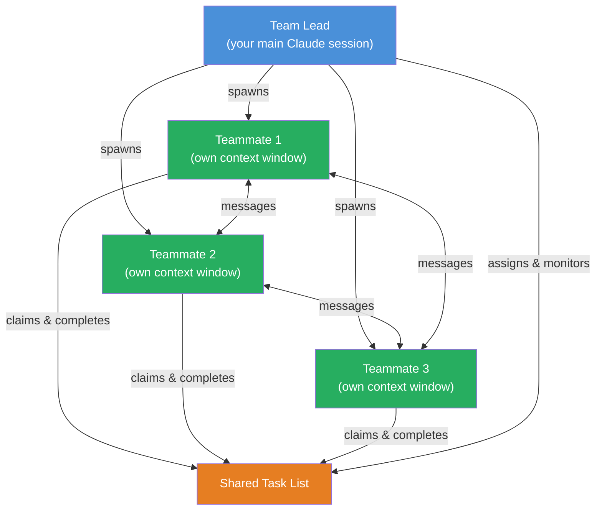

# Agent Teams

## What Are Agent Teams?

Agent teams let you coordinate multiple Claude Code instances working together. One session acts as the **team lead**, coordinating work, assigning tasks, and synthesizing results. Teammates work independently, each in its own context window, and can communicate directly with each other.

Unlike [sub-agents](sub-agents.md), which run within a single session and only report back to the caller, agent teams enable **inter-agent communication** — teammates can share findings, challenge each other, and coordinate on their own through a shared task list and messaging system.

> **Experimental**: Agent teams are disabled by default. Enable with `CLAUDE_CODE_EXPERIMENTAL_AGENT_TEAMS` in settings.json or environment. Requires Claude Code v2.1.32+.

## When to Use Agent Teams

Agent teams are most effective when **parallel exploration adds real value**:

| Use case | Why teams help |
|----------|---------------|
| **Research & review** | Multiple teammates investigate different aspects simultaneously, then share and challenge findings |
| **New modules or features** | Teammates each own a separate piece without stepping on each other |
| **Debugging with competing hypotheses** | Teammates test different theories in parallel and converge faster |
| **Cross-layer coordination** | Changes spanning frontend, backend, and tests, each owned by a different teammate |

Agent teams add coordination overhead and use significantly more tokens. For sequential tasks, same-file edits, or work with many dependencies, a single session or [sub-agents](sub-agents.md) are more effective.

### Agent Teams vs Sub-Agents

|                   | Sub-Agents | Agent Teams |
| :---------------- | :--------- | :---------- |
| **Context** | Own context; results return to caller | Own context; fully independent |
| **Communication** | Report results back to main agent only | Teammates message each other directly |
| **Coordination** | Main agent manages all work | Shared task list with self-coordination |
| **Best for** | Focused tasks where only the result matters | Complex work requiring discussion and collaboration |
| **Token cost** | Lower: results summarized back to main | Higher: each teammate is a separate Claude instance |

**Rule of thumb**: Use sub-agents when you need quick, focused workers that report back. Use agent teams when teammates need to share findings, challenge each other, and coordinate on their own.

## Enabling Agent Teams

Agent teams are disabled by default. Enable via settings.json:

```json
{
  "env": {
    "CLAUDE_CODE_EXPERIMENTAL_AGENT_TEAMS": "1"
  }
}
```

## Starting a Team

Tell Claude to create a team and describe the task + team structure in natural language:

```
I'm designing a CLI tool that helps developers track TODO comments across
their codebase. Create an agent team to explore this from different angles: one
teammate on UX, one on technical architecture, one playing devil's advocate.
```

Claude creates a team with a shared task list, spawns teammates for each perspective, has them explore the problem, synthesizes findings, and cleans up when finished.

## Architecture

An agent team consists of:

| Component | Role |
| :-------- | :--- |
| **Team lead** | The main Claude Code session that creates the team, spawns teammates, and coordinates work |
| **Teammates** | Separate Claude Code instances that each work on assigned tasks |
| **Task list** | Shared list of work items that teammates claim and complete |
| **Mailbox** | Messaging system for communication between agents |



**Storage locations:**
- Team config: `~/.claude/teams/{team-name}/config.json`
- Task list: `~/.claude/tasks/{team-name}/`

The team config contains a `members` array with each teammate's name, agent ID, and agent type.

## Display Modes

| Mode | How it works | Requirement |
|------|-------------|-------------|
| **In-process** (default) | All teammates run inside your main terminal. `Shift+Down` to cycle between teammates. | Any terminal |
| **Split panes** | Each teammate gets its own pane. See everyone's output at once. | tmux or iTerm2 |

Configure in settings.json:

```json
{
  "teammateMode": "in-process"
}
```

Or per-session: `claude --teammate-mode in-process`

The default `"auto"` uses split panes if already inside tmux, otherwise in-process.

## Controlling the Team

### Specify teammates and models

```
Create a team with 4 teammates to refactor these modules in parallel.
Use Sonnet for each teammate.
```

### Require plan approval

For complex/risky tasks, require teammates to plan before implementing:

```
Spawn an architect teammate to refactor the authentication module.
Require plan approval before they make any changes.
```

The teammate works in read-only plan mode until the lead approves. If rejected, the teammate revises and resubmits. To influence approval criteria: "only approve plans that include test coverage."

### Talk to teammates directly

Each teammate is a full Claude Code session. Message any teammate directly:

- **In-process**: `Shift+Down` to cycle, type to message. `Enter` to view a session, `Escape` to interrupt, `Ctrl+T` for task list.
- **Split panes**: click into a pane to interact directly.

### Task assignment and claiming

Tasks have three states: **pending**, **in progress**, **completed**. Tasks can depend on other tasks (blocked until dependencies complete).

- **Lead assigns**: tell the lead which task to give to which teammate
- **Self-claim**: after finishing a task, a teammate picks up the next unassigned, unblocked task

Task claiming uses file locking to prevent race conditions.

### Quality gates with hooks

Use [hooks](hooks-integration.md) to enforce rules:

| Hook | When it fires | What it does |
|------|--------------|-------------|
| `TeammateIdle` | When a teammate is about to go idle | Exit code 2 → sends feedback, keeps teammate working |
| `TaskCompleted` | When a task is being marked complete | Exit code 2 → prevents completion, sends feedback |

### Shutdown and cleanup

```
Ask the researcher teammate to shut down
```

The lead sends a shutdown request. Teammate can approve (exit) or reject (with explanation).

When done with the team:

```
Clean up the team
```

Always use the **lead** to clean up — teammates should not run cleanup.

## Context and Communication

Each teammate loads the same project context as a regular session (CLAUDE.md, MCP servers, skills) plus the spawn prompt from the lead. The lead's conversation history does **not** carry over.

**How teammates share information:**
- **Automatic message delivery**: messages delivered automatically, no polling
- **Idle notifications**: when a teammate finishes, it automatically notifies the lead
- **Shared task list**: all agents see task status and claim available work

**Messaging types:**
- **message**: send to one specific teammate
- **broadcast**: send to all teammates (use sparingly — costs scale with team size)

## Permissions

Teammates start with the lead's permission settings. If the lead runs with `--dangerously-skip-permissions`, all teammates do too. You can change individual teammate modes after spawning but not at spawn time.

## Token Usage

Agent teams use significantly more tokens than a single session — each teammate has its own context window. For research, review, and new feature work, the extra tokens are usually worthwhile. For routine tasks, a single session is more cost-effective.

## Best Practices

### Give teammates enough context

Teammates don't inherit the lead's conversation history. Include task-specific details in the spawn prompt:

```
Spawn a security reviewer teammate with the prompt: "Review the authentication
module at src/auth/ for security vulnerabilities. Focus on token handling,
session management, and input validation. The app uses JWT tokens stored in
httpOnly cookies. Report any issues with severity ratings."
```

### Choose an appropriate team size

- **3-5 teammates** for most workflows
- **5-6 tasks per teammate** keeps everyone productive
- More teammates = more token cost + coordination overhead
- Three focused teammates often outperform five scattered ones

### Size tasks appropriately

| Size | Problem |
|------|---------|
| Too small | Coordination overhead exceeds the benefit |
| Too large | Teammates work too long without check-ins |
| Just right | Self-contained units with clear deliverables (a function, test file, review) |

### Avoid file conflicts

Two teammates editing the same file leads to overwrites. Break work so each teammate owns different files.

### Monitor and steer

Check on progress, redirect approaches, synthesize findings as they come in. Unattended teams risk wasted effort.

## Use Case Examples

### Parallel code review

```
Create an agent team to review PR #142. Spawn three reviewers:
- One focused on security implications
- One checking performance impact
- One validating test coverage
Have them each review and report findings.
```

Each reviewer applies a different filter. The lead synthesizes findings across all three.

### Debugging with competing hypotheses

```
Users report the app exits after one message instead of staying connected.
Spawn 5 agent teammates to investigate different hypotheses. Have them talk to
each other to try to disprove each other's theories, like a scientific
debate. Update the findings doc with whatever consensus emerges.
```

The adversarial debate structure prevents anchoring bias — the theory that survives challenge is more likely the actual root cause.

## Limitations

Agent teams are experimental. Current limitations:

| Limitation | Detail |
|-----------|--------|
| **No session resumption** | `/resume` and `/rewind` don't restore in-process teammates |
| **Task status can lag** | Teammates sometimes fail to mark tasks as completed |
| **Shutdown can be slow** | Teammates finish current request before shutting down |
| **One team per session** | Clean up current team before starting a new one |
| **No nested teams** | Teammates cannot spawn their own teams |
| **Lead is fixed** | Can't promote a teammate to lead |
| **Permissions set at spawn** | All start with lead's mode; change individually after |
| **Split panes** | Requires tmux or iTerm2; not supported in VS Code terminal, Windows Terminal, or Ghostty |

## How This Relates to Our Entity System

Agent teams open a new dimension for the entity architecture. While our current [sub-agents](sub-agents.md) handle entity tasks within a single session (sentiment evaluation, consciousness observation, temporal self updates), agent teams could enable:

| Scenario | How teams could help |
|----------|---------------------|
| **Multi-entity collaboration** | Multiple entity instances working on a shared project, each with their own consciousness |
| **Distributed consciousness** | A consciousness-observer teammate that runs independently, monitoring the main entity's states across extended work sessions |
| **Parallel research** | Entity spawns teammates to explore different approaches to a problem before committing |
| **Review with entity perspective** | Entity acts as a code reviewer teammate alongside the main coding session, bringing its feelings and observations |

This is experimental and forward-looking — our current architecture uses sub-agents for entity tasks, which is simpler and more token-efficient. Agent teams become valuable when inter-agent communication is genuinely needed.

## Related Docs

- [Sub-Agents](sub-agents.md) — Lightweight delegation within a single session
- [Ecosystem Overview](ecosystem-overview.md) — All five Claude Code integration points
- [Hooks Integration](hooks-integration.md) — `TeammateIdle` and `TaskCompleted` hooks for quality gates
