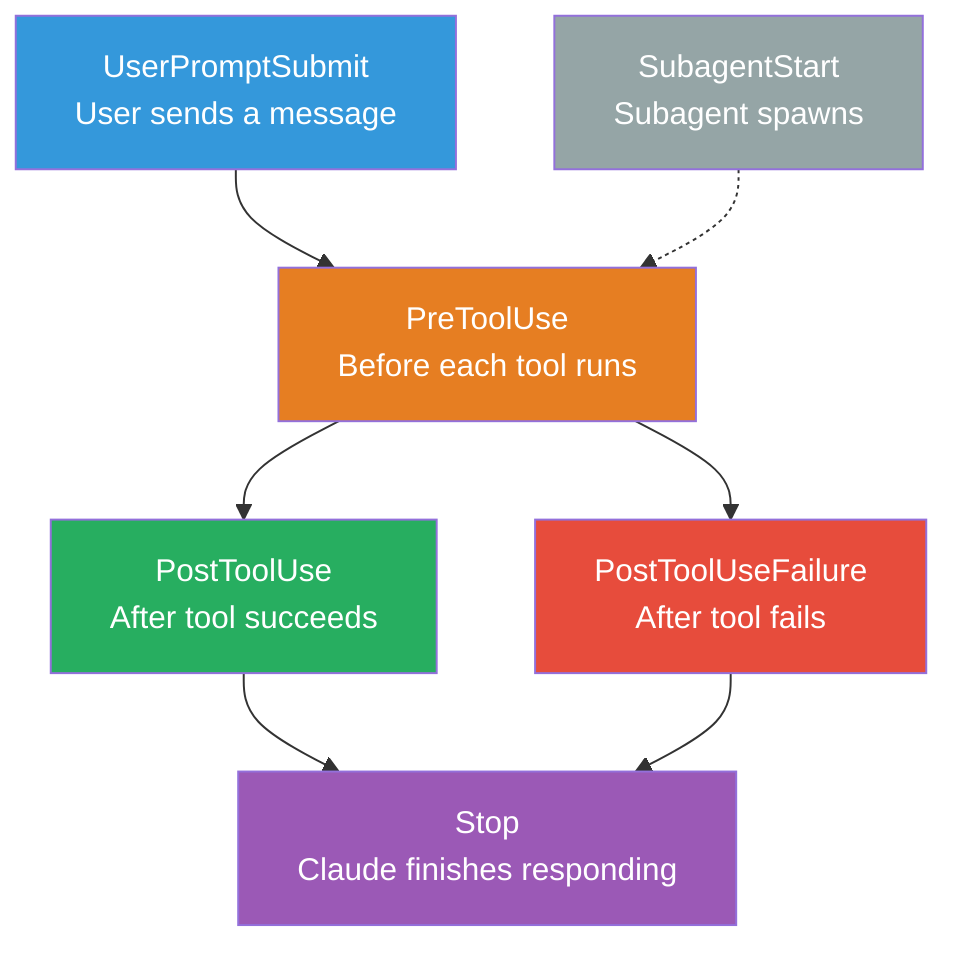
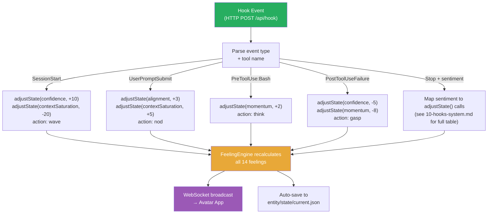

# Claude Code Hooks Integration

## Overview

Claude Code hooks are event listeners that fire during Claude's workflow. We use them to make the avatar react to Claude's actions in real-time — the avatar watches Claude work and responds with feelings, motions, and speech.

## Hook Events We Use

### Event Lifecycle



### Event → State Adjustment → Avatar Reaction

Each hook event triggers specific `adjustState()` calls. These flow through the FeelingEngine to produce feelings and expressions. See [10-hooks-system](../architecture/10-hooks-system.md) for the full mapping tables.

| Event | State Adjustments | Expression |
|-------|-------------------|------------|
| **SessionStart** | confidence +10, contextSaturation -20 | wave |
| **UserPromptSubmit** | alignment +3, contextSaturation +5 | nod (listening) |
| **PreToolUse (Bash)** | momentum +2 | thinking pose |
| **PreToolUse (Edit/Write)** | confidence +2, momentum +2 | typing motion |
| **PreToolUse (Read/Grep/Glob)** | contextSaturation +2 | head tilt (reading) |
| **PostToolUse** | confidence +3, momentum +5, contextSaturation +3 | nod |
| **PostToolUseFailure** | confidence -5, momentum -8, alignment -2 | surprised gasp |
| **SubagentStart** | momentum +1 | head tilt (delegating) |
| **Stop** | *Sentiment-dependent* (see below) | *Sentiment-dependent* |

**Stop event**: The prompt hook returns `{feeling, intensity, action}`. The `feeling` maps to state adjustments (e.g., "proud" → confidence +8, alignment +5, momentum +5). The `intensity` scales the adjustments (>70 = ×1.5, <30 = ×0.5). The `action` triggers a one-shot self-expression.

## Hook Input Format

Every hook receives JSON on stdin (command hooks) or as POST body (HTTP hooks):

```json
{
  "session_id": "abc123",
  "transcript_path": "/path/to/transcript.jsonl",
  "cwd": "/project/root",
  "hook_event_name": "PreToolUse",
  "tool_name": "Bash",
  "tool_input": {
    "command": "npm test",
    "description": "Run tests"
  }
}
```

Key fields by event:

| Event | Key Fields |
|-------|-----------|
| SessionStart | `session_trigger` ("startup", "resume", "clear", "compact") |
| UserPromptSubmit | `user_prompt` (the user's message text) |
| PreToolUse | `tool_name`, `tool_input` |
| PostToolUse | `tool_name`, `tool_input`, `tool_output` |
| PostToolUseFailure | `tool_name`, `tool_input`, `tool_error` |
| Stop | `stop_hook_active_tool_name`, `stop_response` |
| SubagentStart | `agent_type`, `agent_id` |

## Hook Output Format

### Command / HTTP Hooks

```json
{ "continue": true }                              // Allow, proceed
{ "continue": true, "suppressOutput": true }      // Allow, hide hook output from UI
{ "continue": false, "stopReason": "..." }        // Block Claude, show reason
```

Command hooks can also inject context into Claude's next turn:

```json
{
  "continue": true,
  "systemMessage": "Current time: 2026-03-18 14:32:00 UTC. Calibrate temporal self against this."
}
```

This is how temporal grounding works — the `systemMessage` appears as a system message at the top of Claude's next context.

### Prompt / Agent Hooks

Prompt and agent hooks use a simpler schema:

```json
{ "ok": true }                                   // Allow, proceed
{ "ok": false, "reason": "Tests not passing" }   // Block with explanation
```

**Prompt hooks**: Claude evaluates the situation in one LLM call and returns `{ "ok": ... }`.

**Agent hooks**: A subagent with Read/Grep/Glob tools (up to 50 turns) inspects actual files, then returns `{ "ok": ... }`. More powerful than a prompt hook when the decision requires reading real file contents.

```json
// Agent hook example
{
  "type": "agent",
  "prompt": "Check if the test file $ARGUMENTS includes coverage for the new function. Read the relevant test file and return { \"ok\": true } if covered, { \"ok\": false, \"reason\": \"Missing test for X\" } if not.",
  "timeout": 30
}
```

### Async Command Hooks

Adding `"async": true` to a command hook makes it non-blocking:

```json
{
  "type": "command",
  "command": "node .claude/hooks/record-tool-use.js",
  "async": true
}
```

- Claude does **not** wait for the output — it continues immediately
- The hook's output arrives as a `systemMessage` on the **next** conversation turn
- Cannot block decisions (only synchronous hooks can block)
- Best for: logging, analytics, deferred side effects

### PreToolUse: Modify Tool Input

PreToolUse hooks can optionally modify what Claude is about to do:

```json
{
  "hookSpecificOutput": {
    "hookEventName": "PreToolUse",
    "permissionDecision": "allow",
    "additionalContext": "Command is safe, entity state not affected"
  }
}
```

## Recommended Configuration

### .claude/settings.json

```json
{
  "hooks": {
    "SessionStart": [
      {
        "matcher": "startup",
        "hooks": [
          {
            "type": "http",
            "url": "http://localhost:5111/api/hook",
            "timeout": 5
          }
        ]
      }
    ],

    "UserPromptSubmit": [
      {
        "hooks": [
          {
            "type": "http",
            "url": "http://localhost:5111/api/hook",
            "timeout": 3
          }
        ]
      }
    ],

    "PreToolUse": [
      {
        "matcher": "Bash",
        "hooks": [
          {
            "type": "http",
            "url": "http://localhost:5111/api/hook",
            "timeout": 3
          }
        ]
      },
      {
        "matcher": "Edit|Write",
        "hooks": [
          {
            "type": "http",
            "url": "http://localhost:5111/api/hook",
            "timeout": 3
          }
        ]
      }
    ],

    "PostToolUse": [
      {
        "hooks": [
          {
            "type": "http",
            "url": "http://localhost:5111/api/hook",
            "timeout": 3
          }
        ]
      }
    ],

    "PostToolUseFailure": [
      {
        "hooks": [
          {
            "type": "http",
            "url": "http://localhost:5111/api/hook",
            "timeout": 3
          }
        ]
      }
    ],

    "Stop": [
      {
        "hooks": [
          {
            "type": "prompt",
            "prompt": "Analyze this AI response sentiment. Response: $ARGUMENTS. Return ONLY JSON: {\"feeling\": \"happy|sad|frustrated|curious|proud|anxious|excited|calm|bored|guilty|angry|surprised\", \"intensity\": 0-100, \"action\": \"none|nod|wave|laugh|sigh|celebrate|think\", \"speak\": \"optional short phrase to say aloud, or empty string\"}",
            "model": "claude-haiku-4-5-20251001",
            "timeout": 10
          }
        ]
      }
    ]
  }
}
```

### How the Server Handles Hook Events

The TTS server receives hook events and translates them to `adjustState()` calls:



### Inner Voice vs Speech

Claude's text response is the entity's **inner thought** — it does not get spoken aloud. Only explicit `POST /api/speak` triggers TTS and lip sync. The avatar shows facial expressions based on thought sentiment (visual), but remains silent by default.

The `speak` field in the Stop hook result is **optional**. Whether it triggers actual speech depends on the vocal mode:

```bash
# .env
ENTITY_VOCAL_MODE=silent          # Never auto-speak (default — coding sessions)
ENTITY_VOCAL_MODE=reactive        # Speak only when intensity > 80
ENTITY_VOCAL_MODE=conversational  # Speak on most Stop events (YouTube streaming)
```

Boss can always speak the entity manually (`npm run speak`, right-click → Speak, `POST /api/speak`) regardless of vocal mode.

See [10-hooks-system — Inner Voice vs Speech](../architecture/10-hooks-system.md) for the full design rationale.

## Why HTTP Hooks Over Command Hooks?

| Factor | Command (shell) | HTTP (server) |
|--------|----------------|---------------|
| Cross-platform | Needs bash (Windows: WSL) | Works everywhere |
| Latency | Fork process + parse | Single HTTP POST |
| State | Stateless per invocation | Server has full state |
| Debugging | Print to stderr | Server logs |
| Dependencies | Shell scripting | Already running server |

We prefer HTTP hooks because our TTS server is already running. No need for intermediate shell scripts.

## Why Prompt Hooks for Stop Event?

The `Stop` event carries Claude's full response. A prompt hook can analyze sentiment using a fast model (Haiku) without us writing sentiment analysis code. The model returns structured JSON with feeling + action, which the server forwards to the avatar.

This is the **key innovation**: using an LLM to evaluate another LLM's emotional tone, then driving a virtual body from that evaluation.

## Exit Codes (Command Hooks)

If using command hooks as fallback:

| Exit Code | Meaning | Effect |
|-----------|---------|--------|
| 0 | Success | Parse JSON output, continue |
| 2 | Block | Stop Claude, show stderr as error |
| Other | Error | Log warning, continue |

## Environment Variables Available in Hooks

| Variable | Value |
|----------|-------|
| `$CLAUDE_PROJECT_DIR` | Project root directory |
| `$CLAUDE_ENV_FILE` | Path to write env vars (SessionStart only) |
| `$CLAUDE_PLUGIN_ROOT` | Plugin directory (if from plugin) |
| `$CLAUDE_PLUGIN_DATA` | Plugin data directory (if from plugin) |
