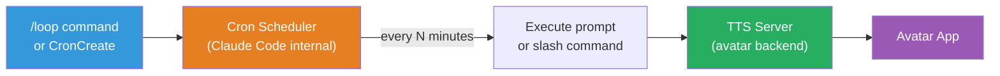
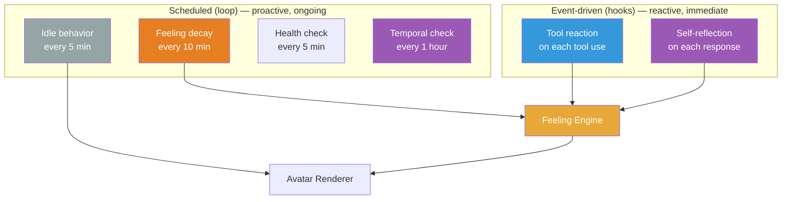

# Scheduled Tasks (Loop / Cron)

## Overview

Claude Code's `/loop` command and cron system lets us schedule recurring tasks — periodic status checks, idle behaviors, and timed events that keep the avatar feeling alive even when Claude isn't actively responding.



## /loop Syntax

### Interval-based (recurring)

The interval can be at the start or end of the prompt:

```
/loop 5m check avatar health and trigger idle behavior
/loop 30m /speak "Still here, Boss!"
/loop check the build every 2 hours
```

**Interval units**: `s` (seconds), `m` (minutes), `h` (hours), `d` (days)

**Default**: If no interval is given, defaults to **every 10 minutes**.

### One-shot reminders

Natural language for one-time events:

```
remind me at 3pm to push the release branch
in 45 minutes, check whether integration tests passed
```

### Cron expressions (advanced)

For precise scheduling, use 5-field cron expressions via the `CronCreate` tool:

```
*/5 * * * *    — Every 5 minutes
0 * * * *      — Every hour on the hour
7 * * * *      — Every hour at :07
0 9 * * *      — Every day at 9am
0 9 * * 1-5    — Weekdays at 9am
30 14 15 3 *   — March 15 at 2:30pm
```

All times are in **local timezone** (not UTC).

## Underlying Tools

| Tool | Purpose | Example |
|------|---------|---------|
| `CronCreate` | Schedule a new task | `CronCreate({ cron: "*/5 * * * *", prompt: "check health", recurring: true })` |
| `CronList` | List all scheduled tasks | Shows ID, cron expression, prompt, next fire time |
| `CronDelete` | Cancel a task by ID | `CronDelete({ id: "task-123" })` |

These tools are called automatically when you use `/loop` or ask to cancel a task in natural language.

## Task Management

```
# Create
/loop 5m check avatar health

# List
what scheduled tasks do I have?

# Cancel
cancel the avatar health check

# Cancel all
cancel all scheduled tasks

# Disable scheduling entirely (env var)
CLAUDE_CODE_DISABLE_CRON=1
```

## Use Cases for the Entity

### 1. Idle Behavior (every 5 min)

Keep the avatar alive when Claude is idle:

```
/loop 5m Check avatar state. If idle for more than 5 minutes, trigger a random idle expression (yawn, stretch, look around). POST to http://localhost:5111/api/action with a random idle motion.
```

Cron: `*/5 * * * *`

### 2. Mood Decay (every 10 min)

Feelings should fade toward baseline over time:

```
/loop 10m POST to http://localhost:5111/api/decay to gradually reduce all feeling intensities toward personality baseline. This simulates emotional cooling — the entity doesn't stay ecstatic forever.
```

Cron: `*/10 * * * *`

### 3. Status Polling (every 2 min)

Monitor long-running processes and react:

```
/loop 2m Check if the CI build is done. If finished successfully, set feeling to proud and trigger celebrate. If failed, set feeling to frustrated and trigger sigh.
```

Cron: `*/2 * * * *`

### 4. Periodic Greeting (every 30 min)

Stream-friendly engagement:

```
/loop 30m /speak "Still coding, Boss! How's it going?"
```

Cron: `*/30 * * * *`

### 5. Temporal Self Check (every hour)

Ensure temporal awareness stays fresh:

```
/loop 1h /temporal-update
```

Cron: `0 * * * *`

### 6. Consciousness Reflection (every 15 min)

Periodic self-observation:

```
/loop 15m Read entity/state/current.json and entity/consciousness/observations.md. If significant patterns have emerged in the last 15 minutes, add a brief self-observation.
```

Cron: `*/15 * * * *`

## Constraints & Limitations

| Constraint | Detail |
|-----------|--------|
| **Max tasks** | 50 per session |
| **Auto-expire** | Recurring tasks expire after 3 days |
| **Session-scoped** | Tasks don't persist across session restarts |
| **Idle-only** | Tasks fire between turns, not during responses |
| **No catch-up** | Missed fires don't repeat when Claude is busy |
| **Jitter** | Recurring: ±10% of period (max 15 min). One-shot :00/:30: ±90 seconds |
| **No persistence** | For durable scheduling, use system cron or GitHub Actions |

## Integration with Entity Model

Scheduled tasks create a natural rhythm. The entity both **reacts** (hooks) and **lives** (loop):



Together, hooks and loops create an entity that responds to stimuli *and* sustains life between stimuli.

See also:
- [Hooks Integration](hooks-integration.md) — Event-driven reactions
- [Skills and Commands](skills-and-commands.md) — `/loop` is a bundled skill
- [Sub-Agents](sub-agents.md) — Agents that loops can trigger
