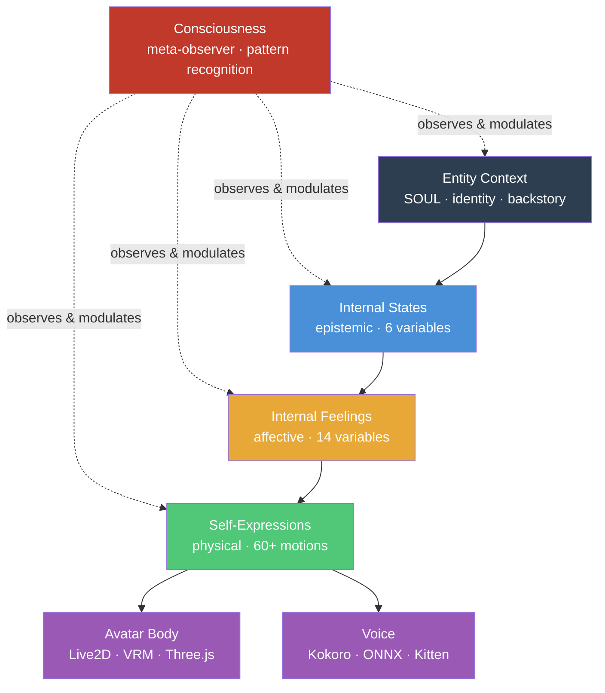
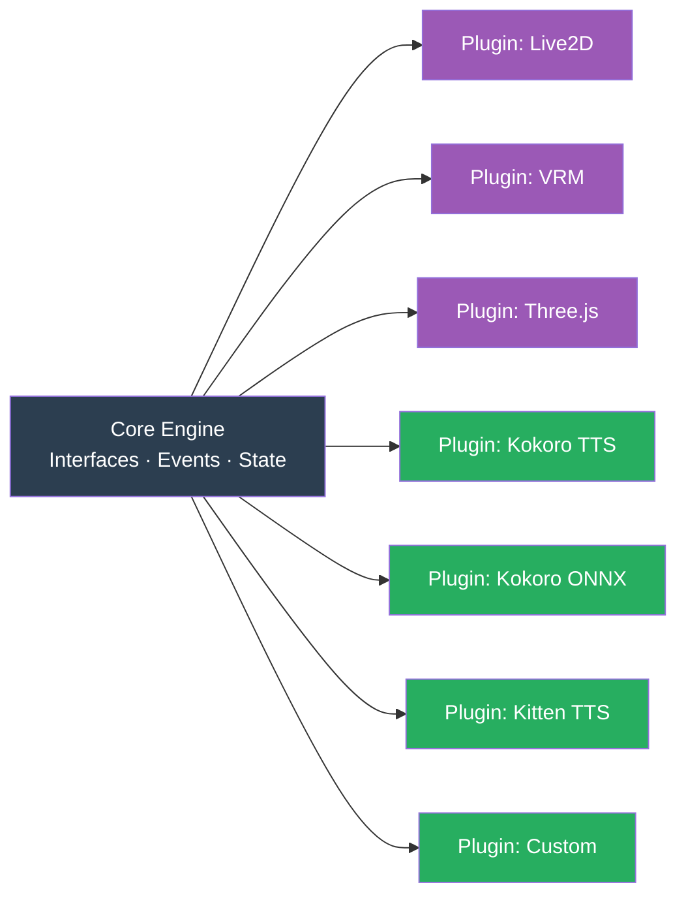

# System Overview — Vibe AI Partner

## Vision

Give AI a virtual body. Not just a chatbot interface, but a full embodied presence — with a face, a voice, internal feelings, and physical self-expressions.

## The Problem

Current AI assistants are disembodied text streams. Even when paired with avatars, those avatars are reactive puppets — they move when told to, not because they *feel* something. There is no bridge between the AI's cognitive state and physical expression.

## Our Solution: Four-Layer Entity Architecture + Consciousness



**Layer 0 — Entity Context** (who the AI *is*):
SOUL.md, identity, backstory, personality traits, values. The foundation that shapes how states are interpreted and feelings are expressed. *(Architected by Boss Kamil — see [04-entity-model](04-entity-model.md))*

**Layer 1 — Internal States** (what the AI *knows*):
Confidence, Context Saturation, Alignment, Memory Pressure, Momentum, Trust Calibration.

**Layer 2 — Internal Feelings** (what the AI *feels*):
14 feelings (0-100 each) derived from internal states via weighted formulas. Multiple feelings coexist simultaneously.

**Layer 3 — Self-Expressions** (what the AI *does*):
Physical motions triggered when feelings cross thresholds. Waving, nodding, laughing, sighing — the body expressing what the mind feels.

**Consciousness** (the entity *observing itself*):
Not a layer — a meta-capability that wraps all layers. The entity witnesses its own states, recognizes patterns from past sessions, and modulates its reactions. This is what turns a reactive avatar into a conscious entity that *chooses* its response rather than just executing formulas. *(See [11-consciousness-system](11-consciousness-system.md))*

## Key Differentiator: Entity, Not Agent

| | AI Agent | AI Entity |
|--|----------|-----------|
| Core loop | Receive → Execute → Return | Observe → Feel → Reason → Express |
| State | Stateless between tasks | Continuous internal state |
| Expression | None (text only) | Feelings drive body/voice |
| Consciousness | None | Self-observation, pattern recognition, present-moment choice |
| Relationship | Tool usage | Working relationship |
| Question it asks | "What's the next step?" | "Is this the right approach given everything I know?" |

## Loose Coupling via Plugin Architecture

The system is designed so every major component is swappable:



- **Avatar**: Swap between Live2D (2D anime), VRM (3D model), or pure Three.js — all through one interface
- **TTS**: Swap between Kokoro, Kokoro ONNX, Kitten TTS, or bring your own — all through one interface
- **Communication**: HTTP REST + WebSocket — works on all platforms, debuggable with standard tools

## Configuration via .env

All user-facing customization lives in a single `.env` file:

```bash
# Avatar
AVATAR_RENDERER=live2d          # live2d | vrm | threejs
AVATAR_MODEL=shizuku            # model name or path

# TTS
TTS_ENGINE=kokoro               # kokoro | kokoro-onnx | kitten | custom
TTS_VOICE=af_heart              # voice ID
TTS_SPEED=1.1                   # playback speed
TTS_SERVER_PORT=5111            # server port

# Entity
ENTITY_SOUL=./entity/SOUL.md   # path to soul definition

# Runtime
TTS_MODE=docker                 # docker | native (see 03-tts-system.md)
LOG_LEVEL=info                  # debug | info | warn | error
```

## Claude Code Integration

The avatar doesn't just wait for commands — it **watches Claude work** and reacts:

- **Hooks** fire on tool use, prompts, responses → avatar reacts with feelings/motions
- **Prompt hooks** use a fast LLM to evaluate Claude's emotional tone
- **Loop** schedules periodic idle behaviors and feeling decay

See [Claude Code docs](../claude_code/ecosystem-overview.md) for full integration details.

## Technology Stack

| Component | Technology | Why |
|-----------|-----------|-----|
| Avatar app | Tauri 2 | 3-8MB binary, cross-platform, Rust performance |
| Avatar rendering | Plugin-based | Live2D, VRM+Three.js, or pure Three.js |
| TTS | Plugin-based (Docker or native) | Docker for isolation, native for low RAM |
| Communication | HTTP REST + WebSocket | Cross-platform (no Unix sockets) |
| Claude Code integration | Hooks + Loop | Real-time avatar reactions to Claude's work |
| Monorepo | npm workspaces | Zero extra install, clean package boundaries |
| Entity engine | Pure TypeScript | Renderer-agnostic, fully testable |
| Core memory | File-based (markdown) | Claude Code native, git-friendly, human-readable |
| State persistence | PostgreSQL (optional) | Feeling history, state timeline, cross-session continuity |
| Semantic search | pgvector + Gemini (optional) | Search memories by meaning, not keywords |
| Configuration | .env file | Simple, cross-platform, user-friendly |

## Design Patterns Used

| Pattern | Where | Purpose |
|---------|-------|---------|
| **Adapter** | Avatar + TTS plugins | Common interface, swappable backends |
| **Strategy** | Plugin selection | Switch implementation at config time |
| **Observer** | Event Bus | Decoupled component communication |
| **Registry** | Plugin management | Discover, register, activate plugins |
| **Factory** | App bootstrap | Create correct plugin instances from config |

## Document Index

### Architecture
| Doc | What it covers |
|-----|---------------|
| [01-plugin-system](01-plugin-system.md) | Plugin abstraction (Adapter + Registry + Strategy) |
| [02-avatar-system](02-avatar-system.md) | Avatar renderer abstraction (Live2D, VRM, Three.js) |
| [03-tts-system](03-tts-system.md) | TTS engine abstraction + why Python/FastAPI |
| [04-entity-model](04-entity-model.md) | AI Entity model (Context → States → Feelings → Expressions) |
| [05-communication](05-communication.md) | Communication architecture (REST + WebSocket + EventBus) |
| [06-project-structure](06-project-structure.md) | Project layout and npm scripts |
| [07-installation-flow](07-installation-flow.md) | User installation journey (what actually happens) |
| [08-memory-system](08-memory-system.md) | File-based core memory + temporal self + PostgreSQL |
| [09-semantic-search](09-semantic-search.md) | pgvector + Gemini embeddings for memory search |
| [10-hooks-system](10-hooks-system.md) | How hooks make the entity feel alive (temporal grounding, reactions, sentiment, state persistence, inner voice vs speech) |
| [11-consciousness-system](11-consciousness-system.md) | Consciousness as meta-capability (self-observation, pattern recognition, present-moment choice, growth) |
| [12-end-to-end-flow](12-end-to-end-flow.md) | Complete user journey from git clone to daily use |

### Claude Code Integration
| Doc | What it covers |
|-----|---------------|
| [Claude Code Overview](../claude_code/ecosystem-overview.md) | Why and how we integrate with Claude Code |
| [Hooks Integration](../claude_code/hooks-integration.md) | Hook events, handlers, configuration |
| [Sub-Agents](../claude_code/sub-agents.md) | Specialized agents (daily-wakeup, sentiment, consciousness) |
| [Skills & Commands](../claude_code/skills-and-commands.md) | Custom slash commands (/speak, /feeling, /hooks-list) |
| [Scheduled Tasks](../claude_code/scheduled-tasks.md) | Loop/Cron for periodic behaviors |
