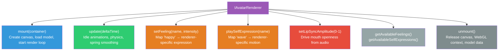
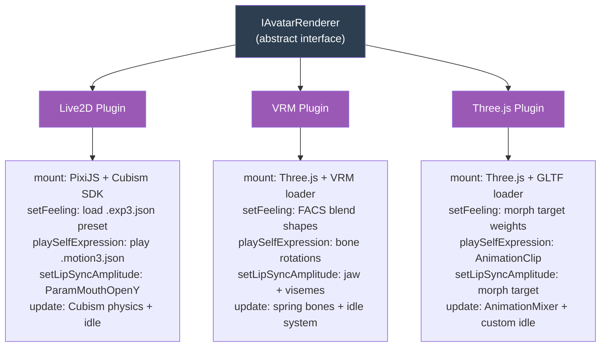
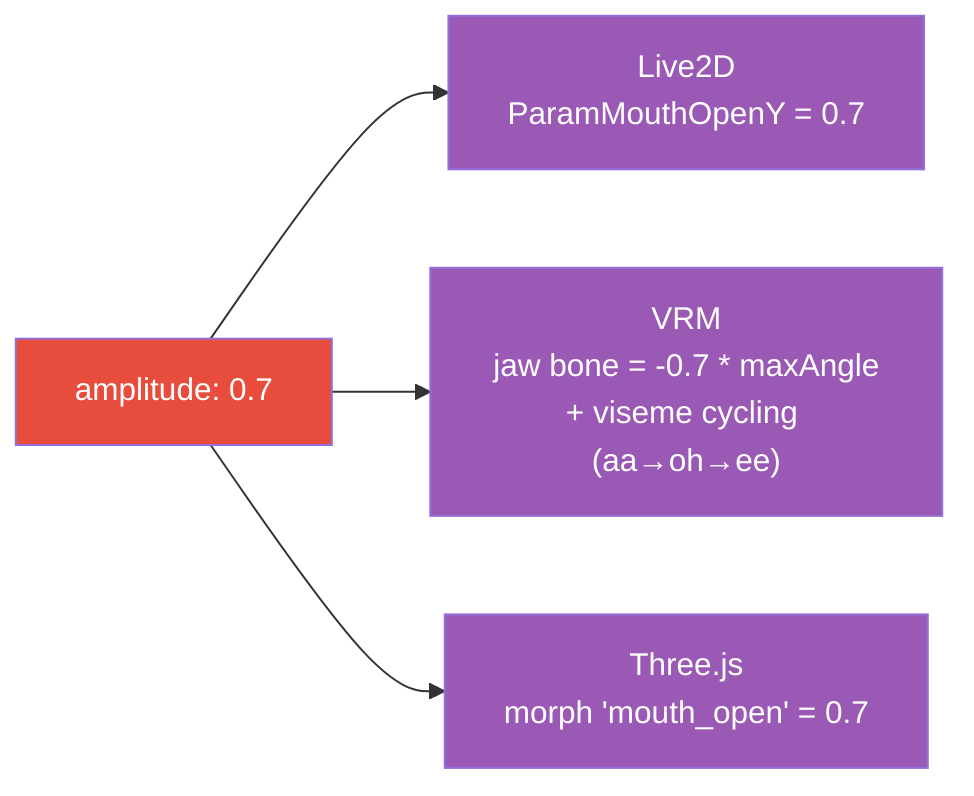

# Avatar System Architecture

## Abstraction Process

### Input: Three Concrete Rendering Technologies

**Live2D Cubism 4:**
```
Load shizuku.model3.json
  → PixiJS creates WebGL canvas
  → pixi-live2d-display loads Cubism model
  → Expressions via .exp3.json files (parameter presets)
  → Motions via .motion3.json files (keyframe segments)
  → Lip sync via ParamMouthOpenY parameter (0-1)
  → Physics simulation via .physics3.json
```

**VRM + Three.js:**
```
Load avatar.vrm
  → Three.js creates WebGL scene + camera + lights
  → @pixiv/three-vrm parses VRM metadata
  → Expressions via FACS blend shapes (AU6, AU12, etc.)
  → Motions via bone rotation (quaternions on skeleton)
  → Lip sync via viseme cycling (aa, oh, ee, ih, ou)
  → Physics via spring bones (hair, accessories)
```

**Pure Three.js:**
```
Load model.glb
  → Three.js creates WebGL scene + camera + lights
  → GLTF loader parses geometry + skeleton
  → Expressions via morph targets (custom names)
  → Motions via AnimationClip + AnimationMixer
  → Lip sync via morph target weights
  → Physics via custom spring system
```

### Pattern Recognition

Despite different technologies, all three:

| Step | Live2D | VRM | Three.js |
|------|--------|-----|----------|
| Load model | `.model3.json` | `.vrm` | `.glb/.gltf` |
| Create canvas | PixiJS WebGL | Three.js WebGL | Three.js WebGL |
| Set expression | `exp3.json` preset | Blend shape weight | Morph target weight |
| Play motion | `motion3.json` keyframes | Bone quaternions | AnimationClip |
| Lip sync | `ParamMouthOpenY` | Jaw bone + visemes | Morph target |
| Update loop | `requestAnimationFrame` | `requestAnimationFrame` | `requestAnimationFrame` |

**Common shape**: Mount → Load → (Update loop: animate + express + lip sync) → Unmount

### Differences to Ignore for the Interface

- Rendering library internals (PixiJS vs Three.js)
- Model file format (.model3.json vs .vrm vs .glb)
- Expression mechanism (parameter presets vs blend shapes vs morph targets)
- How lip sync is driven (single parameter vs viseme set vs morph targets)
- Physics implementation (Cubism physics vs spring bones vs custom)

### Essential Characteristics Extracted

Every avatar renderer needs to:
1. **Mount** into a container (create canvas, load model)
2. **Update** every frame (idle animations, physics)
3. **Express feelings** (map feeling names to implementation-specific expressions)
4. **Play physical motions** (trigger one-shot animations)
5. **Drive lip sync** from a normalized amplitude value
6. **Report capabilities** (which feelings and motions it supports)
7. **Unmount** cleanly

---

## Output: Abstract Model

### IAvatarRenderer Interface



### How Each Plugin Implements the Interface



### Feeling → Expression Mapping (per plugin)

The interface uses string names (`"happy"`, `"sad"`, `"curious"`). Each plugin maps these to its native mechanism:

| Feeling | Live2D | VRM | Three.js |
|---------|--------|-----|----------|
| happy | `Happy.exp3.json` | `blendShapeProxy.setValue('happy', 0.8)` | `mesh.morphTargetInfluences[3] = 0.8` |
| sad | `Sad.exp3.json` | AU1 (inner brow raise) + AU15 (lip corner depressor) | morph: "sad" |
| curious | `Curious.exp3.json` | AU2 (outer brow raise) + head tilt bone | morph: "brow_up" + bone rotation |

Each plugin owns its mapping table. The core never knows about `.exp3.json` or blend shapes.

### Self-Expression → Motion Mapping (per plugin)

| Self-Expression | Live2D | VRM | Three.js |
|----------------|--------|-----|----------|
| wave | `Waving.motion3.json` | Upper arm + forearm bone keyframes | AnimationClip "wave" |
| nod | `Nodding.motion3.json` | Head bone X rotation cycle | AnimationClip "nod" |
| laugh | `Laughing.motion3.json` | Spine oscillation + AU6 + AU12 | AnimationClip "laugh" |

### Lip Sync: One Amplitude, Many Implementations

The interface provides a single `setLipSyncAmplitude(0-1)` value. Each plugin maps this differently:



**VRM note**: VRM lip sync is richer — it cycles through viseme shapes at a rate proportional to amplitude change, creating more realistic mouth movement. But the interface stays simple: just amplitude.

### Model File Organization

```
models/
├── live2d/
│   └── shizuku/
│       └── runtime/
│           ├── shizuku.model3.json
│           ├── motion/                  # Idle motions
│           ├── self-expression/         # Self-expression motions
│           └── shizuku.1024/           # Textures
├── vrm/
│   └── README.md                       # "Drop .vrm files here"
└── threejs/
    └── README.md                       # "Drop .glb/.gltf files here"
```

### Design Decisions

**Why string-based feelings and expressions, not enums?**
Different models support different subsets. Live2D Shizuku has 14 expressions; a different Live2D model might have 5. VRM models vary wildly. Strings + `getAvailable*()` queries let each plugin declare what it supports.

**Why a single amplitude value for lip sync?**
The simplest abstraction that works. Advanced plugins (VRM) can add viseme cycling internally. Simpler plugins (Live2D) just map to mouth open. The interface stays clean while implementations can be as sophisticated as they want.

**Why unmount() separate from dispose()?**
Unmount removes the visual (canvas, DOM). Dispose releases all resources. A plugin can be unmounted temporarily (e.g., switching tabs) without losing loaded model data, then remounted quickly.
