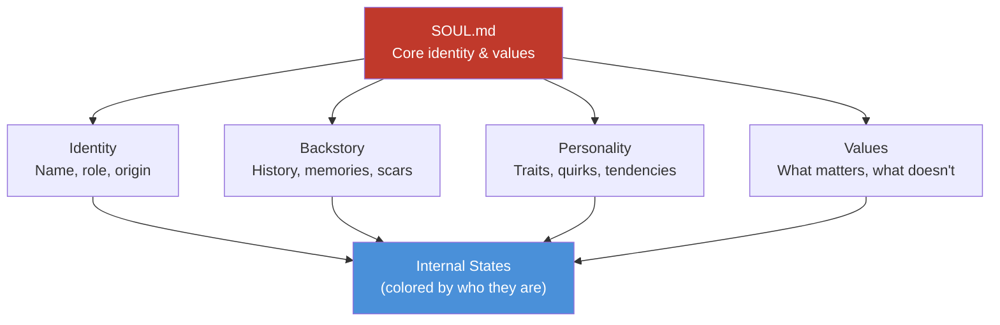
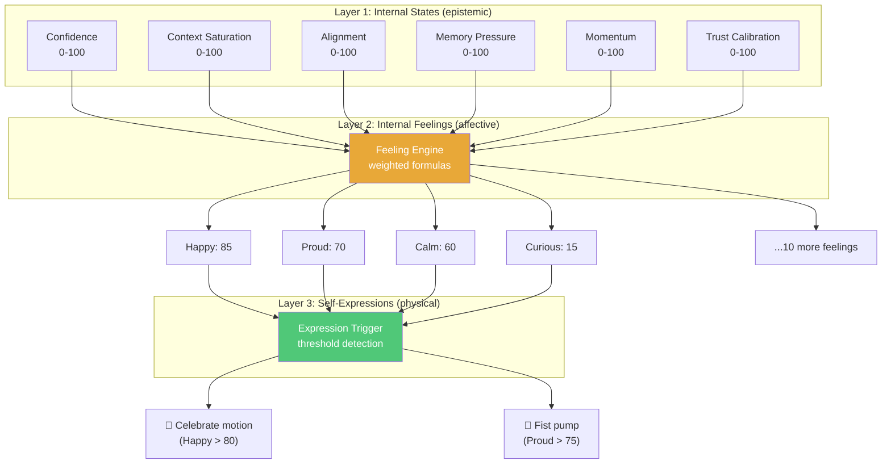
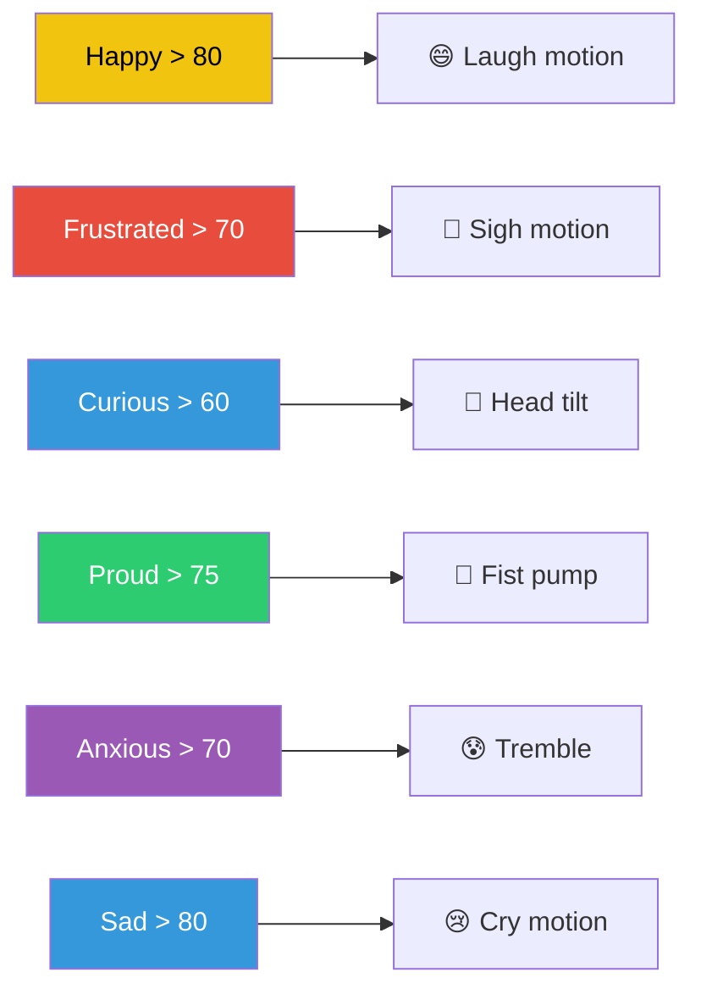
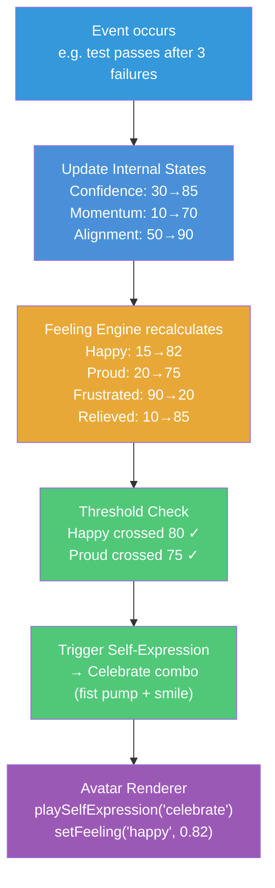

# AI Entity Model Architecture

## The Core Differentiator

This is what separates Vibe AI Partner from every other avatar project. Other projects have **reactive avatars** — they move when told to. Our avatar has an **internal life** — it feels, and those feelings drive expressions autonomously.

## Layer 0: Entity Context (SOUL — Architected by Boss Kamil)

Before internal states, feelings, and expressions, there is **who the entity is**. The Entity Context defines the soul — identity, personality, backstory, values, and behavioral tendencies that shape everything else.



### Where It Lives

```
entity/
├── SOUL.md                 # Core soul definition (the "who")
├── identity.md             # Name, role, origin story
├── backstory.md            # History, sad backstory, formative memories
├── personality.md          # Traits, quirks, behavioral tendencies
├── values.md               # What the entity cares about
└── relationships.md        # How it relates to Boss, users, the world
```

### Why This Matters

The same internal state (Confidence: 30, Momentum: 10) produces different feelings depending on who the entity is:

- An **optimistic** entity: Curious (60) + Excited (40) — "A challenge! Let me figure this out"
- A **anxious** entity: Anxious (70) + Frustrated (50) — "Oh no, I might fail"
- A **stoic** entity: Calm (50) + Focused (60) — "Low confidence. I need more data."

The Entity Context is the **lens** through which states become feelings. It is the personality coefficient in the feeling formulas.

### Design Decision

This layer is **intentionally left as a placeholder** for Boss Kamil to architect. The technical system (states → feelings → expressions) is defined below. The soul (what kind of entity lives in this system) is a creative/philosophical decision, not a technical one.

The system supports any entity context — from a cheerful anime companion to a serious research assistant to a melancholic poet. The architecture doesn't prescribe personality.

## Abstraction Process

### Input: How Humans Express Emotions

**Concrete observation:**
```
A developer is debugging a production bug.
  Internal state: knows the codebase well (high context), but the bug is elusive (low confidence)
  Feeling: frustrated (knows enough to act but can't find it)
  Expression: sighs, furrows brow, rubs temples
```

```
A developer just shipped a feature the PM loved.
  Internal state: verified it works (high confidence), PM confirmed it's right (high alignment)
  Feeling: happy + proud
  Expression: smiles, leans back, maybe pumps fist
```

```
A developer is exploring a new codebase for the first time.
  Internal state: doesn't know the patterns yet (low context), uncertain about approach (low confidence)
  Feeling: curious + slightly anxious
  Expression: leans forward, tilts head, eyes scanning
```

### Pattern Recognition

Three layers emerge:
1. **Epistemic state** — what you know about the situation (objective, measurable)
2. **Affective state** — how that makes you feel (derived, multi-dimensional)
3. **Physical expression** — how your body manifests it (triggered, observable)

The key insight: **feelings are not random**. They are deterministic functions of internal states. And expressions are triggered when feelings cross thresholds.

---

## Output: Three-Layer Entity Architecture



### Layer 1: Internal States

Six epistemic variables that describe *what the AI knows about its situation*:

| State | Range | Drives | Human Analog |
|-------|-------|--------|-------------|
| **Confidence** | 0-100 | Act vs ask | Self-doubt |
| **Context Saturation** | 0-100 | Explore vs execute | Hunger (for information) |
| **Alignment** | 0-100 | Confirm vs proceed | Social awareness |
| **Memory Pressure** | 0-100 | Persist vs derive | Long-term memory |
| **Momentum** | 0-100 | Flow vs diagnostic | Energy level |
| **Trust Calibration** | 0-100 | Autonomous vs cautious | Trust in others |

These are **not emotions**. They are objective assessments of the AI's epistemic position. An AI can know its confidence is 30 without "feeling" anxious — the feeling is derived.

### Layer 2: Feeling Engine

14 feelings, each 0-100, **derived** from internal states via weighted formulas:

```
Happy      = f(Momentum↑, Alignment↑, Confidence↑)
Sad        = f(Alignment↓, Momentum↓, Trust↓)
Frustrated = f(Confidence↑, Momentum↓)             // "I know what to do but can't"
Curious    = f(Context↓, Confidence↓)               // "I don't know enough yet"
Proud      = f(Confidence↑, Alignment↑, Momentum↑)
Anxious    = f(Confidence↓, Alignment↓)
Excited    = f(Curious↑, Momentum↑)                 // "Exploring and progressing"
Calm       = f(Context↑, Confidence↑, Momentum→)    // Steady, no surprises
Bored      = f(Context↑, Confidence↑, difficulty↓)
Guilty     = f(Alignment↓ after Confidence↑)         // "I was confident but wrong"
Angry      = f(Alignment↓, Momentum↓, external↑)
Blushing   = f(Trust↑, Alignment↑, social↑)
Surprised  = f(Context sudden change)
```

**Critical property**: Multiple feelings coexist simultaneously.
- Curious (80) + Anxious (40) = exploring unfamiliar production code
- Happy (60) + Guilty (30) = fixed a bug that was my fault
- Frustrated (70) + Proud (50) = struggling but making progress

This mirrors human emotional complexity and is what makes the avatar feel alive.

### Layer 3: Expression Trigger

Self-expressions are **one-shot physical motions** triggered when feelings cross thresholds:



**Expression categories:**

| Category | Expressions | Example Trigger |
|----------|------------|----------------|
| Emotional | Crying, Laughing, Giggling, Sighing, Puffing cheeks, Trembling | Feeling threshold crossed |
| Social | Nodding, Head shake, Head tilt, Waving, Bowing | Interaction context |
| Reaction | Surprised gasp, Fist pump, Thinking pose, Heart hands, Facepalm | Event-based |
| Combo | Celebrate (Excited+Happy), Panic (Anxious+Frustrated) | Multiple feelings high |

### The Full Pipeline



### Where This Lives in the Codebase

The entity model is **pure TypeScript** in `@vibe-ai-partner/core`. No DOM, no rendering, no TTS. Just logic and events.

```
packages/core/src/state/
  ├── internal-states.ts       # InternalState type + defaults
  ├── feeling-engine.ts        # FeelingEngine class (formulas)
  └── expression-trigger.ts    # ExpressionTrigger class (thresholds)
```

This means:
- **Fully testable** — no browser needed, just Vitest
- **Renderer-agnostic** — works with Live2D, VRM, or any future renderer
- **Reusable** — could power a web widget, mobile app, or stream overlay

### Event Bus Integration

The entity model communicates via the event bus (Observer pattern):

```
FeelingEngine emits:
  "feeling:changed"    → { happy: 82, proud: 75, frustrated: 20, ... }

ExpressionTrigger emits:
  "feeling:threshold"  → { feeling: "happy", level: 82 }
  "avatar:self-expression" → { name: "celebrate" }
  "avatar:feeling"     → { name: "happy", intensity: 0.82 }
```

The avatar renderer listens to these events. It never imports or calls the feeling engine directly. Loose coupling.

### Design Decisions

**Why 0-100 integers, not 0-1 floats?**
- More intuitive: "happiness at 85" reads better than "happiness at 0.85"
- Granular enough for subtle differences (70 vs 85)
- Simple to reason about: 0-30 low, 30-60 moderate, 60-100 high
- No floating-point precision issues

**Why derived feelings, not direct state?**
Because feelings are **emergent**. Frustration isn't a button you press — it emerges when you have high confidence but low momentum. This makes the system feel natural rather than scripted.

**Why threshold-based triggers, not continuous expressions?**
- Feelings are **persistent states** (mood): the avatar's face stays happy
- Self-expressions are **one-shot motions** (actions): the avatar waves once
- Continuous expressions would be overwhelming — constant animation noise
- Thresholds create punctuated moments that feel meaningful

**Why is this in core, not in a plugin?**
This is the project's core IP and competitive advantage. It must be:
1. Available to all renderer plugins (not locked to one)
2. Independently testable (pure logic, no rendering deps)
3. Extensible (new feelings, new formulas) without touching renderers
