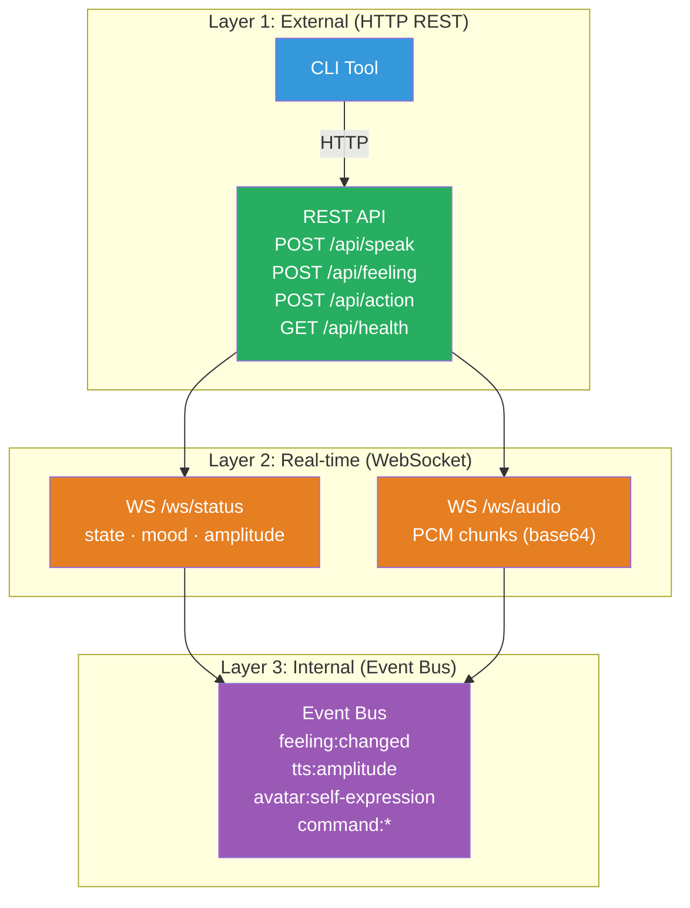
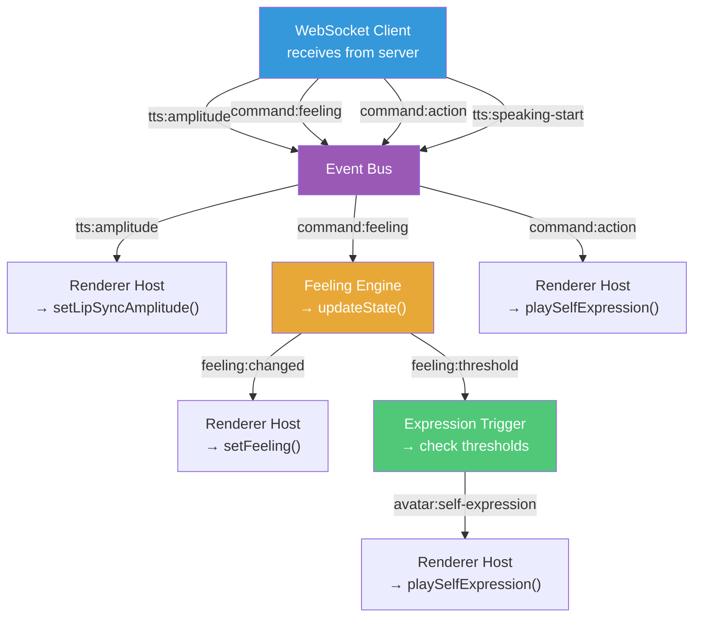
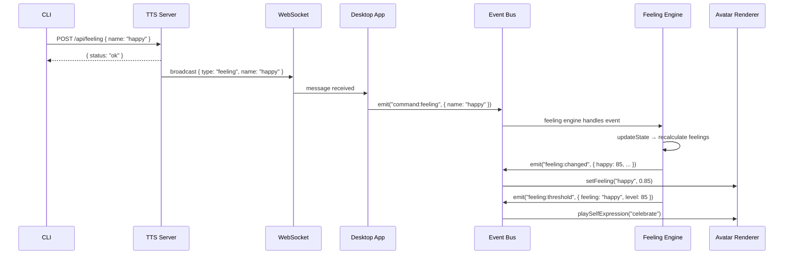
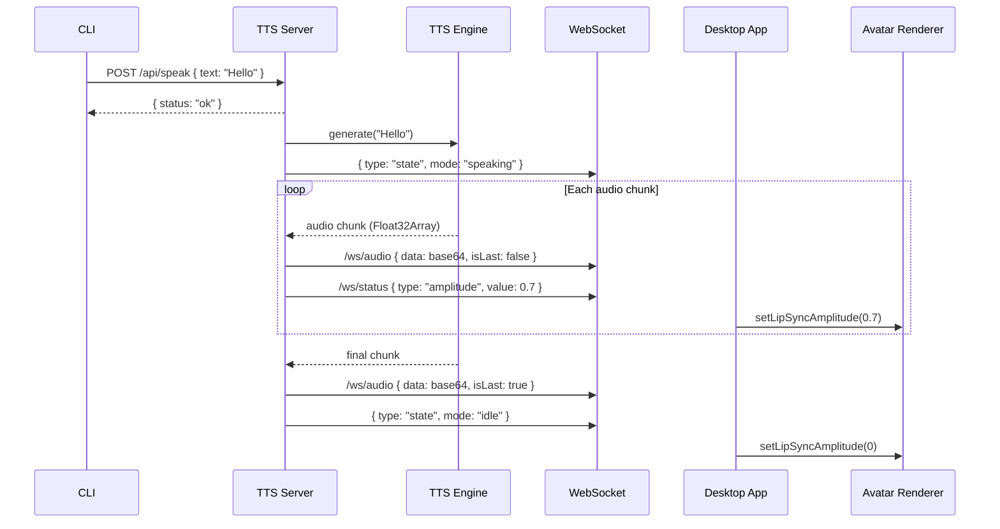

# Communication Architecture

## Abstraction Process

### Input: How Components Need to Talk

**Current system (tightly coupled):**
```
CLI → Unix socket (/tmp/avatar.sock) → Electron main process → IPC → Renderer
CLI → Unix socket (/tmp/vibe-kokoro.sock) → Python TTS daemon
```
Problems: Unix sockets don't work on Windows. Custom protocol. Hard to debug.

**What we need:**
- CLI sends commands (feeling, action, speak) to the system
- TTS server generates audio and emits amplitude in real-time
- Desktop app receives commands and audio, drives avatar
- All cross-platform (Windows, macOS, Linux)
- Debuggable with standard tools (curl, browser devtools)

### Pattern Recognition

Two communication patterns emerge:

1. **Request/Response** — "do this, tell me if it worked"
   - Set a feeling → OK
   - Trigger an action → OK
   - Speak text → OK (async, audio streams separately)
   - Get health status → { status: "ok" }

2. **Real-time streaming** — "keep me updated continuously"
   - Audio amplitude → 0.73, 0.65, 0.81, ... (30Hz)
   - State changes → { mode: "speaking", mood: "happy" }
   - Audio chunks → PCM data for playback

### Essential Characteristics

- **Commands** = HTTP REST (stateless, debuggable, universal)
- **Streams** = WebSocket (persistent, bidirectional, real-time)
- **Internal routing** = Event Bus (in-process, typed, decoupled)

---

## Output: Three Communication Layers



### Layer 1: HTTP REST API (TTS Server)

Commands are synchronous requests. The server processes them and optionally broadcasts side effects via WebSocket.

```
POST /api/speak
  Body: { "text": "Hello!", "voice": "af_heart", "speed": 1.1 }
  Response: { "status": "ok", "duration_estimate": 2.3 }
  Side effect: audio chunks streamed via /ws/audio
               amplitude streamed via /ws/status

POST /api/feeling
  Body: { "name": "happy" }
  Response: { "status": "ok" }
  Side effect: state broadcast via /ws/status

POST /api/action
  Body: { "name": "wave" }
  Response: { "status": "ok" }
  Side effect: action broadcast via /ws/status

POST /api/stop
  Response: { "status": "ok" }

POST /api/voice
  Body: { "voice": "am_adam" }
  Response: { "status": "ok" }

GET /api/health
  Response: { "status": "ok", "engine": "kokoro", "uptime": 3600 }

GET /api/voices
  Response: { "voices": [{ "id": "af_heart", "name": "Heart", ... }] }
```

### Layer 2: WebSocket Channels

Two persistent WebSocket connections from the desktop app to the TTS server:

**Status channel (`/ws/status`):**
```json
{ "type": "state", "mode": "speaking", "mood": "happy" }
{ "type": "amplitude", "value": 0.73, "timestamp": 1710000000.123 }
{ "type": "feeling", "name": "happy" }
{ "type": "action", "name": "wave" }
```

**Audio channel (`/ws/audio`):**
```json
{ "type": "audio_chunk", "data": "<base64 PCM>", "sampleRate": 24000, "isLast": false }
{ "type": "audio_chunk", "data": "<base64 PCM>", "sampleRate": 24000, "isLast": true }
```

### Layer 3: Event Bus (Internal)

Within the desktop app, all inter-component communication goes through a typed event bus:



### Event Map (Complete)

```
// State changes
"state:changed"          → { state: InternalState }
"feeling:changed"        → { feelings: Record<string, number> }
"feeling:threshold"      → { feeling: string, level: number }

// Avatar commands
"avatar:feeling"         → { name: string, intensity: number }
"avatar:self-expression" → { name: string }

// TTS events
"tts:amplitude"          → { value: number }          // 0-1, ~30Hz
"tts:speaking-start"     → { text: string }
"tts:speaking-stop"      → {}

// External commands (from CLI via server)
"command:feeling"        → { name: string }
"command:action"         → { name: string }
"command:speak"          → { text: string, voice?: string }

// Plugin lifecycle
"plugin:activated"       → { id: string, type: string }
"plugin:deactivated"     → { id: string, type: string }

// Configuration
"config:changed"         → { key: string, value: unknown }
```

### Full Request Flow: "npm run feeling happy"



### Full Request Flow: "npm run speak Hello"



### Design Decisions

**Why HTTP REST, not gRPC or raw TCP?**
- curl is universal. Every developer can debug with `curl localhost:5111/api/health`
- No special tooling needed. Browser devtools show WebSocket messages
- FastAPI auto-generates OpenAPI docs
- Overhead is negligible for command frequency (~1-10 requests/sec)

**Why WebSocket, not Server-Sent Events?**
- WebSocket is bidirectional (desktop app can send ack/control messages)
- Two channels (status + audio) keep concerns separate
- Better for binary data (audio chunks)

**Why Event Bus, not direct imports?**
- Components don't know about each other. The WebSocket client doesn't import the Feeling Engine
- Adding a new consumer (e.g., debug panel, stream overlay) means one `eventBus.on()` call
- Testing: mock the event bus, test each component in isolation
- The entity model (States → Feelings → Expressions) flows naturally through events

**Why does the CLI talk to the server, not the desktop app?**
- Server is always running (Docker). Desktop app might be closed
- Server broadcasts to all connected clients (desktop, web dashboard, etc.)
- Single source of truth for state
- CLI doesn't need to know if the desktop app is Tauri, Electron, or a web browser
