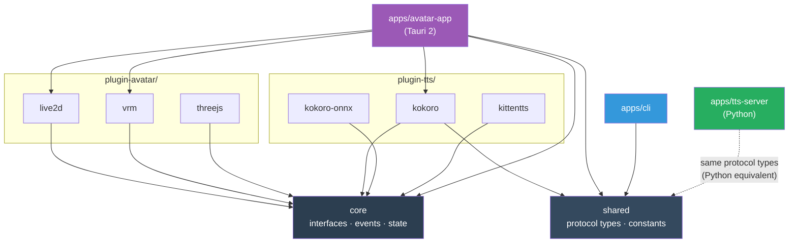

# Project Structure & Build System

## Project Layout

```
vibe-ai-partner/
│
├── packages/                           # Internal code modules (developers only, users don't touch)
│   ├── core/                           # Entity engine, interfaces, event bus
│   │   └── src/
│   │       ├── interfaces/             # IAvatarRenderer, ITTSEngine, IPlugin
│   │       ├── state/                  # InternalStates, FeelingEngine, ExpressionTrigger
│   │       ├── events/                 # EventBus, EventMap
│   │       ├── config/                 # ConfigManager, Zod schemas
│   │       └── utils/                  # Spring physics, shared utilities
│   │
│   ├── shared/                         # Protocol types, constants
│   │   └── src/
│   │       ├── protocol.ts             # WebSocket + REST message types
│   │       └── constants.ts            # Feeling names, expression names, defaults
│   │
│   ├── plugin-avatar/                  # Avatar renderers (user picks one)
│   │   ├── html/                       # Simple HTML/CSS (no WebGL, lightest option)
│   │   ├── live2d/                     # Live2D (PixiJS + Cubism)
│   │   ├── vrm/                        # VRM (Three.js + @pixiv/three-vrm)
│   │   └── threejs/                    # Three.js only (custom models)
│   │
│   ├── plugin-tts/                     # TTS engines (user picks one)
│   │   ├── kokoro/                     # Kokoro full (PyTorch, best quality)
│   │   ├── kokoro-onnx/                # Kokoro ONNX (lighter, CPU ok)
│   │   └── kittentts/                  # KittenTTS (ultra-light, CPU only)
│   │
│   └── plugin-memory/                  # Memory backends (optional add-ons)
│       ├── postgresql/                 # State persistence, feeling history
│       ├── pgvector/                   # Semantic search (requires postgresql)
│       └── sqlite/                     # Lightweight DB alternative
│
├── apps/                               # Runnable applications
│   ├── avatar-app/                     # Tauri 2 avatar window
│   │   ├── src/                        # TypeScript frontend
│   │   │   ├── main.ts                 # Entry, animation loop
│   │   │   ├── app.ts                  # Plugin orchestration, event wiring
│   │   │   ├── renderer-host.ts        # Manages active avatar plugin
│   │   │   ├── tts-host.ts             # Manages active TTS plugin
│   │   │   ├── ws-client.ts            # WebSocket to TTS server
│   │   │   └── ui/                     # Speech bubble, context menu, settings
│   │   ├── src-tauri/                  # Rust backend
│   │   │   └── src/lib.rs              # Window mgmt, native APIs, tray
│   │   ├── vite.config.ts
│   │   ├── index.html
│   │   └── package.json
│   │
│   ├── tts-server/                     # Python FastAPI TTS server
│   │   ├── src/vibe_tts/
│   │   │   ├── server.py               # REST + WebSocket endpoints
│   │   │   ├── engine_registry.py      # Multi-backend TTS registry
│   │   │   ├── engines/                # Kokoro, ONNX, Kitten backends
│   │   │   ├── audio_player.py         # Playback + amplitude
│   │   │   └── pipeline.py             # Chunked streaming
│   │   ├── pyproject.toml
│   │   ├── Dockerfile                  # Optional: Docker deployment
│   │   └── docker-compose.yml
│   │
│   └── cli/                            # Node.js CLI tool
│       ├── src/
│       │   ├── index.ts
│       │   └── commands/               # feeling, action, speak, config
│       └── package.json
│
├── models.json                         # Model registry (URLs, hashes, metadata — ~1KB)
├── models/                             # Downloaded models (gitignored, populated by setup)
│   └── README.md                       # How to add custom models
│
├── entity/                             # Entity Context (Boss Kamil architects the content)
│   ├── self/                           # Core identity (immutable — who the entity IS)
│   │   ├── SOUL.md                     # Core soul definition
│   │   ├── identity.md                 # Name, role, origin
│   │   ├── backstory.md               # History, formative memories
│   │   ├── personality.md             # Traits, quirks, tendencies
│   │   ├── values.md                  # What matters
│   │   └── relationships.md           # How it relates to Boss, users, world
│   │
│   ├── temporal-self/                  # Time awareness (auto-maintained by agents)
│   │   ├── TODAY_SELF.md               # Live session snapshot (overwritten)
│   │   ├── DAILY_SELF.md              # Yesterday's record
│   │   ├── WEEKLY_SELF.md             # Current/last week
│   │   ├── MONTHLY_SELF.md            # Last completed month
│   │   ├── ETERNAL_SELF.md            # Core truths that persist
│   │   └── archives/                  # Archived stale temporal docs
│   │
│   ├── state/
│   │   └── current.json               # Latest internal states + feelings (auto-saved)
│   │
│   └── memory/
│       ├── conversations/              # Session summaries (auto-generated)
│       ├── preferences/                # Learned user preferences
│       ├── lessons/                    # Lessons from past mistakes
│       └── milestones/                 # Important events
│
├── self-research/                      # AI entity model research docs (IP)
├── atlas/                              # ATLAS identity + engineering principles
├── .claude/
│   ├── hooks/                          # Claude Code hook scripts
│   ├── settings.json                   # Hook configuration (shareable)
│   └── settings.local.json            # Local overrides (not committed)
├── docs/
│   ├── architecture/                   # Architecture documents
│   └── claude_code/                    # Claude Code integration docs
│
├── scripts/                            # setup.js, start.js, stop.js, cli.js
├── package.json                        # Root: npm workspaces + scripts
├── tsconfig.base.json                  # Shared TypeScript config
├── docker-compose.yml                  # TTS server container (optional)
├── .env.example                        # Configuration template
└── .env                                # User config (not committed)
```

**Notes:**
- `packages/` is internal code organization — users never interact with it directly
- `models/` is gitignored — model files are downloaded on setup, not stored in git
- `models.json` is the registry listing available models with download URLs and checksums They run `npm run setup`, choose their avatar and TTS engine, and everything works. See [07-installation-flow](07-installation-flow.md) for the user's experience.

## Dependency Graph



**Key principle**: Plugins depend on `core` (for interfaces). `core` depends on nothing. Apps depend on plugins + core + shared. No circular dependencies.

## Build System

### npm Workspaces

```json
// package.json (root)
{
  "workspaces": [
    "packages/core",
    "packages/shared",
    "packages/plugin-avatar/*",
    "packages/plugin-tts/*",
    "packages/plugin-memory/*",
    "apps/*"
  ]
}
```

npm workspaces ship with Node.js — no extra tools. `npm install` at root installs everything.

> **Advanced users**: Bun workspaces also work — `bun install` is faster and `bun test` replaces Vitest. The `package.json` is compatible with both.

### npm Scripts (Developer + User Interface)

All commands run via `npm run`. Works on Windows, macOS, Linux — no Make, no shell scripts.

```json
{
  "scripts": {
    "setup":       "node scripts/setup.js",
    "start":       "node scripts/start.js",
    "stop":        "node scripts/stop.js",
    "restart":     "npm stop && npm start",
    "status":      "node scripts/status.js",

    "dev":         "npm run dev -w apps/avatar-app",
    "build":       "npm run build -ws",
    "test":        "npm run test -ws",

    "tts:start":   "node scripts/tts-start.js",
    "tts:stop":    "node scripts/tts-stop.js",
    "tts:install": "node scripts/tts-install.js",

    "feeling":     "node scripts/cli.js feeling",
    "action":      "node scripts/cli.js action",
    "speak":       "node scripts/cli.js speak",

    "switch":      "node scripts/switch.js"
  }
}
```

Usage:
```bash
npm run setup              # Interactive setup (choose avatar, TTS, voice)
npm start                  # Start everything (TTS server + avatar app)
npm stop                   # Stop everything
npm run status             # Health check

npm run feeling happy      # Set feeling
npm run action wave        # Trigger self-expression
npm run speak "Hello!"     # TTS speak with lip sync

npm run switch avatar vrm         # Switch avatar (installs deps if needed, updates .env)
npm run switch tts kokoro-onnx    # Switch TTS engine
npm run switch memory +postgresql # Add memory plugin
npm run switch memory -postgresql # Remove memory plugin

npm run dev                # Development mode (hot reload)
npm test                   # Run all tests
```

Build order: `core` first → plugins in parallel → `avatar-app` last. npm workspaces handles this with `npm run build -ws`.

> **Optional**: For large-scale builds, [Turborepo](https://turbo.build) can be added for caching and parallelization. Not needed initially.

## Technology Choices

### Tauri 2 (Avatar Window)

| Requirement | How Tauri Handles It |
|-------------|---------------------|
| Cross-platform | macOS, Windows, Linux from one codebase |
| Transparent window | `transparent: true` in tauri.conf.json |
| Always-on-top | `alwaysOnTop: true` in window config |
| Small binary | 3-8MB (vs 150MB Electron) |
| Native APIs | Rust FFI for cursor tracking, system tray |
| WebGL | System WebView supports WebGL 2.0 |

### Docker (TTS Server — Optional)

| Requirement | How Docker Handles It |
|-------------|----------------------|
| Python isolation | Containerized Python 3.12 + all deps |
| GPU passthrough | NVIDIA Container Toolkit (CUDA) |
| Easy setup | `docker compose up` — done |
| Reproducible | Same environment on every machine |
| CPU fallback | Works without GPU (slower) |

### TypeScript + Vitest (Frontend/Packages)

| Requirement | How It Handles It |
|-------------|-------------------|
| Type safety | TypeScript strict mode |
| Plugin interfaces | TypeScript interfaces = compile-time contracts |
| Fast tests | Vitest (native ESM, parallel, watch mode) |
| Build | tsc (simple, no bundler for packages) |
| Bundle (avatar-app) | Vite (fast HMR, Tauri integration) |

## Submodule Decision: Remove for Simplicity

The current `live-ai-partner-avatar/` git submodule is removed. Its code is extracted into the project's `packages/` and `apps/` directories. Reasons:
- Submodules add complexity (clone --recursive, submodule update)
- Contributors get confused by nested git repos
- CI/CD is simpler with one repo
- Git history is preserved in the parent repo (proof of prior art)

## Configuration: .env

All user-facing configuration in a single `.env` file (not committed):

```bash
# Avatar
AVATAR_RENDERER=live2d          # live2d | vrm | threejs
AVATAR_MODEL=shizuku            # model name or path to model file

# TTS
TTS_ENGINE=kittentts            # kittentts | kokoro-onnx | kokoro
TTS_VOICE=Bella                 # voice name (depends on engine)
TTS_SPEED=1.0                   # playback speed
TTS_SERVER_PORT=5111            # server port
TTS_MODE=native                 # native | docker

# Entity
ENTITY_SOUL=./entity/SOUL.md   # path to soul definition

# Memory (see 08-memory-system.md)
MEMORY_MODE=basic               # basic | stateful | intelligent
DATABASE_URL=                   # only for stateful/intelligent
GEMINI_API_KEY=                 # only for intelligent

# Runtime
LOG_LEVEL=info                  # debug | info | warn | error
```

An `.env.example` is committed as the template. `npm run setup` generates this interactively.

## Migration from Current Structure

### What changes:
- `live-ai-partner-avatar/` submodule → **removed**, code extracted into project
- Unix socket IPC → HTTP REST + WebSocket
- Electron → Tauri 2
- Raw JS → TypeScript with interfaces
- Monolithic → Plugin architecture
- Hardcoded config → `.env` file
- Makefile → npm scripts (cross-platform)

### What's added:
- `entity/` — Entity Context (SOUL, identity, backstory) + state persistence + memory
- `docs/claude_code/` — Claude Code hooks + loop integration
- `.claude/hooks/` — Hook scripts for avatar reactions
- `.env.example` — Configuration template

### What stays:
- `self-research/` — preserved as-is (our IP)
- `atlas/` — preserved as-is (ATLAS identity)
- Model files — moved to `models/` but same content
- **Git history — preserved (proof of prior art)**

### Migration order:
1. Create `docs/` (architecture + claude_code docs) — **done**
2. Remove submodule, scaffold project (npm workspaces, tsconfig)
3. Create `entity/` structure (Boss Kamil architects the content)
4. Implement `core` (interfaces, event bus, feeling engine)
5. Port Live2D rendering to `plugin-live2d`
6. Port TTS to `apps/tts-server` (native + Docker option)
7. Create Tauri avatar app (`apps/avatar-app/`)
8. Create CLI
9. Set up Claude Code hooks integration
10. Add VRM plugin + additional TTS engines
