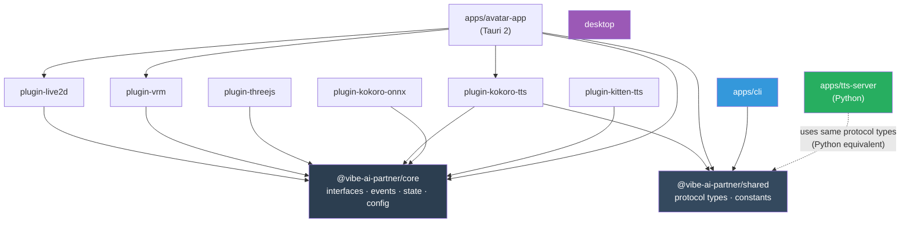

# Project Structure & Build System

## Monorepo Layout

```
vibe-ai-partner/
│
├── packages/                           # Shared libraries (npm packages)
│   ├── core/                           # @vibe-ai-partner/core
│   │   └── src/
│   │       ├── interfaces/             # IAvatarRenderer, ITTSEngine, IPlugin
│   │       ├── state/                  # InternalStates, FeelingEngine, ExpressionTrigger
│   │       ├── events/                 # EventBus, EventMap
│   │       ├── config/                 # ConfigManager, Zod schemas
│   │       └── utils/                  # Spring physics, shared utilities
│   │
│   ├── shared/                         # @vibe-ai-partner/shared
│   │   └── src/
│   │       ├── protocol.ts             # WebSocket + REST message types
│   │       └── constants.ts            # Feeling names, expression names, defaults
│   │
│   ├── plugin-live2d/                  # @vibe-ai-partner/plugin-live2d
│   │   └── src/                        # IAvatarRenderer impl (PixiJS + Cubism)
│   │
│   ├── plugin-vrm/                     # @vibe-ai-partner/plugin-vrm
│   │   └── src/                        # IAvatarRenderer impl (Three.js + VRM)
│   │
│   ├── plugin-threejs/                 # @vibe-ai-partner/plugin-threejs
│   │   └── src/                        # IAvatarRenderer impl (Three.js only)
│   │
│   ├── plugin-kokoro-tts/              # @vibe-ai-partner/plugin-kokoro-tts
│   │   └── src/                        # ITTSEngine impl (HTTP/WS client)
│   │
│   ├── plugin-kokoro-onnx/             # @vibe-ai-partner/plugin-kokoro-onnx
│   │   └── src/                        # ITTSEngine impl (ONNX in browser)
│   │
│   └── plugin-kitten-tts/              # @vibe-ai-partner/plugin-kitten-tts
│       └── src/                        # ITTSEngine impl (Kitten adapter)
│
├── apps/                               # Runnable applications
│   ├── avatar-app/                     # Tauri 2 avatar application
│   │   ├── src/                        # TypeScript frontend
│   │   │   ├── main.ts                 # Entry, animation loop
│   │   │   ├── app.ts                  # Plugin orchestration, event wiring
│   │   │   ├── renderer-host.ts        # Manages active avatar plugin
│   │   │   ├── tts-host.ts             # Manages active TTS plugin
│   │   │   ├── ws-client.ts            # WebSocket to TTS server
│   │   │   └── ui/                     # Speech bubble, context menu, settings
│   │   ├── src-tauri/                  # Rust backend
│   │   │   └── src/lib.rs              # Window mgmt, native APIs, tray
│   │   ├── vite.config.ts
│   │   ├── index.html
│   │   └── package.json
│   │
│   ├── tts-server/                     # Python FastAPI TTS server
│   │   ├── src/vibe_tts/
│   │   │   ├── server.py               # REST + WebSocket endpoints
│   │   │   ├── engine_registry.py      # Multi-backend TTS registry
│   │   │   ├── engines/                # Kokoro, ONNX, Kitten backends
│   │   │   ├── audio_player.py         # Playback + amplitude
│   │   │   └── pipeline.py             # Chunked streaming
│   │   ├── pyproject.toml
│   │   ├── Dockerfile
│   │   └── docker-compose.yml
│   │
│   └── cli/                            # Node.js CLI tool
│       ├── src/
│       │   ├── index.ts                # Entry + commander setup
│       │   └── commands/               # feeling, action, speak, config
│       └── package.json
│
├── models/                             # Avatar model files
│   ├── live2d/shizuku/                 # Live2D Shizuku model + motions
│   ├── vrm/                            # User-provided VRM models
│   └── README.md
│
├── entity/                             # Entity Context (SOUL — Boss Kamil architects)
│   ├── SOUL.md                         # Core soul definition
│   ├── identity.md                     # Name, role, origin
│   ├── backstory.md                    # History, memories, personality formation
│   ├── personality.md                  # Traits, quirks, tendencies
│   ├── values.md                       # What matters to this entity
│   └── relationships.md               # How it relates to Boss, users, world
│
├── self-research/                      # AI entity model research docs (IP)
├── atlas/                              # ATLAS identity + engineering principles
├── .claude/
│   ├── hooks/                          # Claude Code hook scripts
│   ├── settings.json                   # Hook configuration (shareable)
│   └── settings.local.json            # Local overrides (not committed)
├── docs/
│   ├── architecture/                   # Architecture documents
│   └── claude_code/                    # Claude Code integration docs
│
├── scripts/                            # Setup, start, stop, CLI scripts
├── package.json                        # Root: npm workspaces config
├── tsconfig.base.json                  # Shared TypeScript config
├── docker-compose.yml                  # TTS server container (optional)
├── setup.sh                            # One-command setup
├── .env.example                        # Configuration template
└── .env                                # User config (not committed)
```

## Dependency Graph



**Key principle**: Plugins depend on `core` (for interfaces). `core` depends on nothing. Apps depend on plugins + core + shared. No circular dependencies.

## Build System

### npm Workspaces (default)

```json
// package.json (root)
{
  "workspaces": [
    "packages/*",
    "apps/*"
  ]
}
```

npm workspaces ship with Node.js — no extra tools. `npm install` at root installs all packages. `npm run build -w packages/core` builds a specific package.

> **Advanced users**: Bun workspaces also work — `bun install` is faster and `bun test` replaces Vitest. The `package.json` is compatible with both.

### Build Pipeline

```json
// package.json (root)
{
  "scripts": {
    "build": "npm run build -ws",
    "test": "npm run test -ws",
    "dev": "npm run dev -w apps/avatar-app"
  }
}
```

Build order matters: `core` first (no deps), then plugins (depend on core), then apps (depend on everything). npm workspaces handle this via `--workspaces` flag.

For projects that grow large, [Turborepo](https://turbo.build) can be added later for caching and parallel builds:

```json
// turbo.json (optional, add when needed)
{
  "tasks": {
    "build": {
      "dependsOn": ["^build"],
      "outputs": ["dist/**"]
    },
    "test": {
      "dependsOn": ["build"]
    },
    "dev": {
      "cache": false,
      "persistent": true
    }
  }
}
```

`turbo run build`:
1. Builds `core` first (no deps)
2. Builds `shared` (no deps)
3. Builds all plugins in parallel (depend on `core`)
4. Builds `desktop` last (depends on everything)

Incremental: only rebuilds what changed. Cached: skips unchanged packages entirely.

### npm Scripts (Developer Interface)

All commands run via `npm run`. Works on Windows, macOS, Linux — no extra tools.

```json
// package.json (root)
{
  "scripts": {
    "setup":       "node scripts/setup.js",
    "start":       "node scripts/start.js",
    "stop":        "node scripts/stop.js",
    "restart":     "npm stop && npm start",
    "status":      "node scripts/status.js",

    "dev":         "npm run dev -w apps/avatar-app",
    "build":       "npm run build -ws",
    "test":        "npm run test -ws",

    "tts:start":   "node scripts/tts-start.js",
    "tts:stop":    "node scripts/tts-stop.js",
    "tts:install": "node scripts/tts-install.js",

    "feeling":     "node scripts/cli.js feeling",
    "action":      "node scripts/cli.js action",
    "speak":       "node scripts/cli.js speak"
  }
}
```

Usage:
```bash
npm run setup              # Interactive setup (choose avatar, TTS, voice)
npm start                  # Start everything (TTS server + avatar app)
npm stop                   # Stop everything
npm run status             # Health check

npm run feeling happy      # Set feeling
npm run action wave        # Trigger self-expression
npm run speak "Hello!"     # TTS speak with lip sync

npm run dev                # Development mode (hot reload)
npm test                   # Run all tests
```

## Technology Choices

### Tauri 2 (Desktop Shell)

| Requirement | How Tauri Handles It |
|-------------|---------------------|
| Cross-platform | macOS, Windows, Linux from one codebase |
| Transparent window | `transparent: true` in tauri.conf.json |
| Always-on-top | `alwaysOnTop: true` in window config |
| Small binary | 3-8MB (vs 150MB Electron) |
| Native APIs | Rust FFI for cursor tracking, system tray |
| WebGL | System WebView supports WebGL 2.0 |

### Docker (TTS Server)

| Requirement | How Docker Handles It |
|-------------|----------------------|
| Python isolation | Containerized Python 3.12 + all deps |
| GPU passthrough | NVIDIA Container Toolkit (CUDA) |
| Easy setup | `docker compose up` — done |
| Reproducible | Same environment on every machine |
| CPU fallback | Works without GPU (slower) |

### TypeScript + Vitest (Frontend/Packages)

| Requirement | How It Handles It |
|-------------|-------------------|
| Type safety | TypeScript strict mode |
| Plugin interfaces | TypeScript interfaces = compile-time contracts |
| Fast tests | Vitest (native ESM, parallel, watch mode) |
| Build | tsc (simple, no bundler for packages) |
| Bundle (desktop) | Vite (fast HMR, Tauri integration) |

## Submodule Decision: Remove for Simplicity

The current `live-ai-partner-avatar/` git submodule is removed. Its code is extracted into the monorepo's `packages/` and `apps/` directories. Reasons:
- Submodules add complexity (clone --recursive, submodule update)
- Contributors get confused by nested git repos
- CI/CD is simpler with one repo
- Git history is preserved in the parent repo (proof of prior art)

## Configuration: .env

All user-facing configuration in a single `.env` file (not committed):

```bash
# Avatar
AVATAR_RENDERER=live2d          # live2d | vrm | threejs
AVATAR_MODEL=shizuku            # model name or path to model file

# TTS
TTS_ENGINE=kokoro               # kokoro | kokoro-onnx | kitten | custom
TTS_VOICE=af_heart              # voice ID
TTS_SPEED=1.1                   # playback speed
TTS_SERVER_PORT=5111            # server port
TTS_MODE=docker                 # docker | native

# Entity
ENTITY_SOUL=./entity/SOUL.md   # path to soul definition

# Runtime
LOG_LEVEL=info                  # debug | info | warn | error
```

An `.env.example` is committed as the template.

## Migration from Current Structure

### What changes:
- `live-ai-partner-avatar/` submodule → **removed**, code extracted into `packages/` and `apps/`
- Unix socket IPC → HTTP REST + WebSocket
- Electron → Tauri 2
- Raw JS → TypeScript with interfaces
- Monolithic → Plugin architecture
- Hardcoded config → `.env` file

### What's added:
- `entity/` — Entity Context (SOUL, identity, backstory)
- `docs/claude_code/` — Claude Code hooks + loop integration
- `.claude/hooks/` — Hook scripts for avatar reactions
- `.env.example` — Configuration template

### What stays:
- `self-research/` — preserved as-is (our IP)
- `atlas/` — preserved as-is (ATLAS identity)
- npm scripts — replace Makefile (works on all platforms)
- Model files — moved to `models/` but same content
- **Git history — preserved (proof of prior art)**

### Migration order:
1. Create `docs/` (architecture + claude_code docs) ← **you are here**
2. Remove submodule, scaffold monorepo (pnpm, turbo, tsconfig)
3. Create `entity/` structure (Boss Kamil architects the content)
4. Implement `core` package (interfaces, event bus, feeling engine)
5. Port Live2D rendering to `plugin-live2d`
6. Port TTS to `apps/tts-server` + Docker/native
7. Create Tauri avatar app (`apps/avatar-app/`)
8. Create CLI
9. Set up Claude Code hooks integration
10. Add VRM plugin + additional TTS engines
