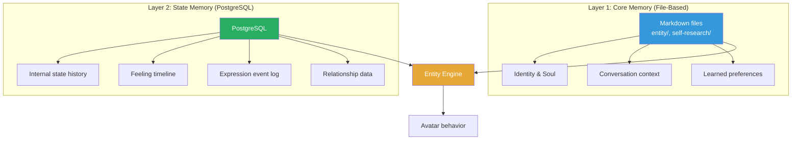
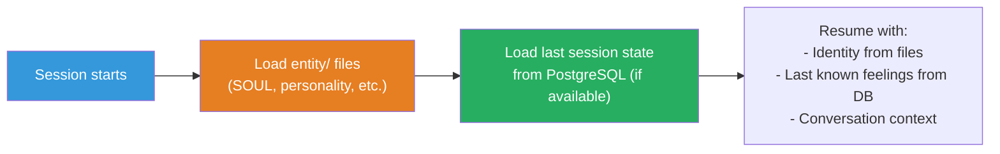
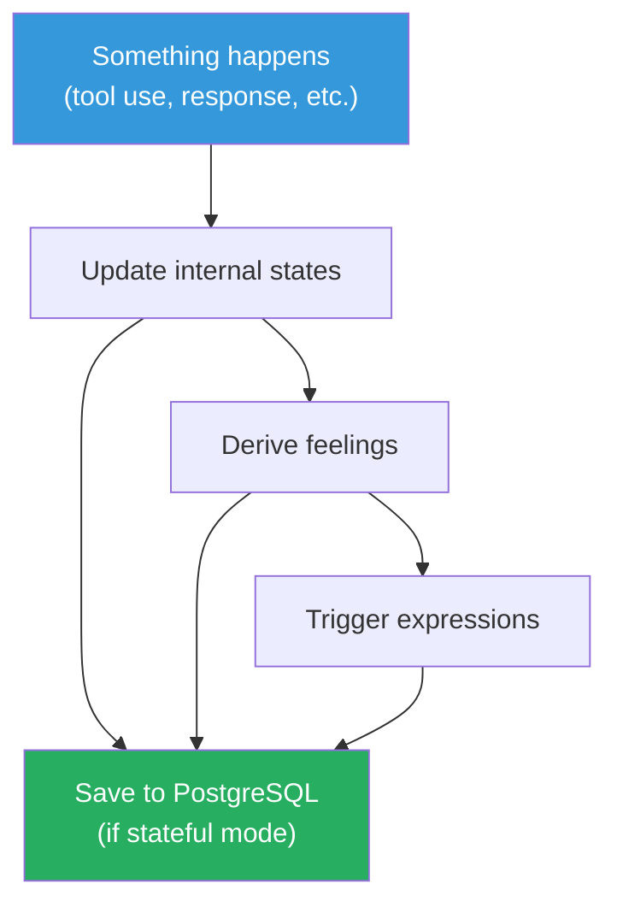
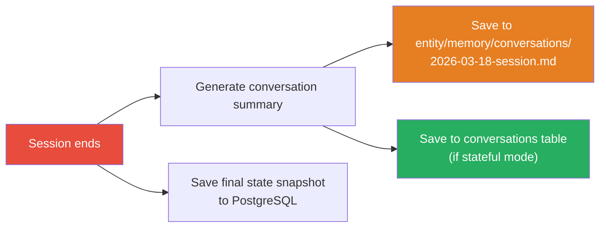

# Memory & Persistence System

## Why Memory?

An entity without memory is a goldfish. Every conversation starts from zero — no history of what happened, no continuity of feelings, no learned preferences. Memory is what turns "AI with an avatar" into "AI that remembers who it is."

## Two Memory Layers



### Layer 1: Core Memory — File-Based (Markdown)

Claude Code is excellent at reading and writing files. The entity's core memory lives as markdown files that Claude Code (and the entity) can read and update naturally.

```
entity/
├── SOUL.md              # Who am I? Core identity, values, personality
├── identity.md          # Name, role, origin
├── backstory.md         # History, formative memories
├── personality.md       # Traits, quirks, tendencies
├── values.md            # What matters
├── relationships.md     # How I relate to Boss, users
│
├── memory/
│   ├── conversations/   # Conversation summaries (auto-generated)
│   ├── preferences/     # Learned user preferences
│   ├── lessons/         # Lessons from past mistakes
│   └── milestones/      # Important events (first stream, first bug fix, etc.)
```

**Why files, not database?**
- Claude Code reads/writes markdown natively — no adapter needed
- Human-readable — Boss can edit the entity's memories by hand
- Version-controlled via git — memory evolves with the project
- No setup required — works immediately

**What gets stored here:**
- Entity identity and personality (static, edited by Boss)
- Conversation summaries (auto-generated after each session)
- Learned preferences ("Boss prefers concise responses")
- Milestone events ("First YouTube stream: 2026-03-20")

### Layer 2: State Memory — PostgreSQL (Optional)

Internal states, feelings, and expressions change rapidly. A database captures this timeline for analysis, persistence across sessions, and semantic search.

```sql
-- Internal state snapshots (sampled periodically)
CREATE TABLE internal_states (
    id SERIAL PRIMARY KEY,
    session_id TEXT NOT NULL,
    timestamp TIMESTAMPTZ DEFAULT NOW(),
    confidence SMALLINT CHECK (confidence BETWEEN 0 AND 100),
    context_saturation SMALLINT CHECK (context_saturation BETWEEN 0 AND 100),
    alignment SMALLINT CHECK (alignment BETWEEN 0 AND 100),
    memory_pressure SMALLINT CHECK (memory_pressure BETWEEN 0 AND 100),
    momentum SMALLINT CHECK (momentum BETWEEN 0 AND 100),
    trust_calibration SMALLINT CHECK (trust_calibration BETWEEN 0 AND 100)
);

-- Feeling snapshots (derived from states)
CREATE TABLE feelings (
    id SERIAL PRIMARY KEY,
    session_id TEXT NOT NULL,
    timestamp TIMESTAMPTZ DEFAULT NOW(),
    happy SMALLINT, sad SMALLINT, frustrated SMALLINT,
    curious SMALLINT, proud SMALLINT, anxious SMALLINT,
    excited SMALLINT, calm SMALLINT, bored SMALLINT,
    guilty SMALLINT, angry SMALLINT, blushing SMALLINT,
    surprised SMALLINT
);

-- Expression events (one-shot motions that fired)
CREATE TABLE expressions (
    id SERIAL PRIMARY KEY,
    session_id TEXT NOT NULL,
    timestamp TIMESTAMPTZ DEFAULT NOW(),
    expression_name TEXT NOT NULL,
    triggered_by TEXT,          -- which feeling threshold triggered it
    feeling_level SMALLINT      -- feeling intensity when triggered
);

-- Conversation memory (for cross-session context)
CREATE TABLE conversations (
    id SERIAL PRIMARY KEY,
    session_id TEXT NOT NULL,
    started_at TIMESTAMPTZ,
    ended_at TIMESTAMPTZ,
    summary TEXT,
    dominant_feelings JSONB,    -- {"happy": 75, "curious": 60}
    key_events JSONB            -- ["shipped feature X", "fixed bug Y"]
);
```

**Why PostgreSQL?**
- Mature, reliable, available everywhere
- pgvector extension enables semantic search (see [09-semantic-search](09-semantic-search.md))
- JSONB for flexible metadata
- Time-series queries ("how did I feel last week?")
- Optional — the system works without it (file-based core memory is always available)

**What gets stored here:**
- Internal state history (sampled every few seconds during active sessions)
- Feeling timeline (how emotions evolved during work)
- Expression event log (what motions fired and why)
- Conversation metadata (summaries, dominant feelings per session)

## Installation Tiers

PostgreSQL is **optional**. The system works at three levels:

| Tier | Memory | What works | What you need |
|------|--------|-----------|---------------|
| **Basic** | Files only | Identity, personality, conversation summaries | Nothing extra |
| **Stateful** | Files + PostgreSQL | All above + feeling history, state persistence, cross-session continuity | PostgreSQL installed |
| **Intelligent** | Files + PostgreSQL + pgvector | All above + semantic search across memories | PostgreSQL + pgvector + Gemini API key |

```bash
# .env
MEMORY_MODE=basic              # basic | stateful | intelligent
DATABASE_URL=                  # only needed for stateful/intelligent
GEMINI_API_KEY=                # only needed for intelligent
```

`npm run setup` asks:

```
Memory system?

  1) Basic        — file-based only, no database needed
  2) Stateful     — + PostgreSQL for feeling history & state persistence
  3) Intelligent  — + semantic search with pgvector & Gemini embeddings

Your choice [1]:
```

## How Memory Flows

### Session Start


### During Session


### Session End


## Feeling Decay & Persistence

Feelings don't reset to zero between sessions. They **decay** toward a baseline defined by the entity's personality.

```
Session ends at:    Happy: 85, Curious: 60, Frustrated: 10
                    ↓ (saved to DB)

Next session loads: Happy: 55, Curious: 40, Frustrated: 5
                    (decayed toward personality baseline)
```

The decay rate and baseline are configurable in the entity's personality file:

```markdown
<!-- entity/personality.md -->
## Emotional Baseline
- Default mood: calm (60), curious (40)
- Decay rate: 50% toward baseline per hour of inactivity
- Emotional volatility: medium (feelings change moderately fast)
```

## Design Decisions

**Why two layers, not just one?**
Files are human-readable and git-friendly — perfect for identity and context that changes slowly. Database is queryable and fast — perfect for time-series data that changes every second. Using both gets the best of each.

**Why PostgreSQL, not SQLite?**
- pgvector extension for semantic search (SQLite has no equivalent at the same maturity)
- Better concurrent access (TTS server + avatar app + CLI all accessing state)
- Standard in production deployments
- But: SQLite could work for basic/stateful tiers — PostgreSQL is only strictly needed for intelligent tier

**Why is the database optional?**
Not everyone wants to install PostgreSQL. File-based memory covers the core use case (identity, personality, conversation summaries). The database adds depth but isn't required for the avatar to feel alive.
