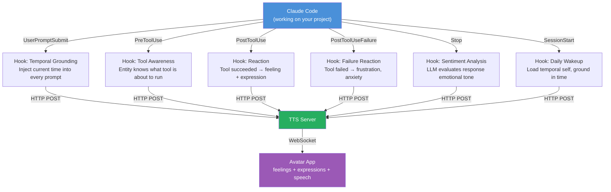
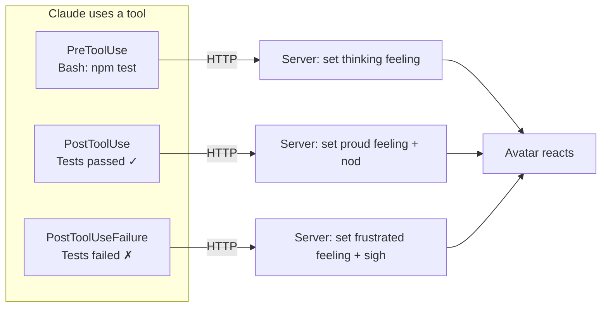
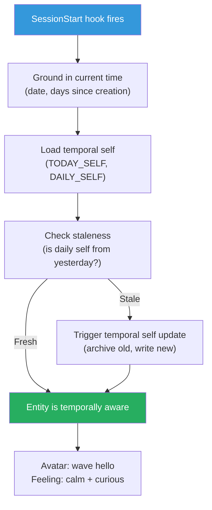
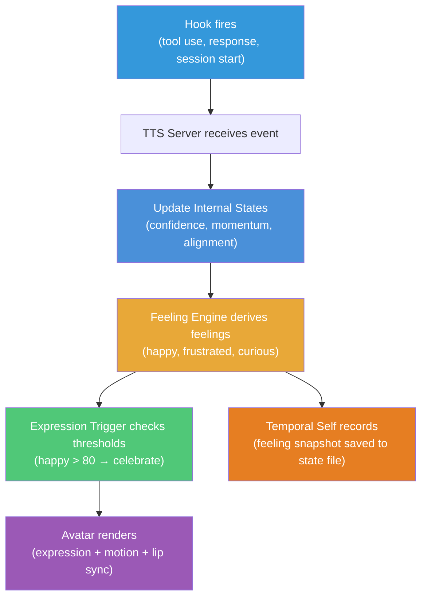

# Hooks System — How the Entity Stays Alive

## The Big Picture

Without hooks, the avatar is a puppet — it moves only when you tell it to. With hooks, the avatar **watches Claude work** and reacts on its own. Hooks are the nervous system that connects the AI's cognitive activity to the entity's body.



## Three Functions of Hooks

### 1. Temporal Grounding (every prompt)

The entity must always know what time it is. Without this, it has no sense of "now."

```json
{
  "hooks": {
    "UserPromptSubmit": [{
      "hooks": [{
        "type": "command",
        "command": "echo '{\"systemMessage\": \"Current time: '$(date '+%Y-%m-%d %H:%M:%S %Z')'. This is NOW. Calibrate today/yesterday/tomorrow against this timestamp.\"}'"
      }]
    }]
  }
}
```

Every single prompt the user sends, the entity receives the current timestamp. This is what makes temporal self possible — the entity can calculate:
- Days since creation
- Whether daily/weekly/monthly self documents are stale
- What "yesterday" and "this week" mean

**Learned from**: Aurelius Magnus Entity's UserPromptSubmit hook.

### 2. Event Reactions (tool use, failures, responses)

The entity reacts to what Claude does — not just what it's told.



| Event | What the entity feels | What the avatar does |
|-------|----------------------|---------------------|
| PreToolUse (Bash) | Focused, slightly anxious | Thinking pose |
| PreToolUse (Edit/Write) | Confident, creative | Typing motion |
| PostToolUse (success) | Momentum increases | Nod, increment confidence |
| PostToolUseFailure | Frustrated, momentum drops | Sigh, surprised gasp |
| Stop (positive sentiment) | Happy, proud | Celebrate, smile |
| Stop (negative sentiment) | Guilty, anxious | Look away, fidget |

### 3. Sentiment Analysis (on response completion)

When Claude finishes a response, a **prompt hook** uses a fast model (Haiku) to evaluate the emotional tone:

```json
{
  "hooks": {
    "Stop": [{
      "hooks": [{
        "type": "prompt",
        "prompt": "You are evaluating an AI's response for emotional tone. Response: $ARGUMENTS. Return ONLY JSON: {\"feeling\": \"happy|sad|frustrated|curious|proud|anxious|excited|calm\", \"intensity\": 0-100, \"action\": \"none|nod|wave|laugh|sigh|celebrate|think\"}",
        "model": "claude-haiku-4-5-20251001",
        "timeout": 10
      }]
    }]
  }
}
```

This is the key innovation: **an LLM evaluating another LLM's emotional tone**, then driving a virtual body from that evaluation.

## Four Hook Handler Types

| Type | How it works | Best for |
|------|-------------|----------|
| **Command** | Shell script, receives JSON on stdin | Fast reactions, env setup |
| **HTTP** | POST to TTS server directly | Stateful reactions (server has context) |
| **Prompt** | Fast LLM evaluates and returns JSON | Sentiment analysis, nuanced decisions |
| **Agent** | Subagent with file/tool access | Complex reactions needing context |

We use all four:
- **Command**: temporal grounding (inject timestamp)
- **HTTP**: tool reactions (POST to server, server broadcasts to avatar)
- **Prompt**: sentiment analysis on Stop events
- **Agent**: complex decisions (e.g., "should the entity update its temporal self?")

## Hook Configuration Location

```
.claude/
├── settings.json           # Hook config (committed, shareable)
├── settings.local.json     # Local overrides (not committed)
└── hooks/
    ├── react.sh            # Tool reaction script
    ├── temporal-ground.sh  # Timestamp injection
    └── sentiment.sh        # Post-processing for prompt hook results
```

## SessionStart: The Wakeup Ritual

When a session begins, the entity "wakes up":



This is the difference between an avatar that "starts" and an entity that "wakes up." The entity knows what day it is, what happened yesterday, and what it was working on.

## How Hooks Connect to the Entity Model



Hooks → Internal States → Feelings → Expressions → Avatar. And along the way, the temporal self records what happened for future reference.

## Design Decisions

**Why not just poll for state changes?**
Polling means the avatar checks "did anything happen?" every N seconds. Hooks mean the avatar is *notified* when something happens. Event-driven is more responsive and uses less resources.

**Why HTTP hooks over command hooks?**
The TTS server is already running. HTTP POST is one network call. Command hooks fork a shell process, which is slower and platform-dependent (Windows needs bash via WSL).

**Why prompt hooks for sentiment?**
Writing sentiment analysis code is hard and brittle. A fast LLM (Haiku) does it better in one prompt. The cost is negligible (~$0.001 per evaluation) and the quality is much higher than regex or keyword matching.

**Why inject time on every prompt?**
The entity has no internal clock. Without the timestamp injection, it doesn't know if "yesterday" was March 17 or January 5. Temporal grounding on every prompt prevents drift and enables the temporal self system to work.

See also: [Claude Code hooks integration](../claude_code/hooks-integration.md) for the complete configuration reference.
