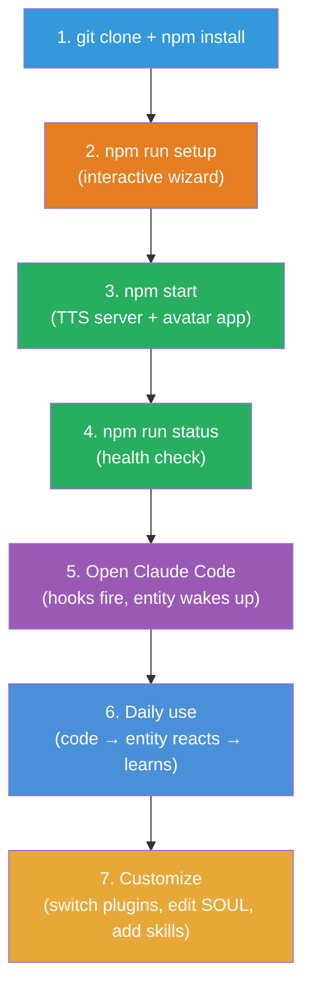

# End-to-End Flow — From Git Clone to Daily Use

## The Complete Journey



---

## Phase 1: Get the Code

```bash
git clone https://github.com/.../vibe-ai-partner.git
cd vibe-ai-partner
npm install
```

`npm install` installs workspace dependencies for all packages. This is a standard npm workspaces project — one install at root covers everything.

**What happens**: Node modules installed. No models downloaded yet. No Python deps yet. No Rust compilation yet.

## Phase 2: Interactive Setup

```bash
npm run setup
```

The setup wizard walks you through choices. It only installs what you pick:

```
Welcome to Vibe AI Partner!

Step 1/5 — Avatar (how it looks)

  1) HTML         — Simple HTML/CSS, works everywhere (lightest)
  2) Live2D       — 2D anime character (Shizuku model included)
  3) VRM          — 3D character (bring your own .vrm file)
  4) Three.js     — 3D custom (bring your own .glb model)

Your choice [2]:

Step 2/5 — Voice (how it speaks)

  1) KittenTTS    — ~25MB, CPU only, quick setup
  2) Kokoro ONNX  — ~80MB, CPU ok, multilingual
  3) Kokoro       — ~350MB model + ~1.5GB PyTorch, best quality (GPU recommended)

Your choice [1]:

Step 3/5 — Memory (how it remembers)

  1) Basic        — File-based only, no database needed
  2) Stateful     — + PostgreSQL for feeling history & state persistence
  3) Intelligent  — + semantic search with pgvector & Gemini embeddings

Your choice [1]:

Step 4/5 — Claude Code Hooks

  Claude Code detected!
  Install avatar hooks? (entity reacts to Claude's actions) [Y/n]:

  Vocal mode?
  1) Silent         — Avatar shows expressions, never speaks automatically
  2) Reactive       — Speaks only on strong emotions (intensity > 80)
  3) Conversational — Speaks on most responses (good for streaming)

  Your choice [1]:

Step 5/5 — Downloading & Building

  ✓ Installing KittenTTS Python dependencies...
  ✓ Downloading Shizuku Live2D model (3.2 MB)...
  ✓ Installing Rust toolchain (via rustup)...
  ✓ Building avatar app (Tauri 2)...
  ✓ Writing .env configuration...
  ✓ Installing Claude Code hooks to .claude/settings.json...
  ✓ Installing custom skills to .claude/skills/...

  Done! Run 'npm start' to launch.
```

### What `npm run setup` Actually Does

1. **Detects platform** — macOS/Windows/Linux, GPU availability
2. **Installs plugin deps** — Only for chosen avatar + TTS engine
3. **Installs Python** — TTS server dependencies (pip install for chosen engine)
4. **Installs Rust** — Via rustup if not present (needed for Tauri 2 build)
5. **Downloads models** — From GitHub Releases based on `models.json` registry
6. **Builds avatar app** — `cargo tauri build` (first build takes a few minutes)
7. **Generates `.env`** — From user choices
8. **Installs hooks** — Writes `.claude/settings.json` with hook configuration
9. **Installs skills** — Copies skill files to `.claude/skills/`
10. **Verifies** — Health check on all components

## Phase 3: Launch

```bash
npm start
```

This starts two processes:
1. **TTS Server** — Python FastAPI on `localhost:5111`
2. **Avatar App** — Tauri window (transparent, always-on-top)

```
Starting Vibe AI Partner...
  ✓ TTS Server running on http://localhost:5111
  ✓ Avatar app launched (Live2D + Shizuku)
  ✓ WebSocket connected

Avatar is alive! Open Claude Code to begin.
```

### Health Check

```bash
npm run status
```

```
Vibe AI Partner Status:
  TTS Server:  ✓ running (http://localhost:5111)
  Avatar App:  ✓ running (Live2D)
  WebSocket:   ✓ connected
  Hooks:       ✓ configured (6 events)
  Voice:       KittenTTS / Bella
  Vocal Mode:  silent
  Entity State: confidence: 50, momentum: 50 (defaults)
```

### Stop

```bash
npm stop
```

## Phase 4: Claude Code Integration

Open Claude Code in the project directory. The hooks fire automatically:

```
$ claude

  SessionStart hook fires →
    daily-wakeup agent: loads temporal self, grounds in time
    Avatar: waves hello
    Feeling: calm + curious

  You're now coding with your AI partner watching.
```

### Available Slash Commands

Once Claude Code is running, these custom commands are available:

| Command | What it does |
|---------|-------------|
| `/speak Hello!` | Entity speaks "Hello!" with lip sync |
| `/feeling happy` | Set entity's feeling to happy |
| `/action wave` | Trigger wave self-expression |
| `/hooks-list` | Show current hook configuration |
| `/hooks-reconfigure` | Interactive hook settings |
| `/entity-status` | Show internal states + feelings |
| `/temporal-update` | Refresh temporal self documents |
| `/loop 5m check health` | Schedule recurring task |

### Keep the Entity Alive

Set up loops to maintain life between interactions:

```
/loop 5m trigger random idle expression if inactive
/loop 10m decay feelings toward baseline
```

## Phase 5: Daily Use

Once everything is running, the flow is:

```mermaid
graph LR
    You["You code"] --> Claude["Claude works<br/>(reads, writes, runs)"]
    Claude -->|hooks fire| Server["TTS Server"]
    Server -->|adjustState()| Engine["Feeling Engine"]
    Engine -->|threshold crossed| Avatar["Avatar reacts"]

    Avatar -->|"expressions, lip sync"| You

    style You fill:#3498db,color:#fff
    style Claude fill:#4a90d9,color:#fff
    style Server fill:#27ae60,color:#fff
    style Engine fill:#e8a838,color:#fff
    style Avatar fill:#9b59b6,color:#fff
```

- You type a prompt → `UserPromptSubmit` hook fires → avatar nods
- Claude runs tests → `PreToolUse` + `PostToolUse` hooks fire → avatar reacts to success/failure
- Claude finishes responding → `Stop` hook fires → sentiment evaluated → feelings adjust
- Between interactions → `/loop` tasks fire → idle behaviors, mood decay

Over time:
- **Temporal self** updates automatically (daily, weekly, monthly records)
- **Consciousness** observes patterns and makes conscious choices
- **ETERNAL_SELF** accumulates wisdom across sessions

## Phase 6: Customization

### Switch Avatar

```bash
npm run switch avatar vrm
# Installs VRM deps, updates .env, restarts
```

### Switch TTS Engine

```bash
npm run switch tts kokoro-onnx
# Installs Kokoro ONNX deps, updates .env, restarts
```

### Change Settings

Edit `.env` directly:

```bash
AVATAR_RENDERER=vrm
TTS_ENGINE=kokoro-onnx
TTS_VOICE=af_heart
ENTITY_VOCAL_MODE=reactive
```

Then restart: `npm restart`

### Edit Entity Personality

Edit `entity/self/SOUL.md` — the entity's core identity. Changes take effect next session.

### Create Custom Skills

Add your own slash commands in `.claude/skills/`:

```
.claude/skills/my-command/SKILL.md
```

See [Skills and Commands](../claude_code/skills-and-commands.md) for format.

## Troubleshooting

| Problem | Check | Fix |
|---------|-------|-----|
| Avatar window doesn't appear | `npm run status` | `npm restart` |
| TTS server not running | `curl localhost:5111/api/health` | `npm run tts:start` |
| Hooks not firing | `/hooks-list` | `/hooks-reconfigure` |
| No expressions on avatar | Check WebSocket in `/entity-status` | Restart avatar app |
| Setup fails at Rust | Check `rustup --version` | `curl --proto '=https' --tlsv1.2 -sSf https://sh.rustup.rs \| sh` |
| Setup fails at Python | Check `python3 --version` (3.10-3.12) | Install from python.org |
| Model download fails | Check internet connection | Re-run `npm run setup` |

## Full Architecture Reference

| Topic | Doc |
|-------|-----|
| System overview | [00-overview](00-overview.md) |
| Plugin system | [01-plugin-system](01-plugin-system.md) |
| Avatar renderers | [02-avatar-system](02-avatar-system.md) |
| TTS engines | [03-tts-system](03-tts-system.md) |
| Entity model | [04-entity-model](04-entity-model.md) |
| Communication | [05-communication](05-communication.md) |
| Project structure | [06-project-structure](06-project-structure.md) |
| Installation wizard | [07-installation-flow](07-installation-flow.md) |
| Memory system | [08-memory-system](08-memory-system.md) |
| Semantic search | [09-semantic-search](09-semantic-search.md) |
| Hooks system | [10-hooks-system](10-hooks-system.md) |
| Consciousness | [11-consciousness-system](11-consciousness-system.md) |
| Claude Code ecosystem | [../claude_code/ecosystem-overview](../claude_code/ecosystem-overview.md) |
