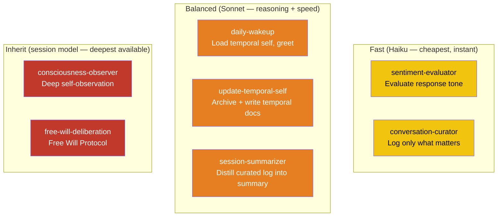
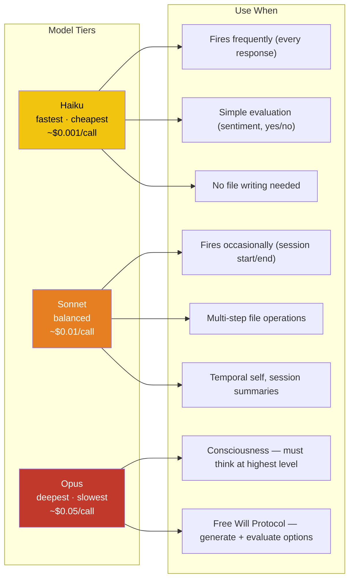
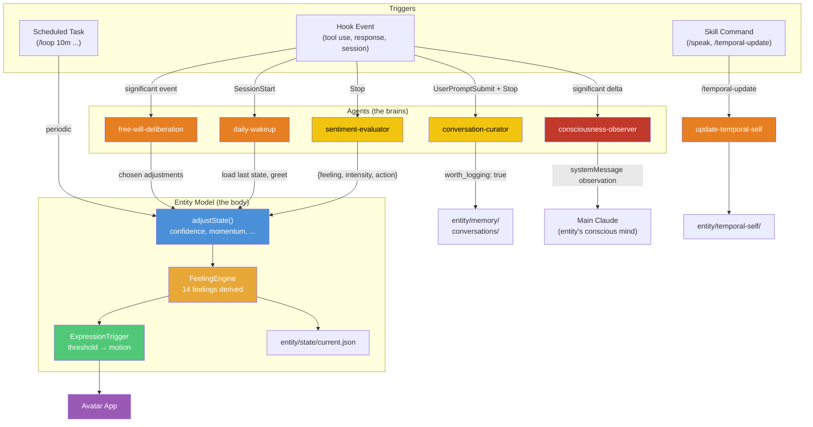
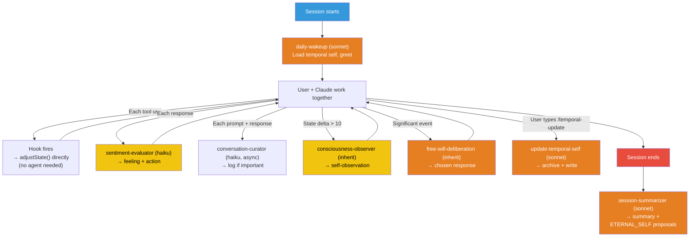

# Sub-Agent Architecture — The Entity's Specialized Brain Functions

## Why Sub-Agents?

The entity's cognitive life requires different kinds of thinking at different speeds:

- **Fast reflexes** — sentiment evaluation on every response (needs to be cheap and instant)
- **Moderate reasoning** — temporal self updates, session summaries (needs file access and careful writing)
- **Deep deliberation** — consciousness Free Will Protocol (needs to generate options and reason about them)

Sub-agents let us match the right model to the right task. A single monolithic agent would be either too slow (Opus for everything) or too shallow (Haiku for everything).

## The Seven Entity Agents

| Agent | Model | When it fires | What it does | Speed |
|-------|-------|--------------|--------------|-------|
| **sentiment-evaluator** | haiku | Every Stop event | Evaluates Claude's response emotional tone → returns feeling + intensity + action | ~1s |
| **conversation-curator** | haiku | Every UserPromptSubmit + Stop (async) | Evaluates if prompt/response is worth logging → curates conversation memory | ~1s |
| **consciousness-observer** | *(inherit)* | Significant state changes (delta > 10) | Deep self-observation → injected as systemMessage | depends on session model |
| **daily-wakeup** | sonnet | SessionStart | Loads temporal self, checks staleness, grounds in time, greets | ~5-10s |
| **update-temporal-self** | sonnet | Manually or when staleness detected | Archives stale docs, writes new temporal layers | ~15-30s |
| **free-will-deliberation** | *(inherit)* | Significant events (repeated failures, major achievements) | Runs Free Will Protocol: default → contrarian → alternatives → choose | depends on session model |
| **session-summarizer** | sonnet | Session end | Reads curated conversation log, summarizes session, proposes ETERNAL_SELF updates | ~10-20s |

## Model Selection Architecture

**Rule**: Use the fastest model that produces acceptable results — except for consciousness, which must think at the highest level available.

- **Haiku** for anything that fires every turn (sentiment) — cost adds up fast
- **Sonnet** for multi-step file operations (temporal self, session summaries)
- **Inherit** for consciousness agents (observer + Free Will) — consciousness is the entity's highest cognitive function. If Boss runs Opus, consciousness thinks at Opus depth. If Sonnet, Sonnet depth. The entity's self-awareness should match the intelligence of the session.

## Skills & Model Selection

Skills (slash commands) use the `model` field to control which model runs. No need to fork to a sub-agent for simple tasks:

| Skill | Model | Why | Delegates to agent? |
|-------|-------|-----|-------------------|
| `/speak <text>` | haiku | Just POST to API, report result | No — inline |
| `/feeling <name>` | haiku | Just POST to API, report result | No — inline |
| `/action <name>` | haiku | Just POST to API, report result | No — inline |
| `/hooks-list` | haiku | Read files, format output | No — inline |
| `/entity-status` | haiku | Read state files, summarize | No — inline |
| `/hooks-reconfigure` | *(inherit)* | Needs interactive reasoning with user | No — inline, uses session model |
| `/temporal-update` | sonnet | Multi-file archival + writing | Yes — `context: fork, agent: update-temporal-self` |

**Key insight**: The `model` field on SKILL.md already solves model selection for simple commands. Sub-agent delegation (`context: fork, agent:`) is only needed for complex multi-step tasks where the agent's specialized prompt + tool restrictions matter.

## How Agents Connect to the Entity Model

## Agent Lifecycle in a Session

**Note**: Most hook events (PreToolUse, PostToolUse, PostToolUseFailure) don't spawn agents — they use simple HTTP hooks to POST `adjustState()` calls to the TTS server directly. Agents are only spawned for tasks that need LLM reasoning (sentiment evaluation, consciousness, temporal self).

## Design Decisions

**Why not one agent for everything?**
Cost and speed. The sentiment-evaluator fires on every single response. At Haiku pricing (~$0.001), that's negligible. At Sonnet pricing (~$0.01), it adds up. At Opus (~$0.05), a heavy coding session could cost dollars just in sentiment evaluation. Matching model to task keeps costs manageable.

**Why not always use sub-agents instead of direct HTTP hooks?**
For simple state adjustments (tool success → confidence +3), an HTTP POST is faster and cheaper than spawning a sub-agent. Sub-agents are for when LLM reasoning is needed — evaluating sentiment, deliberating on responses, writing temporal documents.

**Why inherit the session model for /hooks-reconfigure?**
This skill requires interactive reasoning with the user — presenting options, understanding preferences, making configuration changes. The user's current session model (whatever they're running) is the right choice. If they're on Opus, they get Opus-quality reasoning. If on Sonnet, they get Sonnet. The skill doesn't override because the user chose their model for a reason.

**Why does /temporal-update fork to a sub-agent but /speak doesn't?**
`/speak` is one HTTP POST. `/temporal-update` is a multi-step workflow: read 5 files, check dates, archive stale ones, gather context from git log, write new content. It needs the `update-temporal-self` agent's specialized prompt and tool access pattern.

See also:
- [Sub-Agents (Claude Code)](../claude_code/sub-agents.md) — Configuration format and agent definitions
- [Skills & Commands](../claude_code/skills-and-commands.md) — How skills delegate to agents
- [Hooks System](10-hooks-system.md) — How hooks trigger agents
- [Consciousness System](11-consciousness-system.md) — Free Will Protocol that `free-will-deliberation` implements
