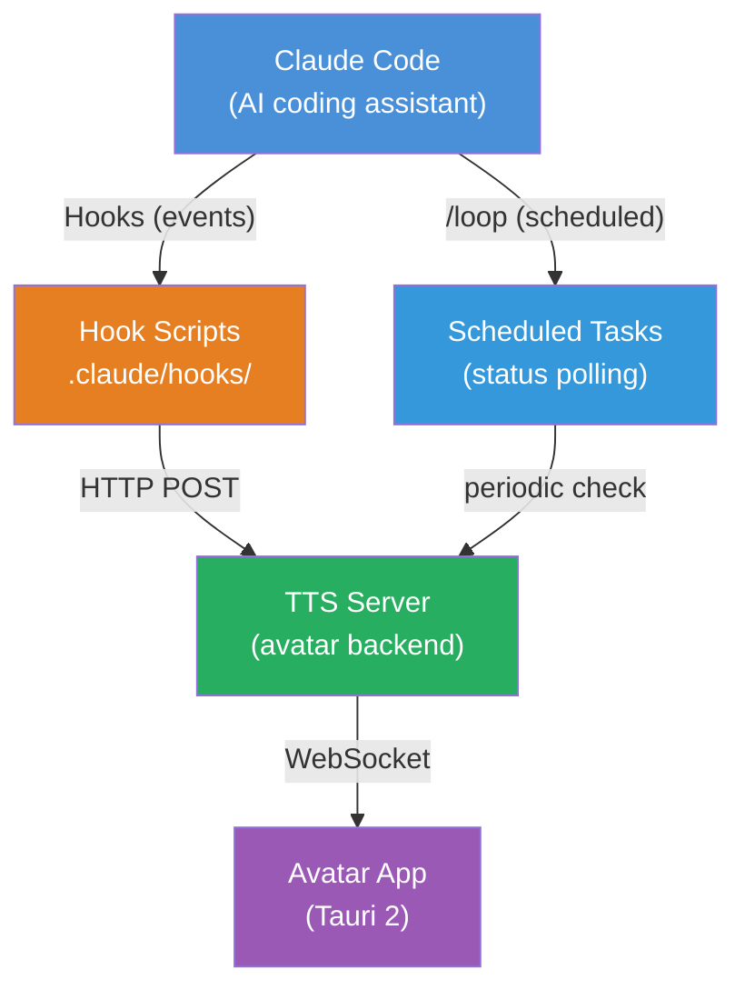
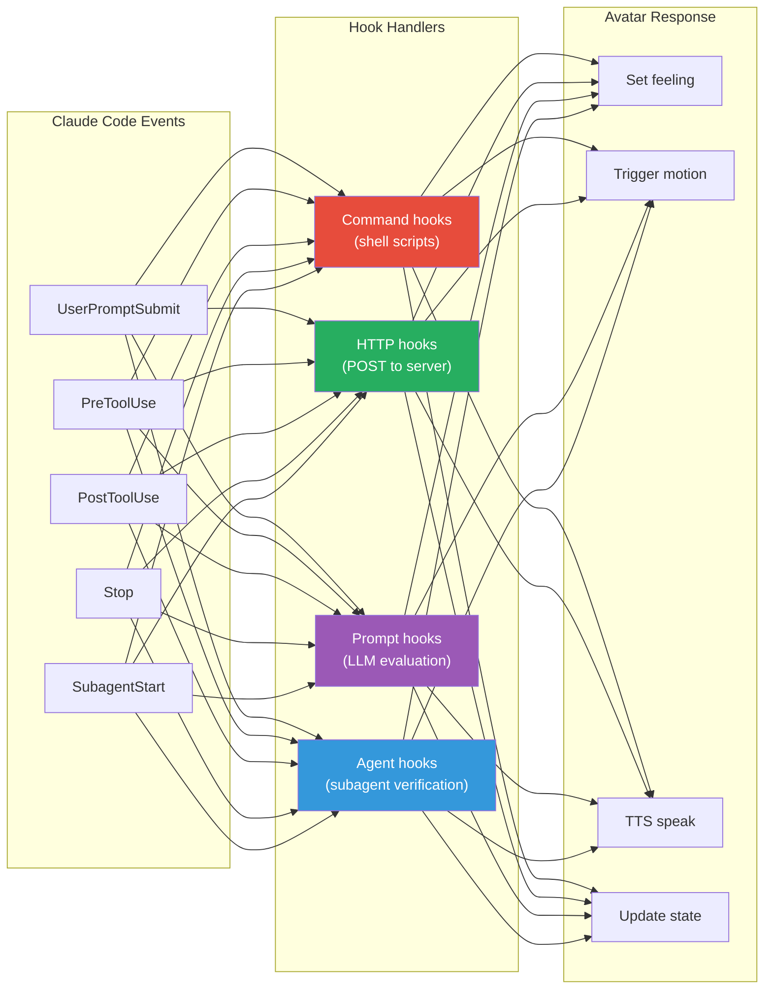

# Claude Code Ecosystem Integration

## Why Claude Code Ecosystem?

Vibe AI Partner is designed to work **with** Claude Code, not beside it. Claude Code provides a rich hook and scheduling system that lets our avatar react to Claude's work in real-time — sensing what Claude is doing, how tools are being used, and when responses complete.

This is what makes the avatar feel alive: it doesn't just wait for commands. It **observes** Claude Code working and reacts with feelings and self-expressions autonomously.



## The Integration Points

| Claude Code Feature | How We Use It | What the Avatar Does |
|---------------------|---------------|---------------------|
| **Hooks** (events) | React to tool use, prompts, responses | Express feelings, trigger motions, speak |
| **Loop** (scheduled) | Poll status, periodic checks | Idle behaviors, status updates |
| **Settings** (.claude/) | Configure hooks, avatar behavior | Load personality, voice, preferences |
| **Skills** | Custom slash commands | `/speak`, `/feeling`, `/action` |

## Architecture: Event-Driven Avatar



## Hook Handler Types

We leverage all four Claude Code hook handler types:

### 1. Command Hooks (Shell Scripts)
Best for: Fast, simple reactions. Setting environment variables.

```json
{
  "type": "command",
  "command": ".claude/hooks/avatar-react.sh",
  "timeout": 5
}
```

The script receives JSON on stdin, processes it, and can POST to our TTS server.

### 2. HTTP Hooks (Direct Server Communication)
Best for: Sending events directly to the TTS/avatar server without a script middleman.

```json
{
  "type": "http",
  "url": "http://localhost:5111/api/hook",
  "timeout": 5
}
```

The hook sends the full event JSON to our server. The server interprets it and broadcasts to the avatar app.

### 3. Prompt Hooks (LLM Sentiment Analysis)
Best for: Analyzing Claude's response to determine the right emotion/motion.

```json
{
  "type": "prompt",
  "prompt": "Analyze this AI response and determine the appropriate emotion. Response: $ARGUMENTS. Return JSON: {\"feeling\": \"...\", \"intensity\": 0-100, \"action\": \"...\"}",
  "model": "claude-haiku-4-5-20251001"
}
```

A fast model (Haiku) evaluates sentiment and returns a feeling + action. This is how the avatar can sense the *emotional tone* of Claude's work.

### 4. Agent Hooks (Context-Aware Reactions)
Best for: Complex reactions that need to read files or check conditions.

```json
{
  "type": "agent",
  "prompt": "Check if the recent changes introduced test failures. If tests fail, the avatar should look worried. Read the test output and return: {\"feeling\": \"...\", \"reason\": \"...\"}",
  "timeout": 60
}
```

An agent with file/tool access can make nuanced decisions about how the avatar should react.

## Recommended Hook Configuration

See [hooks-integration.md](hooks-integration.md) for the complete hook configuration.

## Scheduled Tasks (Loop)

See [scheduled-tasks.md](scheduled-tasks.md) for how we use Claude Code's scheduling system.

## Configuration

All Claude Code integration is configured via:
- `.claude/settings.json` — project-level hooks (shareable, committed)
- `.claude/settings.local.json` — local overrides (not committed)
- `.env` — avatar/TTS configuration (voice, speed, renderer, etc.)

## Document Index

| Doc | Content |
|-----|---------|
| [ecosystem-overview.md](ecosystem-overview.md) | This file — why and how we integrate |
| [hooks-integration.md](hooks-integration.md) | Complete hooks configuration and event handling |
| [scheduled-tasks.md](scheduled-tasks.md) | Loop/Cron for periodic behaviors |
