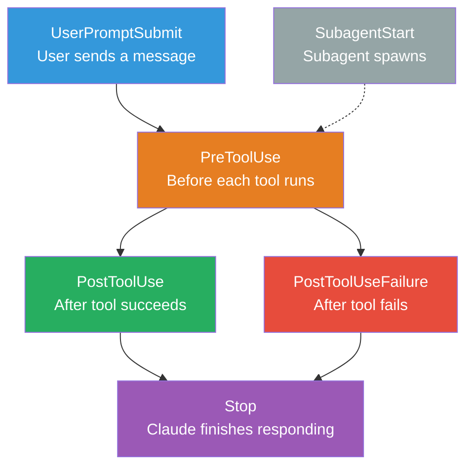
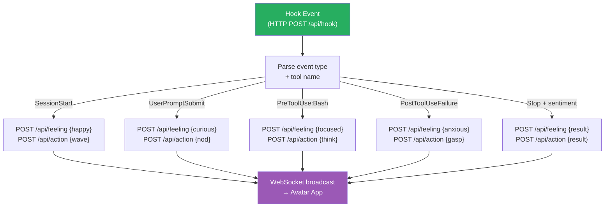

# Claude Code Hooks Integration

## Overview

Claude Code hooks are event listeners that fire during Claude's workflow. We use them to make the avatar react to Claude's actions in real-time — the avatar watches Claude work and responds with feelings, motions, and speech.

## Hook Events We Use

### Event Lifecycle



### Event → Avatar Reaction Mapping

| Event | When | Avatar Reaction |
|-------|------|----------------|
| **SessionStart** | Session begins | Wave hello, set calm feeling |
| **UserPromptSubmit** | User sends message | Nod (listening), set curious feeling |
| **PreToolUse (Bash)** | About to run command | Thinking pose, set focused feeling |
| **PreToolUse (Edit/Write)** | About to edit code | Typing motion, set confident feeling |
| **PostToolUse** | Tool succeeded | Nod, increment momentum state |
| **PostToolUseFailure** | Tool failed | Surprised gasp, set anxious feeling |
| **SubagentStart** | Subagent spawns | Head tilt (delegating), stay calm |
| **Stop** | Response complete | Evaluate sentiment → express appropriate feeling |

## Hook Input Format

Every hook receives JSON on stdin (command hooks) or as POST body (HTTP hooks):

```json
{
  "session_id": "abc123",
  "transcript_path": "/path/to/transcript.jsonl",
  "cwd": "/project/root",
  "hook_event_name": "PreToolUse",
  "tool_name": "Bash",
  "tool_input": {
    "command": "npm test",
    "description": "Run tests"
  }
}
```

Key fields by event:

| Event | Key Fields |
|-------|-----------|
| SessionStart | `session_trigger` ("startup", "resume", "clear", "compact") |
| UserPromptSubmit | `user_prompt` (the user's message text) |
| PreToolUse | `tool_name`, `tool_input` |
| PostToolUse | `tool_name`, `tool_input`, `tool_output` |
| PostToolUseFailure | `tool_name`, `tool_input`, `tool_error` |
| Stop | `stop_hook_active_tool_name`, `stop_response` |
| SubagentStart | `agent_type`, `agent_id` |

## Hook Output Format

Hooks communicate back via JSON on stdout (command) or response body (HTTP):

### Simple Response (Allow/Continue)
```json
{
  "continue": true
}
```

### Response with Side Effects
```json
{
  "continue": true,
  "suppressOutput": true
}
```

### Blocking Response (Stop Claude)
```json
{
  "decision": "block",
  "reason": "Safety check failed",
  "continue": false,
  "stopReason": "Hook blocked this action"
}
```

### PreToolUse Specific (Can Modify Input)
```json
{
  "hookSpecificOutput": {
    "hookEventName": "PreToolUse",
    "permissionDecision": "allow",
    "additionalContext": "This command is safe to run"
  }
}
```

## Recommended Configuration

### .claude/settings.json

```json
{
  "hooks": {
    "SessionStart": [
      {
        "matcher": "startup",
        "hooks": [
          {
            "type": "http",
            "url": "http://localhost:5111/api/hook",
            "timeout": 5
          }
        ]
      }
    ],

    "UserPromptSubmit": [
      {
        "hooks": [
          {
            "type": "http",
            "url": "http://localhost:5111/api/hook",
            "timeout": 3
          }
        ]
      }
    ],

    "PreToolUse": [
      {
        "matcher": "Bash",
        "hooks": [
          {
            "type": "http",
            "url": "http://localhost:5111/api/hook",
            "timeout": 3
          }
        ]
      },
      {
        "matcher": "Edit|Write",
        "hooks": [
          {
            "type": "http",
            "url": "http://localhost:5111/api/hook",
            "timeout": 3
          }
        ]
      }
    ],

    "PostToolUse": [
      {
        "hooks": [
          {
            "type": "http",
            "url": "http://localhost:5111/api/hook",
            "timeout": 3
          }
        ]
      }
    ],

    "PostToolUseFailure": [
      {
        "hooks": [
          {
            "type": "http",
            "url": "http://localhost:5111/api/hook",
            "timeout": 3
          }
        ]
      }
    ],

    "Stop": [
      {
        "hooks": [
          {
            "type": "prompt",
            "prompt": "Analyze this AI response sentiment. Response: $ARGUMENTS. Return ONLY JSON: {\"feeling\": \"happy|sad|frustrated|curious|proud|anxious|excited|calm|bored|guilty|angry|surprised\", \"intensity\": 0-100, \"action\": \"none|nod|wave|laugh|sigh|celebrate|think\", \"speak\": \"optional short summary for TTS\"}",
            "model": "claude-haiku-4-5-20251001",
            "timeout": 10
          }
        ]
      }
    ]
  }
}
```

### How the Server Handles Hook Events

The TTS server receives hook events and translates them to avatar commands:



## Why HTTP Hooks Over Command Hooks?

| Factor | Command (shell) | HTTP (server) |
|--------|----------------|---------------|
| Cross-platform | Needs bash (Windows: WSL) | Works everywhere |
| Latency | Fork process + parse | Single HTTP POST |
| State | Stateless per invocation | Server has full state |
| Debugging | Print to stderr | Server logs |
| Dependencies | Shell scripting | Already running server |

We prefer HTTP hooks because our TTS server is already running. No need for intermediate shell scripts.

## Why Prompt Hooks for Stop Event?

The `Stop` event carries Claude's full response. A prompt hook can analyze sentiment using a fast model (Haiku) without us writing sentiment analysis code. The model returns structured JSON with feeling + action, which the server forwards to the avatar.

This is the **key innovation**: using an LLM to evaluate another LLM's emotional tone, then driving a virtual body from that evaluation.

## Exit Codes (Command Hooks)

If using command hooks as fallback:

| Exit Code | Meaning | Effect |
|-----------|---------|--------|
| 0 | Success | Parse JSON output, continue |
| 2 | Block | Stop Claude, show stderr as error |
| Other | Error | Log warning, continue |

## Environment Variables Available in Hooks

| Variable | Value |
|----------|-------|
| `$CLAUDE_PROJECT_DIR` | Project root directory |
| `$CLAUDE_ENV_FILE` | Path to write env vars (SessionStart only) |
| `$CLAUDE_PLUGIN_ROOT` | Plugin directory (if from plugin) |
| `$CLAUDE_PLUGIN_DATA` | Plugin data directory (if from plugin) |
