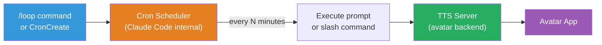
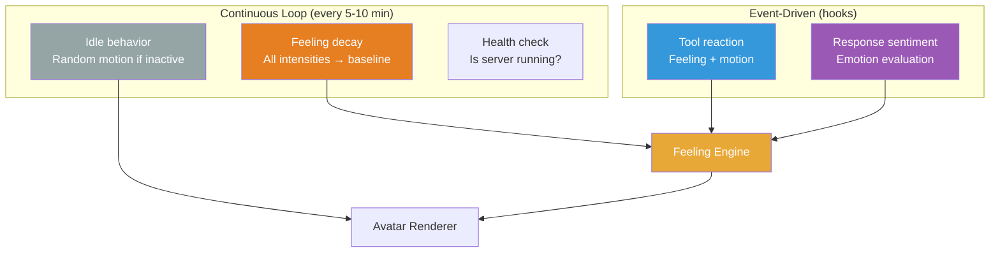

# Scheduled Tasks (Loop / Cron)

## Overview

Claude Code's `/loop` command and cron system lets us schedule recurring tasks — periodic status checks, idle behaviors, and timed events that keep the avatar feeling alive even when Claude isn't actively responding.

## How It Works



## Usage Syntax

### Interval-based
```
/loop 5m check avatar health and trigger idle behavior
/loop 30m /speak "Still here, Boss!"
/loop 10m check if tests passed and update avatar mood
```

### Time-based (one-shot)
```
remind me at 3pm to push the release
in 45 minutes, check integration tests
```

### Cron expression
```
*/5 * * * *    → Every 5 minutes
0 * * * *      → Every hour
0 9 * * 1-5   → Weekdays at 9am
```

## Use Cases for Avatar

### 1. Idle Behavior Loop
Keep the avatar alive when Claude is idle:
```
/loop 5m Check avatar state. If idle for more than 5 minutes, trigger a random idle expression (yawn, stretch, look around). POST to http://localhost:5111/api/action with a random idle motion.
```

### 2. Status Polling
Monitor long-running processes:
```
/loop 2m Check if the build at CI is done. If finished, trigger celebrate or frustrated depending on result.
```

### 3. Mood Decay
Feelings should fade over time:
```
/loop 10m POST to http://localhost:5111/api/decay to gradually reduce all feeling intensities toward baseline. This simulates emotional cooling.
```

### 4. Periodic Greeting
Stream-friendly periodic engagement:
```
/loop 30m /speak "Still coding, Boss! How's it going?"
```

## Task Management

| Action | How |
|--------|-----|
| Create | `/loop 5m <prompt>` or `CronCreate` tool |
| List | Ask "what scheduled tasks do I have?" or `CronList` tool |
| Cancel | Ask "cancel the idle behavior loop" or `CronDelete` tool |

## Constraints

- **Max 50 tasks** per session
- **Auto-expire** after 3 days (recurring tasks)
- **Only run while session is open** and Claude is idle
- **Jitter**: ±10% of period (max 15 min) to avoid thundering herd
- **One-shot tasks**: ±90 seconds if scheduled for :00 or :30

## Integration with Entity Model

Scheduled tasks create a natural rhythm for the avatar:



**Event-driven** (hooks) = reactive, immediate response to Claude's actions
**Scheduled** (loop) = proactive, ongoing life simulation

Together they create an entity that both **reacts** to stimuli and **lives** between stimuli.
