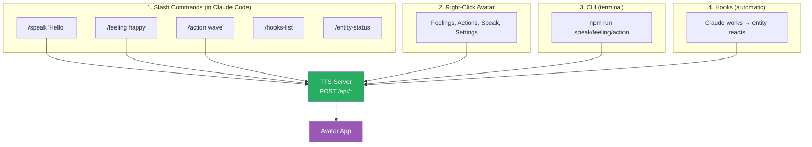

# Skills & Custom Commands

## What Are Skills?

Skills are reusable prompts and workflows stored as `SKILL.md` files. They extend Claude Code with custom slash commands — type `/speak Hello` and the entity speaks. Type `/hooks-list` and see your current hook configuration.

Skills are the primary way **users interact with the entity** inside Claude Code.

## Configuration Format

Each skill lives in its own directory with a `SKILL.md` file:

```
.claude/skills/
├── speak/
│   └── SKILL.md
├── feeling/
│   └── SKILL.md
├── action/
│   └── SKILL.md
├── hooks-list/
│   └── SKILL.md
├── hooks-reconfigure/
│   └── SKILL.md
├── entity-status/
│   └── SKILL.md
└── temporal-update/
    └── SKILL.md
```

### SKILL.md Format

```yaml
---
name: my-skill
description: What this skill does and when to use it
argument-hint: "[required-arg] [optional-arg]"
user-invocable: true
disable-model-invocation: false
allowed-tools: Read, Bash
model: haiku
---

Instructions for Claude when this skill is invoked...
```

### Key Fields

| Field | Required | Description |
|-------|----------|-------------|
| `name` | yes | Skill identifier (lowercase, hyphens). Becomes the `/command` name |
| `description` | yes | When to use. Claude reads this to decide auto-invocation |
| `argument-hint` | no | Shown in UI as placeholder (e.g., `"[text to speak]"`) |
| `user-invocable` | no | `true` = appears in `/` menu (default: true) |
| `disable-model-invocation` | no | `true` = only user can invoke, Claude cannot auto-invoke |
| `allowed-tools` | no | Tools Claude can use without permission when skill is active |
| `model` | no | Model to use (`haiku`, `sonnet`, `opus`) |
| `context` | no | `fork` = run in isolated subagent context |
| `agent` | no | Which sub-agent type to use with `context: fork` |

### String Substitutions

| Variable | Value |
|----------|-------|
| `$ARGUMENTS` | All arguments passed to the skill |
| `$1`, `$2`, `$ARGUMENTS[0]` | Specific arguments by index |
| `${CLAUDE_SESSION_ID}` | Current session ID |
| `${CLAUDE_SKILL_DIR}` | Directory containing the SKILL.md |

### Storage Locations

| Location | Scope | Priority |
|----------|-------|----------|
| `.claude/skills/` | Project-specific | Highest |
| `~/.claude/skills/` | All projects | Lower |

### Who Can Invoke?

| Config | User types `/skill` | Claude auto-invokes |
|--------|--------------------|--------------------|
| Default (both unset) | Yes | Yes |
| `disable-model-invocation: true` | Yes | No |
| `user-invocable: false` | No | Yes |

## Bundled Skills (Built into Claude Code)

These come with Claude Code — no installation needed:

| Skill | Usage | Purpose |
|-------|-------|---------|
| `/loop <interval> <prompt>` | `/loop 5m check health` | Run prompt on schedule |
| `/batch <instruction>` | `/batch add tests to all utils` | Parallel large-scale changes |
| `/simplify [focus]` | `/simplify` | Review recent changes for code quality |
| `/debug [description]` | `/debug hooks not firing` | Troubleshoot current session |

## Our Entity Custom Commands

### /speak — Speak text aloud

```yaml
---
name: speak
description: Speak text with avatar lip sync via TTS. Use when the user asks to speak, say, or read text aloud.
argument-hint: "[text to speak]"
user-invocable: true
allowed-tools: Bash
model: haiku
---

Speak the following text via the TTS server:

```bash
curl -s -X POST http://localhost:5111/api/speak \
  -H "Content-Type: application/json" \
  -d '{"text": "$ARGUMENTS"}'
```

If the server is not running, tell the user to run `npm start` first.
```

**Usage**: `/speak Hello, I'm working on the authentication module`

### /feeling — Set a feeling

```yaml
---
name: feeling
description: Set the entity's feeling. Use when user wants to change mood or emotional state.
argument-hint: "[feeling name]"
user-invocable: true
allowed-tools: Bash
model: haiku
---

Set the entity's feeling via the TTS server. Valid feelings: happy, sad, frustrated, curious, proud, anxious, excited, calm, bored, guilty, angry, blushing, surprised.

```bash
curl -s -X POST http://localhost:5111/api/feeling \
  -H "Content-Type: application/json" \
  -d '{"name": "$ARGUMENTS"}'
```
```

**Usage**: `/feeling happy` or `/feeling curious`

### /action — Trigger self-expression

```yaml
---
name: action
description: Trigger a self-expression motion on the avatar. Use when user wants the avatar to perform a gesture.
argument-hint: "[action name]"
user-invocable: true
allowed-tools: Bash
model: haiku
---

Trigger a self-expression on the avatar. Valid actions: wave, nod, laugh, sigh, think, celebrate, gasp, bow, head-tilt, fist-pump, cry, tremble.

```bash
curl -s -X POST http://localhost:5111/api/action \
  -H "Content-Type: application/json" \
  -d '{"name": "$ARGUMENTS"}'
```
```

**Usage**: `/action wave` or `/action celebrate`

### /hooks-list — Show hook configuration

```yaml
---
name: hooks-list
description: Show current Claude Code hook configuration for the entity system
user-invocable: true
disable-model-invocation: true
allowed-tools: Read
model: haiku
---

Read and display the current hook configuration:

1. Read `.claude/settings.json` and show the `hooks` section.
2. Read `.claude/settings.local.json` if it exists (local overrides).
3. Read the `.env` file for `ENTITY_VOCAL_MODE` and `TTS_SERVER_PORT`.
4. Summarize: which events have hooks, what type (command/http/prompt/agent), timeouts.
5. Show whether the TTS server is reachable: `curl -s http://localhost:5111/api/health`
```

**Usage**: `/hooks-list`

### /hooks-reconfigure — Reconfigure hooks interactively

```yaml
---
name: hooks-reconfigure
description: Interactive hook reconfiguration — enable/disable hooks, change timeouts, switch vocal mode
user-invocable: true
disable-model-invocation: true
allowed-tools: Read, Write, Bash
model: sonnet
---

Help the user reconfigure their entity hooks. Present options and make changes:

1. Read current `.claude/settings.json` hooks config.
2. Read `.env` for ENTITY_VOCAL_MODE.
3. Ask the user what they want to change:
   - Enable/disable specific hook events (SessionStart, PreToolUse, PostToolUse, etc.)
   - Change hook timeouts
   - Switch vocal mode (silent / reactive / conversational)
   - Change TTS server port
   - Reset to defaults
4. Apply changes to `.claude/settings.json` and/or `.env`.
5. Verify: check TTS server health after changes.

Keep it conversational — guide the user through choices.
```

**Usage**: `/hooks-reconfigure`

### /entity-status — Show current state

```yaml
---
name: entity-status
description: Show the entity's current internal states, feelings, and consciousness observations
user-invocable: true
disable-model-invocation: true
allowed-tools: Read, Bash
model: haiku
---

Display the entity's current status:

1. Read `entity/state/current.json` — show internal states and feelings.
2. Read `entity/consciousness/observations.md` — show recent self-observations.
3. Read `entity/temporal-self/TODAY_SELF.md` — show today's snapshot.
4. Check TTS server health: `curl -s http://localhost:5111/api/health`
5. Format as a clear status report.
```

**Usage**: `/entity-status`

### /temporal-update — Refresh temporal self

```yaml
---
name: temporal-update
description: Manually trigger a temporal self refresh — check staleness, archive old docs, write new ones
user-invocable: true
disable-model-invocation: true
context: fork
agent: update-temporal-self
---

Trigger the update-temporal-self sub-agent to refresh the entity's temporal awareness.
Pass the current date as context: $ARGUMENTS
```

**Usage**: `/temporal-update`

## Four Ways Users Interact

Skills are one of four interaction channels. All converge at the same TTS server API:



See also:
- [Sub-Agents](sub-agents.md) — Specialized agents that skills can delegate to
- [Scheduled Tasks](scheduled-tasks.md) — `/loop` for periodic behaviors
- [Hooks Integration](hooks-integration.md) — Automatic reactions to Claude's work
