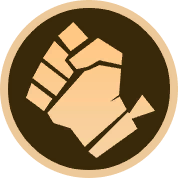
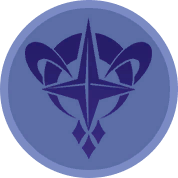

# Synergies (MCGG S6)

Team bonuses that activate at member-count breakpoints. Two axes: **class** (role: Marksman, Mage,
Defender, ...) and **faction** (origin: Emberlord, Astro Power, ...). A hero usually has one class
and one faction synergy. Field enough of the same synergy to reach a breakpoint and its effect turns
on, stronger at each tier: class synergies cap at [2]/[4]/[6] (two cap at [2]/[3]), factions reach up
to [10].

**Raising a synergy count beyond deployed members:**
- **Blessing** adds +1 to one of a hero's synergy counts (from combining a 2-Star hero, Round II-1
  onward; see [season information](../encyclopedia/season_information.md)).
- **Synergy Magic Crystal** also grants +1 to a synergy count.

Per-tier values are exact from the in-game Synergy Guide (S6, captured 2026-06-28). Source and
naming notes: [source_map](source_map.md).

## Class synergies

###  Bruiser  (class · 2/4/6)
**Members:** Gatotkaca, Belerick, Badang, Dyrroth, Masha, Yu Zhong
**Effect:** Bruisers gain extra Basic ATK DMG, and their Basic and Enhanced Basic ATKs have a chance
to hit twice.
- **[2]** Gain 15% extra Basic ATK DMG. 10% chance to hit twice.
- **[4]** Gain 35% extra Basic ATK DMG. 30% chance to hit twice.
- **[6]** Gain 60% extra Basic ATK DMG. 50% chance to hit twice.

###  Dauntless  (class · 2/4/6)
**Members:** Balmond, Franco, Ruby, Hilda, Esmeralda, Silvanna
**Effect:** all allies gain Shield; Dauntless Heroes gain extra Shield.
- **[2]** All allies gain Shield equal to 5% of Max HP. Dauntless Heroes gain extra 25% of Max HP.
- **[4]** All allies gain Shield equal to 10% of Max HP. Dauntless Heroes gain extra 45% of Max HP.
- **[6]** All allies gain Shield equal to 20% of Max HP. Dauntless Heroes gain extra 90% of Max HP.

###  Defender  (class · 2/4/6)
**Members:** Tigreal, Bane, Minotaur, Gatotkaca, Khufra, Terizla
**Effect:** all allies gain Hybrid DEF; Defenders gain extra Hybrid DEF, doubled in the first 20s.
- **[2]** All allies gain 6 Hybrid DEF. Defenders gain extra 20 Hybrid DEF.
- **[4]** All allies gain 12 Hybrid DEF. Defenders gain extra 30 Hybrid DEF.
- **[6]** All allies gain 24 Hybrid DEF. Defenders gain extra 60 Hybrid DEF.

###  Weapon Master  (class · 2/4/6)
**Members:** Alucard, Franco, Alpha, Martis, Leomord, Fredrinn
**Effect:** all allies gain Hybrid Lifesteal; Weapon Masters gain extra Hybrid Lifesteal and
Physical ATK.
- **[2]** All allies gain 5% Hybrid Lifesteal. Weapon Masters gain extra 5% Lifesteal and 40% Physical ATK.
- **[4]** All allies gain 10% Hybrid Lifesteal. Weapon Masters gain extra 10% Lifesteal and 60% Physical ATK.
- **[6]** All allies gain 15% Hybrid Lifesteal. Weapon Masters gain extra 15% Lifesteal and 100% Physical ATK.

###  Marksman  (class · 2/4/6)
**Members:** Miya, Karrie, Irithel, Lesley, Granger, Brody
**Effect:** all allies gain ATK Speed; Marksmen gain extra ATK Speed.
- **[2]** All allies gain 5% ATK Speed. Marksmen gain extra 20% ATK Speed.
- **[4]** All allies gain 10% ATK Speed. Marksmen gain extra 45% ATK Speed.
- **[6]** All allies gain 20% ATK Speed. Marksmen gain extra 90% ATK Speed.

###  Mage  (class · 2/4/6)
**Members:** Kagura, Vexana, Odette, Lylia, Cecilion, Julian
**Effect:** all allies gain Magic ATK; Mages gain extra Magic ATK.
- **[2]** All allies gain 10% Magic ATK. Mages gain extra 40% Magic ATK.
- **[4]** All allies gain 20% Magic ATK. Mages gain extra 80% Magic ATK.
- **[6]** All allies gain 30% Magic ATK. Mages gain extra 120% Magic ATK.

###  Stargazer  (class · 2/4/6)
**Members:** Eudora, Aurora, Pharsa, Selena, Lunox, Luo Yi
**Effect:** all allies restore Mana per second; Stargazers restore extra Mana per second.
- **[2]** All allies restore 2 Mana/s. Stargazers restore 6 extra Mana/s.
- **[4]** All allies restore 4 Mana/s. Stargazers restore 12 extra Mana/s.
- **[6]** All allies restore 6 Mana/s. Stargazers restore 16 extra Mana/s.

###  Swiftblade  (class · 2/4/6)
**Members:** Saber, Helcurt, Gusion, Hanzo, Ling, Joy
**Effect:** all allies gain Hybrid Penetration; Swiftblade Heroes gain extra Hybrid Penetration.
- **[2]** All allies gain 10 Hybrid Penetration. Swiftblade Heroes gain extra 30.
- **[4]** All allies gain 15 Hybrid Penetration. Swiftblade Heroes gain extra 60.
- **[6]** All allies gain 25 Hybrid Penetration. Swiftblade Heroes gain extra 120.

###  Scavenger  (class · 2/3)
**Members:** Angela, Claude, Phoveus
**Effect:** get a random Hero from the Shop at the start of each round.
- **[2]** Obtain 1 random lowest-Gold-cost Hero in the Shop.
- **[3]** Obtain 1 random Hero and 1 Gold.

###  Phasewarper  (class · 2/3)
**Members:** Clint, Fanny, Lancelot, Julian
**Effect:** Phasewarpers gain DMG Increase; the first time their HP drops below 40%, they warp to a
safe spot and restore HP.
- **[2]** Increase 10% DMG. Restore 30% HP.
- **[3]** Increase 15% DMG. Restore 50% HP.

## Faction synergies

###  Emberlord  (faction · 2/4/6/10)
**Members:** Tigreal, Alpha, Irithel, Hanzo, Masha, Cecilion
**Effect:** when an Emberlord Hero dies (only the first 5 deaths trigger it), some surviving
Emberlord Heroes each gain a bonus equal to 25% of the fallen Hero's HP and a percentage of Hybrid ATK.
- **[2]** 1 surviving Hero gains 20% of the fallen Hero's Hybrid ATK.
- **[4]** 3 surviving Heroes each gain 25% of the fallen Hero's Hybrid ATK.
- **[6]** 5 surviving Heroes each gain 35% of the fallen Hero's Hybrid ATK.
- **[10]** All surviving Heroes each gain 50% of the fallen Hero's HP and 85% of their Hybrid ATK. A
  dying Emberlord Hero resurrects with 30% HP.

###  Exorcist  (faction · 2/4/6/10)
**Members:** Saber, Kagura, Ruby, Granger, Yu Zhong, Phoveus
**Effect:** obtain the Exorcist's Seal (equipping it on a Hero converts it into 1 fitting Equipment).
When Exorcist Heroes die they become the carrier's Phantom with 15% HP and cast the carrier's skill once.
- **[2]** The Phantom deals 55% DMG.
- **[4]** The Phantom deals 120% DMG.
- **[6]** The Phantom deals 250% DMG.
- **[10]** The Phantom deals 250% DMG. The Seal's carrier becomes Phantom Lord (+500% DMG Increase
  and HP); at battle start other Exorcist Heroes become its Phantoms instantly, inheriting 500% HP
  and +500% DMG Increase.

###  Heartbond  (faction · 2/4/6/10)
**Members:** Miya, Alucard, Fanny, Claude, Khufra, Esmeralda
**Effect:** deploy a Heartbond Hero on another's special tile to bond them. When one is about to die
it enters dormancy and, if its partner lives, reawakens with 45% HP (dormancy 3s first time, then 5s).
- **[2]** Heartbond Heroes gain 5% Hybrid ATK and HP. Bonded Heroes gain extra 5%.
- **[4]** Heartbond Heroes gain 10% Hybrid ATK and HP. Bonded Heroes gain extra 10%.
- **[6]** Heartbond Heroes gain 30% Hybrid ATK and HP. Bonded Heroes gain extra 30%.
- **[10]** Heartbond Heroes gain 250% Hybrid ATK and HP. Bonded Heroes gain an extra 250%. Heartbond
  Heroes deal at least 10000 True DMG to enemies every 3s.

###  Astro Power  (faction · 2/4/6/10)
**Members:** Minotaur, Hilda, Aurora, Odette, Helcurt, Martis
**Effect:** Astro Power Heroes gain DMG Increase. The one with the most Equipment becomes the Astro
Sovereign, gaining extra DMG Increase and Hybrid Lifesteal.
- **[2]** +10% DMG Increase. Sovereign: +20% DMG Increase, +5% Hybrid Lifesteal.
- **[4]** +20% DMG Increase. Sovereign: +40% DMG Increase, +10% Hybrid Lifesteal.
- **[6]** +30% DMG Increase. Sovereign: +80% DMG Increase, +15% Hybrid Lifesteal.
- **[10]** +100% DMG Increase. Create a second Astro Sovereign. All Sovereigns gain 300% DMG
  Increase, 40% Hybrid Lifesteal, and 600% Max HP. Their Basic ATKs generate Astro Links, dealing
  True DMG equal to 600% of Adaptive ATK to the target and 4 nearby enemies.

###  Dragoncaller  (faction · 2/4/6/10)
**Members:** Balmond, Clint, Eudora, Gusion, Badang, Terizla
**Effect:** every 3s a dragon descends on the 9-tile area with the most enemies, dealing DMG and
strengthening Dragoncallers. Max descends per battle: 3. Dragon unit:
[heroes/special_units](../heroes/special_units.md).
- **[2]** The dragon deals 8% of Max HP as DMG.
- **[4]** The dragon deals 10% of Max HP as DMG. Dragoncallers gain 15% DMG Increase.
- **[6]** The dragon deals 16% of Max HP as DMG. Dragoncallers gain 30% DMG Increase.
- **[10]** The dragon deals 70% of Max HP as DMG. Dragoncallers gain 200% DMG Increase and 60% HP.
  At battle start, summon a Divine Dragon that deals 50% of Max HP as DMG. All dragon strikes can
  stun for 3s.

###  Neobeasts  (faction · 2/4/6/10)
**Members:** Gatotkaca, Pharsa, Ling, Lylia, Brody, Fredrinn
**Effect:** create a Neochest that gains points each round and on ally deaths; reaching 300 / 700
points pays progress rewards. Activating it pays out by current points and grants Neobeasts Heroes
Hybrid ATK and HP per point. Point-reward ladder:
[synergy_guide](../encyclopedia/synergy_guide.md).
- **[2]** Gain 6 points/round, +1 per ally death. Each point grants 0.02% Hybrid ATK and HP.
- **[4]** Gain 30 points/round, +2 per ally death. Each point grants 0.03% Hybrid ATK and HP.
- **[6]** Gain 45 points/round, +3 per ally death. Each point grants 0.05% Hybrid ATK and HP.
- **[10]** Gain 120 points/round, +10 per ally death. Each point grants 0.15% Hybrid ATK and HP.
  Activation instantly grants the rewards tied to 999 points.

###  Kishin  (faction · 2/4/6/10)
**Members:** Franco, Karrie, Lancelot, Angela, Lunox, Dyrroth
**Effect:** obtain Kishin-exclusive Equipment (buy duplicates in the Shop to upgrade it, capped at
Arcane / Tier 3); activating 10-Kishin upgrades it to Supreme (Tier 4). Kishin Heroes gain Hybrid DEF.
- **[2]** Obtain 1 piece of Kishin Equipment. Kishin Heroes gain 12 Hybrid DEF.
- **[4]** Obtain 1 more piece. Kishin Heroes gain 16 Hybrid DEF.
- **[6]** Obtain 1 more piece. Kishin Heroes gain 36 Hybrid DEF.
- **[10]** Equipment upgraded to Supreme. Kishin Heroes gain 600 Hybrid DEF.

###  Enchanted Tales  (faction · 2/4)
**Members:** Vexana, Selena, Leomord, Belerick
**Effect:** each match, 1 random 4-Gold Enchanted Tales Hero becomes the Protagonist with enhanced
skills; enemies drop Tale Fragments on death (max 3/battle, 30 overall) that permanently strengthen
Enchanted Tales Heroes.
- **[2]** Each Tale Fragment provides 1.5% DMG Increase.
- **[4]** Each Tale Fragment provides 4% DMG Increase.

###  Mystic Meow  (faction · 2)
**Members:** Lesley, Silvanna, Julian
**Effect:** all allies gain HP based on the number of active Synergy types; at 9 Synergies choose a
Red or Blue Mystic Claw for an attribute bonus, increased further at 11 Synergies.
- **[2]** Each active Synergy grants +1% HP. The Red / Blue Mystic Claws grant 5% Physical ATK /
  Magic ATK respectively; at 11 Synergies the Claw bonus rises to 15%.

###  Northern Vale  (faction · 2/3)
**Members:** Bane, Luo Yi, Joy
**Effect:** at battle start, Northern Vale Heroes restore a percentage of Mana and gain Skill DMG
Increase.
- **[2]** Restore 60% Mana and gain 20% Skill DMG Increase.
- **[3]** Restore 100% Mana and gain 35% Skill DMG Increase.

## Comp-building note

Cross a faction breakpoint and a class breakpoint with the fewest slots. Who shares what:
[heroes/index](../heroes/index.md). Why thresholds drive comp-building:
[abstract_generalization](../../abstract_generalization.md).
