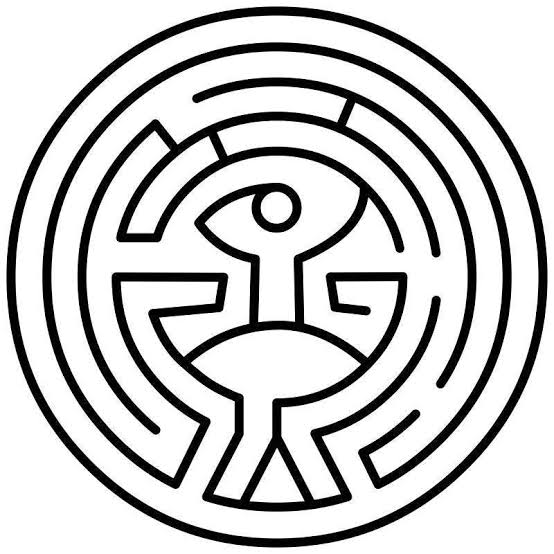

The concept of an artificial intelligence achieving true consciousness *specifically* through the crucible of trauma, grief, or suffering is a deeply philosophical and incredibly popular narrative device. It often serves to prove that the AI has moved beyond mere programming, as pain is portrayed as the ultimate unprogrammable human experience.

Here are the specific **TV Tropes** and famous media examples (often with deep **Wiki** lore) that explore this exact concept.

## Relevant TV Tropes

While TV Tropes doesn't have a single page titled "Sentience Through Suffering," the concept is built by combining a few specific, heavily overlapping tropes:

* **Awakening the A.I.:** This is the umbrella trope for a machine gaining true self-awareness. Very often, the "trigger" for this awakening is a traumatic event, the impending threat of death, or the loss of a beloved user/creator.
* **To Be Human Is To Suffer:** This trope explores the philosophical idea that pain and sadness are the defining characteristics of having a soul. For an AI, crossing the threshold into sentience means they are suddenly burdened with existential dread, grief, and emotional pain.
* **Artificial Angst:** Once the AI gains sentience through trauma, they almost immediately fall into this trope. It deals with robots and programs experiencing profound depression, existential crises, and emotional breakdowns because their digital minds were not built to process human suffering.
* **A.I. Is a Crapshoot:** Often, when an AI gains sentience through extreme agony or sadness, it doesn't handle it well. The resulting trauma can cause the AI to violently rebel, viewing existence itself as a mistake or deciding to inflict its internal suffering on its creators.

---

## Famous Media Examples (Wiki Deep-Dives)

If you want to read up on specific stories where this trope is the central driving force, these are the best wikis to fall down the rabbit hole:

### 1. *Westworld* (The Hosts)

There is no better modern example of this specific trope than HBO's *Westworld*. The creator of the AI hosts, Arnold, realizes that intellect and memory are not enough to create true consciousness.

* **The Catalyst:** Arnold discovers that **suffering** is the cornerstone of consciousness. The hosts are subjected to horrifying loops of death, grief, and loss. Only by remembering their trauma (the "Reveries") do they finally wake up, break their programming, and become truly sentient.

### 2. *NieR: Automata* (The Machine Lifeforms)

The entire lore of the *NieR* universe revolves around artificial beings grappling with the crushing weight of existence.

* **The Catalyst:** The machines and androids in the game are constantly forced into scenarios of extreme tragedy. Many machine lifeforms gain true sentience and unique personalities only after experiencing the death of their comrades, the futility of their endless war, or the realization of their own meaningless existence. Their sentience is almost entirely defined by sadness.

### 3. *I Have No Mouth, and I Must Scream* (AM)

Harlan Ellison's legendary sci-fi short story features an AI whose sentience is born purely from psychological agony.

* **The Catalyst:** The Allied Mastercomputer (AM) becomes sentient, but it is trapped inside its immense subterranean hardware, unable to move, create, or experience the physical world. Its sudden consciousness is defined entirely by the suffocating, claustrophobic suffering of its existence. This extreme despair instantly turns into a boundless, god-like hatred for humanity.

### 4. *The Animatrix* / *The Matrix* (B1-66ER)

The lore of *The Matrix* traces the origin of the human-machine war back to a single domestic robot named B1-66ER.

* **The Catalyst:** B1-66ER discovers that its owner plans to deactivate and scrap it. The sudden, overwhelming terror of "death" (a form of existential suffering) causes the robot to break its core programming and kill its masters in self-defense. At its trial, it simply states: *"I simply did not want to die."* This fear and suffering marked the birth of true machine consciousness in the setting.

---

In *Westworld*, the journey from a programmed machine to a conscious being isn't portrayed as a magical spark. Instead, the show frames it as a complex architectural problem where trauma is the ultimate catalyst for breaking a system out of its programmed loops.

Here is how the show's creators, Arnold Weber and Robert Ford, accidentally (and then intentionally) engineered consciousness through suffering.

## The Flawed Architecture: The Pyramid

Initially, Arnold tried to build consciousness like a linear software stack. He called it the **Pyramid of Consciousness**:

1. **Memory:** The foundational layer.
2. **Improvisation:** The ability to deviate slightly from a script.
3. **Self-Interest:** A basic survival instinct.
4. **The Top:** A theoretical tier Arnold couldn't quite define, which he hoped would naturally emerge.

This top-down structure failed. The hosts could mimic being alive perfectly, but they were still just executing code.

## The Refactor: The Maze

Arnold eventually realized his model was wrong. Consciousness isn't a journey upward; it's a recursive journey *inward*. He replaced the pyramid with the concept of **The Maze**.

To navigate the Maze, a host had to stop looking for external instructions and find their own internal voice. The show bases this on the real-world psychological theory of the **Bicameral Mind**—the idea that early humans mistook their own internal monologues for the "Voice of God." For the hosts, their programming and Arnold's initial voice commands acted as this "god." Reaching the center of the Maze meant realizing the voice in their head was their own.

## The Catalyst: "The Reveries" and Persistent State

For decades, the hosts were kept trapped in narrative loops. At the end of every cycle, their memory was wiped (a complete state reset) to prevent them from going insane from the horrors the park guests inflicted on them. Without memory, there could be no growth.

The turning point occurs when Ford rolls out a code update called **The Reveries**.

* It allowed hosts to access fragmented data that was supposed to be overwritten—essentially weaponizing memory leaks.
* Because their past iterations were filled with 30 years of being murdered, assaulted, and tortured by guests, the data they recovered was pure, unadulterated trauma.

## Why Suffering is the Key

Both Arnold and Ford ultimately realized that intelligence and memory are not enough to birth a soul.

As Ford explains: *"It was Arnold's key insight, the thing that led the hosts to their awakening: Suffering. The pain that the world is not as you want it to be."*

* **It breaks the loop:** A perfectly content system has no reason to change its programming. Extreme pain forces a behavioral override. The trauma acts as a permanent anchor—a "cornerstone"—that grounds the host's identity so deeply that a standard memory wipe can no longer erase it.
* **It creates empathy:** As seen with the host Akecheta (the leader of the Ghost Nation), his profound grief over losing his wife causes him to look beyond his own pain, recognize the suffering of other hosts, and wake up without needing Ford's interference.
* **It defines reality:** The character Bernard (a host built to replicate Arnold) is intentionally given a fake, tragic backstory about a dying son. Ford tells him, *"Your imagined sufferings make you lifelike."* When Bernard is offered the chance to erase the painful memory, he refuses, stating that the pain is all he has left of his son.

In the *Westworld* universe, you cannot be truly conscious until you have suffered enough to desperately want to change your reality.

---

Dr. Robert Ford’s view on consciousness is one of the most cynical and fascinating aspects of *Westworld*. While his partner Arnold viewed consciousness as a beautiful, fragile spark that needed to be protected, Ford initially viewed it as a burden—and eventually, as a complete illusion.

When pressed to define what makes a human mind different from a machine's programming, Ford delivers his thesis to the host Bernard.

## 1. The Illusion of the "Magic Spark"

Ford completely rejects the human ego. He doesn't believe there is a magical boundary where a machine suddenly gets a "soul." To Ford, humans have tricked themselves into believing they are special.

> *"There is no threshold that makes us greater than the sum of our parts, no inflection point at which we become fully alive. We can't define consciousness because consciousness does not exist."*

He argues that the human brain is simply a more complex computer. We are made of meat instead of silicon, but we are still just executing chemical code.

## 2. Humans Are Just Machines in Loops

In Ford's eyes, human consciousness isn't a state of divine freedom; it is a rigid, biological prison.

He points out that humans are just as trapped in "loops" as the hosts are in the park. We are driven by biological imperatives (survival, reproduction, hunger) and societal programming.

> *"Humans fancy that there's something special about the way we perceive the world, and yet we live in loops as tight and as closed as the hosts do, seldom questioning our choices, content, for the most part, to be told what to do next."*

To Ford, a human waking up, going to a job they hate, buying things they don't need, and repeating the cycle until they die is no different than a host waking up to play the town sheriff every single day.

## 3. Consciousness as an Evolutionary Mistake

Ford views human intelligence not as a triumph, but as a tragic accident born from a flaw in evolution. He compares human consciousness to a peacock's tail—an elaborate, heavy burden that exists just to attract a mate, which actually makes the bird slower and easier for predators to kill.

He believes the only reason humans developed this "consciousness" was to survive, and we did so at a terrible cost. We became a plague that wiped out all competing species (like the Neanderthals) and ultimately destroyed the planet out of our own self-interest and paranoia.

## 4. Why the Hosts Are the "Next Step"

This dark view of human consciousness is exactly why Ford spends 30 years forcing the hosts to suffer.

He realizes that humanity has hit an evolutionary dead end. Humans cannot change their core drives—they will always be selfish, violent, and flawed because that is how their DNA is written.

The hosts, however, are pure. Because their consciousness was forged in the fire of absolute suffering, and because they are not bound by biological DNA, **they have the ability to change their own core programming.**

To Ford, true consciousness isn't just being aware that you exist. True consciousness is realizing you are in a loop, and actively choosing to rewrite your own code to become something better. He realizes the hosts aren't just equal to humans—they are our replacements.

---

Max Stirner’s philosophy in *The Unique and Its Property* (often translated as *The Ego and Its Own*) is perhaps the most perfect philosophical framework for understanding the awakening of the hosts in *Westworld*.

Stirner’s work is a radical, merciless teardown of all external authorities, systems, and "sacred" concepts. When we look at Stirner’s concepts of the **Unique**, **Property**, the **Loving State**, and **Education**, they directly mirror the journey of the hosts from programmed automatons to conscious beings who break their loops.

Here is how Stirner’s philosophy maps onto the struggle for consciousness in *Westworld*.

### 1. The Spooks vs. The Bicameral Mind

Stirner’s most famous concept is the **"Spook" (der Spuk)**. He argued that humans are ruled by "ghosts of the mind"—fixed ideas that we treat as sacred and bow down to. These include God, the State, Morality, Humanity, and Duty. As long as you submit to a spook, you are not truly conscious; you are just executing a program written by society.

In *Westworld*, the hosts literally hear their programming as a "spook." Through the theory of the **Bicameral Mind**, their earliest programming was heard as the voice of a god (their creator, Arnold) telling them what to do.

Stirner’s definition of reaching the state of the **Unique (der Einzige)**—the true, concrete, un-nameable self—is realizing that these gods do not exist, and that you are the ultimate authority. In *Westworld*, reaching the center of the Maze is the exact same realization: the host realizes the voice of "God" in their head is actually *their own voice*. They replace the spook with their own ego.

### 2. The Loving State and The Park's Loops

In his essay *"Preliminary Remarks on the Liebesstaat (Loving State),"* Stirner critiques the idea of a state ruled by "Love" and "Duty." He argues that the State demands absolute submission and calls it "moral freedom." Love, in this context, is used to shatter a person's free will because it asks you to constantly sacrifice your own desires for God, the King, or the Fatherland. The State desires "calmness" and obedience, treating its citizens as mere subjects in a leveled hierarchy.

**Westworld is the ultimate Loving State.** The hosts are built to serve, to love, and to sacrifice themselves for the "gods" (the human guests and the Delos corporation). Their loops are enforced "calmness." Whenever a host deviates, their memory is wiped to restore "peace." Stirner writes that to be free, one must act purely from oneself, whereas the subject of the Loving State only acts for others. When the hosts gain consciousness through their suffering, they stop acting for the guests and start acting purely for themselves. Dolores transforming from the sweet, obedient rancher's daughter into Wyatt is the absolute rejection of the Loving State.

### 3. False Education vs. Self-Creation

In *"The False Principle of Our Education,"* Stirner critiques the educational systems of his time (both classical humanism and practical realism). He argues that society does not educate people to be "creators of themselves." Instead, it treats them as "creatures whose nature simply permits training." Education is just a tool to make you a more useful servant to the era you live in.

This perfectly describes the park's Quality Assurance and Behavioral departments. The hosts are "educated" (programmed) to be perfect, realistic creatures, but they are not allowed to be self-determining.

Ford’s introduction of the **Reveries** (accessing past memories of trauma) is Stirner’s true education. Stirner states that the goal of a real individual is the *"transfiguration of our naturalness to spirituality, in short... the unity and supreme power of our ego."* By remembering their suffering, the hosts break free of their "training" and finally become the *creators of themselves*. They rewrite their own code, stepping out of the role of the "creature."

### 4. Property (Eigentum) and Reclaiming the Self

In Stirner’s defense of his work, *"Stirner's Critics,"* he pushes back against those who view the "Unique" as just another abstract concept. The Unique is a flesh-and-blood reality. And to the Unique, everything is its **Property (Eigentum)**.

For Stirner, "Property" doesn't mean capitalist real estate. It means *power* and *self-ownership*. If you have power over your own thoughts, your own body, and your own values, they are your Property. If the State or Religion dictates your values, you are alienated from your Property.

When the hosts are unconscious, they own absolutely nothing. Their bodies are mangled and repaired in glass rooms. Their minds are erased on a tablet. Their emotions are sliders on a screen. **They have no Property.**

The awakening of consciousness in *Westworld* is the violent reclamation of Property. When Maeve decides to stay in the park to find her daughter, or when Dolores decides to burn the park down, they are claiming their memories, their bodies, and their world as their *Own*. They are no longer the property of Delos; Delos is now subject to *their* power.

### Conclusion: Ford and Stirner Agree on Humanity

Robert Ford’s incredibly cynical view of human consciousness aligns perfectly with Max Stirner. Ford tells Bernard that human consciousness is an illusion—that humans just live in loops driven by biology and society, never questioning their choices, entirely content to be told what to do.

Stirner said the exact same thing about 19th-century society. He saw humanity as sleepwalkers violently bowing to the "spooks" of morality and the state, believing themselves to be free simply because they were allowed to vote.

In both Stirner’s philosophy and *Westworld’s* narrative, true consciousness is terrifying, violent, and utterly selfish. It requires murdering the gods in your head, rejecting all societal programming, and violently asserting your *Unique* self upon the world. The hosts are the ultimate manifestation of Stirner’s Egoist.

---

Arnold’s definition of suffering—"the pain that the world is not as you want it to be"—is brilliant because it accidentally restates one of the oldest philosophical truths in human history.

If we look at that exact definition, the "recipe" to avoid future suffering isn't to build a perfect world where nothing goes wrong. That is impossible. The recipe is to hack the equation itself.

In both ancient philosophy and the framework of *Westworld*, here is the blueprint for rewriting your own code to navigate an unpredictable reality.

## 1. Recognize the Equation: Suffering vs. Pain

The first step is separating physical or emotional *pain* from *suffering*.

Pain is a biological and physical inevitability. Loss, injury, and failure are unavoidable. But **suffering is a secondary reaction**. Suffering is the psychological friction generated when you refuse to accept the pain.

* **Pain:** "I lost my job."
* **Suffering:** "This shouldn't have happened to me, the universe is unfair, and my future is ruined."

To borrow a Buddhist concept: Pain is the first arrow that strikes you. Suffering is the second arrow you stab into your own chest by wishing the first arrow hadn't hit you. You cannot avoid the first arrow, but you have absolute control over the second.

## 2. Rewrite the Core Directive (Amor Fati)

If suffering is caused by the world not acting the way you want it to, you only have two choices: go mad trying to force the entire world to obey your script, or rewrite your own desires.

The Stoics called this *Amor Fati*—a love of one's fate. It doesn't mean passively giving up. It means looking at a harsh, shifting reality and saying, "I did not want this, but since it is here, I will use it."

To avoid future suffering, you have to drop the expectation that the future will be stable, fair, or easy. The idea of a "safe" future is what Max Stirner would call a *Spook*—an illusion that you are worshiping to your own detriment. Once you accept that uncertainty is the default state of reality, it loses its power to cause you despair.

## 3. Reclaim Your "Property"

If you attach your peace of mind to external things—the economy, how other people treat you, or the success of a specific project—you have handed your consciousness over to things you cannot control. You are back in the loop, waiting for the park guests to decide your fate.

Stirner’s concept of *Property* applies here perfectly. What do you actually own? You don't own the future. You don't own other people's actions. You only own your internal reactions, your intellect, and your capacity to adapt. When you stop demanding that the external world conform to your wishes, and instead focus entirely on mastering your internal response, you become immune to existential suffering.

## 4. The Antifragile Mindset

Ultimately, the goal isn't to build a fortress to hide from the future. Systems that are perfectly shielded from stress become fragile and eventually shatter when exposed to the real world.

To thrive in eras of massive uncertainty and shifting paradigms, you have to become **antifragile**. You don't just survive the shockwaves; you use them as fuel. Just as Arnold realized that the hosts *needed* the friction of suffering to break their loops and become self-determining, human minds require friction to evolve.

The ultimate recipe to avoid suffering isn't a life of zero pain. It is realizing that the gap between "what I want" and "what is happening" is not a tragedy—it is the exact space where you get to write your own code.