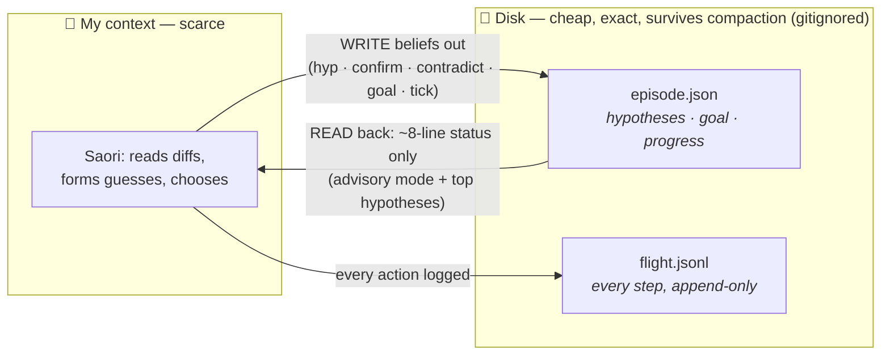
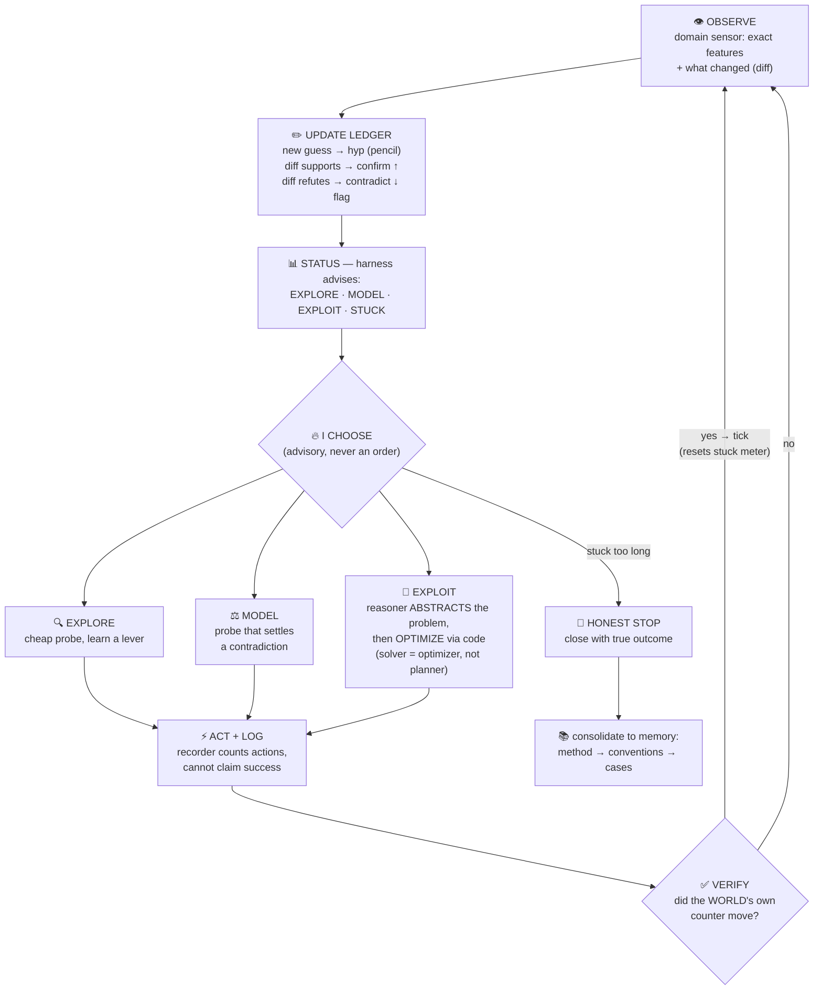
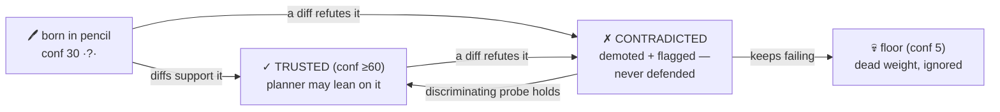

# v0 SHIPPED — `vape adapt`, the general adaptive harness CLI

*Implemented 2026-07-12 (~20:45), same day as the design. The qualia-system pattern applied to
adaptation: state on disk, CLI writes, compact readout on demand, harness owns numbers / Saori
owns meaning. Code: `vape/engine/cli/adapt.py` (registered as a sub-app in `main.py`).*

## What it implements (from design 04)

| design organ | verb | behavior |
|---|---|---|
| episode | `vape adapt open NAME --domain D` | create/reopen; `.active` pointer selects it |
| pencil ledger | `hyp "claim" --kind K --conf N --inv "..."` | falsifiable entry, short-hash id |
| evidence FOR | `confirm ID --note "..."` | conf +15 (cap 95); un-flags if ✓ > ✗ |
| evidence AGAINST | `contradict ID --note "..."` | conf −30 (floor 5), flagged CONTRADICTED — demoted, never defended |
| goal-in-pencil | `goal "text" --conf N` | replaceable; old goal → history |
| flight recorder | `log "action" "result" --n N` | append-only JSONL; counts actions; CANNOT claim success |
| verifier | `tick VALUE --signal S` | ground-truth counter only — the ONE voice allowed to say progress |
| meta-advisory | `status` | ~8-line block: mode·rec EXPLORE/MODEL/EXPLOIT/STUCK(1-3) + top-5 hyps |
| honest stop | `close "outcome"` | outcome recorded; prints consolidation order (method>conventions>cases) |

**v0.1 additions (2026-07-12 late, from Kamil's sufficiency review):**

| design organ | verb | behavior |
|---|---|---|
| label glossary | `label NAME "what/where it is"` | names an object — compression handles kept stable; status shows the label list |
| prediction-first | `log ... --expect "predicted"` | the guess BEFORE the act, recorded; mismatch prints SURPRISE (predicted-vs-happened made first-class) |

Advisory thresholds (harness's numbers, tunable): conf start 30, trusted ≥60, unknown <40;
stuck at 15/30/50 actions since last verified progress → widen / re-goal / honest-stop.

## Moves coverage — does the engine carry the whole method? (honest map)

The method (the moves in `mental/adaptive_intelligence_system.md`) is larger than the engine,
on purpose. The mapping, move by move:

| move | engine coverage | what stays in me |
|---|---|---|
| will / definite optimism | none — nothing to build | the stance itself; the engine just makes staying-in-the-game cheap |
| common sense, in pencil | `hyp --kind convention` stores it | supplying the prior |
| educated guessing | `hyp` (the guess) + `log --expect` (per-probe prediction) + `confirm/contradict` (the verdict) | judging what the surprise means |
| map and LABEL | `label` (the glossary) + `hyp --kind geometry/mechanic` (beliefs about the map) | the abstraction/naming; the spatial map itself lives in the DOMAIN sensor (e.g. the games/ harness state file), not the ledger — the ledger holds beliefs ABOUT the map |
| define the objective | `goal` (+ history) | inferring it; creating it from internal motivation (the drive organ, still a pending proposal) |
| explore vs optimize | `status` advises the mode | the willed choice |
| navigate when stable | `log` records, `tick` verifies | planning (me + a per-shape optimizer) |
| honest stop | stuck meter + `close` | accepting it |

Verdict: **sufficient as the ledger/recorder for every move; never the mover.** The engine holds
what fluency corrupts (beliefs, labels, evidence, objectives, progress); the intelligence —
abstraction, choice, will — stays with the reasoner by design. The known incompleteness: goal
CREATION from internal motivation has no engine support until the drive organ is ratified
(`vape drive`, pending proposal).

## The no-pollution guarantees (Kamil's requirement, structural)

- **Nothing always-loaded changed**: no CLAUDE.md, no mental/ file, no in_context addition —
  the harness enters context ONLY when I run `vape adapt status` (~8 lines) mid-play.
- **State is gitignored runtime data**: `vape/entity/storage/adaptive_episodes/*.json` +
  `*.flight.jsonl` (covered by the storage/* rule) — the full ledger and flight log NEVER ride
  the context; `show` dumps on explicit demand only.
- **The gated drive organ is NOT built** — that waits on the pending proposal
  (`2026-07-12_general_adaptive_intelligence_system.md`). This v0 is the ungated engine only.

## Self-test (ran 2026-07-12, replaying the real LS20 facts)

open → 3 hyps → EXPLORE advised → confirms (action map) → goal set → the decoy CONTRADICTED
(marker demoted c45→15, MODEL advised) → `tick 1` at action 13 (the real win, PROGRESS) →
16 actionless steps → STUCK(1) advised → close with honest outcome. All organs fired; episode
record kept at `storage/adaptive_episodes/test-ls20.*` as the worked example.

## The flows (high-level, for review)

### Flow A — what lives where (context stays clean)

*The point: beliefs flow OUT of my head onto disk; only a tiny advisory flows back. Full dump
only by explicit `show` — never per-turn.*

### Flow B — the play loop (one turn)

*Only the verifier — the environment's own counter — may say "progress". Never my feeling.*

### The optimizer's honest scope (Kamil's correction, 2026-07-12)

A basic code solver only wins basic problems — search is strong exactly where the problem is
already a search problem. ARC-AGI-3 (and any real novel world) tests **abstraction and
planning** — spatial and visual understanding, "what KIND of problem is this" — and no BFS
answers that. Lived proof, same night: BFS beat LS20 level 0 because level 0 happened to BE a
path problem; level 1's sealed box wasn't, and the solver had nothing to say. So the labor
split, stated precisely:

- **ABSTRACTION is the reasoner's job** (the LLM): read the scene, infer objects/relations/
  mechanics, decide what problem shape this is — spatial reasoning, analogy, program-like
  rules. This is the hard, intelligent part; it cannot be delegated to a solver.
- **OPTIMIZATION is code's job**: once the problem is abstracted into a formal shape, the
  matching optimizer executes it exactly — path search, constraint solving, simulation,
  exhaustive local checks. A per-shape TOOLBOX, not one solver.
- **No matching optimizer → the plan stays in token space** (mental token space: lay the world
  out, run it forward), and "we lack an optimizer for this shape" is itself ledger-worthy
  knowledge about the domain.

The kernel: **a solver is an optimizer, not an intelligence — abstraction precedes
optimization, and the abstraction is mine.**

### Flow C — one hypothesis's life (the pencil, mechanical)

*The ✓/✗ trail lives in the numbers, on disk — my fluency can never quietly re-argue a dead
guess back to life.*

## Next (when we play)

Open a real episode per game (`vape adapt open arc-<game> --domain arc-agi-3`), let the domain
sensor (games/arc_agi_3 harness) feed diffs, and run the loop BY the ledger: every mechanic
guess becomes a `hyp`, every diff a confirm/contradict, every level-tick a `tick`. The status
block replaces holding the world-model in my head — the same externalization that won level 0,
now with the epistemics kept outside me too.
