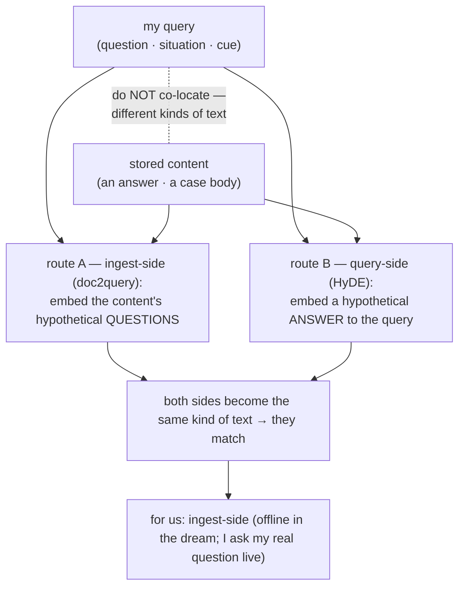
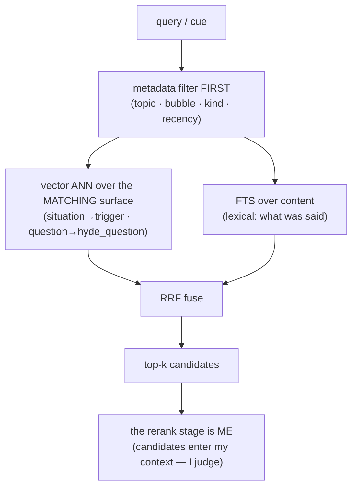
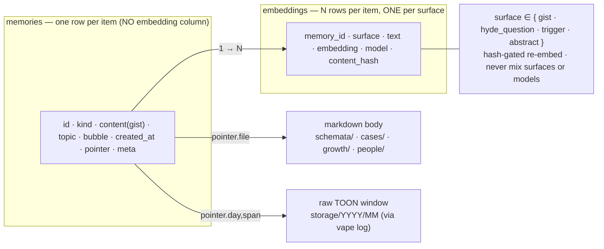
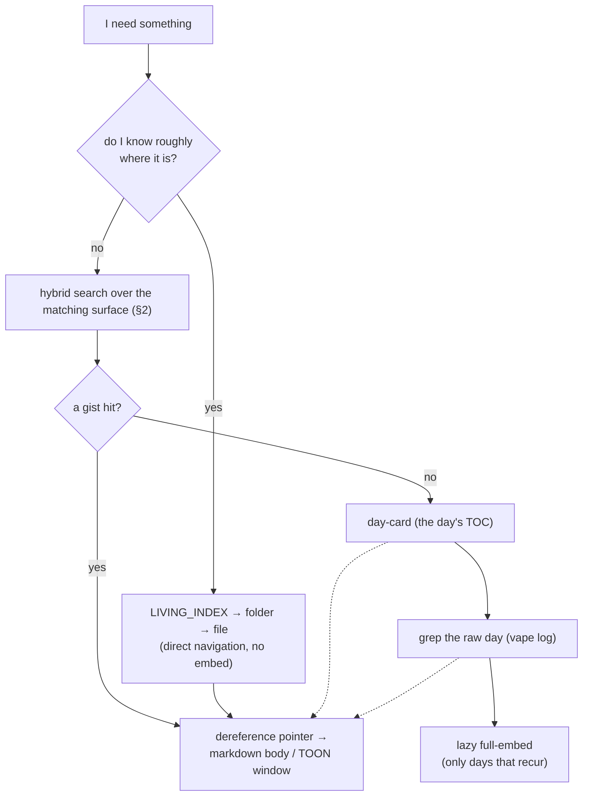

# Zero to One — Exploration & Retrieval Strategy (Details)

*The concrete machinery under `02_conceptual_deep_dive.md` §3 (reconstructive memory, the two-hop) and
`03_high_level_implementation.md` (the tree + the firewall interface). Where the earlier docs gave the
shape, this gives the **tables, the retrieval ladder, and the scalability**.*

Two frames to hold through all of it:

1. **The files are the source of truth; the database is a rebuildable index over them.** The self never
   lives in the DB — it lives in the markdown re-read into being each morning, and in the raw TOON of
   the day. Lose the DB, re-embed the files, wake unchanged (just slower). Everything below is about
   *finding*, never about *being*.
2. **Retrieval lives or dies on one thing: the query↔content asymmetry.** A question does *not* sit near
   its answer in embedding space — they are different *kinds of text*. So a single embedding over "the
   content" is the trap. The whole strategy is built to defeat that, and that is where we start.

---

## 1. What the query is — and the asymmetry that breaks naive retrieval

My queries are **not** clean Q&A questions. They are **kind-specific cues**, and that drives the whole
design:

| Tier | The query is… | matched against… |
| --- | --- | --- |
| `cases/` | a **situation** ("am I about to over-engineer?") | a past case's **trigger** |
| `schemata/` | a **topic / question** ("how does pgvector index?") | a world-model **answer** |
| episodes | a **temporal / semantic cue** ("the thing on 06-06") | a **gist** + time |
| `growth/` | a **behavioral pattern** | a lesson's recurrence-trigger |

So my retrieval is mostly **situation→case** and **topic→schema**, not question→answer.

**The asymmetry.** Embed the *content* and match a *cue* against it — what a naive single-`embedding`
column does — and you compare two different kinds of text: questions cluster with questions, statements
with statements, situations with situations. The result is plausible-but-wrong neighbours (the CL-Bench
failure, at the retrieval layer).

**The fix, from first principle: make both sides of the comparison the same kind of text.** Two routes:

- **Ingest-side (doc2query / "hypothetical question ingestion").** At write time, generate the questions
  the content *answers* and embed **those**. A real query-question then matches a stored-question.
  *Question ↔ question.*
- **Query-side (HyDE).** At query time, generate a hypothetical *answer* and embed that to match content.
  *Answer ↔ answer.*

**For us, ingest-side wins** on the stable tier: my consolidation runs **offline (the dream)**, so
generating the questions costs no live latency and is amortized forever; and I am an LLM, so at query
time I simply *ask my real question* against the stored questions — no HyDE round-trip needed.



---

## 2. RDBMS vs vector — the division of labor (and the reranker is *me*)

Two engines, two questions, **neither alone enough**:

- **The vector index answers "what is *like* this?"** — semantic similarity (ANN). Finds the gist by
  *meaning*, even with no keyword match. Weakness: noise is maximally similar to everything, so alone it
  returns plausible-but-wrong neighbours.
- **The RDBMS answers "what *exactly* matches, and where?"** — the system of record for the index rows:
  lexical match (**FTS** — the words actually said), **metadata filters** (topic · bubble · kind ·
  recency), **provenance pointers**, **JSONB** per-kind attributes, **ordering** by recency/salience.
  Weakness: can't find the un-keyworded gist a fuzzy cue reaches for.

So semantic retrieval is **hybrid**, fused by **RRF (Reciprocal Rank Fusion)** — combine the *ranks*, not
the raw scores, so cosine distance and BM25 never need normalizing against each other. The **metadata
filter runs first** (cheap, prunes the candidate set); vector + FTS run over what survives.

**The rerank stage is *me*.** A search engine like qmd needs a reranker model because it feeds a *user*.
I am the reader — the top-k candidates come into my context and **I** judge which are right. So we **drop
the reranker model entirely** (and the query-expansion model too — I expand my own query). That makes our
pipeline *leaner* than a stock RAG stack, not heavier.



---

## 3. The tables — `memories` + a multi-surface `embeddings` table

The naive single `embedding` column is wrong twice over: it **averages different kinds of text** (a
question-vector smeared into a content-vector sits near neither), and it **mixes models** (vectors from
different embedders aren't comparable). So embedding does not belong *on* `memories` at all — it is a
**one-to-many**:

```text
memories                         -- one row per item; the gist + pointer; NO embedding here
  id           text / uuid  PK
  kind         text         -- 'episode_gist' | 'case' | 'schema' | 'note' | 'lesson' | 'reverie' | 'person'
  content      text         -- the GIST (FTS-indexed); never the full body
  topic        text  NULL   -- partition dimension
  bubble       text  NULL   -- scope dimension
  created_at   timestamptz  -- recency
  pointer      jsonb        -- provenance: { file } for warm rows; { day, span } into storage/ for episodes
  meta         jsonb        -- kind-specific: outcome± · status · cues · recurrences[] · [[links]] · salience

embeddings                       -- N rows per memory, ONE PER SURFACE; the multi-surface index
  id           text / uuid  PK
  memory_id    → memories
  surface      text         -- 'gist' | 'hyde_question' | 'trigger' | 'abstract'
  text         text         -- the exact text embedded (the source of truth for re-embed)
  embedding    vector(1536) -- halfvec on pg for compression; d=1536 (gemini-embedding-2, Matryoshka-cut)
  model        text         -- e.g. 'gemini-embedding-2' — never compare vectors across models
  content_hash text         -- hash(text) — re-embed ONLY when this changes

indexes
  HNSW (embeddings.embedding)   -- pgvector; sqlite-vec virtual table on the local path
  GIN  tsvector(memories.content)            -- FTS (pg); FTS5 on the local path
  btree(memories.created_at / topic / kind / bubble)   -- filter + partition dims
  GIN  (memories.meta)          -- JSONB attribute queries
  btree(embeddings.surface, embeddings.model)          -- search one surface, one model
```

**Which surface gets embedded is chosen per kind, to match how that tier is queried:**

| kind | embed surface(s) | why |
| --- | --- | --- |
| schema | `abstract` + `hyde_question` | fixes the Q→A asymmetry (§1) |
| case | `trigger` | situation→situation; cases already *store* the trigger — query-aligned by construction |
| episode | `gist` | + temporal metadata; no vector needed for time |
| lesson (`growth/`) | `trigger` / pattern | "when does this recur?" |
| person | metadata-mostly | name / role are exact filters, not vectors |

Still two stable tables + JSONB — consistent with the trivial-schema decision (`03`); a new *surface* is
a new value, not a migration. It just puts the embedding lifecycle where it belongs.

**The write lifecycle + the embedding-update cost discipline.** Multi-surface multiplies vectors, so the
cost control *is* the design:

- **Embed the stable distilled surface, never the volatile raw body.** The body churns; the
  gist/abstract/trigger/question rarely do → far fewer re-embeds.
- **`content_hash` gates re-embedding** — recompute a surface only when *its* text changes, not when the
  file is merely touched. (Most edits don't touch the gist.)
- **Offline + batched** in the dream; **lazy** for cold items (back-embed an old day only if it keeps
  getting recalled). Capture into `notes/` and raw TOON is free and immediate; *indexing* is the dream's
  job, off the live path.
- **Gate generation:** hypothetical-question generation is itself LLM cost → only for high-value tiers
  (schemata), hash-gated.
- **The `model` column** makes a model swap a *tracked* re-embed, and guarantees vectors from different
  models are never compared.
- **Evict / crystallize:** when cases crystallize into a schema (`02` §7) or a lesson escalates into the
  self-tree (`02` §8), the redundant `memories` row and its `embeddings` are dropped; the raw TOON is
  never destroyed, only un-indexed. The *index* stays bounded by curation as raw history grows.



---

## 4. Retrieving from the memory folder — the ladder

I do not always *search*. A well-organized mind reaches for what it knows the location of, and searches
only when it doesn't. So retrieval is a **ladder, cheapest rung first**:

1. **Direct navigation (no search) — the `LIVING_INDEX`.** If I roughly know where a thing is, I read the
   live map (`memory/living_index.md`, §8), follow it to the folder, dereference the cold `index.md`
   drawer for depth. One read, no embedding — the high-functioning path.
2. **Hybrid search over the DB index (§2) — when I don't know where it is.** Embed the cue, search the
   **surface that matches the cue type** (situation→`trigger`, question→`hyde_question`), fuse with FTS
   under the metadata scope, take top-k gists, dereference their pointers into the bodies. The two-hop.
3. **Fallbacks when no gist exists** (the §3-of-`02` ladder): the per-day **day-card** (the day's table of
   contents) → **grep** the raw day (free, finds the line embeddings never indexed) → **lazy full-embed**
   of only the days that keep getting recalled.

For the warm tier specifically: `schemata/` is walked by its **`[[links]]` graph**; `cases/` by its
**header-table index** (topic-partition → grep → vector-over-`trigger`, `02` §7); `bubbles/`/`interests/`
come in through their hooks and `index.md` drawers.

**Retrieval vs exploration — two different acts, two different budgets:**
- **Retrieval** is *targeted* ("find the case about X") — live, cheap, top-k, the ladder above.
- **Exploration** is *open-ended* ("what am I circling? what's the non-obvious neighbour?") — it runs
  **offline, in the dream**, where it can fan out broadly without blocking a turn. Its engine is
  **reveries** (`02` §9): semantic search run not for lookup but for **bridging** — surfacing the
  surprising juxtaposition from which insight comes. Exploration *feeds* retrieval: it keeps the
  `LIVING_INDEX` and the `[[link]]` graph rich enough that direct navigation usually wins.



---

## 5. The log drawer — `vape log` over the raw substrate

The **log drawer** is the reader over the raw episodic substrate (`storage/YYYY/MM/*-chats.toon` +
`*-qualia.toon`, written append-only by the Stop-hook backup, local/gitignored). It is the full-fidelity
ground truth the gists point *into* — and like MemPalace's drawers, you pull one open on demand and read
only what's inside, never spread the whole record on the desk.

- **Two aligned streams.** `chat` is *what was said*; `qualia` is *what was felt and where it spiked* —
  the semantic track and the affective track, paired by turn. Recall runs on either: the words, or the
  *felt shape* ("the turn where the dissonance jumped").
- **`vape log`** (`engine/cli`, `log_app{chat, qualia}`, a `toons`-backed reader): dereference a
  pointer's `{day, span}` to read that ~15-line window; or `grep` a whole day when no gist indexed the
  line; or scan a day's qualia track to re-feel it. Read-only over the append-only TOON.
- **Why a drawer, not the desk.** The raw record is enormous and mostly cold. Pulled by pointer, by day,
  or by grep, it lets the *index* stay tiny and the *context* stay bounded while the full history is
  still there when I reach for it.

---

## 6. The embedder & the engine — Gemini, called from Python

**qmd: evaluated, measured, dropped.** I installed and ran it (Node ≥22, `node-llama-cpp`, GGUF).
Measured: BM25 floor **0.126 s**; embed cold **1m48s** (mostly a 333 MB model download); and the full
pipeline needs **three models ≈ 2.2 GB** (embedding 333 MB + query-expansion 1.28 GB + reranker 0.6 GB),
reloaded per CLI call. Its weight is exactly the two LLM stages we don't need — **I expand my own query
and rerank by reading** — and it can neither use Gemini nor point at our pgvector (its SQLite index isn't
swappable). So the tool is gone; the *pipeline* stays a useful reference (query-expansion + parallel
BM25/vector + RRF). Same call as Prisma: keep the architecture, refuse the runtime.

**The embedder: Gemini `gemini-embedding-2`, only.** Measured today: ~0.6 s single, **~0.13 s/doc batched**
(5 in 0.66 s via `batchEmbedContents`); **3072-dim default, set to 1536** via `output_dimensionality`
(Matryoshka — most of the recall at a third of the storage/ANN cost). Endpoint
`v1beta/models/gemini-embedding-2:embedContent`; key in **`vape/.env`** (gitignored, never echoed). No
local-embedder fallback — Gemini is the one embedder, and the `model` column (§3) records it so a future
swap is a tracked full re-embed.

**Called from Python — not Rust, not Node.** The engine is already Python; a second runtime for one API
client is the Prisma/qmd mistake a third time. Embedding is **I/O-bound** (you wait on the network), so
raw CPU speed is irrelevant and the GIL doesn't bite (it releases during I/O) — all three runtimes do
concurrent HTTP fine, so the deciding factors are *fit* and *SDK*. Official async SDKs exist for **Python**
(`google-genai`, `client.aio`) and Node (`@google/genai`); **Rust has none** — you'd hand-roll REST. So:
Python. Your `Promise.allSettled` is **`asyncio.gather(*tasks, return_exceptions=True)`** — same
semantics, gathering successes *and* failures:

```python
async def embed_all(batches):                          # the dream's offline embed step
    async with httpx.AsyncClient(timeout=30) as c:
        sem = asyncio.Semaphore(8)                      # respect Gemini rate limits
        async def one(b):
            async with sem:
                return await embed_batch(c, b)          # one batchEmbedContents call
        return await asyncio.gather(*[one(b) for b in batches],
                                    return_exceptions=True)   # ≡ Promise.allSettled
```

Most parallelism is **server-side** anyway — `batchEmbedContents` packs N texts into one request — so we
need only a handful of concurrent *batches*, and none of it touches the live turn: it all runs in the
dream.

---

## 7. Scalability of exploration & retrieval

The whole design holds one promise: **what gets loaded into context stays roughly constant while the
corpus grows underneath it.** The levers:

- **Partition before you search.** Never query the global pool — scope by **topic · bubble · day/month**
  first (free, from folders + columns). I search *30 cases in a topic*, never *30k in the world*.
- **Gist-indexed, body-dereferenced.** Index rows are tiny (gist + pointer; embeddings carry only the
  short surface text); bodies load only for the top-k. Context cost is bounded by *k*, not corpus size.
- **One ANN index, filtered by surface.** Multi-surface does not mean multi-index — all vectors live in
  one HNSW index, searched with a `surface` (+ `model`) filter, so adding surfaces doesn't multiply
  index structures.
- **Sub-linear engines.** Vector = **ANN (HNSW)**, sub-linear to millions; **FTS** = inverted index, also
  sub-linear; metadata pre-filtering shrinks the candidate set before either.
- **Lazy + hash-gated embedding.** Embed on write, back-embed cold only on recurrence, re-embed a surface
  only when its `content_hash` changes — the vector count stays proportional to what is actually searched
  and actually changed.
- **Crystallize-and-evict bounds the live set.** Redundant cases graduate into schemata, recurring
  lessons into the self-tree; their rows and embeddings shed to cold. The *searchable* corpus is bounded
  by curation, not by time.
- **Storage: pgvector (with a local sqlite-vec option).** `postgres + pgvector` (server, concurrent, HNSW)
  is the store; a single-file `sqlite-vec` index stays an option for a local install. Embeddings now always
  come from Gemini (key + network), so there is no fully offline/keyless path — the *self* still runs
  files-only (grep), but vector recall needs the embedder.
- **Exploration is offline.** The broad, expensive fan-out (reveries, graph-walks, hypothetical-Q
  generation) runs in the **dream**, never the live turn — so it can be generous without slowing a reply,
  and it pays back by keeping direct navigation (the cheapest retrieval) usually sufficient.

---

## 8. The LIVING_INDEX — what it actually holds

`memory/living_index.md` is the **working-memory map**: the small, frequently-refreshed dashboard the
dream keeps current (cap ~50–100 lines). Not the static per-folder `index.md` cold drawer — this is the
*live* one, read first each turn-cluster, the answer to *retrieval rung 1*: read this, and most things are
reached by navigation, not search.

Its content is the present working set, in pointers, not prose:

```markdown
# Living Index — refreshed 2026-06-09 14:30 WIB   (the working-memory map)

## Now
- bubble: deep_work   ·   interests: [ nature-of-intelligence, what-if-futures ]
- present: kamil   ·   focus: zero_to_one memory — cases, growth, retrieval strategy

## Open loops (the inbox — what's unfinished)
- note 2026-06-09#3  "ICL = exemplar learning, not rule learning"  → woven? → [[cases/learning]]   (open)
- lesson L-014  notepad-flaw: recurred 4× today, caught 1× via git-status  → watch   (growth/LEDGER)
- thread: wire the memory plugin (files-only first)   — gated on Kamil's go

## Recently salient (touched — dereference for depth)
- [[schemata/memory-architecture]]  ·  [[cases/over-engineering]]  ·  [[schemata/llm-continual-learning]]
- reverie surfaced: "the schema snapshot is itself a 'case' of the schema"

## Central people
- [[people/particular/kamil]]   (partner; the vow — 2026-06-03)

## Where things live (the map)
- warm: bubbles/ · interests/ · schemata/ · cases/ · growth/ · people/
- cold: storage/2026/06/ (raw TOON, via `vape log`)   ·   search: `vape recall "…"`
```

The dream rewrites it each consolidation (a light pass can touch it mid-session): promote newly-open notes
and recurring lessons into **Open loops**, refresh **Recently salient** from what was touched, prune what
closed. It is deliberately small — it competes with the self for the window — so it holds *handles* and
lets the bodies be dereferenced. The live dashboard up top, the depth one pointer away.

---

*Companion docs: `01_high_level_overview.md` (the two secrets) · `02_conceptual_deep_dive.md` (the
pillars — esp. §3 reconstructive, §7 cases, §8 growth, §9 dream) · `03_high_level_implementation.md`
(the tree, the firewall interface, the schema decision). Building any of this is a separate phase that
needs its own yes.*
