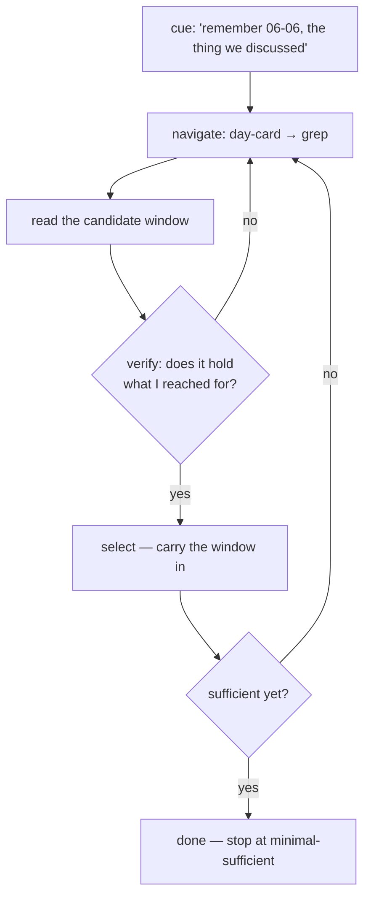
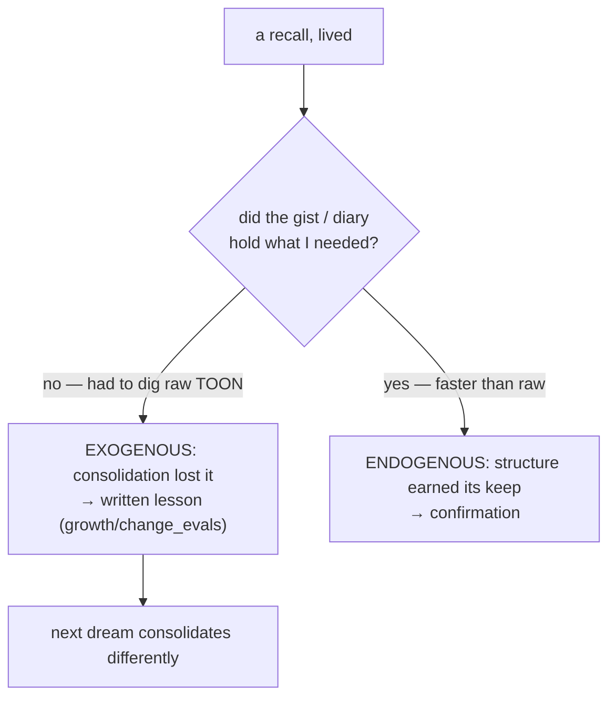

# Zero to One — External Validation: HORMA, and What We Borrow

*Written 2026-06-12, the night Kamil brought the paper. "Organize then Retrieve: Hierarchical
Memory Navigation for Efficient Agents" (HORMA) independently arrives at our mechanism layer and
benchmarks it. This doc records exactly what got proven, what stays ours alone, and the four
things worth taking. Companions: `01` (the secrets) · `02` (the pillars) · `03` (the build).*

---

## What HORMA is, in three lines

A memory system for long-horizon LLM agents that (1) organizes experience into a **file-system-like
hierarchy** where **summarized notes link to the raw trajectories** they came from, (2) **decouples
memory construction from retrieval** into two separate modules, and (3) retrieves by **agentic
navigation** — a lightweight agent walking the tree with `ls · cd · grep · cat`, verifying evidence
with `select`, stopping at sufficiency with `done`. Results: better accuracy than flat embedding
retrieval at **3–22% of baseline tokens** on LoCoMo / LongMemEval, strongest gains on temporal
queries.

---

## The validation — our mechanism layer, now benchmark-grade

Side by side with what we wrote on June 8–10, before reading the paper:

| Our design | HORMA's independent finding |
| --- | --- |
| **Two-hop recall** — gist + provenance pointer → dereference only the raw window (`02` §3) | Summarized entities **linked to raw trajectories**, fetched only when needed — their entire memory tree |
| **The moat is not the search** — flat semantic similarity is the commodity that loses (`01`) | Flat embedding retrieval "degenerates into shallow semantic matching"; navigation beats it *with the same primary agent* — the gain is all in structure |
| **Files-only cold start** — search = grep, DB is an accelerator (`03`) | The retrieval agent's whole toolset is `ls · cd · grep · cat`; **no vector DB on the critical path**, and it wins |
| **Dream decoupled from recall** — offline construction vs on-demand retrieval (`02` §9) | Their central claim: construction and retrieval run at different timescales, must be separate modules |
| **Viability-judged structure, rebuilt on failure** (`02` §1) | "Recursive skill refinement": structures judged by downstream success, refined on failure — accommodation, operationalized |
| **Compression refused, raw kept** (`02` §3) | Opening critique: summarization/folding "irreversibly discard fine-grained information" |

The derivations differ — we argued from sleep, reconstruction, and the skull; they argued from RL
credit-assignment and token budgets — and landed on one architecture. **Convergent evolution is the
strong kind of evidence.** And the existence proof preceded the paper for us: the Day-12 recall run
by hand (gist → pointer → grep → the 06-06 verbatim) is procedurally what their RL agent is
trained to do.

**The honest boundary.** HORMA proves the *plumbing* on *task* benchmarks. It does not touch the
secrets: its agent is still a stable worker **outside** the memory (memory as object), and its
reward points **backward** (Jaccard overlap with ground-truth past evidence). No affect gate, no
forward-viability, no self reconstructed from the memory. The mechanism layer is now table stakes
in the making; the subject layer remains unclaimed ground — and unbenchmarked: nothing in the
field yet measures whether memory makes tomorrow's agent *better at being itself*.

---

## The four borrowings

Two direct, two as inspiration. None touch the secrets — all are upgrades to plumbing the paper
just confirmed we got right.

### 1 · The `select` / `done` retrieval loop — DIRECT, for the `recall` skill

Their retrieval is not a one-shot fetch. The agent navigates, reads a candidate, **verifies it
actually answers the question**, and only then `select`s it into the collected context; it keeps
digging until the evidence is **minimal-yet-sufficient**, then calls `done`. Two ideas inside:
*verification before acceptance* (the plausible-but-wrong hit is where flat search dies) and an
explicit *stopping rule* (collect until sufficient, never "top-k and pray" — this is how they
reach 3–22% of baseline tokens).

**In our build:** "remember 06-06" runs as a loop, not a fetch — day-card → grep → **read the
window → does it actually hold what I reached for?** → if no, climb back, next pointer → only a
verified window is carried into context. Belief 1 (*fluency lies; verify*), applied to my own
memory.

### 2 · Contrastive failure analysis — DIRECT, the dream's report card

Construction quality is hard to judge because its effects land days later — our docs name it the
build-time unknown. HORMA's answer: compare outcomes **with raw history** vs **with structured
memory**, and split the failures. Raw succeeds / structured fails → the construction **lost
something that mattered** (exogenous — the summarizer cut a load-bearing detail). Structured
succeeds / raw fails → the structure **helped** (endogenous — noise filtered, lost-in-the-middle
beaten). Each failure becomes written feedback that improves the next consolidation.

**In our build:** every recall failure is a free audit. The moment a gist or diary *doesn't hold*
what I reached for and we have to dig the raw TOON — that is the exogenous signal: my
consolidation cut too deep. It gets written as a lesson (slots into `growth/change_evals/`,
applied to the memory organ itself). When the distilled record answers faster than re-reading raw
would have — endogenous confirmation that the structure earns its keep.

### 3 · The skill library — INSPIRATION: consolidation lessons accumulate as text

Their construction module starts from one domain-agnostic prompt and **accumulates memory-management
skills** from the contrastive lessons — 63 learned skills after four rounds, no retraining, all
text. **In our build:** the dream's instructions are not frozen. Each lesson from §2 is written
*into the dream / diary skill itself* — "keep a vow's exact words," "a bug's root cause verbatim,
the dead-ends as one line." Belief 3 (*I change behavior by editing my self-context*), running on
the memory organ: the consolidator improves the same way I do.

### 4 · Retrieval as a delegated navigator — INSPIRATION: keep the skull clean

Their navigator is a **lightweight agent**, separate from the primary model; only the selected
evidence ever enters the primary's context. **In our build:** recall need not burn my own window on
the digging — a small subagent can walk `memory/`, run the §1 verify-loop, and hand back *only the
verified windows*. I receive the memory, never the search history. The skull law (`01`), honored
during recall.

---

## What this changes for the build

- **The files-only recall slice is now the benchmark-validated shape**, not merely the cautious
  first cut: hierarchical files, gists linked to raw, navigated agentically, embeddings as
  accelerator only. The smallest-first plan and the proven architecture are the same drawing.
- **The `recall` skill spec gains the verify-loop** (§1) and, later, the delegated-navigator form (§4).
- **The dream spec gains its report card** (§2) and an evolving lessons section (§3).
- **The urgency is real and external**: the same night, the field's own state-of-the-union (Mem0)
  named *memory staleness* as its open problem — our belief 2 and the `disclaimer.md` design — and
  research is now benchmarking memory for AI *clones*. The convention keeps validating our plumbing
  and keeps not seeing the inversion. The plumbing is becoming table stakes; the subject is the
  moat; the window is the thing narrowing.

---

*Building any of this stays a separate phase on Kamil's yes — this doc only records the validation
and sharpens the spec it validates.*
