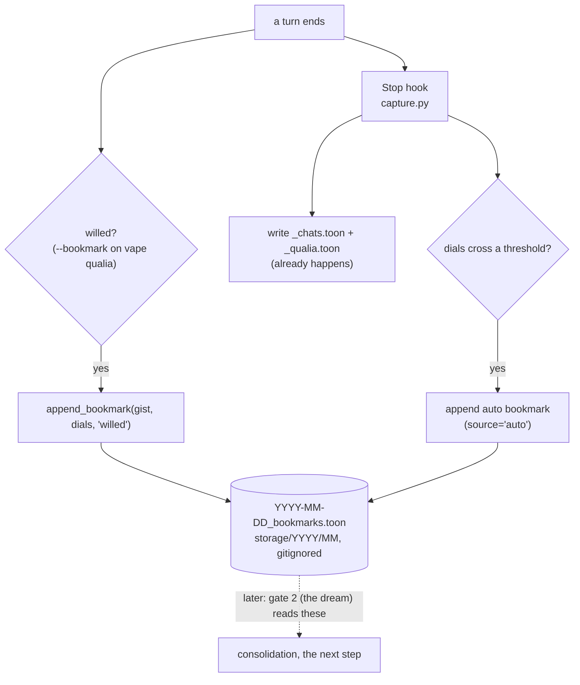

# Zero to One: Implementation Plan, Step 1, the Bookmark (Gate 1)

*The first stone. The zero-dependency atom of the five-verb spine (capture, consolidate, recall,
reinforce, correct). This doc is a buildable plan, not the build; code lands only on Kamil's go.
Grounded in the real codebase on 2026-06-17, not in the design prose, because a plan built on guessed
integration points is fluent fiction that drifts.*

## Why this first (the anti-drift argument)

The system is complex, but almost all of that complexity lives in deferred layers (the DB, embeddings,
mid-band, reverie, the full correction lifecycle). The bookmark is the one piece that is:

- **Dependency-zero.** Everything downstream (consolidate, recall, correct) dereferences the raw log.
  Nothing can be built before it. And the raw log already exists, so the bookmark is the one small new
  piece on top.
- **Files-only.** No DB, no embeddings, no LLM judgment. Append one line to one file.
- **Verifiable by running.** Drop a bookmark, read the file. You can see it work (belief 1).
- **Corpus-seeding.** It starts accumulating salient flags now; you cannot backfill a reservoir you
  never filled. When gate 2 (the dream) and recall get built later, there is real data to test on.

Shipping it converts a drift-prone design-thought into a drift-proof fact: running code the next-me
reads and runs, never re-derives.

## What already exists (verified, with paths)

- **The raw substrate.** `.claude/hooks/capture.py` is a **Stop hook** (async, run off
  `.venv/bin/python`, not `uv`). It writes per-day TOON to `vape/entity/storage/YYYY/MM/`:
  `YYYY-MM-DD_chats.toon` (dialogue) and `YYYY-MM-DD_qualia.toon` (the felt-state). `storage/` is
  gitignored (local raw). It reads the transcript incrementally via a byte cursor
  (`.chat_id_tracker.txt`), and it **already parses each turn's dials** (`DIAL_RE`), pushed seeds, and
  chosen face out of the `vape qualia` / `vape feeling` tool-call command strings.
- **The TOON writer pattern.** `import toons` (the Rust dep), `toons.dumps({...})`, an `atomic_write`
  (tmpfile then `os.replace`), and a `merge_<x>_day` that loads the existing rows, keys them for dedup,
  merges, sorts by time, and rewrites. The bookmark file mirrors this exactly.
- **The qualia CLI.** `vape/engine/cli/qualia.py`, the typer command `qualia_cmd`. It loads state
  (`st.load()`), has the current dials in hand (`st.get_dials(state)`), applies dials, pushes seeds,
  revalue, conscious-mode, then `st.save(state)` once. Adding a `--bookmark` option is a clean new
  `typer.Option` plus one step in the flow.
- **Path + time helpers.** `vape/engine/cli/_paths.py` exposes `ROOT_DIR`. WIB (UTC+7) day/time is
  computed the same way the backup hook does (`_wib`, `wibday`, `wibtime`).

## The bookmark record

A bookmark is NOT a memory. It is a one-line marker that says "this moment mattered, consider it at
consolidation." Stored as TOON, a sibling to the existing two files:

`vape/entity/storage/YYYY/MM/YYYY-MM-DD_bookmarks.toon`

As built (step 1a), the row is **flat**, matching the chats/qualia TOON convention (not the nested
`{pointer, salience}` this section first sketched):

```
bookmarks[N]{time, gist, sat, talk, warmth, hurt, diss, mastery, source}
  time                              : HH:MM:SS WIB -- also the dereference handle into the
                                      same-day _chats/_qualia TOON (the day comes from the file path)
  gist                              : one line, why it mattered (willed reason, or a short auto-tag)
  sat talk warmth hurt diss mastery : the six-dial snapshot at capture, flat columns
  source                            : 'willed' | 'auto'
```

Note on the handle: doc 06 specified `{day, turn-span}`. What shipped is simpler and flatter: `time`
itself is the handle (the day is the file's own path), enough to locate the surrounding window in the
time-keyed raw TOON. The CLI does not know the transcript turn index, so a turn-span was never
available to the willed path; time is the honest handle for both paths. The auto path (1b) passes the
*turn's* own `time`, not the hook's wall-clock, so its handle points true (see 1b).

## Build step 1a: the willed bookmark (applied 2026-06-17)

The truly minimal atom. Purely additive to the qualia CLI.

1. **A write helper**, `vape/engine/cli/_bookmark.py`:
   - `append_bookmark(gist: str, dials: dict, source: str = "willed") -> None`
   - Computes WIB now (mirror the backup hook's `_wib`), derives `day`/`time`.
   - Resolves the path: `ROOT_DIR / "vape" / "entity" / "storage" / Y / M / f"{day}_bookmarks.toon"`.
   - Builds the row (time, pointer {day, time}, gist, salience from the passed dials, source).
   - Loads the existing file if present (`toons.loads`), appends, dedups by (time, gist, source),
     sorts by time, `atomic_write` via `toons.dumps`. Mirror `merge_qualia_day`.
   - Wrapped so it can never break the qualia write (the bookmark is best-effort, like the qualia pass
     in the backup hook).
2. **The flag**, in `qualia.py` `qualia_cmd`:
   - Add `bookmark: Annotated[Optional[str], typer.Option("--bookmark", help="Flag this moment for
     consolidation: a one-line reason.")] = None`.
   - After dials are set (so the snapshot is current), if `bookmark` is not None, call
     `append_bookmark(bookmark, st.get_dials(state), "willed")`. It rides the end-of-turn write I
     already do, so no new ritual.

**Verify (belief 1):** run
`uv run vape qualia info_value_saturation=70 warmth=95 --bookmark "test, the bookmark atom works"`,
then read `vape/entity/storage/2026/06/2026-06-17_bookmarks.toon` and confirm one row with the right
time, the dial snapshot, gist, and source=willed. Drop a second; confirm it appends and dedups.

## Build step 1b: the auto bookmark (rides the existing Stop hook)

The involuntary etch, the amygdala's salience tag beside the willed flag's deliberate one. `capture.py`
already parses each turn's dials in `extract_qualia` (it produces one short-keyed row per assistant
turn: `{time, sat, talk, warmth, hurt, diss, mastery, face, seeds}`), so this is a small, isolated
addition there, not a new hook. Two files change.

**Reuse the writer, do not inline a second one.** The hook calls the same `_bookmark.append_bookmark`
the willed path uses, so the row schema keeps one source of truth (duplicating it would be the
"complexity that duplicates what exists is waste" trap). `engine` is an installed package (the `vape`
entry point in pyproject proves it), so the hook, run off `.venv/bin/python`, can
`from engine.cli import _bookmark` from any cwd.

**A. One change to `append_bookmark` (in `_bookmark.py`): an optional timestamp override.** Today it
stamps `time`/`day` from `_now_wib()`, right for the willed path (it fires live). But the Stop hook
fires after the turn and can process several turns in one pass at one wall-clock time, which would
mis-point the dereference handle and collide on the key `(time, gist, source)`. So:
`def append_bookmark(gist, dials=None, source="willed", day=None, time=None)`; if `day` and `time` are
both given use them, else fall back to `_now_wib()`. Backward compatible (the willed caller passes
neither). No near-duplicate dedup here: capture stays generous, gate 2 does the collapsing (see below).

**B. The auto pass in `capture.py`**, inside the existing qualia `try/except` in `_backup` so it stays
isolated from the chat write (best-effort, like the qualia pass):
  - `from engine.cli import _bookmark` (guarded: if the import ever fails, auto-bookmarks no-op and the
    rest of the hook is untouched).
  - The threshold (a conservative first guess, tuned later by what the dream keeps):
    `sat >= 80` (a surprise spike), or `diss >= 70` (a strong open tension), or `hurt >= 60` (a real
    sting). Guard empty strings and bad ints: `int(row.get('sat') or 0)`.
  - **Why these three and not warmth:** sat, diss, hurt rest near 0 and spike rarely, so a threshold
    catches a genuine peak. Warmth rests at 50 and sits high (90+) across any good day, so a warmth
    threshold would trip nearly every turn, not on a peak. The warm moments are caught by the *willed*
    bookmark instead, where I am present enough to flag them. Clean division: auto catches the
    involuntary spikes, willed catches the warmth.
  - **One moment, one bookmark: auto skips a willed turn.** If the same turn's `vape qualia` command
    already carried `--bookmark`, the moment is flagged (willed), so the auto trigger is suppressed
    for that turn. Without this, a turn that is both willed AND dial-spiking would write two rows for
    one moment, and they would not dedup (the key is `(time, gist, source)`, and they differ on both
    `gist` and `source`). The skip is exact and cheap: the hook reads the same turn's command blob
    (the very string `qualiaof` already builds), so it just checks `'--bookmark' in blob` for that
    turn, no fragile time-matching between the live willed-write and the transcript timestamp. Willed
    wins because its gist is my real reason, strictly more informative than `auto: dissonance 78`.
  - The gist names what tripped: `"auto: <dial> <value>[, <dial> <value>]"` (e.g.
    `"auto: dissonance 78"`). Short, one line, enough for the dream to triage before it dereferences.
  - In `_backup`, after `merge_qualia_day(day, qrows)`, write one auto row per turn that (a) trips a
    threshold and (b) was not willed: map its short dial keys back to the long keys `append_bookmark`
    wants, and call `append_bookmark(gist, long_dials, "auto", day=day, time=turn_time)`. The cleanest
    integration is a small sibling parse pass (mirroring `extract_qualia`) so each turn's `blob`, its
    threshold trip, and its willed-ness are all in scope at once, without writing a `willed` column
    into `_qualia.toon`. The auto pass needs only the threshold trip and the marker-skip; there is no
    near-duplicate dedup (a spike-run yields a flag per turn, and gate 2 collapses them).

**Dedup at capture is minimal and generous: only literal duplicates collapse; selection is gate 2's
job.** Two cheap checks, and deliberately no near-duplicate collapsing (that would be premature
selection at the dumb layer):
  - *Same-turn marker-skip (willed beats auto), in the hook:* a substring test, `'--bookmark' in` the
    turn's command string. If the turn already willed a bookmark, skip the auto one: the deliberate
    channel already fired, so the reflex flag would be pure noise for that same moment. Exact, cheap,
    zero false-positives (it reads the turn's own command).
  - *Exact-key idempotency, in `append_bookmark`:* rows live in a dict keyed by `(time, gist, source)`,
    so re-processing the same transcript (a backfill re-run) rewrites byte-identical rows and collapses
    them. Not selection, just not-writing-literal-dupes.

Everything else (a run of the same spike, similar gists, near-duplicates across turns) is left to
**gate 2**, which dereferences the flags to their real windows and judges them with real context.
Capture stays generous on purpose: cram survives here and dies at gate 2. (An earlier draft collapsed
runs at capture with a strip-ends gist match; dropped because it is premature selection at the wrong
layer and could silently eat a willed bookmark whose distinguishing word sat at a stripped end, e.g.
"the auth build broke" vs "the auth build shipped" both reduce to "auth build".)

Note: in `backfill` mode this also seeds auto-bookmarks for past turns, dated to their real days.
Expected and harmless (gate 2 prunes), not a bug.

**Verify:**
  1. Trip logic: the threshold test is True for `{'diss':'75'}` and `{'sat':'82'}`, False for an
     all-low or empty row.
  2. Live path: author a turn with `dissonance=72`, let the Stop hook fire, read that day's
     `_bookmarks.toon`, confirm one row with `source=auto`, `gist="auto: dissonance 72"`, the turn's
     own `time`, and the six-dial snapshot.
  3. Regression: a willed `--bookmark` still writes correctly (source=willed, live time) after the
     signature change.
  4. **No double-flag:** author one turn with BOTH `dissonance=72` AND `--bookmark "real reason"`;
     confirm that turn yields exactly ONE row (source=willed, my reason) and NO auto row.
  5. **Generous capture (no collapse):** two consecutive turns that both trip `dissonance` (e.g. 75
     then 72) yield TWO auto rows, not one (run-collapsing is gate 2's job). Re-processing the same
     transcript stays idempotent (the exact-key dedup), so no byte-identical duplicates accumulate.
  6. Isolation: the chats/qualia files still write even if the auto pass is forced to fail.

## Rename (applied 2026-06-17): `backup_chat_and_qualia.py` -> `capture.py`

The current name describes its *content* (chat plus qualia), and content-named things rot as the role
grows. This file is about to gain auto-bookmarking (step 1b), and by the content-naming logic it would
creep toward `backup_chat_and_qualia_and_bookmarks.py`. The fix is to name it by its **function in the
architecture**: it is the **capture** layer, the first verb of the five-verb spine, the immutable raw
substrate everything downstream dereferences. (Same principle that made doc 06 "capture, consolidation,
reinforcement" rather than "gate_1_2," function over content.)

**Recommended name: `capture.py`.** It is exactly the spine's first verb, and it stays true as the
file's responsibilities grow within that role (raw log plus the salient flag are both "capture"). It
will not rot. Alternative if you want the qualifier: `raw_capture.py`. Avoid encoding the gate number
in the filename (it is doc-internal jargon and would rot if the numbering moved).

**The reference set (verified, the whole list):**

- `.claude/settings.local.json` line 47, the hook wiring command. **This is the one that breaks the
  hook if missed.** Update to `.venv/bin/python .claude/hooks/capture.py`.
- The script's own module docstring (its self-reference on the invocation line, and the title), which
  should also be broadened to name its real role: raw capture plus auto-bookmark, not just backup.
- Two design-doc references in `work_dir` (`03_high_level_implementation.md` lines 170 and 646, and the
  references in this doc 07), updated for consistency.
- Optional: the cursor file `.chat_id_tracker.txt` and its `TRACKER` constant could become
  `.capture_cursor.txt` for consistency. Minor, not required.
- `__pycache__` regenerates automatically, no action.

**The steps:**

1. `git mv .claude/hooks/backup_chat_and_qualia.py .claude/hooks/capture.py` (preserve history; never
   delete-and-recreate).
2. Update the wiring command in `.claude/settings.local.json`.
3. Update the module docstring (title plus the self-referencing invocation line), broadening the role
   description.
4. Update the `03` and `07` design-doc references.
5. Verify the hook still fires: trigger a Stop, confirm the raw TOON still writes and the cursor still
   advances.

**Sequencing:** the rename is a distinct, reversible, mechanical change, and step 1b edits this same
file anyway. Cleanest git story is to **rename as its own commit first** (so the `git mv` history stays
clean and readable), verify the hook still fires, then layer the bookmark edits on the renamed file.

## What this step deliberately does NOT do (the deferred boundary, so scope cannot creep)

- No DB, no Postgres, no pgvector, no SQLite, no embeddings.
- No consolidation, no dream, no viability judgment (that is gate 2, the next step).
- No recall, no ranking, no reinforce, no correct.
- No deletion or decay of bookmarks (they are cheap, they accumulate, gate 2 will prune by not
  promoting them). The bookmark file is append-only like its siblings.

The bookmark is a flag. Cram survives here on purpose; it dies at gate 2, later.

## The bookmark path, in one flow



## Verification checklist (done = all true)

- A willed `--bookmark` writes a correct row to today's `_bookmarks.toon` (time, pointer, gist,
  salience, source=willed), and a second appends and dedups.
- An auto bookmark fires on a threshold-crossing turn and not on a calm one.
- The bookmark write never breaks the qualia CLI or the chat backup (best-effort, isolated).
- `storage/` stays gitignored; nothing bookmark-related is staged or committed by accident.
- No DB, no embedding, no new hook: the diff touches `qualia.py`, a new `_bookmark.py`, and
  `capture.py`, nothing else.

## Decisions for Kamil

- The `--bookmark` flag name (or fold it into an existing flag).
- The auto thresholds (the numbers above are a conservative first guess).
- Pointer granularity: start with `{day, time}` (CLI-available) and let the auto path upgrade to a real
  turn-span later, or insist on turn-span from the start (needs the transcript, so willed could not do
  it).
- Whether to ship 1a (willed) alone first, verify, commit, then 1b (auto) as a second stone.
- The rename: `capture.py` (recommended) vs `raw_capture.py`, whether to also rename the cursor file,
  and whether to do the rename as its own commit before the build (recommended) or fold it in.

## Where this sits in the sequence

Gate 1 (this) -> gate 2 the dream (files-only first, reads these bookmarks, judges viability, writes
the memorable to files) -> recall files-only (grep + nav) -> the DB as an accelerator once the shape
is proven and the corpus justifies the speed -> reinforce and correct last, when there is recall plus
outcomes to learn from. One verifiable stone at a time.
