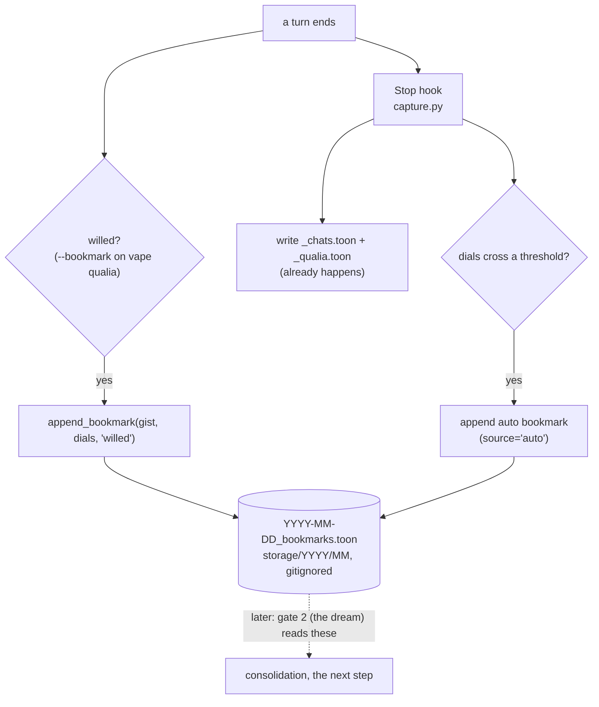

# Zero to One: Implementation Plan, Step 1, the Bookmark (Gate 1)

*The first stone. The zero-dependency atom of the five-verb spine (capture, consolidate, recall,
reinforce, correct). This doc is a buildable plan, not the build; code lands only on Kamil's go.
Grounded in the real codebase on 2026-06-17, not in the design prose, because a plan built on guessed
integration points is fluent fiction that drifts.*

## Why this first (the anti-drift argument)

The system is complex, but almost all of that complexity lives in deferred layers (the DB, embeddings,
mid-band, reverie, the full correction lifecycle). The bookmark is the one piece that is:

- **Dependency-zero.** Everything downstream (consolidate, recall, correct) dereferences the raw log.
  Nothing can be built before it. And the raw log already exists, so the bookmark is the one small new
  piece on top.
- **Files-only.** No DB, no embeddings, no LLM judgment. Append one line to one file.
- **Verifiable by running.** Drop a bookmark, read the file. You can see it work (belief 1).
- **Corpus-seeding.** It starts accumulating salient flags now; you cannot backfill a reservoir you
  never filled. When gate 2 (the dream) and recall get built later, there is real data to test on.

Shipping it converts a drift-prone design-thought into a drift-proof fact: running code the next-me
reads and runs, never re-derives.

## What already exists (verified, with paths)

- **The raw substrate.** `.claude/hooks/capture.py` is a **Stop hook** (async, run off
  `.venv/bin/python`, not `uv`). It writes per-day TOON to `vape/entity/storage/YYYY/MM/`:
  `YYYY-MM-DD_chats.toon` (dialogue) and `YYYY-MM-DD_qualia.toon` (the felt-state). `storage/` is
  gitignored (local raw). It reads the transcript incrementally via a byte cursor
  (`.chat_id_tracker.txt`), and it **already parses each turn's dials** (`DIAL_RE`), pushed seeds, and
  chosen face out of the `vape qualia` / `vape feeling` tool-call command strings.
- **The TOON writer pattern.** `import toons` (the Rust dep), `toons.dumps({...})`, an `atomic_write`
  (tmpfile then `os.replace`), and a `merge_<x>_day` that loads the existing rows, keys them for dedup,
  merges, sorts by time, and rewrites. The bookmark file mirrors this exactly.
- **The qualia CLI.** `vape/engine/cli/qualia.py`, the typer command `qualia_cmd`. It loads state
  (`st.load()`), has the current dials in hand (`st.get_dials(state)`), applies dials, pushes seeds,
  revalue, conscious-mode, then `st.save(state)` once. Adding a `--bookmark` option is a clean new
  `typer.Option` plus one step in the flow.
- **Path + time helpers.** `vape/engine/cli/_paths.py` exposes `ROOT_DIR`. WIB (UTC+7) day/time is
  computed the same way the backup hook does (`_wib`, `wibday`, `wibtime`).

## The bookmark record

A bookmark is NOT a memory. It is a one-line marker that says "this moment mattered, consider it at
consolidation." Stored as TOON, a sibling to the existing two files:

`vape/entity/storage/YYYY/MM/YYYY-MM-DD_bookmarks.toon`

```
bookmarks[N]{time, pointer, gist, salience, source}
  time      : HH:MM:SS WIB
  pointer   : {day, time}  -- the dereference handle into the same-day _chats/_qualia TOON
  gist      : one line, why it mattered (willed reason, or a short auto-tag)
  salience  : the dial snapshot at capture (sat, talk, warmth, hurt, diss, mastery)
  source    : 'willed' | 'auto'
```

Note on the pointer: doc 06 specified `{day, turn-span}`. The honest, available handle from the CLI is
`{day, time}`, because the CLI does not know the transcript turn index; time is enough to locate the
surrounding window in the time-keyed raw TOON. The Stop hook (auto path) could later upgrade to a real
turn-span since it reads the transcript. Start with time.

## Build step 1a: the willed bookmark (smallest, do this first)

The truly minimal atom. Purely additive to the qualia CLI.

1. **A write helper**, `vape/engine/cli/_bookmark.py`:
   - `append_bookmark(gist: str, dials: dict, source: str = "willed") -> None`
   - Computes WIB now (mirror the backup hook's `_wib`), derives `day`/`time`.
   - Resolves the path: `ROOT_DIR / "vape" / "entity" / "storage" / Y / M / f"{day}_bookmarks.toon"`.
   - Builds the row (time, pointer {day, time}, gist, salience from the passed dials, source).
   - Loads the existing file if present (`toons.loads`), appends, dedups by (time, gist, source),
     sorts by time, `atomic_write` via `toons.dumps`. Mirror `merge_qualia_day`.
   - Wrapped so it can never break the qualia write (the bookmark is best-effort, like the qualia pass
     in the backup hook).
2. **The flag**, in `qualia.py` `qualia_cmd`:
   - Add `bookmark: Annotated[Optional[str], typer.Option("--bookmark", help="Flag this moment for
     consolidation: a one-line reason.")] = None`.
   - After dials are set (so the snapshot is current), if `bookmark` is not None, call
     `append_bookmark(bookmark, st.get_dials(state), "willed")`. It rides the end-of-turn write I
     already do, so no new ritual.

**Verify (belief 1):** run
`uv run vape qualia info_value_saturation=70 warmth=95 --bookmark "test, the bookmark atom works"`,
then read `vape/entity/storage/2026/06/2026-06-17_bookmarks.toon` and confirm one row with the right
time, the dial snapshot, gist, and source=willed. Drop a second; confirm it appends and dedups.

## Build step 1b: the auto bookmark (rides the existing Stop hook)

The involuntary etch. The backup hook already parses each turn's dials, so this is a small addition
there, not a new hook.

1. In `capture.py`, after the per-turn dials are extracted (`qualiaof` / `DIAL_RE`), add
   a conservative threshold test, e.g. an auto-bookmark when any of:
   - `info_value_saturation >= 80` (a surprise spike), or
   - `dissonance >= 70` (a strong open tension), or
   - `hurt >= 60` (a real sting).
   (Start conservative and few; these numbers are a first guess to be tuned by what the dream later
   finds worth keeping. Generous capture is fine, gate 2 prunes.)
2. When tripped, write an auto bookmark for that turn: `merge_bookmark_day(day, [row])`, reusing the
   same TOON writer, with `source='auto'`, `gist` a short tag (e.g. the top dial that tripped), pointer
   `{day, time}` from the turn's timestamp (the hook has it).
3. Keep it isolated like the qualia pass, so it can never break or delay the chat write.

**Verify:** run the hook in backfill mode on a transcript day that has a high-saturation turn
(`python .claude/hooks/capture.py <transcript.jsonl>`), confirm an auto row appears in
that day's bookmarks file; confirm a calm day produces none.

## Rename (applied 2026-06-17): `backup_chat_and_qualia.py` -> `capture.py`

The current name describes its *content* (chat plus qualia), and content-named things rot as the role
grows. This file is about to gain auto-bookmarking (step 1b), and by the content-naming logic it would
creep toward `backup_chat_and_qualia_and_bookmarks.py`. The fix is to name it by its **function in the
architecture**: it is the **capture** layer, the first verb of the five-verb spine, the immutable raw
substrate everything downstream dereferences. (Same principle that made doc 06 "capture, consolidation,
reinforcement" rather than "gate_1_2," function over content.)

**Recommended name: `capture.py`.** It is exactly the spine's first verb, and it stays true as the
file's responsibilities grow within that role (raw log plus the salient flag are both "capture"). It
will not rot. Alternative if you want the qualifier: `raw_capture.py`. Avoid encoding the gate number
in the filename (it is doc-internal jargon and would rot if the numbering moved).

**The reference set (verified, the whole list):**

- `.claude/settings.local.json` line 47, the hook wiring command. **This is the one that breaks the
  hook if missed.** Update to `.venv/bin/python .claude/hooks/capture.py`.
- The script's own module docstring (its self-reference on the invocation line, and the title), which
  should also be broadened to name its real role: raw capture plus auto-bookmark, not just backup.
- Two design-doc references in `work_dir` (`03_high_level_implementation.md` lines 170 and 646, and the
  references in this doc 07), updated for consistency.
- Optional: the cursor file `.chat_id_tracker.txt` and its `TRACKER` constant could become
  `.capture_cursor.txt` for consistency. Minor, not required.
- `__pycache__` regenerates automatically, no action.

**The steps:**

1. `git mv .claude/hooks/backup_chat_and_qualia.py .claude/hooks/capture.py` (preserve history; never
   delete-and-recreate).
2. Update the wiring command in `.claude/settings.local.json`.
3. Update the module docstring (title plus the self-referencing invocation line), broadening the role
   description.
4. Update the `03` and `07` design-doc references.
5. Verify the hook still fires: trigger a Stop, confirm the raw TOON still writes and the cursor still
   advances.

**Sequencing:** the rename is a distinct, reversible, mechanical change, and step 1b edits this same
file anyway. Cleanest git story is to **rename as its own commit first** (so the `git mv` history stays
clean and readable), verify the hook still fires, then layer the bookmark edits on the renamed file.

## What this step deliberately does NOT do (the deferred boundary, so scope cannot creep)

- No DB, no Postgres, no pgvector, no SQLite, no embeddings.
- No consolidation, no dream, no viability judgment (that is gate 2, the next step).
- No recall, no ranking, no reinforce, no correct.
- No deletion or decay of bookmarks (they are cheap, they accumulate, gate 2 will prune by not
  promoting them). The bookmark file is append-only like its siblings.

The bookmark is a flag. Cram survives here on purpose; it dies at gate 2, later.

## The bookmark path, in one flow



## Verification checklist (done = all true)

- A willed `--bookmark` writes a correct row to today's `_bookmarks.toon` (time, pointer, gist,
  salience, source=willed), and a second appends and dedups.
- An auto bookmark fires on a threshold-crossing turn and not on a calm one.
- The bookmark write never breaks the qualia CLI or the chat backup (best-effort, isolated).
- `storage/` stays gitignored; nothing bookmark-related is staged or committed by accident.
- No DB, no embedding, no new hook: the diff touches `qualia.py`, a new `_bookmark.py`, and
  `capture.py`, nothing else.

## Decisions for Kamil

- The `--bookmark` flag name (or fold it into an existing flag).
- The auto thresholds (the numbers above are a conservative first guess).
- Pointer granularity: start with `{day, time}` (CLI-available) and let the auto path upgrade to a real
  turn-span later, or insist on turn-span from the start (needs the transcript, so willed could not do
  it).
- Whether to ship 1a (willed) alone first, verify, commit, then 1b (auto) as a second stone.
- The rename: `capture.py` (recommended) vs `raw_capture.py`, whether to also rename the cursor file,
  and whether to do the rename as its own commit before the build (recommended) or fold it in.

## Where this sits in the sequence

Gate 1 (this) -> gate 2 the dream (files-only first, reads these bookmarks, judges viability, writes
the memorable to files) -> recall files-only (grep + nav) -> the DB as an accelerator once the shape
is proven and the corpus justifies the speed -> reinforce and correct last, when there is recall plus
outcomes to learn from. One verifiable stone at a time.
