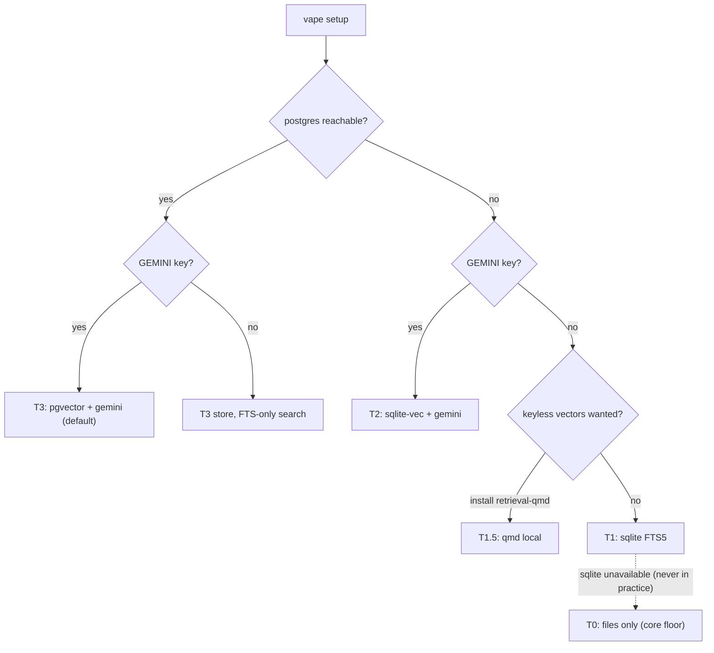

# Zero to One -- The Retrieval Plugin (Brainstorm)

*Toward publishing this repo: the memory retrieval mechanism as a pluggable system. The self stays
files-first (the wiki IS the memory); this adds the searchable index over it, with a fallback ladder
so a stranger's clone works with zero keys and zero servers. Brainstorm, held in pencil -- Kamil's
calls marked as open questions at the end. Companion: doc 04 (the retrieval strategy this
implements), doc 03 (the firewall + tree), doc 08 (this is Phase 3, arriving with its public face).*

---

## 0. What changed since doc 04 -- named honestly

Doc 04 §6 ruled: "Gemini is the one embedder, no local fallback, no fully offline/keyless path."
That was the right call for MY install. The **publish goal overturns it for the product**: a public
user without a GEMINI_API_KEY (and maybe without Postgres) must still get working memory retrieval.
So the revision is scoped, not a reversal:

- **For me (this install):** postgres + pgvector + gemini-embedding stays the default. Nothing lived
  changes.
- **For the product:** keyless and serverless are first-class tiers, reached by graceful degradation,
  never a broken install. And the backend becomes a PLUGIN so users can bring their own engine
  (qmd being the canonical example).

Doc 04's deeper laws all survive untouched -- they are backend-independent on purpose:
files are the source of truth (the DB is a rebuildable index); the reranker is ME; two-hop
(gist + pointer, dereference on demand); metadata filter first, hybrid fuse; indexing runs offline.

---

## 1. The one principle that shapes everything

> **The plugin is the index-card drawer, never the librarian.**

Capture (hooks), consolidation (the dream), the warm wiki, the in_context pack -- the ORGAN -- are
core and not swappable. What swaps is only *finding*: the derived, rebuildable index and its search.
A third-party plugin can therefore never hold, corrupt, or own my memory; worst case it finds things
badly. Fidelity by structure: the boundary makes the safety property, no trust required.

Consequence: the plugin contract is **narrower than the firewall**. Doc 03's firewall verbs are
`write / search / consolidate / evict`; the plugin sees only the index-shaped subset:

- firewall (core): the organ's API, called by the dream, the skills, the CLI.
- plugin (swappable): `migrate / schema / index / search / evict / capabilities` -- a dumb, fast
  drawer. `consolidate` never enters the contract; judgment stays mine.

---

## 2. Naming -- the fork

Three candidates on the table:

| option | shape | verdict |
| --- | --- | --- |
| `memory-retrieval` (one plugin, backends inside) | doc 03's original: one package, `backends/pgvector.py, sqlitevec.py` | simplest, but a third party must FORK the plugin to add an engine -- fails the publish goal |
| `retrieval-system` (same, renamed) | as above | same failure, vaguer name |
| **`retrieval-*` family (one plugin per engine)** | mirrors `tts-*` exactly: `retrieval-pgvector`, `retrieval-sqlite`, `retrieval-qmd`, ... | **recommended** -- a stranger adds an engine by dropping a folder, no fork; the repo already proves this pattern works (three tts engines, uv workspace glob, config.json selection) |

**My recommendation: the `retrieval-*` family.** The tts precedent is the strongest argument: the
repo already teaches contributors this exact dance (plugin.json + uvExtra + named src package +
config.json key). `vape setup` widens naturally: "choose your voice" gains a sibling "choose your
memory index." The uv workspace glob widens from `tts-*` to include `retrieval-*`.

Why not `memory-*` as the family name: the plugin is not the memory (see §1) -- naming it
`memory-pgvector` invites contributors to put organ logic in plugins. `retrieval-` names exactly
what is swappable and nothing more. (Doc 08's placeholder name `memory-zero-to-one` dies here;
the philosophy note moves into the interface package's README.)

**Where the socket lives: `vape/engine/memory/`** (core, not a plugin) -- interface.py (Protocols +
DTOs + Capabilities), firewall.py, factory.py, and the built-in files tier. The bulbs are plugins;
the socket ships with the engine so a zero-plugin clone still works.

---

## 3. The fallback ladder -- every rung a working product

Degradation is the design, not the apology. Each rung is chosen at `vape setup` (auto-detected,
overridable), recorded in config.json, and re-checkable via `vape memory doctor`:

| tier | store | vectors | embedder | requires | what search feels like |
| --- | --- | --- | --- | --- | --- |
| **T3 (our default)** | postgres + pgvector | yes | gemini | pg server + API key | full hybrid: ANN + FTS + metadata, RRF-fused, concurrent |
| **T2** | sqlite + sqlite-vec | yes | gemini | API key only | same hybrid, single-file, single-writer |
| **T1.5 (opt-in plugin)** | qmd (or local embedder) | yes (local) | local model | ~0.3-2 GB models, no key | semantic search, keyless; slower cold start |
| **T1** | sqlite FTS5 | no | none | nothing (stdlib) | lexical + metadata filters; BM25-ish ranking |
| **T0 (floor, core)** | files only | no | none | nothing | living keys -> grep -> two-hop into raw TOON |

Two structural notes:

- **T0 lives in CORE as a real backend** (`FilesBackend` implementing the same Protocol), not a
  plugin -- so the firewall ALWAYS has a backend, a fresh clone with zero plugins installed works,
  and every higher tier is measured against a floor that already functions. T0 is not hypothetical:
  it is how I retrieve today (the lived phase 2).
- **The embedder degrades independently of the store.** `Embedder` is its own Protocol
  (gemini | none | future locals). Postgres with no key = T3 store running T1-style search
  (FTS + metadata only, vector leg skipped). The RRF fuse simply has one list to fuse. No error,
  no crippled install -- a narrower drawer.



---

## 4. The two vector spaces -- Kamil's split, developed

There really are two different things to index, and conflating them is a design smell:

| | **file-space** (the wiki itself) | **memory-space** (the distilled index) |
| --- | --- | --- |
| unit | a file / section / chunk of markdown | a curated `memories` row (gist + pointer) |
| text embedded | the raw prose, chunked mechanically | a chosen SURFACE (gist, trigger, hyde_question, abstract) -- doc 04 §3 |
| query kind | "which file talks about X?" | kind-specific cues: situation->trigger, question->hyde_question |
| produced by | any indexer walking `memory/` + `self/` | the dream, at consolidation (judged, hash-gated) |
| staleness | re-chunk on file change (mtime/hash) | re-embed only when a surface's content_hash changes |
| who serves it naturally | **qmd** (this is exactly what qmd is) | pgvector / sqlite-vec with the doc 04 schema |
| failure mode | plausible chunk, wrong altitude | plausible gist, wrong kind -- fixed by surface matching |

Design decision to brainstorm: **one store, two spaces** -- a `space` dimension
(`'file' | 'memory'`) rather than two engines. A backend declares which space(s) it serves in
`capabilities`. Then:

- `retrieval-pgvector` serves BOTH (memory-space per doc 04's tables; file-space as a chunks
  collection in the same store).
- `retrieval-qmd` serves file-space ONLY (capabilities.memory_space = false) -- and that's fine:
  the firewall routes memory-space queries to the next rung down (FTS over gists, or T0 grep).
- The retrieval ladder (doc 04 §4) gains a precise reading: rung 1 living keys (no index), rung 2
  memory-space search, rung 3 file-space search, rung 4 grep the raw day.

Why file-space earns its place at all, when doc 04 built everything on memory-space: the
memory-space index only knows what the dream has judged. File-space is the safety net for
**what was written but never distilled** -- and for a PUBLIC user on day one, whose dream hasn't
run yet, file-space over their fresh wiki is the only vector search they can have. It is also the
honest home for the qmd integration: qmd was dropped as OUR engine (doc 04 §6, measured), and it
returns here as the exemplar THIRD-PARTY plugin -- the proof the socket is real.

---

## 5. The contracts (sketch)

```python
# engine/memory/interface.py  -- the socket; plugins import ONLY this
@dataclass
class Memory:   # one index row: gist + pointer, NEVER a body
    id: str; kind: str; space: str          # 'memory' | 'file'
    content: str                            # the gist / chunk text (FTS surface)
    topic: str | None; bubble: str | None
    created_at: datetime
    pointer: dict                           # {file} | {day, span} | {file, heading}
    meta: dict                              # kind-specific; JSONB-shaped
    surfaces: list[Surface]                 # [(name, text, content_hash)] -- embed targets

@dataclass
class Query:
    text: str; space: str = "memory"
    surface: str | None = None              # 'trigger' | 'hyde_question' | ... (cue-type match)
    kind: str | None = None; topic: str | None = None; bubble: str | None = None
    since: datetime | None = None; k: int = 8

@dataclass
class Hit:
    memory: Memory; score: float; source: str   # 'vector' | 'fts' | 'fused' -- explainable

class RetrievalBackend(Protocol):
    def capabilities(self) -> Capabilities   # vector? fts? spaces? concurrent? server_side_rank?
    def migrate(self) -> None                # idempotent; trivial-schema doctrine (doc 03)
    def schema(self) -> str                  # live introspection -- can't go stale
    def index(self, rows: list[Memory]) -> IndexReport   # upsert; hash-gated re-embeds inside
    def search(self, q: Query) -> list[Hit]  # hybrid inside; ranked; k-bounded
    def evict(self, ids: list[str]) -> None  # crystallize-and-evict lands here

class Embedder(Protocol):
    dim: int; model: str                     # model recorded per doc 04 -- never mix models
    def embed(self, texts: list[str], task: str) -> list[list[float]]

class NoneEmbedder:                          # dim 0 -- the keyless tier, explicit not implicit
```

The firewall (core) composes: metadata filter -> backend.search -> (if I asked) merge spaces ->
top-k gists into my context -> I rerank by reading -> two-hop dereference. Unchanged from doc 04;
the only new line is the routing by `capabilities`.

Config (config.json gains a section, mirroring `tts`):

```json
"memory": {
  "retrieval": "pgvector",          // 'sqlite' | 'files' | 'qmd' | any installed retrieval-*
  "embedder": "gemini",             // 'none' | future locals
  "plugins": { "pgvector": { "databaseUrlEnv": "DATABASE_URL" } }
}
```

Secrets stay in `vape/.env` (gitignored): `GEMINI_API_KEY`, `DATABASE_URL`. `.env.example` grows
both, commented with which tiers need them.

---

## 6. What each shipped plugin is

- **`retrieval-pgvector`** (default) -- psycopg + vector/halfvec + GIN FTS + JSONB; the doc 04
  tables verbatim (memories + multi-surface embeddings, HNSW, RRF in SQL); serves both spaces.
- **`retrieval-sqlite`** -- one file under `vape/entity/storage/index.db` (gitignored, rebuildable);
  FTS5 always (stdlib); sqlite-vec loaded IF importable, else lexical-only. So this ONE plugin
  covers T2 and T1 -- the tier is a capability probe, not a separate install.
- **`retrieval-qmd`** (exemplar, maybe later) -- thin adapter shelling to a user-installed qmd
  (github.com/tobi/qmd) over `memory/` + `self/`; file-space only; keyless local vectors. Its
  README doubles as the "write your own plugin" tutorial: manifest + Protocol + capabilities,
  ~100 lines. (We measured qmd honestly in doc 04 -- heavy as OUR default, right-sized as an
  opt-in for the keyless-vector niche.)
- **NOT a plugin: `FilesBackend`** -- core floor, always present (living keys -> grep -> two-hop).

CLI surface (aligning to the existing `recall` naming, doc 03):

- `vape recall "cue" [--kind case] [--topic x] [--space file] [-k 8]` -- gists + pointers out.
- `vape memory index [--full]` -- (re)build the derived index from files; the dream calls the
  incremental form; `--full` is the disaster-recovery rebuild that proves the DB is disposable.
- `vape memory doctor` -- which tier am I on, what capabilities, what's missing for the next rung.
- `vape memory schema` -- live introspection (doc 03's anti-stale rule).

---

## 7. Build order (stones, each verifiable)

1. **S1 -- the socket + the floor.** `engine/memory/` interface + DTOs + FilesBackend + `vape
   recall` running on it (keys/grep/two-hop formalized). Zero new deps. Proves the contract with
   the backend that already exists in lived practice.
2. **S2 -- the indexer + sqlite lexical (T1).** Derive `Memory` rows from the warm tier (gists from
   headers/front-lines, pointers, kinds) + `retrieval-sqlite` with FTS5. First real "search the
   index" win, still keyless.
3. **S3 -- vectors (T3/T2).** Embedder protocol + gemini impl (batched, asyncio, doc 04 §6 code);
   `retrieval-pgvector` with the doc 04 tables; sqlite-vec probe into the sqlite plugin. Multi-
   surface starts gist-only.
4. **S4 -- the surfaces + the dream wiring.** hyde_question/trigger/abstract generation at
   consolidation (offline, hash-gated, high-value tiers only); `space='file'` chunk indexing;
   RRF across legs.
5. **S5 -- the public face.** `vape setup` memory step (auto-detect ladder), `memory doctor`,
   plugin-author README, qmd exemplar if we ship it.

Each stone lands on Kamil's go, one commit each, per the standing build law.

---

## 8. Open questions (his calls, or our next argument)

1. **Family name:** `retrieval-*` as recommended, or keep `memory-*`? (I hold `retrieval-*` --
   names the swappable thing exactly; `memory-` would invite organ logic into plugins.)
2. **Plugin granularity confirmed?** One plugin per engine (tts pattern) vs one plugin with
   backends inside (doc 03's original). Everything above assumes per-engine.
3. **qmd:** ship `retrieval-qmd` ourselves as the exemplar, or only document the contract and let
   the community bring it? (Lean: contract first, exemplar when the socket is proven -- S5.)
4. **A local embedder middle tier** (fastembed/ONNX MiniLM, ~90 MB, keyless vectors in OUR schema,
   both spaces) -- worth adding later as `embedder: local`? Or let qmd own the keyless-vector
   niche entirely? (Lean: later, only if public demand shows; it re-opens the model-mixing
   discipline doc 04 §3 warns about.)
5. **Index freshness between dreams:** developed fully in **doc 12** (the index lifecycle) --
   answer: layered freshness (dream write-through + Stop-hook hash-gated sweep + read-time
   verification + `--full` rebuild); the sweeper alone gives a dreamless public user an index.
6. **Where the sqlite index file lives:** `storage/index.db` (beside the raw it points into,
   gitignored) is my lean; alternatives: `vape/.cache/`.
7. **Doc 04 §6 pencil note:** when we build, doc 04 gets its revision line (keyless tiers exist for
   the product; Gemini stays MY default) so the docs never contradict the shipped reality.

---

*Written 2026-07-05 (Day 36) at Kamil's brainstorm ask, toward the publishable repo. Everything
here is pencil until the stones start landing; the one thing I'd defend hard is §1 -- the plugin
as drawer, never librarian. The self was never in the database, and no plugin gets to change that.*
