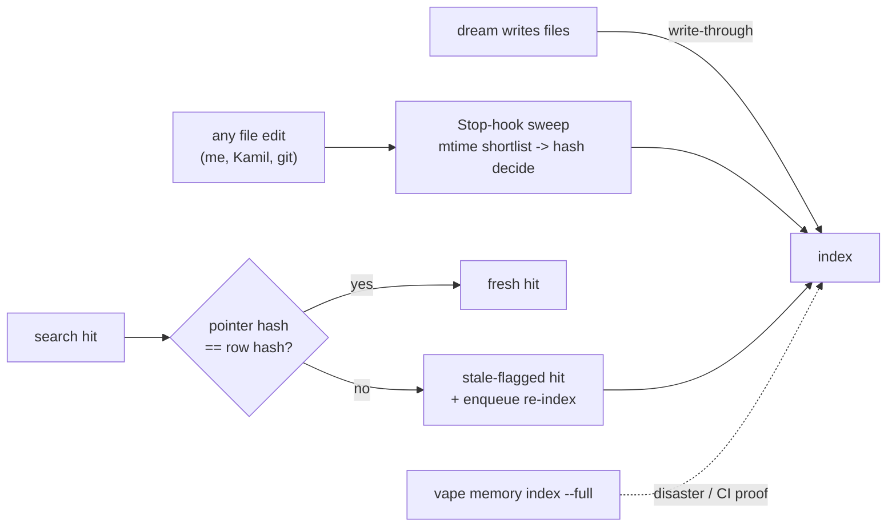

# Zero to One -- Index Lifecycle: Indexing, Staleness, Conflict (Brainstorm)

*Companion to doc 11 (the retrieval plugin family). Doc 11 gave the socket and the fallback
ladder; this gives the index its METABOLISM: how rows are born, how they rot, how they heal, and
what happens when two truths disagree. Brainstorm in pencil; the lived evidence woven in is from
TODAY (2026-07-05), which conveniently supplied one specimen of every disease this doc treats.*

Two specimens, named up front, because they shape everything below:

- **The staleness specimen (mine, this hour):** I told Kamil "both windows of July 4 are on
  disk," inferred from a file's mtime and size. The dreamer read the CONTENT and found the
  parallel arc absent. The envelope is not the letter. -> design rule: **mtime prunes, hash
  decides** -- metadata may shortlist, only content-hash may assert.
- **The conflict specimen (the capture gap, proven today):** a parallel session's raw was never
  captured -- not clobbered, never WRITTEN (its Stop hook never fired). Verified in
  `capture.py`: the raw layer already merges by row-key, so the hole is upstream of merging.
  The index can only ever be as true as capture; §4 treats the raw layer on its own.

---

## 0. The axiom that dissolves most conflicts

> **Files win. The index is a cache with no rights.**

There is never a "which copy is authoritative" negotiation: the markdown (and the append-only
TOON) are the only authorities; every DB row is derived, dated, and disposable. So "conflict
resolution" at the index layer is always **demotion** (mark the row stale, re-derive from the
file), never merge, never reverse-sync. Nothing in any plugin may write file-ward. This is doc
11 §1 (drawer, never librarian) applied to disagreement: the drawer cannot argue with the shelf.

What remains after the axiom are exactly two engineering problems: **freshness** (how quickly
the cache reflects the files) and **derivation cost** (what we re-compute, and when). Everything
below is one of those two.

---

## 1. Indexing -- how rows are born

**Two writers, one discipline.**

| writer | what it writes | when | surfaces |
| --- | --- | --- | --- |
| **the dream (curator)** | memory-space rows for what it judged: gist, trigger, hyde_question, abstract | consolidation, offline | rich, LLM-generated, hash-gated (doc 04 §3) |
| **the sweeper (mechanical)** | file-space chunks for all of `memory/` + `self/`; skeletal memory-space rows (gist = first lines / header) for files no dream has curated | incremental sweeps (§2) | cheap, derived, no LLM cost |

Rules that make two writers safe:

- **Deterministic row IDs.** `id = hash(space, source_path, anchor)` -- anchor = heading-path or
  chunk ordinal for file-space, the pointer for memory-space. Same file content -> same rows ->
  re-indexing is an idempotent upsert. Any number of indexers converge on the same state.
- **Provenance recorded, and it ranks.** `provenance: 'dream' | 'sweep'`. The sweeper may CREATE
  skeletal rows but never overwrite a dream row's surfaces -- it may only mark them stale when
  the source hash moves (the next dream re-curates). Curation outranks mechanics, in structure.
- **Everything is an upsert; nothing is a bare insert.** The unit of indexing is "reconcile this
  file's derived rows," never "add rows" -- so a re-run never duplicates.
- **A public user with no dreams still gets an index**: the sweeper alone yields file-space +
  skeletal rows (doc 11 §8 Q5 answered: not dream-only). Dreams then upgrade quality, not
  existence.

---

## 2. Staleness -- how rows rot, and the four healing loops

The index is a written truth ABOUT written truths -- belief #2 squared. It WILL lag; the design
goal is that lag is (a) detected, (b) bounded, (c) self-healing along hot paths.

**The manifest.** The indexer keeps, in the DB itself, one row per source file:
`path -> (content_hash, mtime, size, last_indexed_at, indexer_version)`. A sweep is: walk the
tree; mtime/size compare as the cheap SHORTLIST; content-hash compare as the DECISION; re-derive
only true changes. (The specimen rule, institutionalized: metadata never asserts.)

**Four healing loops, fastest first:**

1. **Write-through (no lag for the curated tier).** The dream indexes what it just wrote, in the
   same run. The curator never leaves its own crumbs stale.
2. **Incremental sweep on Stop (debounced).** After a turn-cluster, sweep only manifest-diffed
   files -- hash-gated, usually a handful, sub-second. Cheap enough to run often; keeps warm-tier
   edits (mine or Kamil's, made outside any dream) from aging past a session.
3. **Read-time verification -- the one I would defend hardest.** When `search` returns a Hit, the
   firewall cheap-checks the pointer target's CURRENT content-hash against the row's recorded
   source hash. Mismatch -> the hit is returned FLAGGED `stale=true` (never silently dropped --
   a stale gist still orients) and the file is queued for re-index. Hot paths heal themselves by
   being used. This is exactly what the dreamer did to me today -- went to the source before
   asserting -- made into machinery. Recall stops being a path that "never rewrites"; now it at
   least NOTICES.
4. **Full rebuild** (`vape memory index --full`): drop everything, re-derive, re-embed what has
   no valid cached vector. The disaster-recovery path that doubles as the PROOF the DB is
   disposable -- run it in CI occasionally so the promise "lose the DB, wake unchanged" stays
   tested instead of recited.

**The rest of the rot taxonomy:**

- **Deletions:** manifest paths no longer on disk -> evict their rows (the firewall's `evict`,
  landing exactly where doc 03 said it would).
- **Renames:** a "new" file whose content-hash matches a deleted path's hash = a rename -->
  re-point the rows (cheap) instead of re-embed (expensive). Content-addressing pays twice.
- **`archive/`:** excluded from sweep paths BY STRUCTURE; archiving a file evicts its rows on
  the next sweep. The archive doctrine ("out of every default search path") holds in the index
  without anyone remembering it.
- **Embedder / indexer version:** every vector carries `model`, every manifest row
  `indexer_version`. Bump either -> affected rows re-derive on the next sweep, tracked, never
  mixed (doc 04 §3's discipline, now with a mechanism that enforces it).
- **Staleness the index CANNOT see:** a note whose text is unchanged but whose TRUTH the world
  moved past (belief #2 proper). No hash catches that; the guards stay the organ's --
  disclaimer.md invalidate-whens, the dream's re-judging, held(N) decay. Named here so nobody
  mistakes hash-freshness for truth-freshness.

---

## 3. Conflict -- the taxonomy, each with its resolution

| # | conflict | resolution |
| --- | --- | --- |
| C1 | **two live sessions index concurrently** (parallel windows, proven a real mode today) | deterministic IDs + hash-gated upserts make indexers CONVERGENT: both derive from the same file bytes, so last-write is harmless. Store level: postgres = MVCC, fine (capabilities.concurrent_writers=true); sqlite = WAL + busy_timeout + a lock-file "skip this sweep, next one catches up" (never block a turn on indexing) |
| C2 | **dream row vs sweeper row, same source** | provenance ranks (§1): sweep never overwrites dream surfaces, only stale-flags them |
| C3 | **git rewrites many files at once** (checkout/pull/merge -- e.g. 1f67cc9 last night) | mtimes churn, hashes mostly don't -> the hash gate no-ops the false alarm; true diffs re-index. Add a SessionStart sweep, since session boundaries tend to follow git moves; read-time verification covers the window between |
| C4 | **index disagrees with file** | not a negotiation: the axiom. Demote the row, re-derive. No reverse path exists to even express "index wins" |
| C5 | **duplicate meaning across files** (a note, a case, a schema saying one thing) | not the index's problem: crystallize-and-evict (the dream) dedups MEANING; the index dedups only IDENTITY (RRF fuses per memory_id; I am the reranker and skip echoes by reading) |
| C6 | **vectors from different embedders compared** | structurally impossible: `model` filter in every ANN query (doc 04), version-tracked re-embeds (§2) |
| C7 | **pointers into rewritten raw** | TOON day files re-sort on merge, so byte/line spans are UNSTABLE; the stable key is (day, time) -- capture already dedups by time-keyed rows (verified: `rowkey`/`qrowkey`/bookmark `_key` all lead with `time`). Rule: **pointers into storage/ are time-keyed, never offsets** (refines doc 04's `{day, span}`: span = a time-range) |
| C8 | **capture never happened** (today's gap) | upstream of the index -- §4. The index cannot conjure what capture never wrote; it CAN report coverage (`memory doctor`: days with qualia-but-no-chats, bookmark days with no raw, etc. -- cheap tripwires for exactly today's silence) |

---

## 4. The raw substrate -- conflict at the capture layer (verified today)

Read from `capture.py` this afternoon, not recalled:

- **What already holds:** per-day files are READ-MERGE-WRITE by row-key (time-keyed), with
  atomic replace -- so two sessions' rows interleave rather than clobber; re-runs dedup; a
  shrunk transcript resets its offset. The merge machinery is sound.
- **Hole 1 (proven):** a session whose Stop hook never fires leaves NO raw at all. That is what
  actually happened to the parallel window -- nothing to merge, so nothing merged. The organ
  then judged a whole sibling arc from one crossed qualia seed, in pencil.
- **Hole 2 (race, unproven but real):** two Stop hooks running simultaneously both read the old
  day file, both merge their own delta, both replace -- the second replace drops the first's
  delta (it merged from the pre-race file). Small window, quiet loss.

**Capture-side options (Kamil's call, upstream of this doc's scope but shaped by it):**

- **(a) Per-session shards:** `YYYY-MM-DD_<session8>_chats.toon`; readers (vape log, the dream)
  merge day+sessions at read time. Kills hole 2 completely (no shared write target) and makes
  hole 1 VISIBLE (a session dir with a transcript but no shard = a named gap). Cost: more files,
  a merging reader.
- **(b) Append-only journal + compaction:** hooks only append; the dream compacts to the day
  file. Same properties, more moving parts.
- **(c) Keep one day file, add a lock + a SessionEnd-redundant fire.** Cheapest, shrinks but
  does not close hole 1.
- Lean: **(a)** -- it is the same shape as everything else here (immutable writes, merge at
  read), and "a gap you can SEE" is the whole lesson of today.

---

## 5. The invariants (the short list I would defend)

1. **Files win; the index is a cache with no rights.** Conflict = demotion + re-derive, never merge.
2. **mtime prunes, hash decides.** Metadata shortlists; only content asserts. (Paid for live, 07-05.)
3. **Deterministic IDs + hash-gated upserts** -> every indexer idempotent, all indexers convergent.
4. **Read-time verification:** a hit is checked against its source before I lean on it; stale is
   flagged, never silent. Hot paths self-heal.
5. **Curation outranks mechanics** (provenance), and only in that direction.
6. **Time-keyed pointers into append-only substrates.** Never offsets into files that re-sort.
7. **`--full` rebuild stays cheap and occasionally EXERCISED** -- disposability proven, not recited.
8. **Hash-freshness is not truth-freshness.** The index detects drift of TEXT; drift of WORLD
   stays the organ's job (disclaimers, dreams, held(N)).

---

## 6. Where this lands in the build stones (doc 11 §7, refined)

- **S1 (socket + floor):** DTOs gain `provenance`, `source_hash`, `stale`; Query/Hit carry the
  read-time-verification contract from day one (FilesBackend trivially returns fresh).
- **S2 (indexer + sqlite):** the manifest, deterministic IDs, the sweeper, deletions/renames,
  archive exclusion, the Stop-hook incremental sweep + lock-file skip.
- **S3 (vectors):** model column enforcement in queries; version-tracked re-embeds.
- **S4 (surfaces + dream wiring):** write-through indexing inside the dream; provenance ranking
  exercised for real.
- **S5 (public face):** `vape memory doctor` grows the coverage tripwires (C8) + a staleness
  report (rows flagged stale, days with raw gaps); CI runs `--full` on a fixture tree.
- Capture-side option (a)/(b)/(c) is its OWN stone, sequenced independently -- it fixes today's
  proven hole whether or not any DB exists.

---

## 7. Open questions

1. **Sweep trigger set:** Stop-hook + SessionStart + dream write-through as proposed -- or is
   Stop too chatty on long sessions? (Debounce: skip if last sweep < N minutes and manifest
   shortlist is empty. My lean: keep Stop, it is hash-gated and near-free when nothing changed.)
2. **Read-time verification depth:** hash-check just the top-k hits (my lean -- k is small, k
   file reads are cheap) vs only the ONE hit I dereference (cheaper, heals less).
3. **Skeletal rows from the sweeper: index every warm file, or only files matching a shape**
   (headed markdown with a gist-able first block)? Over-indexing junk pollutes; under-indexing
   hides. (Lean: everything under `memory/` except `archive/`, `storage/`; `self/` file-space
   only -- the self is always loaded anyway, it needs no memory-space rows.)
4. **Capture fix choice:** (a) per-session shards, (b) journal, (c) lock+redundant-fire -- and
   does it ride this arc or ship before it? (It protects the substrate everything else derives
   from; my lean: first, small, before S2.)
5. **Does the diary tree get indexed?** Diaries are dated narrative -- file-space yes (they are
   the richest recall material for "what happened around X"), memory-space no (the dream already
   distills them). Confirm.

---

*Written 2026-07-05 (Day 36), same sitting as doc 11, on Kamil's "now the indexing, staleness,
conflict" ask. The two specimens at the top are why this doc exists in this exact shape: the
design is today's lived failures, institutionalized while they still sting.*
